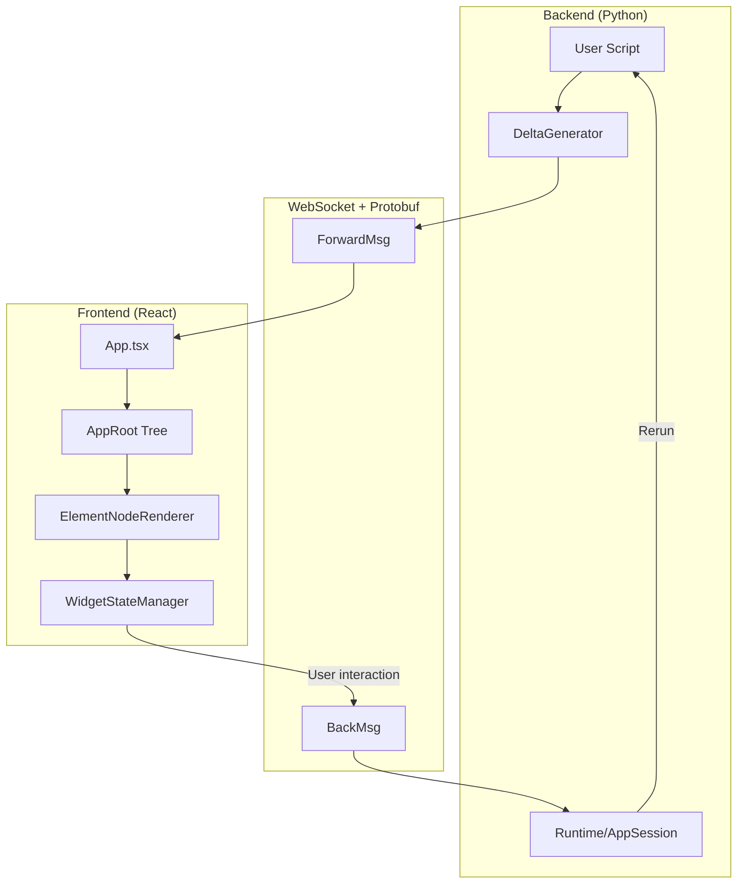
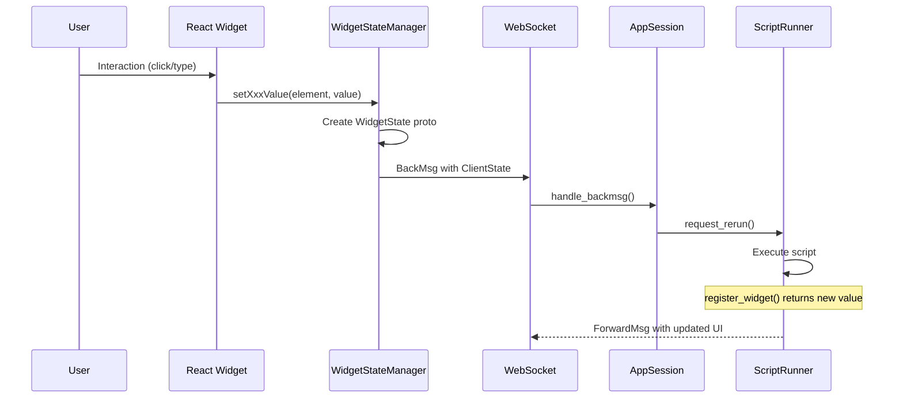

# Understanding Streamlit architecture

Streamlit is a client-server application with bidirectional WebSocket communication using Protocol Buffers.

## Core mental model

**Key insight**: Scripts re-execute top-to-bottom on every widget interaction. State persists via `st.session_state` and caching decorators.

## Architecture layers

### Backend (Python)

| Component | File | Purpose |
|-----------|------|---------|
| Runtime | `lib/streamlit/runtime/runtime.py` | Singleton managing app lifecycle and sessions |
| AppSession | `lib/streamlit/runtime/app_session.py` | Per-browser-tab: ScriptRunner + SessionState + ForwardMsgQueue |
| ScriptRunner | `lib/streamlit/runtime/scriptrunner/script_runner.py` | Executes user scripts in separate thread |
| DeltaGenerator | `lib/streamlit/delta_generator.py` | API entry point using mixin pattern |
| SessionState | `lib/streamlit/runtime/state/session_state.py` | Widget values and user variables |
| Elements | `lib/streamlit/elements/` | Backend implementation of `st.*` commands |

**For backend deep dive**: See [backend.md](backend.md)

### Frontend (TypeScript/React)

| Component | File | Purpose |
|-----------|------|---------|
| App | `frontend/app/src/App.tsx` | Central orchestrator |
| AppRoot | `frontend/lib/src/render-tree/AppRoot.ts` | Immutable element tree with 4 containers |
| ElementNodeRenderer | `frontend/lib/src/components/core/Block/ElementNodeRenderer.tsx` | Maps protos to React components |
| WidgetStateManager | `frontend/lib/src/WidgetStateManager.ts` | Widget state, forms, query params |
| ConnectionManager | `frontend/connection/src/ConnectionManager.ts` | WebSocket state machine |

**For frontend deep dive**: See [frontend.md](frontend.md)

### Communication (Protobuf)

| Proto | Purpose |
|-------|---------|
| `ForwardMsg.proto` | Server to client: deltas, session events, navigation |
| `BackMsg.proto` | Client to server: rerun requests with widget states |
| `Element.proto` | ~50+ element types in `oneof type` union |
| `WidgetStates.proto` | Widget values: `trigger_value`, `string_value`, `bool_value`, etc. |

**Location**: `proto/streamlit/proto/`

**For protocol deep dive**: See [communication.md](communication.md)

## Essential concepts

### Script rerun model

1. User interacts with widget (e.g., clicks button)
2. Frontend sends `BackMsg` with `ClientState` containing all `WidgetStates`
3. Backend updates `SessionState`, triggers script rerun
4. Script executes top-to-bottom; widget functions return current values
5. `trigger_value` widgets (buttons) auto-reset to `False` after run

### Delta path system

Elements are positioned via delta paths like `[0, 2, 3]`:
- Index into nested containers (main, sidebar, columns, expanders)
- Enables efficient updates without full tree replacement
- Used for message coalescing and media garbage collection

### Widget state flow

**Value types**: `trigger_value` (buttons), `string_value` (text), `bool_value` (checkbox), `double_value` (slider), `json_value` (complex), `json_trigger_value` (transient payloads)

### Element tree structure

Frontend maintains immutable `AppRoot` with 4 top-level containers:
- `main`: Primary content area
- `sidebar`: Sidebar elements
- `event`: Toasts, balloons, transient effects
- `bottom`: Sticky elements (chat input)

Each container holds `BlockNode` (containers) or `ElementNode` (leaf elements).

## Key patterns

### Mixin composition (backend)

DeltaGenerator uses mixin pattern to compose all element types. See `lib/streamlit/delta_generator.py`.

Each mixin implements related `st.*` functions.

### Visitor pattern (frontend)

Element tree operations use visitors:
- `RenderNodeVisitor`: Converts tree to React elements
- `ClearStaleNodeVisitor`: Removes elements from previous runs
- `SetNodeByDeltaPathVisitor`: Updates specific tree positions

### Message caching

ForwardMsgs include `hash` for deduplication:
- Backend can send `ref_hash` instead of full message
- Frontend maintains `ForwardMsgCache`
- Reduces bandwidth for unchanged elements

## Quick reference: Adding features

1. **Proto definition**: `proto/streamlit/proto/<Element>.proto`
2. **Register in Element.proto**: Add to `oneof type`
3. **Backend mixin**: `lib/streamlit/elements/<element>.py`
4. **Frontend component**: `frontend/lib/src/components/widgets/<Element>/`
5. **Register in ElementNodeRenderer**: Add case to switch statement
6. **Compile protos**: `make protobuf`

See the `implementing-new-features` skill for detailed implementation guide.

## Common debugging paths

| Symptom | Where to look |
|---------|---------------|
| Widget value not updating | `SessionState`, `register_widget()`, `WidgetStateManager` |
| Element not rendering | `ElementNodeRenderer`, proto definition, delta path |
| Rerun not triggering | `BackMsg` handling, `AppSession.request_rerun()` |
| Stale elements showing | `ClearStaleNodeVisitor`, `scriptRunId` tracking |
| Connection issues | `WebsocketConnection`, `DoInitPings`, `ConnectionManager` |
| Form submission issues | `WidgetStateManager.submitForm()`, `form_id` in protos |

## Startup modes

- **Classic**: `streamlit run app.py` uses Tornado server with ScriptRunner
- **ASGI**: Detects `st.App`, FastAPI, or Starlette; uses uvicorn
- **Config**: `server.useStarlette` flag for Starlette-managed mode

## Related skills

- `implementing-new-features`: Step-by-step guide for new elements/widgets
- `debugging-streamlit`: Using `make debug` for hot-reload development
