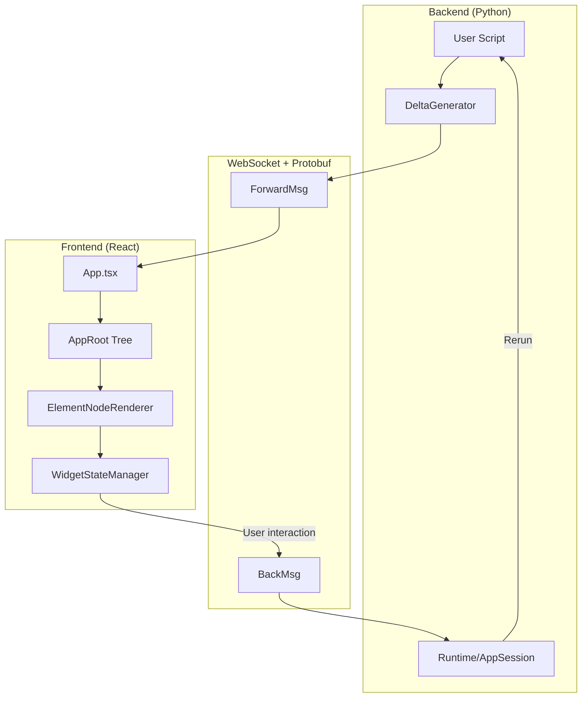
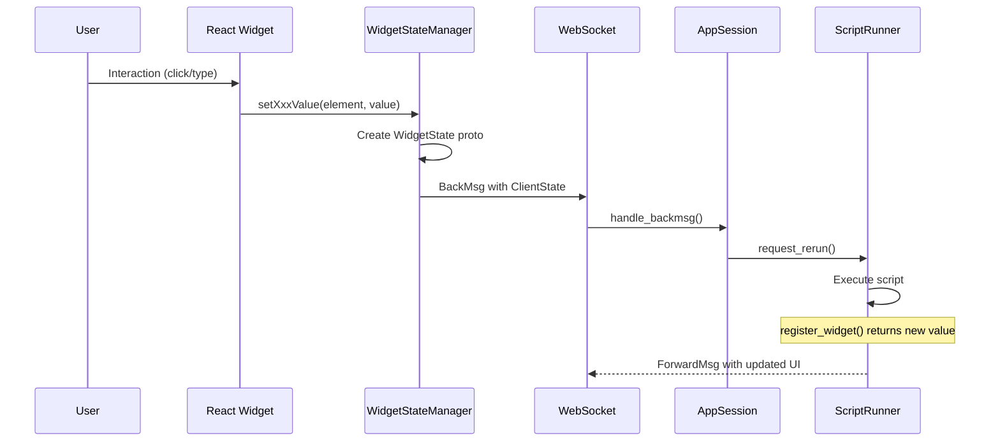

# Understanding Streamlit architecture

Streamlit is a client-server application with bidirectional WebSocket communication using Protocol Buffers.

## Concepts glossary

| Concept | Description | Key files |
|---------|-------------|-----------|
| **Element** | Umbrella term for all UI components in Streamlit: widgets, containers, and display elements. Represented in `Element.proto` as a `oneof` union of ~50+ types. | `proto/streamlit/proto/Element.proto`, `lib/streamlit/elements/` |
| **Widget** | Interactive element (button, slider, text_input) that triggers reruns on user interaction. Value accessible via return value or `st.session_state`. Some elements become widgets conditionally (e.g., dataframe/chart with `on_select`). | `lib/streamlit/elements/widgets/`, `frontend/lib/src/components/widgets/` |
| **Display Element** | Non-interactive element (text, markdown, image, chart) that renders content without triggering reruns by itself. | `lib/streamlit/elements/`, `frontend/lib/src/components/elements/` |
| **Container** | Layout block that groups elements spatially (sidebar, columns, expander, tabs, form). Represented as `BlockNode` in the element tree. | `lib/streamlit/elements/layouts.py`, `Block.proto` |
| **DeltaGenerator** | The `st` object; API entry point that queues UI deltas. Uses mixin pattern to compose all `st.*` commands. | `lib/streamlit/delta_generator.py` |
| **Session State** | Per-session dictionary (`st.session_state`) persisting data across reruns. Stores widget values and user variables. | `lib/streamlit/runtime/state/session_state.py` |
| **Rerun** | Re-execution of the user script for the current page. Triggered by widget interactions, `st.rerun()`, file changes, or fragment timers. Rebuilds the element tree while preserving session state. | `lib/streamlit/runtime/scriptrunner/script_runner.py`, `lib/streamlit/commands/execution_control.py` |
| **Form** | Container (`st.form`) that batches widget inputs, deferring reruns until form submission. | `lib/streamlit/elements/form.py`, `WidgetStateManager.ts` |
| **Fragment** | Decorator (`@st.fragment`) enabling partial reruns of specific UI sections without full script re-execution. | `lib/streamlit/runtime/fragment.py` |
| **Caching** | Decorators (`@st.cache_data`, `@st.cache_resource`) that memoize function results to avoid redundant computation. | `lib/streamlit/runtime/caching/` |
| **Pages** | Multipage app system using `st.navigation()` and `st.Page()` or auto-discovery from `pages/` directory. | `lib/streamlit/navigation/`, `lib/streamlit/runtime/pages_manager.py` |
| **Config** | App configuration via `.streamlit/config.toml` controlling server, client, and theme settings. | `lib/streamlit/config.py`, `lib/streamlit/config_option.py` |
| **Theming** | Customizable UI themes (Light/Dark/Custom) defined in config or via theme editor. | `lib/streamlit/theme.py`, `frontend/lib/src/theme/` |
| **Secrets** | Secure credential storage via `.streamlit/secrets.toml` (local) or platform settings (deployed). Accessed via `st.secrets`. | `lib/streamlit/runtime/secrets.py` |
| **Connection** | Database/service abstraction (`st.connection`) with built-in caching and secrets integration. | `lib/streamlit/connections/` |
| **Custom Components** | User-built extensions using React/iframe. **v1 (legacy)**: `declare_component()` API. **v2 (current)**: Bidirectional components with improved state management. | `component-lib/`, `lib/streamlit/components/v1/`, `lib/streamlit/components/v2/` |
| **Static Files** | Files in `static/` directory served directly via `/_stcore/static/`. | `lib/streamlit/web/server/routes.py` |
| **App Testing** | Testing framework (`AppTest`) for simulating user interactions and inspecting rendered output. | `lib/streamlit/testing/` |

## Core mental model

**Key insight**: Script execution is rerun-driven: most widget interactions trigger reruns (full app or fragment-scoped). State persists via `st.session_state` and caching decorators.

## Execution model

Streamlit's execution model differs from traditional web frameworks:

**Rerun triggers**:
1. **Widget interaction**: User clicks button, moves slider, etc.
2. **Source code change**: File watcher detects script modification
3. **`st.rerun()`**: Explicit programmatic rerun
4. **Fragment timer**: `@st.fragment(run_every=...)` periodic reruns

**Execution order nuances**:
- Scripts execute **top-to-bottom** on every rerun
- **Callbacks first**: `on_change`/`on_click` handlers run *before* the main script body
- **Fragments isolate reruns**: Widget interactions inside `@st.fragment` only rerun that fragment
- **Control flow exceptions**: `st.stop()`, `st.rerun()`, `st.switch_page()` raise exceptions to halt/redirect execution

**Session isolation**:
- Each browser tab = separate `AppSession` with its own `SessionState`
- Refreshing the page creates a new session (unless reconnecting within TTL)
- No shared state between sessions (use external storage for multi-user state)

**What persists across reruns** (within a session):
- `st.session_state` values
- Cached function results (`@st.cache_data`, `@st.cache_resource`)
- Uploaded files
- Fragment registrations

**What resets on each rerun**:
- Local variables in script
- Widget return values (re-read from `SessionState`)
- Element tree (rebuilt from scratch, then diffed)

## Architecture layers

### Backend (Python)

| Component | File | Purpose |
|-----------|------|---------|
| Runtime | `lib/streamlit/runtime/runtime.py` | Singleton managing app lifecycle and sessions |
| AppSession | `lib/streamlit/runtime/app_session.py` | Per-browser-tab: ScriptRunner + SessionState + ForwardMsgQueue |
| ScriptRunner | `lib/streamlit/runtime/scriptrunner/script_runner.py` | Executes user scripts in separate thread |
| DeltaGenerator | `lib/streamlit/delta_generator.py` | API entry point using mixin pattern |
| SessionState | `lib/streamlit/runtime/state/session_state.py` | Widget values and user variables |
| Elements | `lib/streamlit/elements/` | Backend implementation of `st.*` commands |

**For backend deep dive**: See [backend.md](backend.md)

### Frontend (TypeScript/React)

| Component | File | Purpose |
|-----------|------|---------|
| App | `frontend/app/src/App.tsx` | Central orchestrator |
| AppRoot | `frontend/lib/src/render-tree/AppRoot.ts` | Immutable element tree with 4 containers |
| ElementNodeRenderer | `frontend/lib/src/components/core/Block/ElementNodeRenderer.tsx` | Maps protos to React components |
| WidgetStateManager | `frontend/lib/src/WidgetStateManager.ts` | Widget state, forms, query params |
| ConnectionManager | `frontend/connection/src/ConnectionManager.ts` | WebSocket state machine |

**For frontend deep dive**: See [frontend.md](frontend.md)

### Communication (Protobuf)

| Proto | Purpose |
|-------|---------|
| `ForwardMsg.proto` | Server to client: deltas, session events, navigation |
| `BackMsg.proto` | Client to server: rerun requests with widget states |
| `Element.proto` | ~50+ element types in `oneof type` union |
| `WidgetStates.proto` | Widget values: `trigger_value`, `string_value`, `bool_value`, etc. |

**Location**: `proto/streamlit/proto/`

**For protocol deep dive**: See [communication.md](communication.md)

## Essential concepts

### Script rerun model

1. User interacts with widget (e.g., clicks button)
2. Frontend sends `BackMsg` with `ClientState` containing current `WidgetStates`
3. Backend updates `SessionState`, triggers script rerun
4. Script executes top-to-bottom; widget functions return current values
5. `trigger_value` widgets (buttons) auto-reset to `False` after run

### Delta path system

Elements are positioned via delta paths like `[0, 2, 3]`:
- Index into nested containers (main, sidebar, columns, expanders)
- Enables efficient updates without full tree replacement
- Used for message coalescing and media garbage collection

### `active_script_hash` semantics (MPA + fragments)

- Every `ForwardMsg` carries `metadata.active_script_hash` from `ScriptRunContext.active_script_hash`
- On each run reset, backend initializes active hash to the main script hash
- In MPA v2, selected pages execute inside `ctx.run_with_active_hash(page._script_hash)` so elements/widgets are page-scoped
- Fragment reruns restore the fragment's initialized active hash to keep IDs/script ownership stable across partial reruns
- Frontend stores this as `activeScriptHash` on nodes and uses it during page-element filtering (`AppRoot.filterMainScriptElements`)

### Widget state flow

**Value types** (from `WidgetState.proto` oneof):
- **Primitives**: `bool_value`, `double_value`, `int_value`, `string_value`
- **Arrays**: `double_array_value`, `int_array_value`, `string_array_value`
- **Complex**: `json_value`, `arrow_value` (data editor), `bytes_value`, `file_uploader_state_value`
- **Triggers** (auto-reset after run): `trigger_value` (buttons), `chat_input_value`, `json_trigger_value`

### Element tree structure

Frontend maintains immutable `AppRoot` with 4 top-level containers:
- `main`: Primary content area
- `sidebar`: Sidebar elements
- `event`: Toasts, balloons, transient effects
- `bottom`: Sticky elements (chat input)

Each container holds `BlockNode` (containers) or `ElementNode` (leaf elements).

### Fragments (`@st.fragment`)

Fragments enable partial reruns of specific UI sections:
- Decorated functions (`@st.fragment`) register with `FragmentStorage`
- Widget interactions inside fragments typically trigger fragment-scoped reruns
- Frontend tracks `fragmentId` to update only affected elements
- See [backend.md](backend.md#fragment-system-stfragment) for detailed flow

## Key patterns

### Mixin composition (backend)

DeltaGenerator uses mixin pattern to compose all element types. See `lib/streamlit/delta_generator.py`.

Each mixin implements related `st.*` functions.

### Visitor pattern (frontend)

Element tree operations use visitors:
- `RenderNodeVisitor`: Converts tree to React elements
- `ClearStaleNodeVisitor`: Removes elements from previous runs
- `ClearTransientNodesVisitor`: Clears transient nodes (spinners)
- `SetNodeByDeltaPathVisitor`: Updates specific tree positions

### Message caching

ForwardMsgs include `hash` for deduplication:
- Backend can send `ref_hash` instead of full message
- Frontend maintains `ForwardMsgCache`
- Reduces bandwidth for unchanged elements

## Quick reference: Adding features

1. **Proto definition**: `proto/streamlit/proto/<Element>.proto`
2. **Register in Element.proto**: Add to `oneof type`
3. **Backend mixin**: `lib/streamlit/elements/<element>.py`
4. **Frontend component**: `frontend/lib/src/components/elements/<Element>/` or `frontend/lib/src/components/widgets/<Element>/` (depending on element vs widget)
5. **Register in ElementNodeRenderer**: Add case to switch statement
6. **Compile protos**: `make protobuf`

See the `implementing-new-features` skill for detailed implementation guide.

## Startup modes

- **Classic (default)**: `streamlit run app.py` uses Tornado server with ScriptRunner
- **ASGI**: Detects `st.App`, FastAPI, or Starlette; uses uvicorn
- **Starlette-managed**: `server.useStarlette=true` runs Streamlit's internal server on Starlette/uvicorn

## Related skills

- `implementing-new-features`: Step-by-step guide for new elements/widgets
- `debugging-streamlit`: Using `make debug` for hot-reload development
