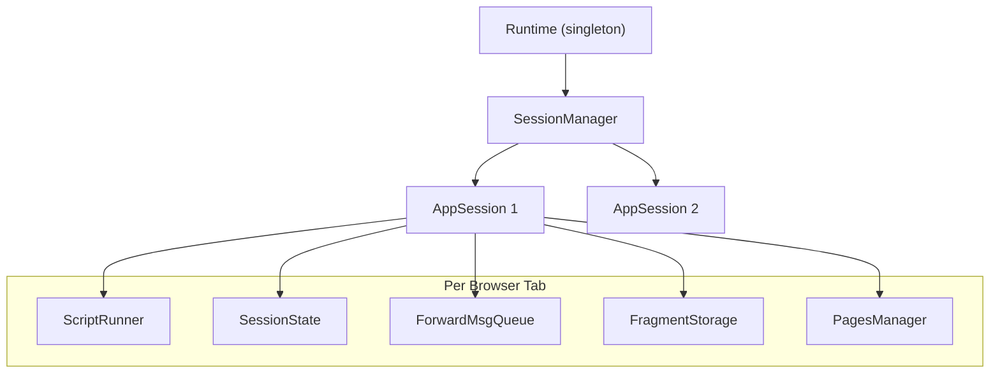
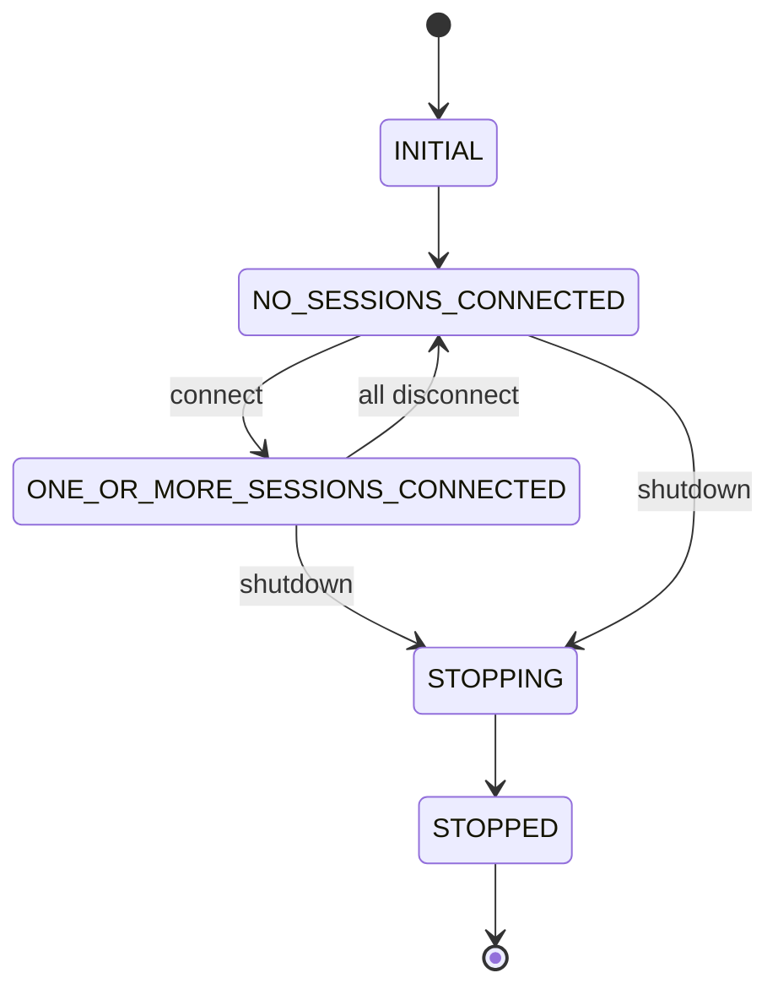

# Backend architecture

Deep dive into Streamlit's Python backend.

## Execution hierarchy



## Runtime (`lib/streamlit/runtime/runtime.py`)

Singleton managing the application lifecycle.

**State machine**:


**Key responsibilities**:
- Main asyncio event loop that flushes message queues
- Thread-safe communication via `call_soon_threadsafe`
- Coordinates managers: MediaFileManager, UploadedFileManager, ScriptCache

## AppSession (`lib/streamlit/runtime/app_session.py`)

Represents a single browser tab.

**Lifecycle**:
1. WebSocket connects -> `Runtime.connect_session()`
2. Creates ScriptRunner, starts initial script execution
3. Widget interaction -> `handle_backmsg()` -> `request_rerun()`
4. Script produces ForwardMsgs -> queued -> flushed to browser
5. WebSocket disconnects -> cleanup

**File watchers**: Monitors script, config.toml, secrets.toml, pages/ for changes.

## ScriptRunner (`lib/streamlit/runtime/scriptrunner/script_runner.py`)

Executes user scripts in isolated thread.

**Execution flow**:
1. Compile script to bytecode (cached via ScriptCache)
2. Create fake `__main__` module
3. Attach `ScriptRunContext` to thread
4. Execute with `exec()` in modified sys.path
5. Process widget callbacks before execution
6. Handle fragments for partial reruns

**Script events**:
- `SCRIPT_STARTED`
- `SCRIPT_STOPPED_WITH_SUCCESS`
- `SCRIPT_STOPPED_WITH_COMPILE_ERROR`
- `SCRIPT_STOPPED_FOR_RERUN` (st.rerun() called)
- `FRAGMENT_STOPPED_WITH_SUCCESS`

**Interrupt points**: Most `st.*` commands check for stop/rerun requests and raise `RerunException` or `StopException`.

## ScriptRunContext (`lib/streamlit/runtime/scriptrunner_utils/script_run_context.py`)

Thread-local context during script execution.

**Key fields**:
- `session_id`: Unique session identifier
- `session_state`: SafeSessionState wrapper
- `query_string`: URL query parameters
- `page_script_hash`: Current page identifier
- `widget_ids_this_run`: Widgets seen in current run
- `cursors`: Delta path cursors for element positioning
- `fragment_storage`: Storage for @st.fragment functions

**Access**: `get_script_run_ctx()` from any code during script execution.

## DeltaGenerator (`lib/streamlit/delta_generator.py`)

The `st` object users interact with.

**Mixin pattern**: Composes ~53 mixins for all element types:
```python
class DeltaGenerator(
    AlertMixin,
    ButtonMixin,
    ChartMixin,
    # ... many more
):
    pass
```

**Cursor system**:
- `RunningCursor`: Moves forward as elements added
- `LockedCursor`: Fixed position for updating elements
- Delta path: `[0, 2, 3]` uniquely identifies element position

**Element creation**:
```
st.button("Click")
  -> ButtonMixin.button()
  -> _enqueue("button", ButtonProto(...))
  -> ForwardMsg with delta path
  -> ScriptRunContext.enqueue()
```

## SessionState (`lib/streamlit/runtime/state/session_state.py`)

Dictionary-like object for state persistence.

**Contents**:
- Widget values (automatic via `register_widget()`)
- User variables (`st.session_state.my_var = 123`)
- Query params integration (`st.query_params`)

**Widget registration**:
```python
register_widget(
    element_id,
    on_change_handler=callback,
    deserializer=serde.deserialize,
    serializer=serde.serialize,
    value_type="trigger_value",  # Maps to WidgetState proto field
)
```

**Lifecycle hooks**:
- `on_script_will_rerun()`: Process widget states from browser, run callbacks
- `on_script_finished()`: Clean up stale widgets not seen this run

## Caching (`lib/streamlit/runtime/caching/`)

**@st.cache_data** (`cache_data_api.py`):
- Pickle-based caching for data (DataFrames, lists)
- In-memory + optional disk persistence
- TTL support, max entries limit

**@st.cache_resource** (`cache_resource_api.py`):
- Stores singleton resources (DB connections, ML models)
- No serialization (stores objects directly)
- Cleanup hooks on cache clear

## Web server (`lib/streamlit/web/server/`)

**Key endpoints**:
- `/_stcore/stream`: WebSocket for bidirectional messages
- `/_stcore/health`: Health check
- `/_stcore/upload_file/<session>/<file>`: File uploads
- `/media/*`: Media files (images, videos)
- `/component/*`: Custom component resources

**WebSocket handler** (`browser_websocket_handler.py`):
```
Browser connects -> Runtime.connect_session()
                 -> Create AppSession
                 -> Start ScriptRunner
                 -> Messages flow bidirectionally
                 -> Browser disconnects -> Runtime.disconnect_session()
```

## Key abstractions

| Interface | Purpose | Default Implementation |
|-----------|---------|------------------------|
| SessionManager | Session lifecycle | WebsocketSessionManager |
| SessionStorage | Session persistence | MemorySessionStorage |
| UploadedFileManager | File uploads | MemoryUploadedFileManager |
| MediaFileStorage | Media files | MemoryMediaFileStorage |
| CacheStorageManager | Cache backend | LocalDiskCacheStorageManager |
