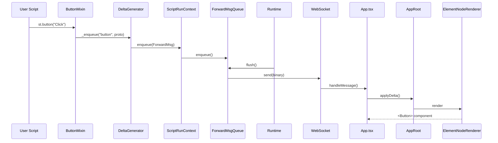
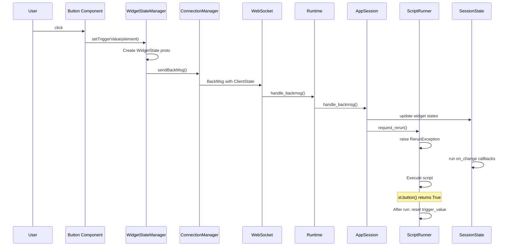

# Communication protocol

Deep dive into Streamlit's protobuf communication layer.

## Proto file location

`proto/streamlit/proto/` contains ~87 `.proto` files.

Compile with: `make protobuf`

**Generated code**:
- Python: `lib/streamlit/proto/*_pb2.py` and `*_pb2.pyi`
- TypeScript: `frontend/protobuf/src/proto.ts` (package: `@streamlit/protobuf`)

## ForwardMsg (server to client)

`ForwardMsg.proto` - Root message sent from backend to frontend.

```protobuf
message ForwardMsg {
  string hash = 1;                    // Unique hash for caching
  ForwardMsgMetadata metadata = 2;    // Contains delta_path

  oneof type {
    NewSession new_session = 4;
    Delta delta = 5;
    ScriptFinishedStatus script_finished = 6;
    SessionStatus session_status_changed = 9;
    Navigation navigation = 23;
    string ref_hash = 11;             // Reference to cached message
    bool heartbeat_ack = 26;
    // ... more types
  }
}
```

**Key types**:
- `delta`: UI updates (new elements, blocks, transients)
- `new_session`: Initial session setup, config, pages
- `script_finished`: Signals script completion
- `ref_hash`: Reference to cached message (bandwidth optimization)

## BackMsg (client to server)

`BackMsg.proto` - Messages from frontend to backend.

```protobuf
message BackMsg {
  oneof type {
    ClientState rerun_script = 11;    // Main rerun trigger
    bool stop_script = 7;
    bool clear_cache = 5;
    FileURLsRequest file_urls_request = 16;
    bool app_heartbeat = 17;
  }
}
```

**ClientState** (key field):
```protobuf
message ClientState {
  string query_string = 1;
  WidgetStates widget_states = 2;    // All widget values
  string page_script_hash = 3;
  string fragment_id = 5;
  repeated string cached_message_hashes = 7;
}
```

## Delta (UI changes)

`Delta.proto` - Incremental UI updates.

```protobuf
message Delta {
  oneof type {
    Element new_element = 3;          // Add UI element
    Block add_block = 6;              // Add container
    Transient new_transient = 9;      // Temporary element
    ArrowNamedDataSet arrow_add_rows = 7;  // Append data
  }
  string fragment_id = 8;
}
```

**Delta path**: Array in metadata like `[0, 2, 3]` specifying tree position.

## Element types

`Element.proto` - ~50+ element types in `oneof type` union.

**Categories**:
- Text: `alert`, `markdown`, `text`, `heading`, `code`
- Data: `dataframe`, `table`, `json`, `metric`
- Charts: `vega_lite_chart`, `plotly_chart`, `deck_gl_json_chart`
- Input widgets: `button`, `checkbox`, `slider`, `text_input`, `selectbox`, `multiselect`
- Date/time: `date_input`, `time_input`, `date_time_input`
- Media: `audio`, `video`, `imgs`
- Special: `spinner`, `progress`, `toast`, `exception`
- Components: `component_instance`, `bidi_component`

## Block types

`Block.proto` - Layout containers.

```protobuf
message Block {
  oneof type {
    Vertical vertical = 1;            // st.container
    Horizontal horizontal = 2;        // st.columns container
    Column column = 3;                // Individual column
    Expandable expandable = 4;        // st.expander
    Form form = 5;                    // st.form
    TabContainer tab_container = 6;   // st.tabs
    Tab tab = 7;                      // Individual tab
    ChatMessage chat_message = 9;     // st.chat_message
    Popover popover = 10;             // st.popover
    Dialog dialog = 11;               // st.dialog
    FlexContainer flex_container = 13; // Dynamic layout container
  }
}
```

## WidgetStates

`WidgetStates.proto` - Widget value transport.

```protobuf
message WidgetState {
  string id = 1;

  oneof value {
    bool trigger_value = 2;           // Buttons (auto-resets)
    bool bool_value = 3;              // Checkbox
    double double_value = 4;          // Slider
    sint64 int_value = 5;             // Integer input
    string string_value = 6;          // Text input
    DoubleArray double_array_value = 7;
    SInt64Array int_array_value = 8;
    StringArray string_array_value = 9;
    string json_value = 10;           // Complex JSON
    ArrowTable arrow_value = 11;      // Data editor
    bytes bytes_value = 12;
    FileUploaderState file_uploader_state_value = 13;
    ChatInputValue chat_input_value = 15;
    string json_trigger_value = 16;   // Transient JSON (auto-resets)
  }
}
```

**Important**: `trigger_value` and `json_trigger_value` auto-reset to default after script run.

## Message flow diagrams

### Script execution to browser update



### Widget interaction to script rerun



## Message caching

ForwardMsgs include `hash` for deduplication:

1. Backend computes hash of message content
2. Frontend maintains `ForwardMsgCache`
3. For unchanged content, backend sends `ref_hash` instead of full message
4. Frontend retrieves from cache using hash

**Benefit**: Reduces bandwidth for large/unchanged elements.

## Key design decisions

| Decision | Problem | Solution |
|----------|---------|----------|
| Delta paths | Efficient tree updates | Array-based paths like `[0, 2, 3]` |
| Message caching | Bandwidth for large elements | Hash-based deduplication |
| Oneof unions | Type-safe variants | Protobuf `oneof` for Element, Block, Delta |
| Trigger vs persistent | Buttons should fire once | `trigger_value` auto-resets |
| Arrow format | Slow dataframe serialization | Apache Arrow columnar format |

## Adding new widget state type

1. Add field to `WidgetState` in `WidgetStates.proto`
2. Run `make protobuf`
3. Backend: Use new `value_type` in `register_widget()`
4. Frontend: Add getter/setter to `WidgetStateManager`
