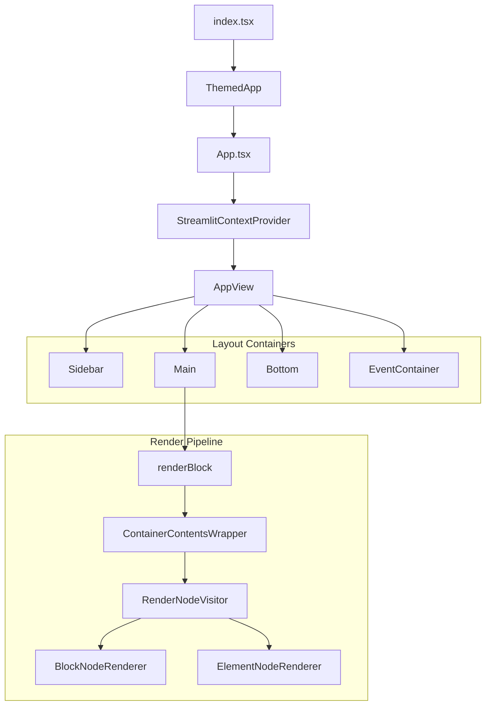

# Frontend architecture

Deep dive into Streamlit's TypeScript/React frontend.

## Component hierarchy



## App.tsx (`frontend/app/src/App.tsx`)

Central orchestrator managing everything.

**Key responsibilities**:
- Manages WebSocket connection via `ConnectionManager`
- Handles all message types via `handleMessage` method
- Maintains `AppRoot` element tree in state
- Coordinates script run state

**ForwardMsg handling by type** (essential types shown):
- `newSession`: Creates empty AppRoot, initializes session
- `delta`: Updates tree via `AppRoot.applyDelta()`
- `scriptFinished`: Clears stale nodes, sends widget states
- `sessionStatusChanged`: Updates script run state
- `navigation`: Handles MPA page changes
- `pageConfigChanged`: Updates page title, icon, layout

## Element tree (`frontend/lib/src/render-tree/`)

### AppRoot (`AppRoot.ts`)

Immutable root with 4 top-level containers:
- `main`: Primary content area
- `sidebar`: Sidebar elements
- `event`: Toasts, balloons, transient effects
- `bottom`: Sticky elements (chat input)

**Key methods**:
- `applyDelta()`: Processes Delta messages
- `clearStaleNodes()`: Removes elements from previous runs
- `filterMainScriptElements()`: Filters by script hash (MPA)

### Node types

**BlockNode** (`BlockNode.ts`):
- Container for children (BlockNode | ElementNode | TransientNode)
- Contains `BlockProto` (layout containers like: columns, expanders, forms, tabs, dialogs)
- Tracks: `scriptRunId`, `fragmentId`, `activeScriptHash`

**ElementNode** (`ElementNode.ts`):
- Leaf node for UI elements
- Contains `Element` protobuf message
- Lazy-loads processed data (Quiver for dataframes)
- Handles `arrowAddRows` for incremental updates

**TransientNode** (`TransientNode.ts`):
- Holds transient elements (spinners) at a delta path position
- Maintains anchor node that persists after transient clears
- Auto-cleared when spinner context exits

### Visitor pattern

Tree operations use visitors in `frontend/lib/src/render-tree/visitors/`:
- `ClearStaleNodeVisitor`: Removes outdated elements
- `SetNodeByDeltaPathVisitor`: Updates tree at path
- `GetNodeByDeltaPathVisitor`: Retrieves node at path

Rendering uses `RenderNodeVisitor` (`frontend/lib/src/components/core/Block/RenderNodeVisitor.tsx`) to convert tree to React elements.

## Rendering pipeline

### ElementNodeRenderer (`frontend/lib/src/components/core/Block/ElementNodeRenderer.tsx`)

Maps protobuf element types to React components via a switch statement.

**Features**:
- Lazy-loads most components via `React.lazy()`
- Wraps in `ElementContainer` with layout config
- Handles staleness with `Maybe` component

### BlockNodeRenderer

Handles containers: forms, tabs, columns, chat messages, expanders, dialogs, popovers.

## WidgetStateManager (`frontend/lib/src/WidgetStateManager.ts`)

Manages all widget state on the frontend.

**Core responsibilities**:
1. Widget state storage (top-level + per-form)
2. Form management (pending changes, uploads, submit buttons)
3. Trigger widget batching (coalesces updates via `setTimeout(0)`)
4. Query parameter bindings

**Methods**: Provides getter/setter pairs for each value type (`setTriggerValue`/`getTriggerValue`, `setStringValue`/`getStringValue`, `setBoolValue`/`getBoolValue`, etc.).

**Trigger batching**: Multiple trigger calls in same macrotask are batched to prevent race conditions.

## Connection management (`frontend/connection/src/`)

### ConnectionManager (`ConnectionManager.ts`)

High-level orchestrator deciding between WebSocket vs static connection.

### WebsocketConnection (`WebsocketConnection.tsx`)

Sophisticated state machine managing WebSocket lifecycle.

**States**:
```
INITIAL -> PINGING_SERVER -> CONNECTING -> CONNECTED
Any state -> DISCONNECTED_FOREVER (on fatal error)
```

**Features**:
- Tries multiple URIs with exponential backoff
- Uses `ForwardMsgCache` for message deduplication
- Maintains message ordering via index queue
- Handles session reconnection via tokens

### ForwardMsgCache (`ForwardMessageCache.ts`)

- Deduplicates messages by hash
- Downloads large payloads asynchronously
- Fragment-aware: keeps messages from active fragments

## React context architecture

**StreamlitContextProvider** provides 8 contexts organized by stability:

**Layer 1: Static config**
- `LibConfigContext`: Locale, Mapbox token, download behavior
- `SidebarConfigContext`: Sidebar state, width, logo

**Layer 2: Theme**
- `ThemeContext`: Active theme, available themes

**Layer 3: Runtime state**
- `NavigationContext`: Page links, current page, app pages
- `ViewStateContext`: Fullscreen state
- `ScriptRunContext`: Script run state/ID, fragment IDs (critical for staleness)
- `FormsContext`: Forms data (pending changes, uploads)
- `DownloadContext`: Deferred file request handler

## Key patterns

### Immutable updates
- Immer used extensively for state updates
- AppRoot operations return new instances
- Prevents mutation bugs in reactive system

### Staleness tracking
Every node tracks:
- `scriptRunId`: Which run created it
- `fragmentId`: Which fragment (if any)
- `deltaMsgReceivedAt`: Timestamp for ordering

Stale nodes are cleared after `scriptFinished`.

### Lazy loading
Components use `React.lazy()` for code splitting, deferring load until first render.

### Referential stability
Heavy use of `useMemo` and `useCallback` to prevent unnecessary re-renders.
