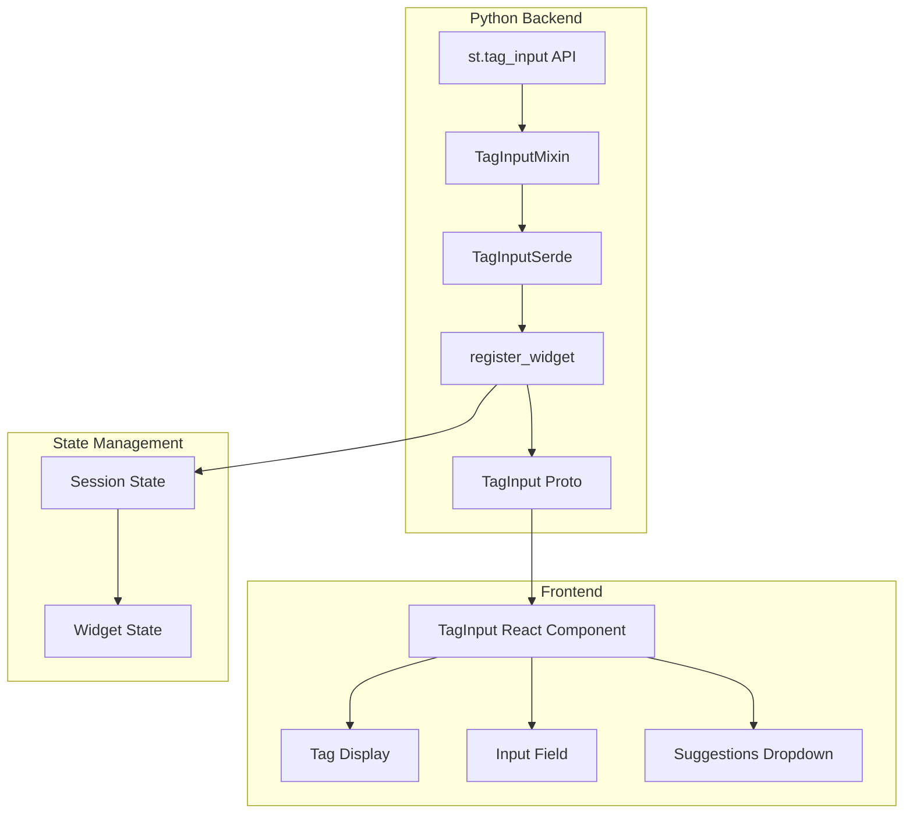

# Design Document: st.tag_input Widget

## Overview

The `st.tag_input` widget is a new Streamlit int that allows users to enter multiple free-form text values displayed as removable tags (chips). This widget fills a common gap in data applications for collecting multiple discrete text inputs such as email addresses, keywords, labels, or filter criteria.

The widget follows Streamlit's existing patterns for input widgets, integrating with the session state system, form handling, and callback mechanisms. It communicates between Python backend and TypeScript frontend via Protocol Buffers over WebSocket.

## Architecture

The tag input widget follows Streamlit's standard widget architecture:



### Data Flow

1. Developer calls `st.tag_input()` with configuration parameters
2. Backend creates a `TagInput` protobuf message with widget configuration
3. Frontend renders the widget and handles user interactions
4. User interactions (add/remove tags) update the frontend state
5. Frontend sends updated tag list back to backend via protobuf
6. Backend deserializes the value and updates session state
7. Callbacks are invoked if registered

## Components and Interfaces

### Python Backend Components

#### TagInputMixin (lib/streamlit/elements/widgets/tag_input.py)

```python
class TagInputMixin:
    def tag_input(
        self,
        label: str,
        value: list[str] | None = None,
        *,
        options: Sequence[str] | None = None,
        max_tags: int | None = None,
        allow_duplicates: bool = False,
        placeholder: str | None = None,
        key: Key | None = None,
        help: str | None = None,
        on_change: WidgetCallback | None = None,
        args: WidgetArgs | None = None,
        kwargs: WidgetKwargs | None = None,
        disabled: bool = False,
        label_visibility: LabelVisibility = "visible",
        width: WidthWithoutContent = "stretch",
    ) -> list[str]:
        """Display a tag input widget."""
        ...
```

#### TagInputSerde

```python
@dataclass
class TagInputSerde:
    default_value: list[str]

    def serialize(self, value: list[str]) -> list[str]:
        """Convert Python list to proto-compatible format."""
        return list(value) if value else []

    def deserialize(self, ui_value: list[str] | None) -> list[str]:
        """Convert proto value back to Python list."""
        return list(ui_value) if ui_value is not None else self.default_value
```

### Protocol Buffer Definition (proto/streamlit/proto/TagInput.proto)

```protobuf
syntax = "proto3";

message TagInput {
    string id = 1;
    string label = 2;
    repeated string default = 3;
    repeated string options = 4;
    string help = 5;
    string form_id = 6;
    repeated string value = 7;
    bool set_value = 8;
    bool disabled = 9;
    LabelVisibilityMessage label_visibility = 10;
    int32 max_tags = 11;
    string placeholder = 12;
    bool allow_duplicates = 13;
}
```

### Frontend Components (frontend/lib/src/components/widgets/TagInput/)

#### TagInput.tsx (Main Component)

- Renders the label, input field, and tag list
- Manages local state for input text and suggestions
- Handles keyboard events (Enter, Tab, Backspace, Arrow keys)
- Communicates with backend via WidgetStateManager

#### Tag.tsx (Individual Tag Component)

- Renders a single tag with text and remove button
- Handles click events for removal
- Supports keyboard focus for accessibility

#### TagInputSuggestions.tsx (Autocomplete Dropdown)

- Renders filtered suggestions based on input
- Handles keyboard navigation
- Supports mouse and keyboard selection

## Data Models

### Widget State

```typescript
interface TagInputState {
    tags: string[];           // Current list of tags
    inputValue: string;       // Current text in input field
    suggestions: string[];    // Filtered suggestions to display
    selectedSuggestionIndex: number; // For keyboard navigation
    isFocused: boolean;       // Input focus state
}
```

### Proto Message Fields

| Field | Type | Description |
|-------|------|-------------|
| id | string | Unique widget identifier |
| label | string | Widget label text |
| default | repeated string | Initial tag values |
| options | repeated string | Autocomplete suggestions |
| help | string | Tooltip text |
| form_id | string | Parent form identifier |
| value | repeated string | Current tag values |
| set_value | bool | Whether value was set by frontend |
| disabled | bool | Widget disabled state |
| label_visibility | LabelVisibilityMessage | Label display mode |
| max_tags | int32 | Maximum number of tags (0 = unlimited) |
| placeholder | string | Input placeholder text |
| allow_duplicates | bool | Whether duplicate tags are allowed |

## Correctness Properties

*A property is a characteristic or behavior that should hold true across all valid executions of a system-essentially, a formal statement about what the system should do. Properties serve as the bridge between human-readable specifications and machine-verifiable correctness guarantees.*

### Property 1: Serialization Round-Trip Consistency

*For any* valid list of tag strings, serializing the list to protobuf format and then deserializing it back SHALL produce an equivalent list with the same elements in the same order.

**Validates: Requirements 11.1, 11.2, 11.3**

### Property 2: Widget Initialization Correctness

*For any* valid combination of label, value, key, and configuration parameters, calling `st.tag_input()` SHALL produce a protobuf message containing all provided values correctly mapped to their respective fields.

**Validates: Requirements 1.1, 1.2, 1.3, 1.4**

### Property 3: Max Tags Enforcement

*For any* tag input widget with a `max_tags` parameter set to N (where N > 0), the widget SHALL never contain more than N tags, and attempting to add tags beyond the limit SHALL be rejected.

**Validates: Requirements 4.1, 4.2, 4.3**

### Property 4: Duplicate Tag Handling

*For any* tag input widget, when `allow_duplicates=False` (default), attempting to add a tag that already exists in the list SHALL be rejected. When `allow_duplicates=True`, duplicate tags SHALL be permitted.

**Validates: Requirements 7.1, 7.2**

### Property 5: Whitespace Tag Rejection

*For any* string composed entirely of whitespace characters (spaces, tabs, newlines), attempting to add it as a tag SHALL be rejected, and the tag list SHALL remain unchanged.

**Validates: Requirements 2.4**

### Property 6: Callback Invocation on Value Change

*For any* tag input widget with an `on_change` callback registered, whenever the tag list changes (tags added or removed), the callback SHALL be invoked exactly once.

**Validates: Requirements 3.3, 10.1**

### Property 7: Form Integration

*For any* tag input widget placed inside a Streamlit form, the widget SHALL correctly set the `form_id` field in the protobuf message to match the parent form's identifier.

**Validates: Requirements 10.3**

### Property 8: Options Inclusion in Proto

*For any* tag input widget with an `options` parameter provided, all option strings SHALL be included in the protobuf message's `options` field, enabling frontend autocomplete functionality.

**Validates: Requirements 5.1, 5.3**

## Error Handling

### Input Validation Errors

| Error Condition | Handling |
|-----------------|----------|
| Empty/whitespace tag | Reject silently, no state change |
| Duplicate tag (when not allowed) | Reject, highlight existing tag |
| Max tags exceeded | Reject, disable input field |
| Invalid max_tags value (< 0) | Raise StreamlitAPIException |

### API Errors

| Error Condition | Exception |
|-----------------|-----------|
| Invalid label type | StreamlitAPIException |
| Invalid value type (not list of strings) | StreamlitAPIException |
| Invalid options type | StreamlitAPIException |

### Error Messages

```python
# max_tags validation
if max_tags is not None and max_tags < 0:
    raise StreamlitAPIException(
        f"max_tags must be a non-negative integer, got {max_tags}"
    )

# value type validation
if value is not None and not isinstance(value, (list, tuple)):
    raise StreamlitAPIException(
        f"value must be a list of strings, got {type(value).__name__}"
    )
```

## Testing Strategy

### Dual Testing Approach

The implementation will use both unit tests and property-based tests to ensure correctness:

- **Unit tests** verify specific examples, edge cases, and error conditions
- **Property-based tests** verify universal properties that should hold across all inputs

### Property-Based Testing Framework

The implementation will use **Hypothesis** for Python property-based testing, configured to run a minimum of 100 iterations per property test.

### Unit Tests (lib/tests/streamlit/elements/widgets/tag_input_test.py)

1. **Basic Rendering Tests**
   - Widget renders with label
   - Widget renders with initial value
   - Widget renders with all configuration options

2. **Serialization Tests**
   - Empty list serialization
   - Single tag serialization
   - Multiple tags serialization
   - Special characters in tags

3. **Validation Tests**
   - max_tags enforcement
   - Duplicate rejection
   - Whitespace rejection
   - Invalid parameter handling

4. **Integration Tests**
   - Form integration
   - Session state integration
   - Callback invocation

### Property-Based Tests (lib/tests/streamlit/elements/widgets/tag_input_property_test.py)

Each property test will be annotated with the format:
`**Feature: tag-input, Property {number}: {property_text}**`

1. **Round-trip serialization property**
2. **Widget initialization property**
3. **Max tags enforcement property**
4. **Duplicate handling property**
5. **Whitespace rejection property**
6. **Callback invocation property**
7. **Form integration property**
8. **Options inclusion property**

### Frontend Tests (frontend/lib/src/components/widgets/TagInput/TagInput.test.tsx)

1. **Rendering Tests**
   - Renders with label
   - Renders tags correctly
   - Renders placeholder when empty

2. **Interaction Tests**
   - Add tag on Enter
   - Add tag on Tab
   - Add tag on comma
   - Remove tag on click
   - Remove tag on Backspace
   - Keyboard navigation in suggestions

3. **Accessibility Tests**
   - ARIA labels present
   - Keyboard navigation works
   - Focus management correct

### E2E Tests (e2e_playwright/st_tag_input_test.py)

1. **Basic functionality**
2. **Autocomplete suggestions**
3. **Max tags limit**
4. **Form submission**
5. **Session state persistence**
