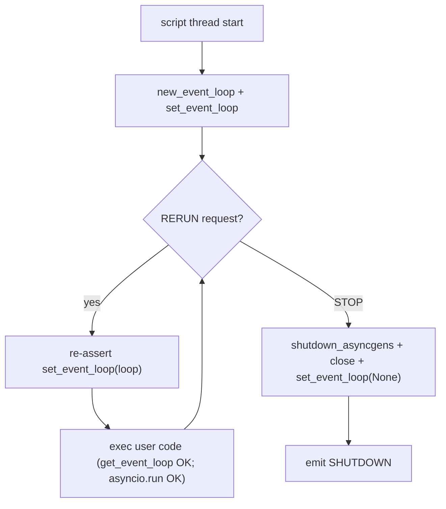

# Tech spec: persistent asyncio event loop on the script thread

**Status:** Draft
**Deliverable:** #1 of "Async-Enabled Streamlit" (concurrency roadmap, Theme A)
**Related issues:** #8488 (async support), #8161 (async in `write_stream`), #8308 (async cache), #744 (import-time / no-current-loop crashes)

## Problem statement

Streamlit runs user code on a dedicated non-main thread (`ScriptRunner.scriptThread`, created in
[`ScriptRunner._run_script_thread`](lib/streamlit/runtime/scriptrunner/script_runner.py)). That thread
never has an asyncio event loop installed. On CPython, only the main thread gets an implicit loop, so
any code on the script thread that reaches for the current loop fails.

Concrete failure modes:

- **Import-time crash (#744).** Many libraries call `asyncio.get_event_loop()` at import or object
  construction (`nest_asyncio.apply()`, `tornado`, `panel`/`holoviews`, `gremlinpython`, older `pyppeteer`).
  On the script thread this raises `RuntimeError: There is no current event loop in thread
  'ScriptRunner.scriptThread'`, so the app crashes before any user logic runs.

  ```python
  # main.py — crashes on import, not on use
  import nest_asyncio
  nest_asyncio.apply()  # RuntimeError: There is no current event loop in thread ...
  ```

- **`asyncio.run()` churn.** `asyncio.run(coro)` technically works today because it creates and then
  *closes* a brand-new loop on every call, finally resetting the thread's loop to `None`. Repeated calls
  across reruns mean there is never a stable loop, which breaks anything that expects loop continuity
  (see cache interaction below).

  ```python
  import asyncio, streamlit as st

  async def fetch(): ...
  st.write(asyncio.run(fetch()))  # new loop created + torn down every rerun
  ```

- **Nested-loop conflict.** If a loop is *running* on the thread, `asyncio.run()` / `loop.run_until_complete()`
  raise `RuntimeError: asyncio.run() cannot be called from a running event loop` (the reason `nest_asyncio`
  exists). Any fix that makes the loop *run in the background* on the script thread reintroduces this class
  of error for the common `asyncio.run()` usage.

Streamlit already carries a point workaround: `type_util.async_generator_to_sync` spins up a throwaway
`asyncio.new_event_loop()` per `st.write_stream` call
([type_util.py:486](lib/streamlit/type_util.py)). This deliverable replaces ad-hoc workarounds with a
single, well-defined loop primitive.

## Proposed approach

Install one persistent, **non-running** event loop on the script thread, owned per session, and set it as
the thread's current loop for the lifetime of the session.

- **Where:** in [`ScriptRunner._run_script_thread`](lib/streamlit/runtime/scriptrunner/script_runner.py),
  immediately after `add_script_run_ctx(...)` and *before* the `while request.type == RERUN` loop that
  drives reruns. Create the loop with `asyncio.new_event_loop()` and install it with
  `asyncio.set_event_loop(loop)`.
- **Non-running by design.** We do *not* call `loop.run_forever()` on a helper thread. The loop is merely
  *installed* so `asyncio.get_event_loop()` returns a valid, stable loop. Because it is not running,
  user `asyncio.run(...)` and `loop.run_until_complete(...)` calls continue to work with no nested-loop
  conflict. This directly fixes the #744 import/construction crashes and gives async client libraries a
  stable loop to bind to.
- **Ownership:** the loop is owned by the `ScriptRunner` (one per session) and stored on the instance
  (e.g. `self._event_loop`). It is not exposed as public API in this deliverable; a public thread-context
  helper is a later deliverable (see scope-out).

Sketch:

```python
def _run_script_thread(self) -> None:
    ...
    add_script_run_ctx(threading.current_thread(), ctx)

    self._event_loop = asyncio.new_event_loop()
    asyncio.set_event_loop(self._event_loop)
    try:
        request = self._requests.on_scriptrunner_ready()
        while request.type == ScriptRequestType.RERUN:
            self._run_script(request.rerun_data)
            request = self._requests.on_scriptrunner_ready()
        ...
    finally:
        self._close_event_loop()  # cancel pending tasks, run shutdown_asyncgens, close, set_event_loop(None)
```

## Loop lifecycle

- **Creation:** once, when the script thread starts (before the first rerun).
- **Reuse:** the *same* loop instance persists across every rerun of the session. Reruns do not create or
  close it. This is the property that makes cached async resources safe (below).
- **Cleanup on session end:** when the thread receives STOP and is about to send `SHUTDOWN`, cancel any
  outstanding tasks, run `loop.run_until_complete(loop.shutdown_asyncgens())`, then `loop.close()` and
  `asyncio.set_event_loop(None)`. Wrap in `try/except` so cleanup never blocks shutdown.
- **Interaction with `asyncio.run()` in user code.** `asyncio.run()` creates its *own* temporary loop,
  runs the coroutine, closes that loop, and in its `finally` calls `set_event_loop(None)` — which *unsets*
  our persistent loop. To keep the persistent loop as the current loop for subsequent user code within the
  same rerun, re-install it after each script body executes. Cheapest robust option: re-assert
  `asyncio.set_event_loop(self._event_loop)` at the top of `_run_script` (idempotent, runs once per rerun),
  so any prior `set_event_loop(None)` is corrected before the next user code runs. `asyncio.run()` itself
  keeps working because our loop is never running.



## Interaction with parallel fragments

Parallel fragments execute on `ThreadPoolExecutor` worker threads managed by
[`ParallelFragmentCoordinator`](lib/streamlit/runtime/parallel_coordinator.py). Those worker threads have
the parent `ScriptRunContext` attached but, like the script thread previously, **no event loop**. So the
same `get_event_loop()` crash exists there today for `async def` fragment bodies or async imports triggered
inside a fragment.

- **Do not share one loop across threads.** A `loop` object is not thread-safe: `run_until_complete` may
  only be driven from the loop's owning thread, and concurrent use from multiple worker threads corrupts
  loop state. Sharing the script-thread loop with workers is unsafe.
- **Recommended: one persistent loop per worker thread.** Install a loop lazily the first time a worker
  thread runs (e.g. inside `ParallelFragmentCoordinator`'s `tracked()` wrapper, or via a
  `ThreadPoolExecutor(initializer=...)`), and reuse it for that thread's lifetime. Because
  `ThreadPoolExecutor` recycles threads, a per-thread install amortizes across submissions. This makes
  `asyncio.run()` / `get_event_loop()` inside fragment bodies behave the same as on the script thread.
- **Cross-loop caveat.** A coroutine object or async client bound to loop A cannot be awaited on loop B.
  So an async client created on the script thread cannot be safely `await`-ed from a fragment worker
  thread. For this deliverable we accept that constraint and document guidance: create/await async clients
  on the thread that uses them. Whether fragment async bodies should instead marshal onto the script loop
  via `run_coroutine_threadsafe` (which requires a running loop) is an open question, not part of #1.

## Interaction with `st.cache_resource`

`@st.cache_resource` ([cache_resource_api.py](lib/streamlit/runtime/caching/cache_resource_api.py)) is the
idiomatic place to build long-lived async clients (`httpx.AsyncClient`, `aiohttp.ClientSession`,
`openai.AsyncOpenAI`). Such clients capture "the current event loop" at construction time and remain bound
to it. Objects bound to a closed or replaced loop raise `RuntimeError: Event loop is closed` or
`... is bound to a different event loop` on later use.

Today this is broken: with no persistent loop, either construction crashes (#744) or an `asyncio.run()`-created
loop is closed as soon as the constructing call returns, so the cached client is bound to a dead loop and
fails on the next rerun. A persistent **per-session** loop fixes this: the client is created against the
session loop, that loop stays alive and unchanged across reruns, and reuse of the cached instance remains
valid for the whole session. This is the core reason the loop lifecycle must be per-session, not per-rerun.

Note: `cache_resource` is process-wide, so a cached client may be shared across sessions/script threads,
each with its own loop. A client bound to session A's loop being used from session B is a real hazard. The
awaitable/async-aware cache decorators (deliverable that handles binding and per-loop keying) are out of
scope here; this spec only guarantees a stable loop *within* a session. See open questions.

## What this does NOT solve (explicit scope-out)

- **Awaitable cache decorators.** Native `async def` support in `@st.cache_data` / `@st.cache_resource`
  (awaiting coroutines, per-loop keying, cross-session binding safety) is a separate deliverable (#8308).
- **Thread-context helper.** A public/helper API to fetch the `ScriptRunContext` and event loop from
  arbitrary user-spawned threads is a separate deliverable.
- **Making the loop "run" in the background** (true concurrent scheduling on the script thread / removing
  the need for `run_until_complete`) is not attempted; the loop is installed but not driven.
- **`nest_asyncio` integration.** We do not auto-apply `nest_asyncio`; installing a non-running loop is
  sufficient for the reported crashes without changing asyncio semantics.

## Open questions

1. **`asyncio.run()` re-install placement.** Is re-asserting `set_event_loop(self._event_loop)` at the
   start of each `_run_script` sufficient, or do we also need to guard the case where user code calls
   `set_event_loop(None)` *mid-body* and then relies on `get_event_loop()` again in the same rerun?
2. **Fragment worker loops.** Confirm per-worker-thread lazy install vs. `ThreadPoolExecutor(initializer=)`;
   and how/whether to clean those loops up when the pool shuts down each run.
3. **Cross-session cached clients.** Should `cache_resource` async clients be keyed by loop, warned about,
   or explicitly documented as "create per session"? (Likely resolved by the async-cache deliverable, but
   the risk exists the moment persistent loops make async clients usable.)
4. **Free-threaded / no-GIL builds.** Any additional constraints under PEP 703 free-threaded Python for the
   per-thread loop model?
5. **AppTest / testing harness.** Does the `streamlit.testing` AppTest runner reuse the same script-thread
   entry point, or does it need the loop installed separately?

## Risks

- **Backward compatibility with `asyncio.run()` users.** Apps that call `asyncio.run()` today must keep
  working. Because our loop is non-running, `asyncio.run()` still succeeds; the only nuance is the
  `set_event_loop(None)` reset it performs, handled by the re-install above. This must be covered by tests.
- **Leaked resources on non-graceful shutdown.** If the loop is not closed (thread killed), unclosed async
  clients/sockets can leak. Mitigated by best-effort cleanup in the `finally` of `_run_script_thread`.
- **Libraries that assume a running loop.** Code paths expecting `asyncio.get_running_loop()` (not just
  `get_event_loop()`) still fail, since our loop is installed but not running. This is out of scope but
  should be documented so expectations are clear.
- **Interaction with the existing `write_stream` workaround.** `type_util.async_generator_to_sync` creates
  its own loop; once a persistent loop exists it should be updated to reuse it (follow-up), otherwise a
  second loop is briefly installed/closed and could reset the thread's current loop. Low risk but worth a
  test.
- **Per-thread loop proliferation in fragments.** Many fragment worker threads each holding a loop increases
  memory/fd usage slightly; bounded by `runner.parallelMaxWorkers`.
