# Implementation Plan: `resolution` parameter for `st.camera_input`

## Goal

Add an optional `resolution: Literal["480p", "720p", "1080p"] | None = None`
keyword-only parameter to `st.camera_input`. When set, the browser is asked to
capture at the requested height (via a height-only `ideal` constraint on
`getUserMedia`), and the resulting JPEG is encoded at the camera's actual stream
resolution rather than the on-screen widget size.

Source of truth for API design: the approved product spec
(`specs/2026-05-19-camera-input-size/product-spec.md`, PR #15249). This document
covers the implementation only.

## Approach summary

The closest existing analog is `st.audio_input`'s `sample_rate` parameter, which:

- validates an optional value against an allow-set and raises
  `StreamlitAPIException` on invalid input,
- threads the value into `compute_and_register_element_id`,
- ships it over an `optional int32` proto field
  ([`AudioInput.proto`](proto/streamlit/proto/AudioInput.proto) line 28), and
- is read on the frontend as `element.sampleRate ?? undefined`
  ([`AudioInput.tsx`](frontend/lib/src/components/widgets/AudioInput/AudioInput.tsx) line 236).

We mirror that pattern. The preset-string -> integer-height mapping is done
**in Python** (see "Mapping logic" for the rationale and the spec deviation this
implies), so the proto carries a plain integer pixel height and the frontend
applies it directly.

### Data flow

```mermaid
flowchart LR
  user["st.camera_input(resolution='720p')"] --> validate["Validate preset, map '720p' -> 720 (Python)"]
  validate --> proto["CameraInput proto: resolution_height = 720"]
  proto --> ws["WebSocket ForwardMsg"]
  ws --> ci["CameraInput.tsx reads element.resolutionHeight"]
  ci --> webcam["WebcamComponent videoConstraints + forceScreenshotSourceSize"]
  webcam --> gum["getUserMedia video height ideal 720"]
  gum --> shot["getScreenshot at stream resolution"]
  shot --> upload["JPEG upload -> UploadedFile"]
```



## Key design decisions

These are implementation decisions not fully pinned down by the product spec.
Each is flagged again in "Open questions".

1. **Map preset -> pixels in Python (not the frontend).** The spec prose says
   "the frontend maps preset strings to integer pixel values", but mapping
   location is an implementation detail, not an API decision. Doing it in Python
   keeps validation and mapping co-located (one source of truth), matches the
   `audio_input` precedent (integer over the wire), and avoids duplicating the
   preset table in TypeScript. The proto therefore carries an integer height.

2. **Proto field is `optional int32 resolution_height`.** `optional` lets us
   distinguish "not set" (`None`, no constraint) from any real height, exactly
   like `sample_rate`. Named `resolution_height` to make the units explicit and
   leave room for a future width/aspect field.

3. **`forceScreenshotSourceSize` must be enabled when a resolution is set.**
   `react-webcam`'s `getScreenshot()` defaults to capturing at the *displayed*
   element size (`video.clientWidth`), so a larger `getUserMedia` stream would
   **not** change the output image dimensions on its own. Per the library docs,
   `forceScreenshotSourceSize` makes the screenshot use the underlying video
   stream's intrinsic size. We enable it only when `resolution` is provided so
   the default (no resolution) behavior is unchanged.

4. **When `resolution` is set, send a height-only `ideal` constraint and drop
   the display-width `ideal`.** The component currently passes
   `width: { ideal: debouncedWidth }` (the layout width) to `getUserMedia`.
   Sending both a layout-derived width ideal and a 720/1080 height ideal gives
   the browser conflicting aspect-ratio hints. When `resolution` is set we pass
   only `height: { ideal }` (+ `facingMode`) so the camera's native aspect ratio
   determines width, matching the spec. With no `resolution`, behavior is
   unchanged.

## Python API changes

File: [`lib/streamlit/elements/widgets/camera_input.py`](lib/streamlit/elements/widgets/camera_input.py)

### Imports / module constants

Add `Literal` and `Final` to the typing imports, import `StreamlitAPIException`,
and define the preset table at module scope (per the "static lookup at module
level" guidance):

```python
from typing import TYPE_CHECKING, Final, Literal, TypeAlias, cast

from streamlit.errors import StreamlitAPIException

CameraInputResolution: TypeAlias = Literal["480p", "720p", "1080p"]

_RESOLUTION_TO_HEIGHT: Final[dict[str, int]] = {
    "480p": 480,
    "720p": 720,
    "1080p": 1080,
}
```

### Public `camera_input` signature + docstring

Add the keyword-only parameter after `label_visibility` (keeping `width` last to
match the existing order, or place `resolution` immediately before `width`):

```python
    *,  # keyword-only arguments:
    disabled: bool = False,
    label_visibility: LabelVisibility = "visible",
    resolution: CameraInputResolution | None = None,
    width: WidthWithoutContent = "stretch",
) -> UploadedFile | None:
```

Docstring entry (NumPy style, user-facing wording, placed alongside the other
parameters):

```
resolution : "480p", "720p", "1080p", or None
    The capture resolution to request from the user's camera. Resolution
    presets set the target image height in pixels; the width is determined
    by the camera's native aspect ratio. This can be one of the following:

    - ``None`` (default): Streamlit captures at a resolution determined by
      the widget's display size.
    - ``"480p"``: Target a height of 480 pixels.
    - ``"720p"``: Target a height of 720 pixels.
    - ``"1080p"``: Target a height of 1080 pixels.

    The value is a request, not a guarantee. Cameras support a fixed set of
    resolutions, so the browser selects the closest supported resolution and
    the returned image may differ from the requested height. If you need
    exact dimensions, resize the captured image after capture (for example,
    with ``PIL.Image.resize``).
```

Add a short example to the docstring's `Examples` section, e.g.
`st.camera_input("Scan QR code", resolution="720p")`.

### Validation + plumbing

In the public `camera_input`, validate before delegating to `_camera_input`
(mirrors `audio_input`'s `sample_rate` validation at
[`audio_input.py`](lib/streamlit/elements/widgets/audio_input.py) lines 244-249):

```python
if resolution is not None and resolution not in _RESOLUTION_TO_HEIGHT:
    raise StreamlitAPIException(
        f"Invalid resolution: {resolution!r}. "
        f"Must be one of {sorted(_RESOLUTION_TO_HEIGHT)}, or None."
    )
```

Pass `resolution=resolution` through to `_camera_input` and add the matching
parameter to its signature.

In `_camera_input`, include `resolution` in the element-id computation and set
the proto field (mapping preset -> pixels here):

```python
element_id = compute_and_register_element_id(
    "camera_input",
    user_key=key,
    key_as_main_identity=True,
    dg=self.dg,
    label=label,
    help=help,
    width=width,
    resolution=resolution,
)

camera_input_proto = CameraInputProto()
# ... existing field assignments ...
if resolution is not None:
    camera_input_proto.resolution_height = _RESOLUTION_TO_HEIGHT[resolution]
```

> Note: `compute_and_register_element_id` accepts arbitrary keyword identity
> values (this is how `audio_input` passes `sample_rate`). Confirm `resolution`
> is hashable for the id hash; the string literal is.

## Protobuf changes

File: [`proto/streamlit/proto/CameraInput.proto`](proto/streamlit/proto/CameraInput.proto)

Add a new optional field (next free tag is `7`):

```proto
message CameraInput {
  string id = 1;
  string label = 2;
  string help = 3;
  string form_id = 4;
  bool disabled = 5;
  LabelVisibility label_visibility = 6;
  optional int32 resolution_height = 7;
}
```

Run `make protobuf` to regenerate Python (`CameraInput_pb2.py(i)`) and the
TypeScript definitions in the `@streamlit/protobuf` package. Do not hand-edit
generated files.

## Frontend changes

### `CameraInput.tsx`

File: [`frontend/lib/src/components/widgets/CameraInput/CameraInput.tsx`](frontend/lib/src/components/widgets/CameraInput/CameraInput.tsx)

Read the height off the proto and forward it to `WebcamComponent` (the proto
value is `number | null | undefined` after codegen, normalize to
`number | undefined` like `AudioInput` does):

```tsx
<WebcamComponent
  handleCapture={handleCapture}
  width={width}
  disabled={disabled}
  clearPhotoInProgress={clearPhotoInProgress}
  setClearPhotoInProgress={setClearPhotoInProgress}
  facingMode={facingMode}
  setFacingMode={handleSetFacingMode}
  resolutionHeight={element.resolutionHeight ?? undefined}
  testOverride={testOverride}
/>
```

### `WebcamComponent.tsx`

File: [`frontend/lib/src/components/widgets/CameraInput/WebcamComponent.tsx`](frontend/lib/src/components/widgets/CameraInput/WebcamComponent.tsx)

Add `resolutionHeight?: number` to `Props`, then build `videoConstraints`
conditionally and enable `forceScreenshotSourceSize` when a resolution is set.

Current (lines 144-168):

```tsx
{!disabled && (
  <Webcam
    audio={false}
    ref={videoRef}
    screenshotFormat="image/jpeg"
    screenshotQuality={1}
    width={debouncedWidth}
    height={(debouncedWidth * 9) / 16}
    style={{
      borderRadius: `${theme.radii.default} ${theme.radii.default} 0 0`,
    }}
    onUserMediaError={() => {
      setWebcamPermissionState(WebcamPermission.ERROR)
    }}
    onUserMedia={() => {
      setWebcamPermissionState(WebcamPermission.SUCCESS)
      setClearPhotoInProgress(false)
    }}
    videoConstraints={{
      width: { ideal: debouncedWidth },
      facingMode,
    }}
  />
)}
```

Proposed:

```tsx
const videoConstraints: MediaTrackConstraints = isNullOrUndefined(
  resolutionHeight
)
  ? { width: { ideal: debouncedWidth }, facingMode }
  : { height: { ideal: resolutionHeight }, facingMode }

// ... in JSX:
{!disabled && (
  <Webcam
    audio={false}
    ref={videoRef}
    screenshotFormat="image/jpeg"
    screenshotQuality={1}
    forceScreenshotSourceSize={!isNullOrUndefined(resolutionHeight)}
    width={debouncedWidth}
    height={(debouncedWidth * 9) / 16}
    style={{
      borderRadius: `${theme.radii.default} ${theme.radii.default} 0 0`,
    }}
    onUserMediaError={() => {
      setWebcamPermissionState(WebcamPermission.ERROR)
    }}
    onUserMedia={() => {
      setWebcamPermissionState(WebcamPermission.SUCCESS)
      setClearPhotoInProgress(false)
    }}
    videoConstraints={videoConstraints}
  />
)}
```

`isNullOrUndefined` is already imported in `CameraInput.tsx`; import it from
`~lib/util/utils` in `WebcamComponent.tsx` (it currently is not). The
`screenshotQuality={1}` JPEG output is unchanged; only the canvas source size
changes.

> The preview box keeps its `16/9` display aspect (`StyledBox`/`StyledImg`),
> while the captured image now reflects the camera's native aspect ratio. This
> is acceptable per the spec ("width determined by native aspect ratio"), but it
> is a visible behavior difference worth confirming in review.

## Mapping logic (preset string -> integer)

- Validation and the `"480p" -> 480` mapping both live in Python, driven by the
  single `_RESOLUTION_TO_HEIGHT` table in
  [`camera_input.py`](lib/streamlit/elements/widgets/camera_input.py).
- The proto carries the resolved integer (`resolution_height`).
- The frontend performs no string parsing; it consumes the integer directly.

Alternative (spec-literal) considered and not recommended: ship the preset
string over the proto (`optional string resolution`) and map it to pixels in a
module-level TS lookup. This matches the spec wording but duplicates the preset
knowledge across Python and TypeScript and splits validation from mapping. If
review prefers strict spec alignment, this is a low-effort swap.

## Error handling

- **Invalid preset (call time):** `StreamlitAPIException` raised in Python before
  enqueue, as shown above. Covered by spec row "Invalid `resolution` value ->
  `StreamlitAPIException` at call time".
- **Camera returns a different resolution:** no error. `ideal` constraints let
  the browser pick the nearest supported resolution; the returned image uses the
  actual captured resolution (no server-side resize), per spec.
- **Camera cannot start at all:** unchanged - the existing `onUserMediaError`
  path sets `WebcamPermission.ERROR` and shows the standard permission UI.
- **`exact` is intentionally not used**, to avoid `OverconstrainedError`.

## Testing plan

### Python unit tests

File: [`lib/tests/streamlit/elements/camera_input_test.py`](lib/tests/streamlit/elements/camera_input_test.py)

Add a `CameraInputResolutionTest(DeltaGeneratorTestCase)` class:

- `resolution=None` (default) -> proto does **not** have `resolution_height`
  (`c.HasField("resolution_height") is False`).
- Parametrized over `("480p", 480), ("720p", 720), ("1080p", 1080)` ->
  `c.resolution_height` equals the expected pixel height.
- Invalid value (e.g. `"4k"`, `720`, `"720"`) -> `StreamlitAPIException` with the
  expected message; assert no element is enqueued (anti-regression negative).
- Extend `test_stable_id_with_key` coverage to confirm a `key` keeps the id
  stable when `resolution` changes, and (separately, without a key) that
  changing `resolution` changes the auto-generated id.

### Python typing test

File: [`lib/tests/streamlit/typing/camera_input_types.py`](lib/tests/streamlit/typing/camera_input_types.py)

Add `assert_type` lines for each preset and `None`, plus the combined-parameters
call, e.g.:

```python
assert_type(camera_input("Take a picture", resolution="720p"), UploadedFile | None)
assert_type(camera_input("Take a picture", resolution=None), UploadedFile | None)
```

### Frontend unit tests

Files:
[`CameraInput.test.tsx`](frontend/lib/src/components/widgets/CameraInput/CameraInput.test.tsx),
[`WebcamComponent.test.tsx`](frontend/lib/src/components/widgets/CameraInput/WebcamComponent.test.tsx)

- `CameraInput.test.tsx`: a `CameraInputProto` with `resolutionHeight: 720`
  forwards `resolutionHeight={720}` to `WebcamComponent`; absent field forwards
  `undefined`.
- `WebcamComponent.test.tsx`: mock `react-webcam` and assert the `videoConstraints`
  and `forceScreenshotSourceSize` props:
  - no `resolutionHeight` -> `videoConstraints` has `width.ideal` and no
    `height.ideal`; `forceScreenshotSourceSize` is `false` (negative assertion).
  - `resolutionHeight={1080}` -> `videoConstraints.height.ideal === 1080`, no
    `width.ideal`, and `forceScreenshotSourceSize` is `true`.

### E2E (Playwright)

Files: [`e2e_playwright/st_camera_input.py`](e2e_playwright/st_camera_input.py),
[`e2e_playwright/st_camera_input_test.py`](e2e_playwright/st_camera_input_test.py)

- Add a camera input with `resolution="720p"` (and optionally one per preset) to
  the app script. Bump `NUM_CAMERA_INPUT_WIDGETS` (currently `5`) to match, since
  `test_displays_correct_number_of_elements` asserts the exact count.
- Add a Chromium-only test (the suite already uses a fake camera via
  `--use-fake-device-for-media-stream`; webkit is skipped) that takes a photo
  from the 720p widget, renders it with `st.image`, and asserts the captured
  image's natural height is the expected value. The fake device in CI typically
  honors the height constraint; if it proves flaky, assert "an image was
  captured and dimensions differ from the default-width capture" rather than an
  exact pixel match.
- Keep negative/again-stable checks consistent with existing tests (disabled
  state, key-based CSS class).

> Note: per repo policy, run E2E via `make run-e2e-test st_camera_input_test.py`
> (not `pytest` directly), and run `make frontend-fast` first since frontend
> code changed. Snapshot mismatches can be regenerated/ignored as needed.

## File-by-file change list

- [`proto/streamlit/proto/CameraInput.proto`](proto/streamlit/proto/CameraInput.proto)
  - Add `optional int32 resolution_height = 7;`.
- Generated (via `make protobuf`, do not hand-edit):
  - `lib/streamlit/proto/CameraInput_pb2.py`, `CameraInput_pb2.pyi`
  - `frontend/protobuf/src/proto.d.ts` / generated JS (the `@streamlit/protobuf`
    output).
- [`lib/streamlit/elements/widgets/camera_input.py`](lib/streamlit/elements/widgets/camera_input.py)
  - Add imports (`Literal`, `Final`, `StreamlitAPIException`), `CameraInputResolution`
    alias, `_RESOLUTION_TO_HEIGHT` constant.
  - Add `resolution` param + docstring to `camera_input` and `_camera_input`.
  - Validate, thread into `compute_and_register_element_id`, set proto field.
- [`frontend/lib/src/components/widgets/CameraInput/CameraInput.tsx`](frontend/lib/src/components/widgets/CameraInput/CameraInput.tsx)
  - Pass `resolutionHeight={element.resolutionHeight ?? undefined}` to
    `WebcamComponent`.
- [`frontend/lib/src/components/widgets/CameraInput/WebcamComponent.tsx`](frontend/lib/src/components/widgets/CameraInput/WebcamComponent.tsx)
  - Add `resolutionHeight?: number` prop, conditional `videoConstraints`,
    `forceScreenshotSourceSize`, import `isNullOrUndefined`.
- Tests:
  - [`lib/tests/streamlit/elements/camera_input_test.py`](lib/tests/streamlit/elements/camera_input_test.py)
  - [`lib/tests/streamlit/typing/camera_input_types.py`](lib/tests/streamlit/typing/camera_input_types.py)
  - [`frontend/lib/src/components/widgets/CameraInput/CameraInput.test.tsx`](frontend/lib/src/components/widgets/CameraInput/CameraInput.test.tsx)
  - [`frontend/lib/src/components/widgets/CameraInput/WebcamComponent.test.tsx`](frontend/lib/src/components/widgets/CameraInput/WebcamComponent.test.tsx)
  - [`e2e_playwright/st_camera_input.py`](e2e_playwright/st_camera_input.py)
  - [`e2e_playwright/st_camera_input_test.py`](e2e_playwright/st_camera_input_test.py)

### Validation commands

- `make protobuf` after editing the `.proto`.
- `make python-tests` / targeted `uv run pytest lib/tests/streamlit/elements/camera_input_test.py`.
- `make python-types` (mypy/ty, exercises the typing test).
- `make frontend-fast` (rebuild), `make frontend-tests`, `make frontend-types`,
  `make frontend-lint`.
- `make run-e2e-test st_camera_input_test.py`.
- `make check` for the full changed-file gate.

## Open questions / ambiguities (spec gaps to confirm in review)

1. **Mapping location.** Spec says the frontend maps presets to pixels; this plan
   maps in Python (single source of truth, matches `audio_input`). Confirm this
   deviation is acceptable, or switch to shipping the preset string.
2. **`forceScreenshotSourceSize` not mentioned in the spec.** Without it, the
   `getUserMedia` resolution does not change the output image size in
   `react-webcam`. This plan enables it when `resolution` is set. This is the
   crux of making the feature actually work and should be explicitly validated.
3. **Width constraint interaction.** When `resolution` is set we drop the
   layout-derived `width: { ideal }` so only `height` constrains capture. Confirm
   we do not want to keep a width hint.
4. **Preview vs capture aspect ratio.** The preview box stays `16/9` while the
   captured image follows the camera's native aspect ratio, so the captured
   image may differ in framing from the preview. Confirm acceptable, or consider
   matching the preview aspect to the capture when `resolution` is set.
5. **Metrics.** The spec checklist wants metrics on (1) preset values used and
   (2) resolution-mismatch frequency. `@gather_metrics("camera_input")` records
   the call but not parameter values or client-side mismatch. Tracking the preset
   value and the actual-vs-requested mismatch would need additional metrics
   wiring (Python arg telemetry and/or a frontend signal); scope this separately
   or confirm it is out of scope for the first PR.
6. **Mobile facing-mode + height constraint.** On mobile, `facingMode` plus a
   `height: { ideal }` constraint can interact with device capabilities; worth a
   manual check on at least one mobile browser, though `ideal` should degrade
   gracefully.
