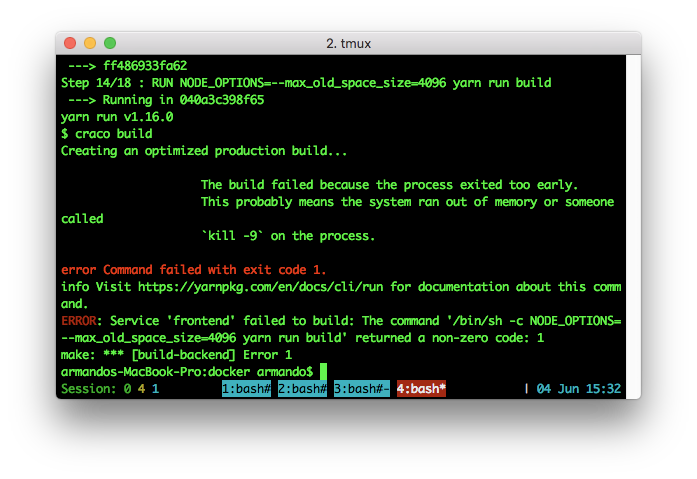
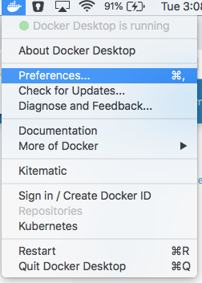
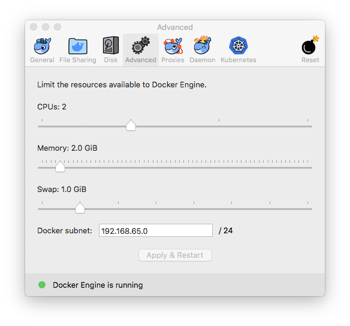
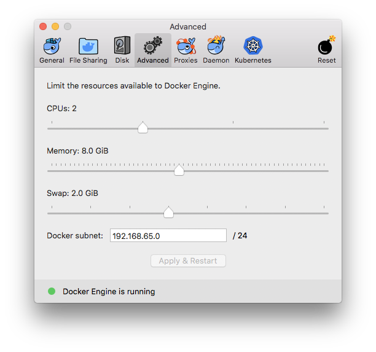

# Docker images with streamlit installed from git.

This is used for development.

## Build docker images
```
$ (cd backend; docker-compose build)
```

### Frontend errors
* You'll most likely get an error like the following due to memory issues.



* Go to Docker -> Preferences -> Advanced



* The default has 2 GB of memory



* I increased it to 8.



## Run
```
$ (cd backend; docker-compose up streamlit)
```

Manually go to [http://127.0.0.1:8501](http://127.0.0.1:8501)

## Pick a different script

Edit [backend/docker-compose.override.yml](backend/docker-compose.override.yml) and change the `command` line.
