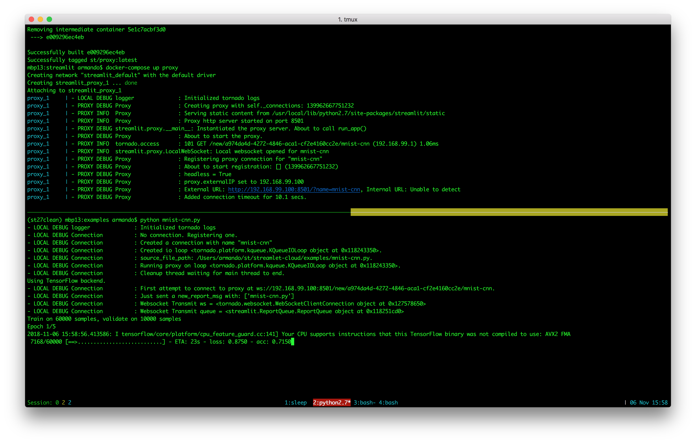

# Docker container for proxy.

This is for running the Proxy in Docker, not running scripts in docker.
ie client runs on your local machine but the proxy runs in docker.  Your
browser connects to the proxy running in docker.

## Install Docker

### OSX
```
brew cask install docker
```

Then start docker and you should see the whale up in the top right.

OSX installs docker-machine and docker-compose

### Linux
[https://docs.docker.com/install/linux/docker-ce/ubuntu/](https://docs.docker.com/install/linux/docker-ce/ubuntu/)
[https://docs.docker.com/machine/install-machine/](https://docs.docker.com/machine/install-machine/)

Then `pip install docker-compose`

### Both
```
docker run hello-world
```

## Create a VM that has docker running on it.
This is basically needed so that proxy is running on 192.168.99.100
instead of localhost.

```
docker-machine create --driver=virtualbox vm0
```

*This is important cause you can easily spin up machines in AWS or GCE*
* [https://docs.docker.com/machine/drivers/aws/](https://docs.docker.com/machine/drivers/aws/)
* [https://docs.docker.com/machine/drivers/gce/](https://docs.docker.com/machine/drivers/gce/)

## Setup environment to point to docker running in vm
```
eval $(docker-machine env vm0)
```

## Build image
If you dont do the eval command above, this will build the image in the
docker-engine running on localhost instead of the vm.

```
cd docker/streamlit
docker-compose build
```


## Run image
```
cd docker/streamlit
docker-compose up proxy
```

Or run this to have it running in the background as a daemon.
```
docker-compose up -d proxy
```

Then this for logs.
```
docker-compose logs -f proxy
```



## Misc
* Restart Virtualbox DHCP Server on OSX
```
sudo /Library/Application\ Support/VirtualBox/LaunchDaemons/VirtualBoxStartup.sh restart
```
