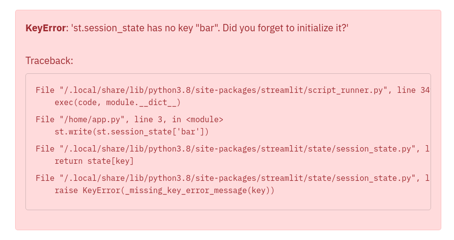
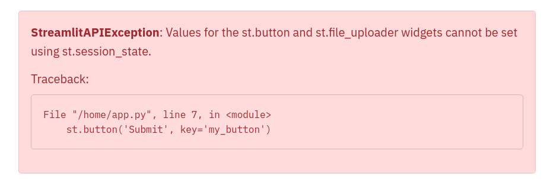

# Add State to your app

## What is State?

We define access to a Streamlit app in a browser tab as a **session**. For each browser tab that connects to the Streamlit server, a new session is created. Streamlit reruns your script from top to bottom every time you interact with your app. Each reruns takes place in a blank slate: no variables are shared between runs.

Session State is a way to share variables between reruns, for each user session. In addition to the ability to store and persist state, Streamlit also exposes the ability to manipulate state using Callbacks.

In this guide, we will illustrate the usage of **Session State** and **Callbacks** as we build a stateful Counter app.

For details on the Session State and Callbacks API, please refer to our [Session State API Reference Guide](session_state_api.md).

## Build a Counter

Let's call our script `counter.py`. It initializes a `count` variable and has a button to increment the value stored in the `count` variable:

```python
import streamlit as st

st.title('Counter Example')
count = 0

increment = st.button('Increment')
if increment:
    count += 1

st.write('Count = ', count)
```

No matter how many times we press the **_Increment_** button in the above app, the `count` remains at 1. Let's understand why:

- Each time we press the **_Increment_** button, Streamlit reruns `counter.py` from top to bottom, and with every run, `count` gets initialized to `0` .
- Pressing **_Increment_** subsequently adds 1 to 0, thus `count=1` no matter how many times we press **_Increment_**.

As we'll see later, we can avoid this issue by storing `count` as a Session State variable. By doing so, we're indicating to Streamlit that it should maintain the value stored inside a Session State variable across app reruns.

Let's learn more about the API to use Session State.

### Initialization

The Session State API follows a field-based API, which is very similar to Python dictionaries:

```python
# Check if 'key' already exists in session_state
# If not, then initialize it
if 'key' not in st.session_state:
	st.session_state['key'] = 'value'

# Session State also supports the attribute based syntax
if 'key' not in st.session_state:
	st.session_state.key = 'value'
```

### Reads and updates

Read the value of an item in Session State by passing the item to `st.write` :

```python
# Reads
st.write(st.session_state.key)

# Outputs: value
```

Update an item in Session State by assigning it a value:

```python
# Updates
st.session_state.key = 'value2'     # Attribute API
st.session_state['key'] = 'value2'  # Dictionary like API
```

Streamlit throws an exception if an uninitialized variable is accessed:

```python
st.write(st.session_state['value'])

# Throws an exception!
```



Let's now take a look at a few examples that illustrate how to add Session State to our Counter app.

### Example 1: Add Session State

Now that we've got a hang of the Session State API, let's update our Counter app to use Session State:

```python
import streamlit as st

st.title('Counter Example')
if 'count' not in st.session_state:
	st.session_state.count = 0

increment = st.button('Increment')
if increment:
    st.session_state.count += 1

st.write('Count = ', st.session_state.count)
```

As you can see in the above example, pressing the **_Increment_** button updates the `count` each time.

### Example 2: Session State and Callbacks

Now that we've built a basic Counter app using Session State, let's move on to something a little more complex. The next example uses Callbacks with Session State.

**Callbacks**: A callback is a Python function which gets called when an input widget changes. Callbacks can be used with widgets using the parameters `on_change` (or `on_click`), `args`, and `kwargs` parameters. The full Callbacks API can be found in our [Session State API Reference Guide](session_state_api.html#use-callbacks-to-update-session-state).

```python
import streamlit as st

st.title('Counter Example using Callbacks')
if 'count' not in st.session_state:
	st.session_state.count = 0

def increment_counter():
	st.session_state.count += 1

st.button('Increment', on_click=increment_counter)

st.write('Count = ', st.session_state.count)
```

Now, pressing the **_Increment_** button updates the count each time by calling the `increment_counter()` function.

### Example 3: Use `args` and `kwargs` in Callbacks

Callbacks also support passing arguments using the `args` parameter in a widget:

```python
import streamlit as st

st.title('Counter Example using Callbacks with args')
if 'count' not in st.session_state:
	st.session_state.count = 0

increment_value = st.number_input('Enter a value', value=0, step=1)

def increment_counter(increment_value):
	st.session_state.count += increment_value

increment = st.button('Increment', on_click=increment_counter,
	args=(increment_value, ))

st.write('Count = ', st.session_state.count)
```

Additionally, we can also use the `kwargs` parameter in a widget to pass named arguments to the callback function as shown below:

```python
import streamlit as st

st.title('Counter Example using Callbacks with kwargs')
if 'count' not in st.session_state:
	st.session_state.count = 0

def increment_counter(increment_value=0):
	st.session_state.count += increment_value

def decrement_counter(decrement_value=0):
	st.session_state.count -= decrement_value

st.button('Increment', on_click=increment_counter,
	kwargs=dict(increment_value=5))

st.button('Decrement', on_click=decrement_counter,
	kwargs=dict(decrement_value=1))

st.write('Count = ', st.session_state.count)
```

### Example 4: Forms and Callbacks

Say we now want to not only increment the `count`, but also store when it was last updated. We illustrate doing this using Callbacks and `st.form`:

```python
import streamlit as st
import datetime

st.title('Counter Example')
if 'count' not in st.session_state:
    st.session_state.count = 0
    st.session_state.last_updated = datetime.time(0,0)

def update_counter():
    st.session_state.count += st.session_state.increment_value
    st.session_state.last_updated = st.session_state.update_time

with st.form(key='my_form'):
    st.time_input(label='Enter the time', value=datetime.datetime.now().time(), key='update_time')
    st.number_input('Enter a value', value=0, step=1, key='increment_value')
    submit = st.form_submit_button(label='Update', on_click=update_counter)

st.write('Current Count = ', st.session_state.count)
st.write('Last Updated = ', st.session_state.last_updated)
```

## Advanced concepts

### Session State and Widget State association

Session State provides the functionality to store variables across reruns. Widget state (i.e. the value of a widget) is also stored in a session.

For simplicity, we have _unified_ this information in one place. i.e. the Session State. This convenience feature makes it super easy to read or write to the widget's state anywhere in the app's code. Session State variables mirror the widget value using the `key` argument.

We illustrate this with the following example. Let's say we have an app with a slider to represent temperature in Celsius. We can **set** and **get** the value of the temperature widget by using the Session State API, as follows:

```python
import streamlit as st

if "celsius" not in st.session_state:
    # set the initial default value of the slider widget
    st.session_state.celsius = 50.0

st.slider(
    "Temperature in Celsius",
    min_value=-100.0,
    max_value=100.0,
    key="celsius"
)

# This will get the value of the slider widget
st.write(st.session_state.celsius)
```

There is a limitation to setting widget values using the Session State API.

```eval_rst
.. important:: Streamlit **does not allow** setting widget values via the Session State API for ``st.button`` and ``st.file_uploader``.
```

The following example will raise a `StreamlitAPIException` on trying to set the state of `st.button` via the Session State API:

```python
if 'my_button' not in st.session_state:
	st.session_state.my_button = True
	# Streamlit will raise an Exception on trying to set the state of button

st.button('Submit', key='my_button')
```



### Caveats and limitations

Here are some limitations to keep in mind when using Session State:

- Session State exists for as long as the tab is open and connected to the Streamlit server. As soon as you close the tab, everything stored in Session State is lost.
- Session State is not persisted. If the Streamlit server crashes, then everything stored in Session State gets wiped
- For caveats and limitations with the Session State API, please see the [API limitations](session_state_api.html#caveats-and-limitations).
