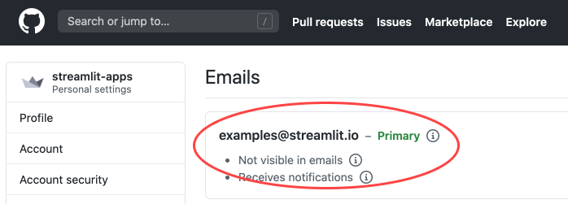
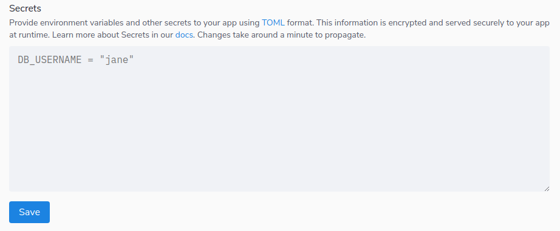
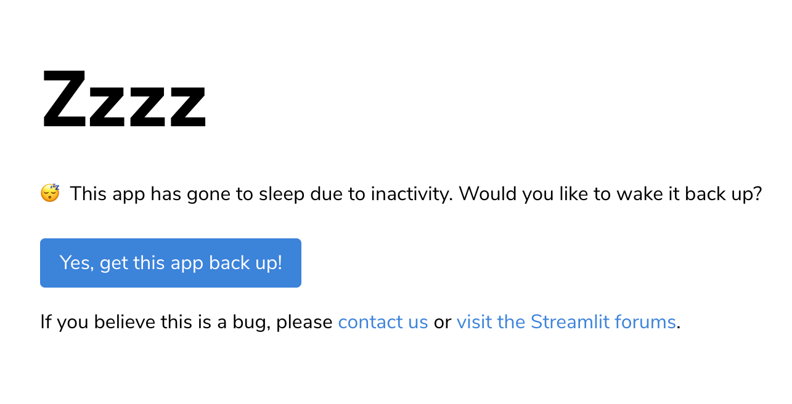
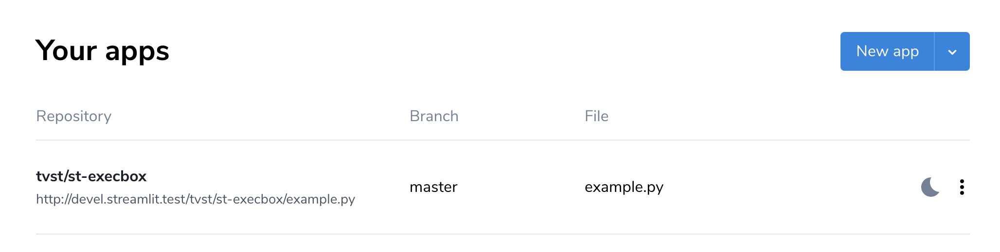

# Deploy an app

Now that you've created your app, you're ready to share it! Use **Streamlit sharing** to share it with the world completely for free. Streamlit sharing is the perfect solution if your app is hosted in a public GitHub repo and you'd like anyone in the world to be able to access it. If that doesn't sound like your app, then check out [Streamlit for Teams](https://streamlit.io/for-teams) for more information on how to get secure, private sharing for your apps.

Of course, if you want to host your app using another hosting provider, go for it! Streamlit apps work anywhere a Python app works. You can find guides for other hosting providers on our [community-supported deployment wiki](https://discuss.streamlit.io/t/streamlit-deployment-guide-wiki/5099).

## Sign up for Streamlit sharing

To get started, first request an invite at [streamlit.io/sharing](https://streamlit.io/sharing). Once you receive your invite email, you're ready to deploy! It's really straightforward, just follow the next few steps.

## Put your Streamlit app on GitHub

1. Add your Streamlit app to a public GitHub repo
2. Add a requirements file to manage any external dependencies
   1. [Python dependencies](/deploy_streamlit_app.html#python-dependencies)
   2. [apt-get dependencies](/deploy_streamlit_app.html#apt-get-dependencies) (for Linux applications outside python environment)

```eval_rst
.. note:: Python requirements files should be placed either in the root of your repository or in the same directory as your Streamlit app.
```

### Python dependencies

Streamlit looks at your requirements file's filename to determine which Python dependency manager to use:

| **Filename**       | **Dependency Manager** | **Documentation**                                                           |
| ------------------ | ---------------------- | --------------------------------------------------------------------------- |
| `requirements.txt` | pip                    | **[docs](https://pip.pypa.io/en/stable/user_guide/#)**                      |
| `Pipfile`          | pipenv                 | **[docs](https://pipenv.pypa.io/en/latest/basics/)**                        |
| `pyproject.toml`   | poetry                 | **[docs](https://python-poetry.org/docs/basic-usage/)**                     |
| `environment.yml`  | conda                  | **[docs](https://conda.io/projects/conda/en/latest/user-guide/index.html)** |

```eval_rst
.. note:: Only include packages in your requirements file that are not distributed with a standard Python installation. If [any of the modules from base Python](https://docs.python.org/3/py-modindex.html) are included in the requirements file, you will get an error when you try to deploy. Additionally, use versions **0.69.2+** of Streamlit to ensure full sharing functionality.
```

```eval_rst
.. warning:: You should only use one requirements file for your app.** If you include more than one (e.g. `requirements.txt` and `Pipfile`), only one will be installed, and we do not guarantee which file will be used.
```

### apt-get dependencies

If `package.txt` exists in the repository we automatically detect it, parse it, and install the listed packages as described below. You can read more about apt-get in their [docs](https://linux.die.net/man/8/apt-get).

Add **apt-get** dependencies to `packages.txt`, one package name per line. For example:

```
freeglut3-dev
libgtk2.0-dev
```

## Log in to share.streamlit.io

The first thing you'll see is a button to login with GitHub. Click on the button to login with the primary email associated with your GitHub account.

```eval_rst
.. important:: If the email you originally signed-up with isn't the primary email associated with your GitHub account, just reply to your invite email telling us your primary Github email so we can grant access to the correct account.
```

You can find your [GitHub account email](https://github.com/settings/emails) here:


## Deploy your app

Click "New app", then fill in your repo, branch, and file path, and click "Deploy".


If your app has a lot of dependencies it may take some time to deploy the first time. But after that, any change that does not touch your dependencies should show up immediately.

That's it — you're done! Your app can be found at:

```python
https://share.streamlit.io/[user name]/[repo name]/[branch name]/[app path]
```

for example:

```python
http://share.streamlit.io/streamlit/demo-self-driving/master/streamlit_app.py
```

If your app has name `streamlit_app.py` and your branch is `master`, your app is also given a shortened URL of the form `https://share.streamlit.io/[user name]/[repo name]`. The only time you need the full URL is when you deployed multiple apps from the same repo. So you can also reach the example URL above at the short URL [http://share.streamlit.io/streamlit/demo-self-driving](http://share.streamlit.io/streamlit/demo-self-driving).

## Secrets management

It is a bad practice to store unencrypted secrets in a git repository. Secrets management allows you to store secrets securely and access them in your Streamlit app as environment variables.

### Set up secrets

In the Streamlit sharing deployment interface, there is a link for 'Advanced settings'. Clicking this link will bring up the secrets interface:



Provide your secrets in the "Secrets" field using TOML format. For example:

```shell
# Everything in this section will be available as an environment variable
db_username="Jane"
db_password="12345qwerty"

# You can also add other sections if you like.
# The contents of sections as shown below will not become environment variables,
# but they'll be easily accessible from within Streamlit anyway as we show
# later in this doc.
[my_cool_secrets]
things_i_like=["Streamlit", "Python"]
```

### Use secrets in your app

Access your secrets as environment variables or by querying the st.secrets dict. For example, if you enter the secrets from the section above, the code below shows you how you can access them within your Streamlit app.

```python
import streamlit as st

# Everything is accessible via the st.secrets dict:

st.write("DB username:", st.secrets["db_username"])
st.write("DB password:", st.secrets["db_password"])
st.write("My cool secrets:", st.secrets["my_cool_secrets"]["things_i_like"])

# And the root-level secrets are also accessible as environment variables:

import os
st.write("Has environment variables been set:",
os.environ["db_username"] == st.secrets["db_username"]
)
```

### Edit your app secrets

1. Go to [https://share.streamlit.io/](https://share.streamlit.io/)
2. Open the menu for your app and click "Edit secrets"
   
3. Click "Save". It might take a minute for the update to be propagated to your app, but the new values will be reflected when the app re-runs.

### Develop locally with secrets

When developing your app locally, add a file called `secrets.toml` in a folder called `.streamlit` at the root of your app repo, and copy/paste your secrets into that file.

```eval_rst
.. note:: Be sure to add this file to your .gitignore so you don't commit your secrets to your public GitHub repo!
```

## Share, update, and collaborate

Now that your app is deployed you can easily share it and collaborate on it. But first, let's take a moment and do a little joy dance for getting that app deployed! 🕺💃

### Share your app

Your app is now live at that fixed URL, so go wild and share it with whomever you want. From your deployed app you can click on the "☰" menu on the top right and select 'Share this app' to post it directly into social media or to share with the community on the [Forum](https://discuss.streamlit.io/c/streamlit-examples/9). We'd love to see what you make!

### Update your app

Your GitHub repository is the source for the app, so that means that any time you push an update to your repo you'll see it reflected in the app in almost real time. Try it out!

Streamlit also smartly detects whether you touched your dependencies, in which case it will automatically do a full redeploy for you - which will take a little more time. But since most updates don't involve dependency changes, you should usually see your app update in real time.

### Collaborate on your app

You can collaborate with others by simply having multiple contributors pushing to the same GitHub repo. If you want to try out something new while still keeping your original app running, just create a new branch, make some changes, and deploy a new version of the Streamlit app.

Every deployed app has its Github source code linked in the "☰" menu on the top right. So if you are looking to understand the code of another Streamlit app, you can simply navigate to the GitHub page from there and read or fork the app.

## App access and usage

Streamlit sharing is completely free and is meant to get you started with sharing your Streamlit apps. If you need a solution with access controls, ability to deploy from private repos, ability to customize resources, and much more, please check out [Streamlit for Teams](https://streamlit.io/for-teams).

### Access

- Apps are visible to the entire world.
- You can only deploy apps that are in a public GitHub repo.
- Your source code must live in Github. We're looking to expand to other Git hosts soon.
- Everyone with push access to your repo is automatically a maintainer of the app.

### App Hibernation

For apps without traffic for 7 consecutive days, they will automatically go to sleep. This is done to alleviate resources and allow the best communal use of the platform! Here are some need to know's about how this works:

- As the app developer, you will receive an email after 5 days of no traffic on your app.
- If you would like to keep your app awake, you have one of two choices:
  - Visit the app (create traffic).
  - Push a commit to the app (this can be empty!).
- If left alone the app will go to sleep at the 7 day mark (2 days after you receive the email). When someone visits the app after this, they will see the sleeping page:
  

- To wake the app up, simply press the "Yes, get this app back up!" button. This can be done by _anyone_ who wants to view the app, not just the app developer!
- You can also wake apps through your Streamlit Sharing dashboard. You will know which apps are sleeping because a moon icon will appear next to the app settings. To wake an app from the dashboard, simply click the moon.
  

### Resource limits

- You can deploy up to 3 apps per account.
- Apps get up to 1 CPU, 800 MB of RAM, and 800 MB of dedicated storage in a shared execution environment.
- Apps do not have access to a GPU.
- If you have a special good-for-the-world case that needs more resources, [send us an email](mailto:support@streamlit.io) and we'll see about making an exception!

## Managing apps

To view or change your deployed Streamlit apps, use your app dashboard at [share.streamlit.io](https://share.streamlit.io) to view your apps, deploy a new app, delete an app, or reboot an app.

### App dashboard

When you first log into [share.streamlit.io](http://s4a.streamlit.io) you will land on your app dashboard, which gives you a list of all your deployed apps. This list does include apps deployed by other people who have push access to the same repos as you, since you're all managers of those apps. Such apps are indicated with an icon like this one:


### Reboot an app

If your app needs a hard reboot, just click on the "︙" overflow menu to the right of the app and click to Reboot. This will interrupt any user that may currently be using that app. It may also take a few minutes for your app to re-deploy, and in that time you — and anyone visiting the app — will see the 'Your app is in the oven' screen.


### Delete an app

If you're not using the app anymore, go ahead and delete it! That will free up space for you to host new apps. Simply click the "︙" overflow menu to the right of the app and select delete. To make sure that you do want to delete the app we ask you to type in the name of the repo to confirm that app will be deleted. Don't worry if you have multiple apps in that repo, we'll just delete the one you selected.


### View logs

You can see logs for your app by just navigating to your app and expanding the "Manage app" button on the bottom right. That will open up a terminal view that will let you see live all the logs for your app.


### Add or remove dependencies

You can add/remove dependencies at any point by updating `requirements.txt` (Python deps) or `packages.txt` (Debian deps) and doing a `git push` to your remote repo. This will cause Streamlit to detect there was a change in its dependencies, which will automatically trigger its installation.

It is best practice to pin your Streamlit version in `requirements.txt`. Otherwise, the version may be auto-upgraded at any point without your knowledge, which could lead to undesired results (e.g. when we deprecate a feature in Streamlit).

## Limitations and known issues

Here are some limitations and known issues that we're actively working to resolve. If you find an issue [please let us know](https://discuss.streamlit.io/c/deploying-streamlit/streamlit-sharing/13)!

- **If you're having trouble logging in,** check your Streamlit sharing invitation email and make sure you signed up using your Primary Github email, which you can find [here](https://github.com/settings/emails).
- When you print something to the terminal, you may need to do a `sys.stdout.flush()` before it shows up.
- Apps execute in a Linux environment running Debian Buster (slim) with Python 3.7. There is no way to change these, and we may upgrade the environment at any point. If we do upgrade it, we will _usually_ not touch existing apps, so they'll continue to work as expected. But if there's a critical fix in the update, we _may_ force-upgrade all apps.
- Matplotlib [doesn't work well with threads](https://matplotlib.org/3.3.2/faq/howto_faq.html#working-with-threads). So if you're using Matplotlib you should wrap your code with locks as shown in the snippet below. This Matplotlib bug is more prominent when you share your app apps since you're more likely to get more concurrent users then.

  ```python
  from matplotlib.backends.backend_agg import RendererAgg
  _lock = RendererAgg.lock

  with _lock:
    fig.title('This is a figure)')
    fig.plot([1,20,3,40])
    st.pyplot(fig)
  ```

- All apps are hosted in the United States. This is currently not configurable.
