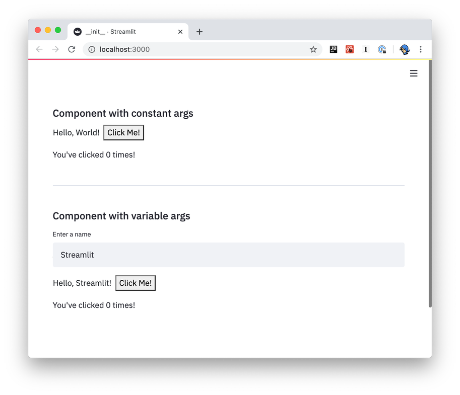

# Components API reference

The first step in developing a Streamlit Component is deciding whether to create a static component (i.e. rendered once, controlled by Python) or to create a bi-directional component that can communicate from Python to JavaScript and back.

## Create a static component

If your goal in creating a Streamlit Component is solely to display HTML code or render a chart from a Python visualization library, Streamlit provides two methods that greatly simplify the process: `components.html()` and `components.iframe()`.

If you are unsure whether you need bi-directional communication, **start here first**!

### Render an HTML string

While [`st.text`](api.html#streamlit.text), [`st.markdown`](api.html#streamlit.text) and [`st.write`](api.html#streamlit.text) make it easy to write text to a Streamlit app, sometimes you'd rather implement a custom piece of HTML. Similarly, while Streamlit natively supports [many charting libraries](api.html#display-charts), you may want to implement a specific HTML/JavaScript template for a new charting library. `components.html` works by giving you the ability to embed an iframe inside of a Streamlit app that contains your desired output.

```eval_rst
.. autofunction:: streamlit.components.v1.html
```

**Example**

```python
import streamlit as st
import streamlit.components.v1 as components

# bootstrap 4 collapse example
components.html(
    """
    <link rel="stylesheet" href="https://maxcdn.bootstrapcdn.com/bootstrap/4.0.0/css/bootstrap.min.css" integrity="sha384-Gn5384xqQ1aoWXA+058RXPxPg6fy4IWvTNh0E263XmFcJlSAwiGgFAW/dAiS6JXm" crossorigin="anonymous">
    <script src="https://code.jquery.com/jquery-3.2.1.slim.min.js" integrity="sha384-KJ3o2DKtIkvYIK3UENzmM7KCkRr/rE9/Qpg6aAZGJwFDMVNA/GpGFF93hXpG5KkN" crossorigin="anonymous"></script>
    <script src="https://maxcdn.bootstrapcdn.com/bootstrap/4.0.0/js/bootstrap.min.js" integrity="sha384-JZR6Spejh4U02d8jOt6vLEHfe/JQGiRRSQQxSfFWpi1MquVdAyjUar5+76PVCmYl" crossorigin="anonymous"></script>
    <div id="accordion">
      <div class="card">
        <div class="card-header" id="headingOne">
          <h5 class="mb-0">
            <button class="btn btn-link" data-toggle="collapse" data-target="#collapseOne" aria-expanded="true" aria-controls="collapseOne">
            Collapsible Group Item #1
            </button>
          </h5>
        </div>
        <div id="collapseOne" class="collapse show" aria-labelledby="headingOne" data-parent="#accordion">
          <div class="card-body">
            Collapsible Group Item #1 content
          </div>
        </div>
      </div>
      <div class="card">
        <div class="card-header" id="headingTwo">
          <h5 class="mb-0">
            <button class="btn btn-link collapsed" data-toggle="collapse" data-target="#collapseTwo" aria-expanded="false" aria-controls="collapseTwo">
            Collapsible Group Item #2
            </button>
          </h5>
        </div>
        <div id="collapseTwo" class="collapse" aria-labelledby="headingTwo" data-parent="#accordion">
          <div class="card-body">
            Collapsible Group Item #2 content
          </div>
        </div>
      </div>
    </div>
    """,
    height=600,
)
```

### Render an iframe URL

`components.iframe` is similar in features to `components.html`, with the difference being that `components.iframe` takes a URL as its input. This is used for situations where you want to include an entire page within a Streamlit app.

```eval_rst
.. autofunction:: streamlit.components.v1.iframe
```

**Example**

```python
import streamlit as st
import streamlit.components.v1 as components

# embed streamlit docs in a streamlit app
components.iframe("https://docs.streamlit.io/en/latest")
```

## Create a bi-directional component

A bi-directional Streamlit Component has two parts:

1. A **frontend**, which is built out of HTML and any other web tech you like (JavaScript, React, Vue, etc.), and gets rendered in Streamlit apps via an iframe tag.
2. A **Python API**, which Streamlit apps use to instantiate and talk to that frontend

To make the process of creating bi-directional Streamlit Components easier, we've created a React template and a TypeScript-only template in the [Streamlit Component-template GitHub repo](https://github.com/streamlit/component-template). We also provide some [example Components](https://github.com/streamlit/component-template/tree/master/examples) in the same repo.

### Development Environment Setup

To build a Streamlit Component, you need the following installed in your development environment:

- Python 3.6+
- Streamlit 0.63+
- [nodejs](https://nodejs.org/en/)
- [npm](https://www.npmjs.com/) or [yarn](https://yarnpkg.com/)

Clone the [component-template GitHub repo](https://github.com/streamlit/component-template), then decide whether you want to use the React.js (["template"](https://github.com/streamlit/component-template/tree/master/template-reactless)) or plain TypeScript (["template-reactless"](https://github.com/streamlit/component-template/tree/master/template-reactless)) template.

1. Initialize and build the component template frontend from the terminal:

   ```shell
   # React template
   $ template/my_component/frontend
   $ npm install    # Initialize the project and install npm dependencies
   $ npm run start  # Start the Webpack dev server

   # or

   # TypeScript-only template
   $ template-reactless/my_component/frontend
   $ npm install    # Initialize the project and install npm dependencies
   $ npm run start  # Start the Webpack dev server
   ```

2. _From a separate terminal_, run the Streamlit app (Python) that declares and uses the component:

   ```shell
   # React template
   $ cd template
   $ . venv/bin/activate # or similar to activate the venv/conda environment where Streamlit is installed
   $ streamlit run my_component/__init__.py # run the example

   # or

   # TypeScript-only template
   $ cd template-reactless
   $ . venv/bin/activate # or similar to activate the venv/conda environment where Streamlit is installed
   $ streamlit run my_component/__init__.py # run the example
   ```

After running the steps above, you should see a Streamlit app in your browser that looks like this:



The example app from the template shows how bi-directional communication is implemented. The Streamlit Component displays a button (`Python → JavaScript`), and the end-user can click the button. Each time the button is clicked, the JavaScript front-end increments the counter value and passes it back to Python (`JavaScript → Python`), which is then displayed by Streamlit (`Python → JavaScript`).

### Frontend

Because each Streamlit Component is its own webpage that gets rendered into an `iframe`, you can use just about any web tech you'd like to create that web page. We provide two templates to get started with in the Streamlit [Components-template GitHub repo](https://github.com/streamlit/component-template/); one of those templates uses [React](https://reactjs.org/) and the other does not.

```eval_rst
.. note::
  Even if you're not already familiar with React, you may still want to check out the React-based template. It handles most of the boilerplate required to send and receive data from Streamlit, and you can learn the bits of React you need as you go.

  If you'd rather not use React, please read this section anyway! It explains the fundamentals of Streamlit ←→ Component communication.
```

#### React

The React-based template is in `template/my_component/frontend/src/MyComponent.tsx`.

- `MyComponent.render()` is called automatically when the component needs to be re-rendered (just like in any React app)
- Arguments passed from the Python script are available via the `this.props.args` dictionary:

```python
# Send arguments in Python:
result = my_component(greeting="Hello", name="Streamlit")
```

```javascript
// Receive arguments in frontend:
let greeting = this.props.args["greeting"]; // name = "Hello"
let name = this.props.args["name"]; // greeting = "Streamlit"
```

- Use `Streamlit.setComponentValue()` to return data from the component to the Python script:

```javascript
// Set value in frontend:
Streamlit.setComponentValue(3.14);
```

```python
# Access value in Python:
result = my_component(greeting="Hello", name="Streamlit")
st.write("result = ", result) # result = 3.14
```

When you call `Streamlit.setComponentValue(new_value)`, that new value is sent to Streamlit, which then _re-executes the Python script from top to bottom_. When the script is re-executed, the call to `my_component(...)` will return the new value.

From a _code flow_ perspective, it appears that you're transmitting data synchronously with the frontend: Python sends the arguments to JavaScript, and JavaScript returns a value to Python, all in a single function call! But in reality this is all happening _asynchronously_, and it's the re-execution of the Python script that achieves the sleight of hand.

- Use `Streamlit.setFrameHeight()` to control the height of your component. By default, the React template calls this automatically (see `StreamlitComponentBase.componentDidUpdate()`). You can override this behavior if you need more control.
- There's a tiny bit of magic in the last line of the file: `export default withStreamlitConnection(MyComponent)` - this does some handshaking with Streamlit, and sets up the mechanisms for bi-directional data communication.

#### Typescript-only

The Typescript-only template is in `template-reactless/my_component/frontend/src/MyComponent.tsx`.

This template has much more code than its React sibling, in that all the mechanics of handshaking, setting up event listeners, and updating the component's frame height are done manually. The React version of the template handles most of these details automatically.

- Towards the bottom of the source file, the template calls `Streamlit.setComponentReady()` to tell Streamlit it's ready to start receiving data. (You'll generally want to do this after creating and loading everything that the Component relies on.)
- It subscribes to `Streamlit.RENDER_EVENT` to be notified of when to redraw. (This event won't be fired until `setComponentReady` is called)
- Within its `onRender` event handler, it accesses the arguments passed in the Python script via `event.detail.args`
- It sends data back to the Python script in the same way that the React template does - clicking on the "Click Me!" button calls `Streamlit.setComponentValue()`
- It informs Streamlit when its height may have changed via `Streamlit.setFrameHeight()`

#### Other frontend details

- Because you're hosting your component from a dev server (via `npm run start`), any changes you make should be automatically reflected in the Streamlit app when you save.
- If you want to add more packages to your component, run `npm add` to add them from within your component's `frontend/` directory.

```shell
npm add baseui
```

- To build a static version of your component, run `npm run build`. See [Prepare your Component](publish_streamlit_components.md) for more information

### Python API

`components.declare_component()` is all that's required to create your Component's Python API:

```python
  import streamlit.components.v1 as components
  my_component = components.declare_component(
    "my_component",
    url="http://localhost:3001"
  )
```

You can then use the returned `my_component` function to send and receive data with your frontend code:

```python
# Send data to the frontend using named arguments.
return_value = my_component(name="Blackbeard", ship="Queen Anne's Revenge")

# `my_component`'s return value is the data returned from the frontend.
st.write("Value = ", return_value)
```

While the above is all you need to define from the Python side to have a working Component, we recommend creating a "wrapper" function with named arguments and default values, input validation and so on. This will make it easier for end-users to understand what data values your function accepts and allows for defining helpful docstrings.

Please see [this example](https://github.com/streamlit/component-template/blob/master/template/my_component/__init__.py#L41-L77) from the Components-template for an example of creating a wrapper function.

### Data serialization

#### Python → Frontend

You send data from Python to the frontend by passing keyword args to your Component's invoke function (that is, the function returned from `declare_component`). You can send the following types of data from Python to the frontend:

- Any JSON-serializable data
- `numpy.array`
- `pandas.DataFrame`

Any JSON-serializable data gets serialized to a JSON string, and deserialized to its JavaScript equivalent. `numpy.array` and `pandas.DataFrame` get serialized using [Apache Arrow](https://arrow.apache.org/) and are deserialized as instances of `ArrowTable`, which is a custom type that wraps Arrow structures and provides a convenient API on top of them.

Check out the [CustomDataframe](https://github.com/streamlit/component-template/tree/master/examples/CustomDataframe) and [SelectableDataTable](https://github.com/streamlit/component-template/tree/master/examples/SelectableDataTable) Component example code for more context on how to use `ArrowTable`.

#### Frontend → Python

You send data from the frontend to Python via the `Streamlit.setComponentValue()` API (which is part of the template code). Unlike arg-passing from Python → frontend, **this API takes a single value**. If you want to return multiple values, you'll need to wrap them in an `Array` or `Object`.

Custom Components can send JSON-serializable data from the frontend to Python, as well as [Apache Arrow](http://arrow.apache.org/) `ArrowTable`s to represent dataframes.
