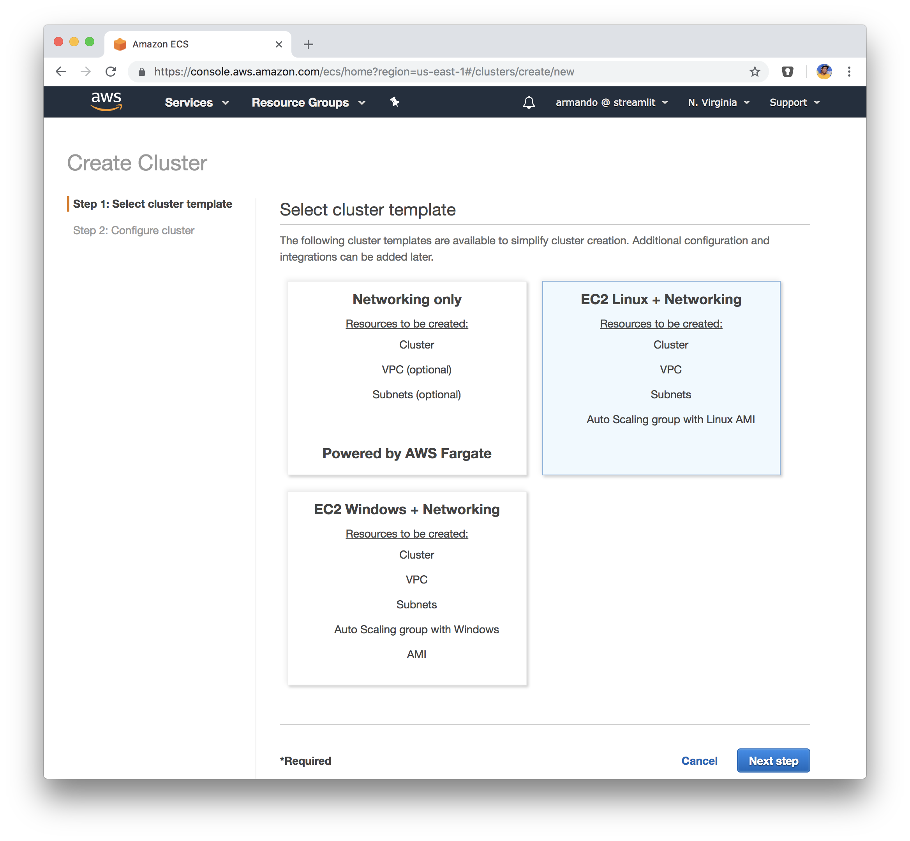
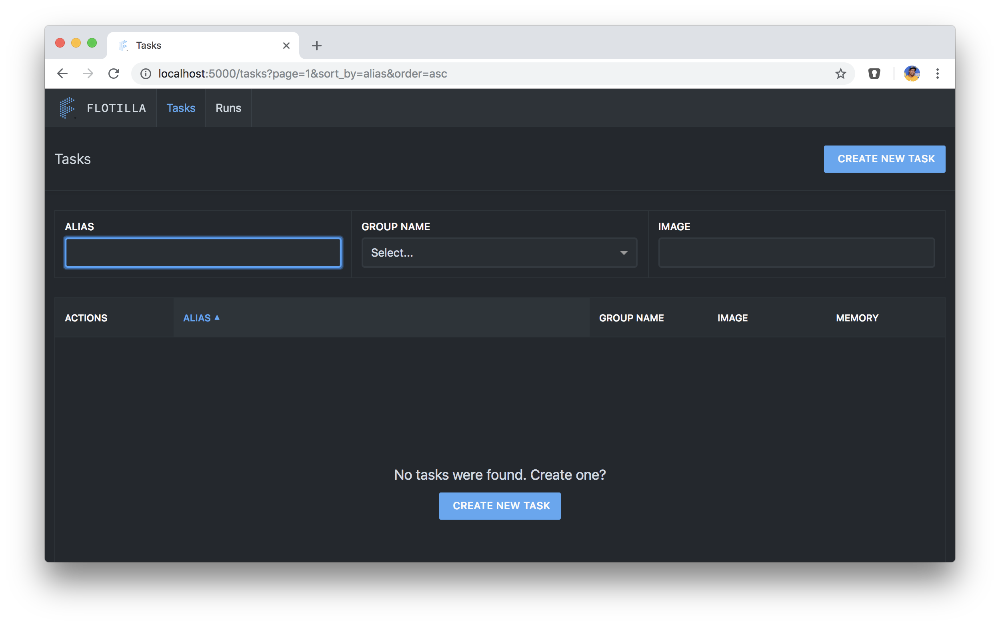
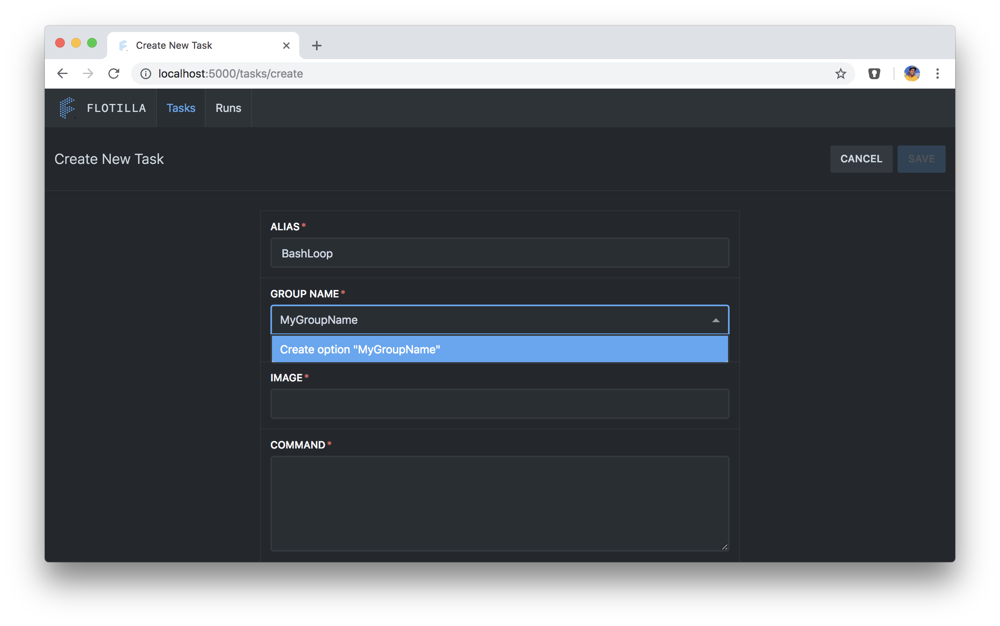
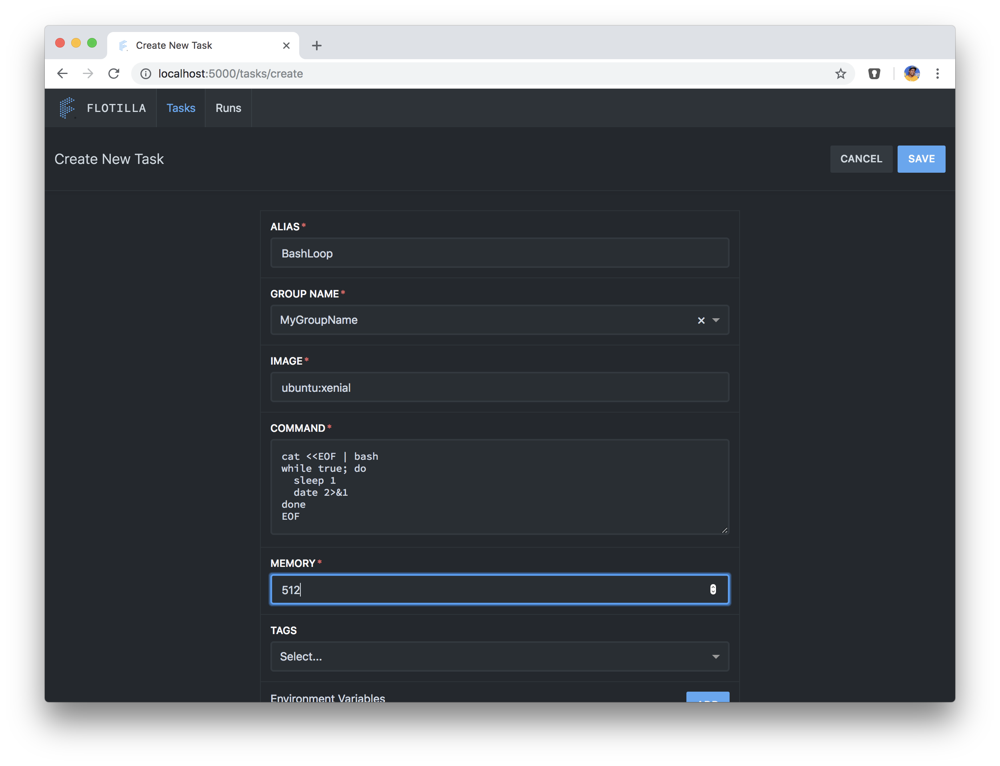
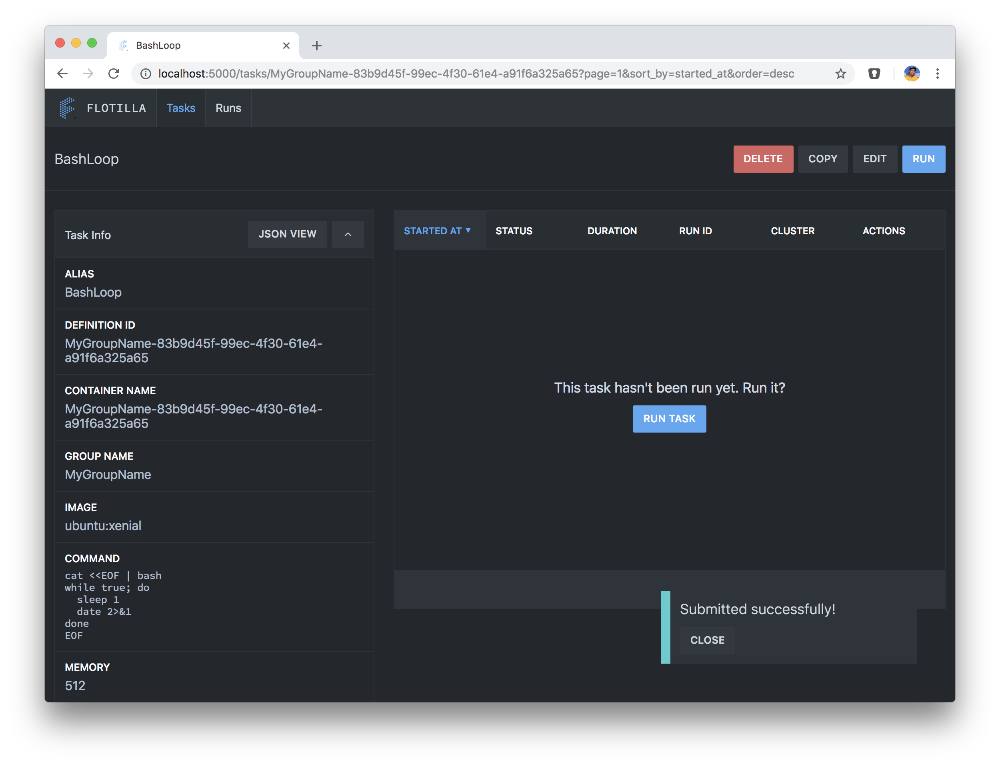
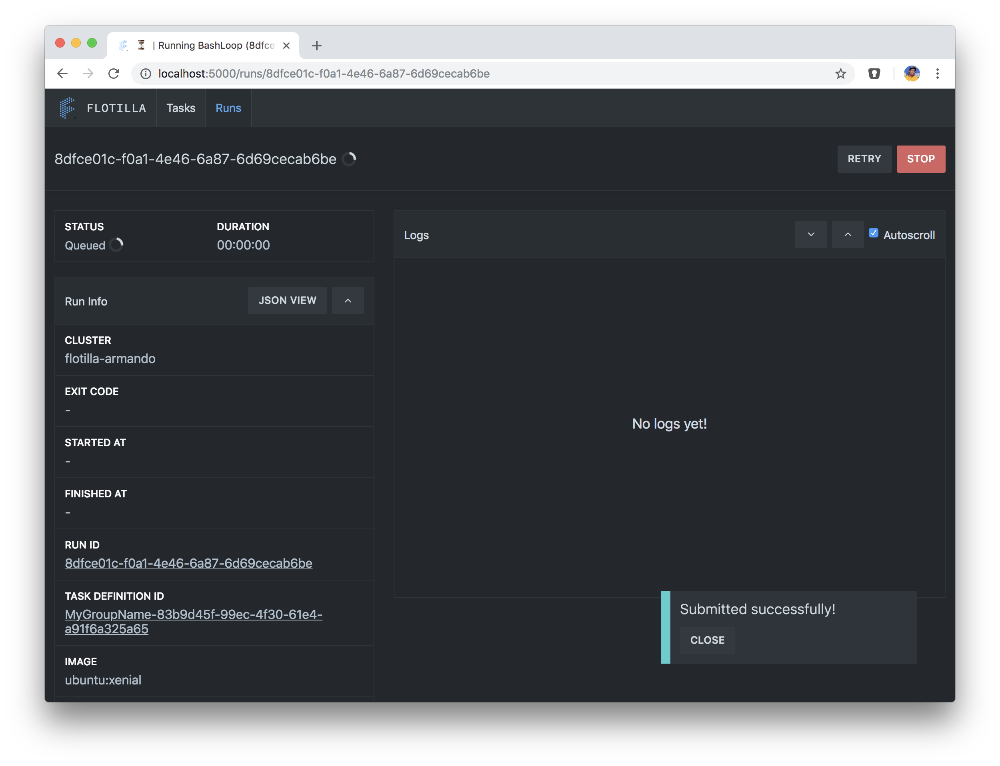
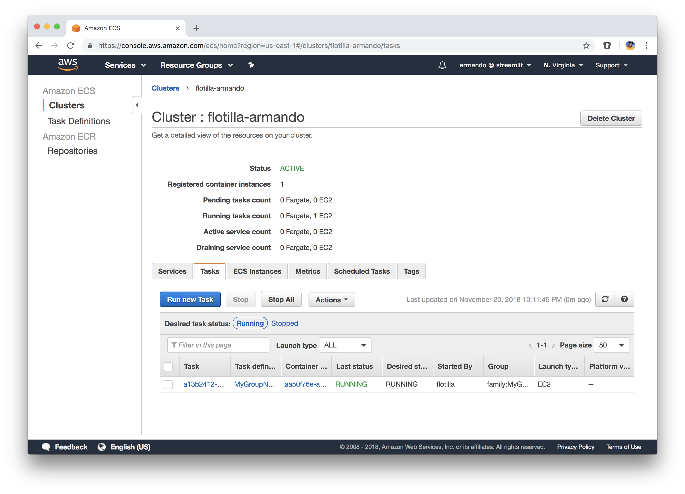
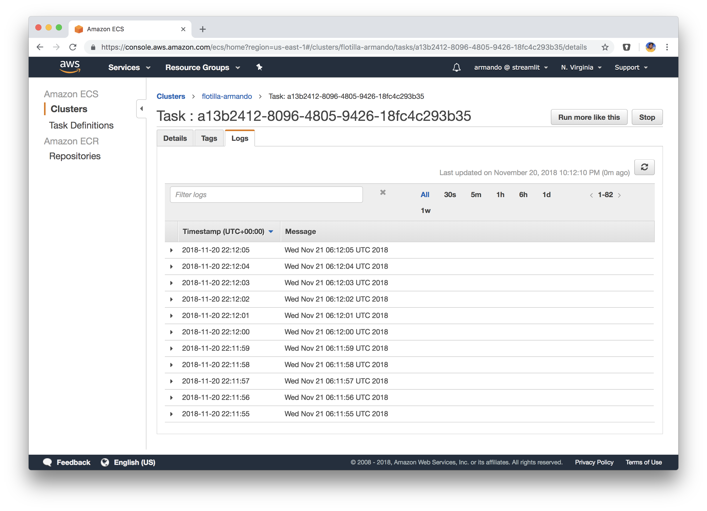
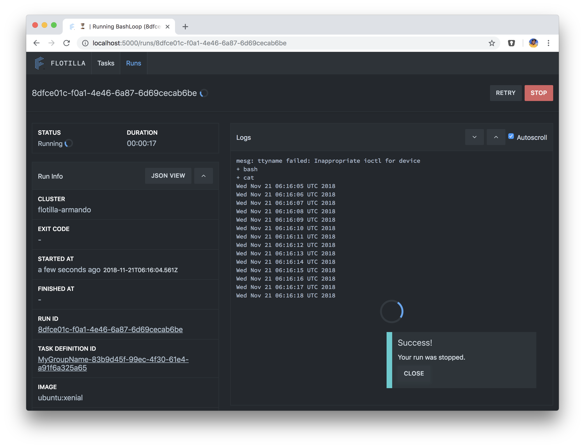

# flotilla

This doc is for use by streamlit developers.

## Prereqs
Follow the instructions to setup AWS and docker.
* [AWS](aws.md)
* [Docker](docker.md)


At the very least do this.
```
export AWS_PROFILE=${AWS_PROFILE:-streamlit}
export AWS_ACCESS_KEY_ID=$(aws --profile ${AWS_PROFILE} configure get aws_access_key_id)
export AWS_SECRET_ACCESS_KEY=$(aws --profile ${AWS_PROFILE} configure get aws_secret_access_key)
export AWS_DEFAULT_REGION=us-east-1
```

## Setup AWS ECS Cluster (Docker engine on AWS).
### Go to the ECS Cluster
[ECS Cluster Dashboard](https://us-east-1.console.aws.amazon.com/ecs/home?region=us-east-1)
Make sure you're in us-east-1 ie Northern Virginia. It defaults to that for some reason.
<br>

### Create cluster
Make sure you pick EC2 Linux + Networking and not just Network (ie Fargate)
<br>

### Configure cluster
Pick a name and select instance size.  At this stage a t2.small is good enough.  The rest defaults and click Create.
<br>

## Setup AWS SQS rules
See this [bug](https://github.com/stitchfix/flotilla-os/issues/95)  This isnt necessary to do as I already did it


## Get source
```
$ git clone git@github.com:stitchfix/flotilla-os.git
```

## Build docker images.
```
$ cd flotilla-os
$ docker-compose build
```

## Run docker images
All three are started with the same command
* frontend - ui
* backend - flotilla
* postgres - db

```
$ docker-compose up
```

## Go to flotilla frontend

Go the [flotilla frontend](http://localhost:5000)



You might have to run docker-compose up a few times by control-c and
then just running up again.  There's some race condition on setup thats
a bug in flotilla.

## Create New Task
This creates what AWS calls a task definition.

Start filling it out, the only tricky part is create the group name, not
only do you have to type it in, but you have to click on create


Fill it out completely and for command add this
```
cat <<EOF | bash
while true; do
  sleep 1
  date 2>&1
done
EOF
```

It should look like this when you're done.


A pop up in the bottom right should show up.


## Run the task
Click on the run button which takes you here.


Select your cluster then hit run.  It will get submitted and pop up in
the bottom right should appear.


## Look at AWS cluster tasks.
Click on the first task (blue link) on the tasks tab under task.


Then click on logs and you should see logs in cloudwatch.



## Look for the logs back on the flotilla UI.


## Stop task.

