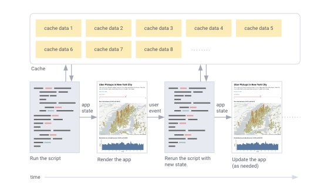

# Main concepts

Working with Streamlit is simple. First you sprinkle a few Streamlit commands
into a normal Python script, then you run it with `streamlit run`:

```
$ streamlit run your_script.py [-- script args]
```

As soon as you run the script as shown above, a local Streamlit server will
spin up and your app will open in a new tab your default web browser. The app
is your canvas, where you'll draw charts, text, widgets, tables, and more.

What gets drawn in the app is up to you. For example
[`st.text`](api.html#streamlit.text) writes raw text to your app, and
[`st.line_chart`](api.html#streamlit.line_chart) draws — you guessed it — a
line chart. Refer to our [API documentation](api.md) to see all commands that
are available to you.

```eval_rst
.. note::
   When passing your script some custom arguments, they must be passed after
   two dashes. Otherwise the arguments get interpreted as arguments to
   Streamlit itself.
```

```eval_rst
.. tip::
   You can also pass a URL to `streamlit run`! This is great when combined with
   Github Gists. For example:

   `$ streamlit run https://raw.githubusercontent.com/streamlit/demo-uber-nyc-pickups/master/app.py`
```

## Development flow

Every time you want to update your app, just save the source file. When you do
that, Streamlit detects if there is a change and asks you whether you want to
rerun your app. Choose "Always rerun" at the top-right of your screen to
automatically update your app every time you change its source code.

This allows you to work in a fast interactive loop: you type some code, save
it, try it out live, then type some more code, save it, try it out, and so on
until you're happy with the results. This tight loop between coding and viewing
results live is one of the ways Streamlit makes your life easier.

```eval_rst
.. tip::
  While developing a Streamlit app, it's recommended to lay out your editor and
  browser windows side by side, so the code and the app can be seen at the same
  time. Give it a try!
```

## Data flow

Streamlit's architecture allows you to write apps the same way you write plain
Python scripts. To unlock this, Streamlit apps have a unique data flow: any
time something must be updated on the screen, Streamlit just reruns your entire
Python script from top to bottom.

This can happen in two situations:

- Whenever you modify your app's source code.

- Whenever a user interacts with widgets in the app. For example, when dragging
  a slider, entering text in an input box, or clicking a button.

And to make all of this fast and seamless, Streamlit does some heavy lifting
for you behind the scenes. A big player in this story is the
[`@st.cache`](#caching) decorator, which allows developers to skip certain
costly computations when their apps rerun. We'll cover caching later in this
page.

## Drawing content

Writing to Streamlit apps is simple. Just call the appropriate API command:

```python
import streamlit as st
x = 4
st.write(x, 'squared is', x * x)
```

In the example above we used the [`st.write()`](api.html#streamlit.write)
command. Whenever you want to draw something to the screen
[`st.write()`](api.html#streamlit.write) is always a good first start! It tries
to guess the best visual representation for its arguments based on their data
types, so things like dataframes are drawn as beautiful tables, Matplotlib
figures are drawn as charts, and so on.

And you can even use [Streamlit magic](api.html#magic) to skip the
[`st.write()`](api.html#streamlit.write) command altogether:

```python
import streamlit as st
x = 4
x, 'squared is', x * x  # 👈 Magic!
```

If you want to do something more advanced like changing specific settings,
drawing animations, or inserting content out of order, check out other
available Streamlit commands in our [API documentation](api.md) and [Advanced
Concepts](advanced_concepts.md) pages.

## Widgets

When you've got the data or model into the state that you want to explore, you
can add in widgets like [`st.slider()`](api.html#streamlit.slider),
[`st.button()`](api.html#streamlit.button) or
[`st.selectbox()`](api.html#streamlit.selectbox). It's really straightforward
— just treat widgets as variables:

```python
import streamlit as st
x = st.slider('x')  # 👈 this is a widget
st.write(x, 'squared is', x * x)
```

On first run, the app above should output the text "0 squared is 0". Then
every time a user interacts with a widget, Streamlit simply reruns your script
from top to bottom, assigning the current state of the widget to your variable
in the process.

For example, if the user moves the slider to position `10`, Streamlit will
rerun the code above and set `x` to `10` accordingly. So now you should see the
text "10 squared is 100".

## Sidebar

Streamlit makes it easy to organize your widgets in a left panel sidebar with
[`st.sidebar`](api.html#add-widgets-to-sidebar). Each element that's passed to
[`st.sidebar`](api.html#add-widgets-to-sidebar) is pinned to the left, allowing
users to focus on the content in your app while still having access to UI
controls.

For example, if you want to add a selectbox and a slider to a sidebar, just
use `st.sidebar.slider` and `st.siderbar.selectbox` instead of `st.slider` and
`st.selectbox`:

```python
import streamlit as st

# Add a selectbox to the sidebar:
add_selectbox = st.sidebar.selectbox(
    'How would you like to be contacted?',
    ('Email', 'Home phone', 'Mobile phone')
)

# Add a slider to the sidebar:
add_slider = st.sidebar.slider(
    'Select a range of values',
    0.0, 100.0, (25.0, 75.0)
)
```

```eval_rst
.. note::
  The following Streamlit commands are not currently supported in the sidebar:
  `st.write` (you should use `st.sidebar.markdown()` instead), `st.echo`, and
  `st.spinner`.
```

## Caching

The Streamlit cache allows your app to execute quickly even when loading data
from the web, manipulating large datasets, or performing expensive
computations.

To use the cache, just wrap functions in the
[`@st.cache`](api.html#streamlit.cache) decorator:

```python
@st.cache  # 👈 This function will be cached
def my_slow_function(arg1, arg2):
    # Do something really slow in here!
    return the_output
```

When you mark a function with the [`@st.cache`](api.html#streamlit.cache)
decorator, it tells Streamlit that whenever the function is called it needs to
check a few things:

1. The input parameters that you called the function with
1. The value of any external variable used in the function
1. The body of the function
1. The body of any function used inside the cached function

If this is the first time Streamlit has seen these four components with these
exact values and in this exact combination and order, it runs the function and
stores the result in a local cache. Then, next time the cached function is
called, if none of these components changed, Streamlit will just skip executing
the function altogether and, instead, return the output previously stored in
the cache.

For more information about the Streamlit cache, its configuration parameters,
and its limitations, see [Caching](caching.md).

## App model

Now that you know a little more about all the individual pieces, let's close
the loop and review how it works together:

1. Streamlit apps are Python scripts that run from top to bottom
1. Every time a user opens a browser tab pointing to your app, the script is
   re-executed
1. As the script executes, Streamlit draws its output live in a browser
1. Scripts use the Streamlit cache to avoid recomputing expensive functions, so
   updates happen very fast
1. Every time a user interacts with a widget, your script is re-executed and
   the output value of that widget is set to the new value during that run.



## Next steps

- [Get started](getting_started.md) with Streamlit
- Read up on [advanced concepts](advanced_concepts.md)
- [Build your first app ](tutorial/index.md)
