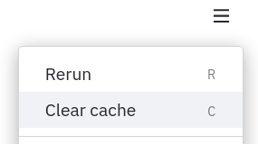
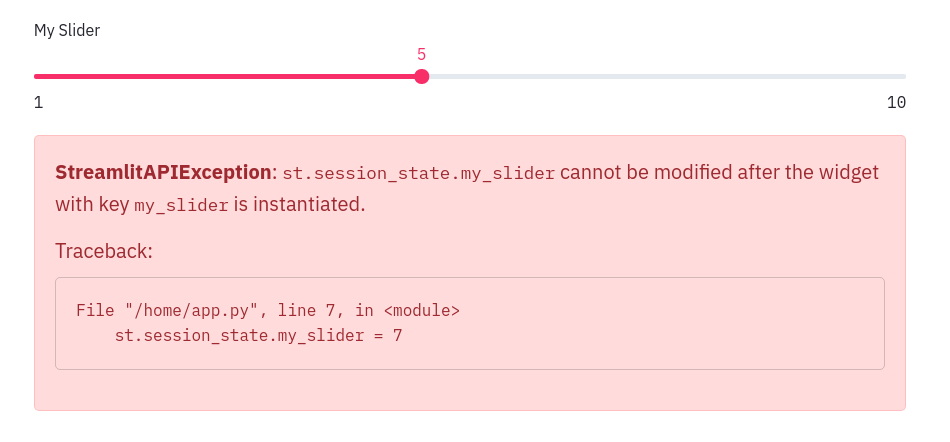

# Session State API

Session State is a way to share variables between reruns, for each user session. In addition to the ability to store and persist state, Streamlit also exposes the ability to manipulate state using Callbacks.

### Initialize values in Session State

The Session State API follows a field-based API, which is very similar to Python dictionaries:

```python
# Initialization
if 'key' not in st.session_state:
	st.session_state['key'] = 'value'

# Session State also supports attribute based syntax
if 'key' not in st.session_state:
	st.session_state.key = 'value'
```

### Reads and updates

Read the value of an item in Session State by passing the item to `st.write` :

```python
# Reads
st.write(st.session_state.key)

# Outputs: value
```

Update an item in Session State by assigning it a value:

```python
st.session_state.key = 'value2'     # Attribute API
st.session_state['key'] = 'value2'  # Dictionary like API
```

Curious about what is in Session State? Use `st.write` or magic:

```python
st.write(st.session_state)

# With magic:
st.session_state
```

Streamlit throws a handy exception if an uninitialized variable is accessed:

```python
st.write(st.session_state['value'])

# Throws an exception!
```


### Delete items

Delete items in Session State using the syntax to delete items in any Python dictionary:

```python
# Delete a single key-value pair
del st.session_state[key]

# Delete all the items in Session state
for key in st.session_state.keys():
    del st.session_state[key]
```

Session State can also be cleared by going to Settings → Clear Cache, followed by Rerunning the app.



### Session State and Widget State association

Every widget with a key is automatically added to Session State:

```python
st.text_input("Your name", key="name")

# This exists now:
st.session_state.name
```

### Use Callbacks to update Session State

A callback is a python function which gets called when an input widget changes.

**Order of execution**: When updating Session state in response to **events**, a callback function gets executed first, and then the app is executed from top to bottom.

Callbacks can be used with widgets using the parameters `on_change` (or `on_click`), `args`, and `kwargs`:

**Parameters**

- **on_change** or **on_click** - The function name to be used as a callback
- **args** (_tuple_) - List of arguments to be passed to the callback function
- **kwargs** (_dict_) - Named arguments to be passed to the callback function

Widgets which support the `on_change` event:

- `st.checkbox`
- `st.color_picker`
- `st.date_input`
- `st.multiselect`
- `st.number_input`
- `st.radio`
- `st.select_slider`
- `st.selectbox`
- `st.slider`
- `st.text_area`
- `st.text_input`
- `st.time_input`
- `st.file_uploader`

Widgets which support the `on_click` event:

- `st.button`
- `st.form_submit_button`

To add a callback, define a callback function **above** the widget declaration and pass it to the widget via the `on_change` (or `on_click` ) parameter.

### Forms and Callbacks

Widgets inside a form can have their values be accessed and set via the Session State API. `st.form_submit_button` can have a callback associated with it. The callback gets executed upon clicking on the submit button. For example:

```python
def form_callback():
  st.write(st.session_state.my_slider)
  st.write(st.session_state.my_checkbox)

with st.form(key='my_form'):
	slider_input = st.slider('My slider', 0, 10, 5, key='my_slider')
	checkbox_input = st.checkbox('Yes or No', key='my_checkbox')
	submit_button = st.form_submit_button(label='Submit', on_click=form_callback)
```

### Caveats and limitations

- Only the `st.form_submit_button` has a callback in forms. Other widgets inside a form are not allowed to have callbacks.
- `on_change` and `on_click` events are only supported on input type widgets.
- Modifying the value of a widget via the Session state API, after instantiating it, is not allowed and will raise a `StreamlitAPIException`. For example:

  ```python
  slider = st.slider(
      label='My Slider', min_value=1,
      max_value=10, value=5, key='my_slider')

  st.session_state.my_slider = 7

  # Throws an exception!
  ```

  

- Setting the widget state via the Session State API and using the `value` parameter in the widget declaration is not recommended, and will throw a warning on the first run. For example:

  ```python
  st.session_state.my_slider = 7

  slider = st.slider(
      label='Choose a Value', min_value=1,
      max_value=10, value=5, key='my_slider')
  ```

  

- Setting the state of button-like widgets: `st.button` and `st.file_uploader` via the Session State API is not allowed. Such type of widgets are by default _False_ and have ephemeral _True_ states which are only valid for a single run. For example:

  ```python
  if 'my_button' not in st.session_state:
      st.session_state.my_button = True

  st.button('My button', key='my_button')

  # Throws an exception!
  ```

  
