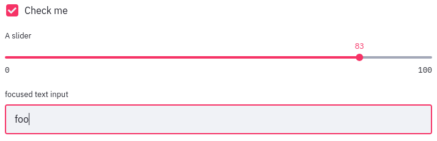
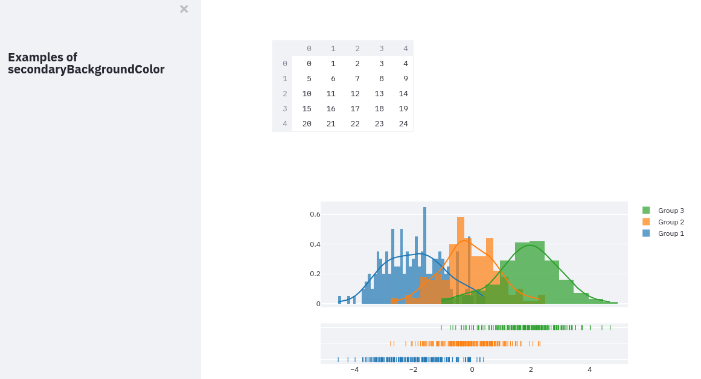

# Theme option reference

In this guide, we provide examples of how Streamlit page elements are affected
by the various theme config options. For a more high-level overview of
Streamlit themes, see the Themes section of the
[main concepts documentation](main_concepts.html#themes).

Streamlit themes are defined using regular config options: a theme can be set
via command line flag when starting your app using `streamlit run` or by
defining it in the `[theme]` section of a `config.toml` file. For more
information on setting config options, please refer to the
[Streamlit configuration documentation](streamlit_configuration.html#set-configuration-options).

The following config options show the default Streamlit Light theme recreated
in the `[theme]` section of a `config.toml` file.

```toml
[theme]
primaryColor="#F63366"
backgroundColor="#FFFFFF"
secondaryBackgroundColor="#F0F2F6"
textColor="#262730"
font="sans serif"
```

Let's go through each of these options, providing screenshots to demonstrate
what parts of a Streamlit app they affect where needed.

## primaryColor

`primaryColor` defines the accent color most often used throughout a Streamlit
app. A few examples of Streamlit widgets that use `primaryColor` include
`st.checkbox`, `st.slider`, and `st.text_input` (when focused).



```eval_rst
.. tip::
   Any CSS color can be used as the value for primaryColor and the other color
   options below. This means that theme colors can be specified in hex or with
   browser-supported color names like "green", "yellow", and
   "chartreuse". They can even be defined in the RGB and HSL formats!
```

## backgroundColor

Defines the background color used in the main content area of your app.

## secondaryBackgroundColor

This color is used where a second background color is needed for added
contrast. Most notably, it is the sidebar's background color. It is also used
as the border and header color for `st.dataframe`, the plot background color
for `st.plotly_chart`, and as the background color for most other interactive
widgets.



## textColor

This option controls the text color for most of your Streamlit app.

## font

Selects the font used in your Streamlit app. Valid values are "sans serif",
"serif", and "monospace". This option defaults to "sans serif" if unset or
invalid.

Note that code blocks are always rendered using the monospace font regardless of
the font selected here.
