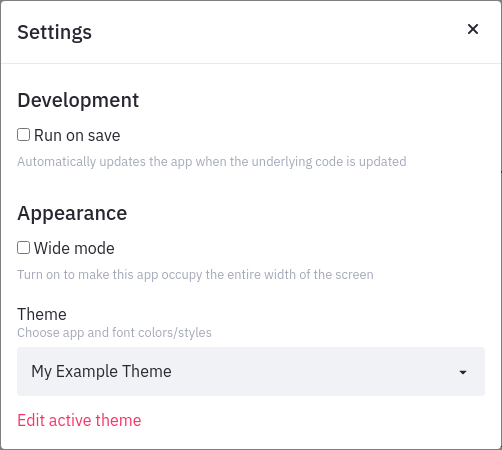
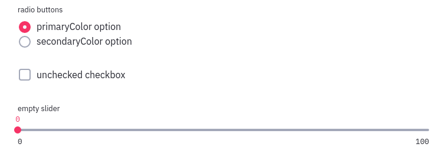

# Theme Option Reference

Along with the included Light and Dark themes, Streamlit allows you to define a
custom theme as the default theme for your app. A Streamlit theme is defined by
setting the configuration options in the `[theme]` section described in the
[Streamlit configuration documentation](streamlit_configuration.html#view-all-configuration-options).

In this guide, we provide visual references to show examples of Streamlit
widgets that are affected by the various available theme config options. The
following config options show the default Streamlit Light theme recreated in
the `[theme]` section of a `config.toml` file.

```toml
[theme]
name="My Example Theme"
primaryColor="#f63366"
secondaryColor="#a3a8b8"
backgroundColor="#FFFFFF"
secondaryBackgroundColor="#f0f2f6"
textColor="#262730"
font="sans serif"
```

Let's go through each of these options, providing screenshots to demonstrate
what parts of a Streamlit app they affect where needed.

## "Required" Options

Setting your own theme on a Streamlit app is optional, so in this case,
required theme options are options that must all be set if you wish to define a
theme. If only some required theme options are set, Streamlit will not apply
a custom theme to your app and will log a warning to your terminal.

### primaryColor

`primaryColor` defines the accent color most often used throughout a Streamlit
app. A few examples of Streamlit widgets that use `primaryColor` include
`st.checkbox`, `st.slider`, and `st.text_input` (when focused).


### backgroundColor

Defines the background color used in the main section of your app.

### secondaryBackgroundColor

This option is used where another background color is needed for added
contrast. Most notably, it is the sidebar's background color. It is also used
as the the border and header color for `st.dataframe`, and the plot background
color for `st.plotly_chart`.


### textColor

As its name suggests, this option controls the text color of your Streamlit
app.

## Other Options

These are options that we are able to provide sensible defaults for, so they
are not necessary for us to consider a theme definition to be complete.

### name

The `name` option allows you to set the name for your theme displayed to the
user in the "Settings" menu. If unset, the option defaults to "Custom Theme".



### secondaryColor

The `secondaryColor` option is currently rarely used by Streamlit widgets,
so specifying it is optional. Some examples uses of `secondaryColor` include
the borders of an unselected `st.radio` button/`st.checkbox` and the unfilled
part of `st.slider`.



### font

Selects the font used in your Streamlit app. Valid values are "sans serif",
"serif", and "monospace". This option defaults to "sans serif" if unset or
invalid.

Note that code blocks are always rendered using the monospace font regardless of
the font selected here.
