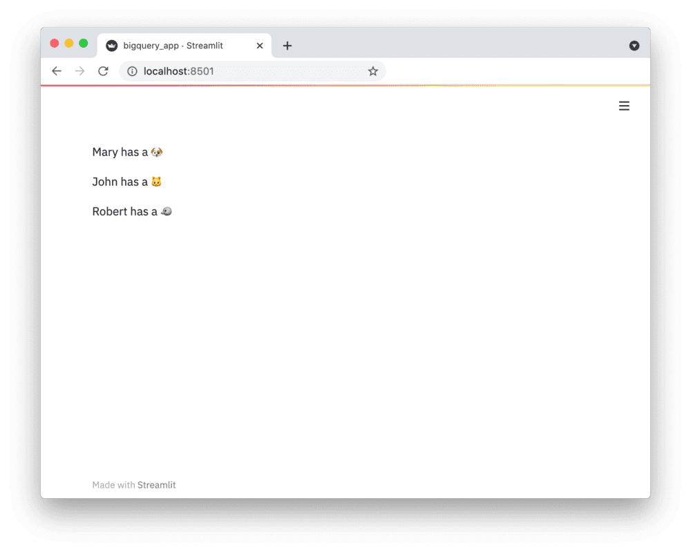

# Connect Streamlit to PostgreSQL

## Introduction

This guide explains how to securely access a PostgreSQL database from Streamlit sharing or Streamlit for Teams. It uses the [psycopg2](https://www.psycopg.org/) library and Streamlit's [secrets management](../deploy_streamlit_app.html#secrets-management).

## Create a PostgreSQL database

```eval_rst
.. note:: If you already have a database that you want to use, feel free to `skip to the next step <postgresql.html#add-username-and-password-to-your-local-app-secrets>`__.
```

First, follow [this tutorial](https://www.tutorialspoint.com/postgresql/postgresql_environment.htm) to install PostgreSQL and create a database (note down the database name, username, and password!). Open the SQL Shell (`psql`) and enter the following two commands to create a table with some example values:

```sql
CREATE TABLE mytable (
    name            varchar(80),
    pet             varchar(80)
);

INSERT INTO mytable VALUES ('Mary', 'dog'), ('John', 'cat'), ('Robert', 'bird');
```

## Add username and password to your local app secrets

Your local Streamlit app will read secrets from a file `.streamlit/secrets.toml` in your app's root directory. Create this file if it doesn't exist yet and add the name, user, and password of your database as shown below:

```python
# .streamlit/secrets.toml

[postgres]
host = "localhost"
port = 5432
dbname = "xxx"
user = "xxx"
password = "xxx"
```

```eval_rst
.. important:: Add this file to ``.gitignore`` and don't commit it to your Github repo!
```

## Copy your app secrets to the cloud

As the `secrets.toml` file above is not committed to Github, you need to pass its content to your deployed app (on Streamlit sharing or Streamlit for Teams) separately. Go to the [app dashboard](https://share.streamlit.io/) and in the app's dropdown menu, click on **Edit Secrets**. Copy the content of `secrets.toml` into the text area. More information in [Secrets Management](../deploy_streamlit_app.html#secrets-management).


## Add psycopg2 to your requirements file

Add the [psycopg2](https://www.psycopg.org/) package to your `requirements.txt` file, preferably pinning its version (just replace `x.x.x` with the version you want installed):

```
# requirements.txt
psycopg2-binary==x.x.x
```

## Write your Streamlit app

Copy the code below to your Streamlit app and run it. Make sure to adapt `query` to use the name of your table.

```python
# streamlit_app.py

import streamlit as st
import psycopg2

# Initialize connection. 
# Uses st.cache to only run once. 
@st.cache(allow_output_mutation=True, hash_funcs={"_thread.RLock": lambda _: None})
def init_connection():
    return psycopg2.connect(**st.secrets["postgres"])

conn = init_connection()

# Perform query.
# Uses st.cache to only rerun when the query changes or after 10 min.
@st.cache(ttl=600)
def run_query(query):
    with conn.cursor() as cur:
        cur.execute(query)
        return cur.fetchall()

rows = run_query("SELECT * from mytable;")

# Print results.
for row in rows:
    st.write(f"{row[0]} has a :{row[1]}:")
```

See `st.cache` above? Without it, Streamlit would run the query every time the app reruns (e.g. on a widget interaction). With `st.cache`, it only runs when the query changes or after 10 minutes (that's what `ttl` is for). Watch out: If your database updates more frequently, you should adapt `ttl` or remove caching so viewers always see the latest data. Read more about caching [here](../caching.md).

If everything worked out (and you used the example table we created above), your app should look like this:

