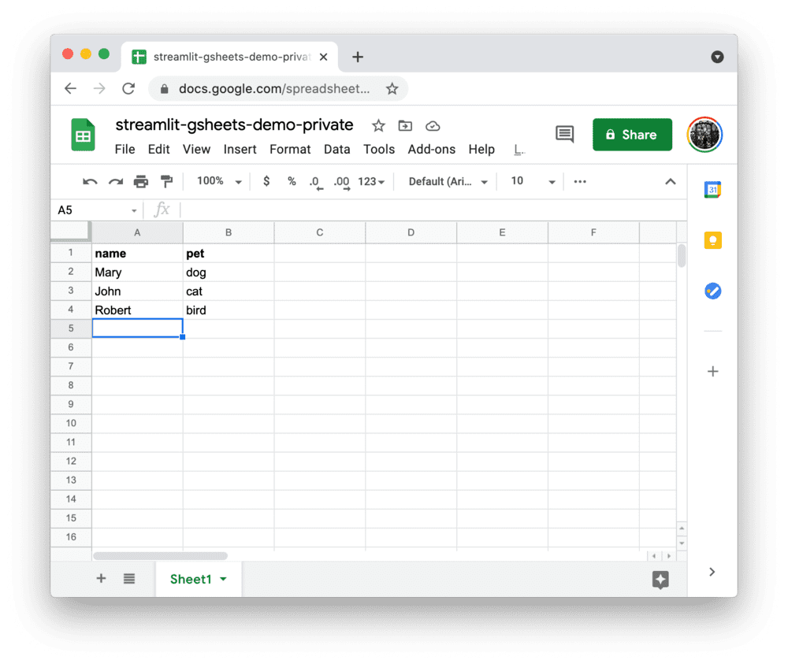

# Connect Streamlit to a private Google Sheet

## Introduction

This guide explains how to securely access a private Google Sheet from Streamlit sharing or Streamlit for Teams. It uses the [gsheetsdb](https://github.com/betodealmeida/gsheets-db-api) library and Streamlit's [secrets management](../deploy_streamlit_app.html#secrets-management).

If you are fine with enabling link sharing for your Google Sheet (i.e. everyone with the link can view it), the guide [Connect Streamlit to a public Google Sheet](public_gsheet.md) shows a simpler method of doing this. If your Sheet contains sensitive information and you cannot enable link sharing, keep on reading. 


## Create a Google Sheet

```eval_rst
.. note:: If you already have a Sheet that you want to access, feel free to `skip to the next step <private_gsheet.html#enable-the-sheets-api>`__.
```



## Enable the Sheets API

Programmatic access to Google Sheets is controlled through [Google Cloud Platform](https://cloud.google.com/). Create an account or sign in and head over to the [**APIs & Services** dashboard](https://console.cloud.google.com/apis/dashboard) (select or create a project if asked). As shown below, search for the Sheets API and enable it:

```eval_rst
.. thumbnail:: ../media/databases/private-gsheet-2.png
   :width: 32%

.. thumbnail:: ../media/databases/private-gsheet-3.png
   :width: 32%

.. thumbnail:: ../media/databases/private-gsheet-4.png
   :width: 32%
```

## Create a service account & key file

To use the Sheets API from the Streamlit Cloud, you need a Google Cloud Platform service account (a special account type for programmatic data access). Go to the [**Service Accounts** page](https://console.cloud.google.com/iam-admin/serviceaccounts) and create an account with the **Viewer** permission (this will let the account access data but not change it):

```eval_rst
.. thumbnail:: ../media/databases/private-gsheet-5.png
   :width: 32%

.. thumbnail:: ../media/databases/private-gsheet-6.png
   :width: 32%

.. thumbnail:: ../media/databases/private-gsheet-7.png
   :width: 32%

.. note:: If the button **CREATE SERVICE ACCOUNT** is gray, you don't have the correct permissions. Ask the admin of your Google Cloud project for help.
```

After clicking **DONE**, you should be back on the service accounts overview. First, note down the email address of the account you just created (**important for next step!**). Then, create a JSON key file for the new account and download it: 

```eval_rst
.. thumbnail:: ../media/databases/private-gsheet-8.png
   :width: 32%

.. thumbnail:: ../media/databases/private-gsheet-9.png
   :width: 32%

.. thumbnail:: ../media/databases/private-gsheet-10.png
   :width: 32%
```

## Share the Google Sheet with the service account

By default, the service account you just created cannot access your Google Sheet. To give it access, click on the **Share** button in the Google Sheet, add the email of the service account (noted down in step 2), and choose the correct permission (if you just want to read the data, **Viewer** is enough):


```eval_rst
.. thumbnail:: ../media/databases/private-gsheet-11.png
   :width: 49%

.. thumbnail:: ../media/databases/private-gsheet-12.png
   :width: 49%
```

## Add the key file to your local app secrets

Your local Streamlit app will read secrets from a file `.streamlit/secrets.toml` in your app's root directory. Create this file if it doesn't exist yet and add the URL of your Google Sheet plus the content of the key file you downloaded to it as shown below:

```python
# .streamlit/secrets.toml

private_gsheets_url = "https://docs.google.com/spreadsheets/d/12345/edit?usp=sharing"

[gcp_service_account]
type = "service_account"
project_id = "xxx"
private_key_id = "xxx"
private_key = "xxx"
client_email = "xxx"
client_id = "xxx"
auth_uri = "https://accounts.google.com/o/oauth2/auth"
token_uri = "https://oauth2.googleapis.com/token"
auth_provider_x509_cert_url = "https://www.googleapis.com/oauth2/v1/certs"
client_x509_cert_url = "xxx"
```

```eval_rst
.. important:: Add this file to ``.gitignore`` and don't commit it to your Github repo!
```

## Copy your app secrets to the cloud

As the `secrets.toml` file above is not committed to Github, you need to pass its content to your deployed app (on Streamlit sharing or Streamlit for Teams) separately. Go to the [app dashboard](https://share.streamlit.io/) and in the app's dropdown menu, click on **Edit Secrets**. Copy the content of `secrets.toml` into the text area. More information in [Secrets Management](../deploy_streamlit_app.html#secrets-management).


## Add gsheetsdb to your requirements file

Add the [gsheetsdb](https://github.com/betodealmeida/gsheets-db-api) package to your `requirements.txt` file, preferably pinning its version (just replace `x.x.x` with the version you want installed):

```
# requirements.txt
gsheetsdb==x.x.x
```

## Write your Streamlit app

Copy the code below to your Streamlit app and run it. 

```python
# streamlit_app.py

import streamlit as st
from google.oauth2 import service_account
from gsheetsdb import connect

# Create a connection object.
credentials = service_account.Credentials.from_service_account_info(
    st.secrets["gcp_service_account"],
    scopes=[
        "https://www.googleapis.com/auth/spreadsheets",
    ],
)
conn = connect(credentials=credentials)

# Perform SQL query on the Google Sheet.
# Uses st.cache to only rerun when the query changes or after 10 min.
@st.cache(ttl=600)
def run_query(query):
    rows = conn.execute(query, headers=1)
    return rows

sheet_url = st.secrets["private_gsheets_url"]
rows = run_query(f'SELECT * FROM "{sheet_url}"')

# Print results.
for row in rows:
    st.write(f"{row.name} has a :{row.pet}:")
```

See `st.cache` above? Without it, Streamlit would run the query every time the app reruns (e.g. on a widget interaction). With `st.cache`, it only runs when the query changes or after 10 minutes (that's what `ttl` is for). Watch out: If your database updates more frequently, you should adapt `ttl` or remove caching so viewers always see the latest data. Read more about caching [here](../caching.md).

If everything worked out (and you used the example table we created above), your app should look like this:

