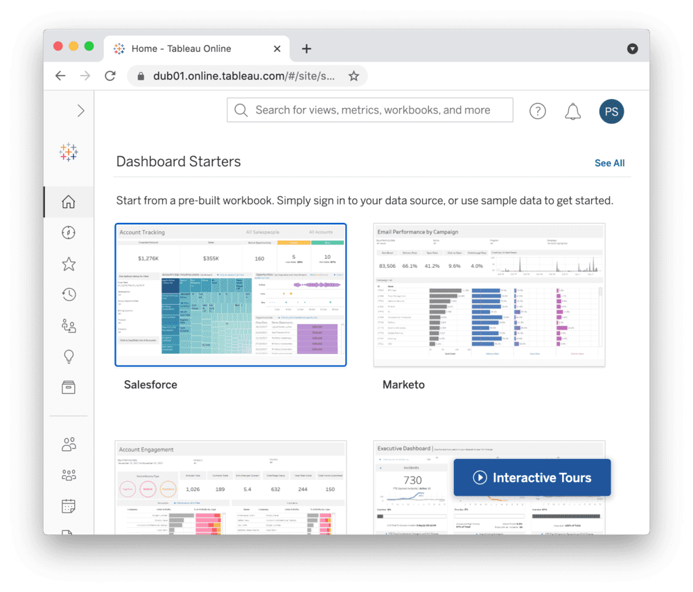
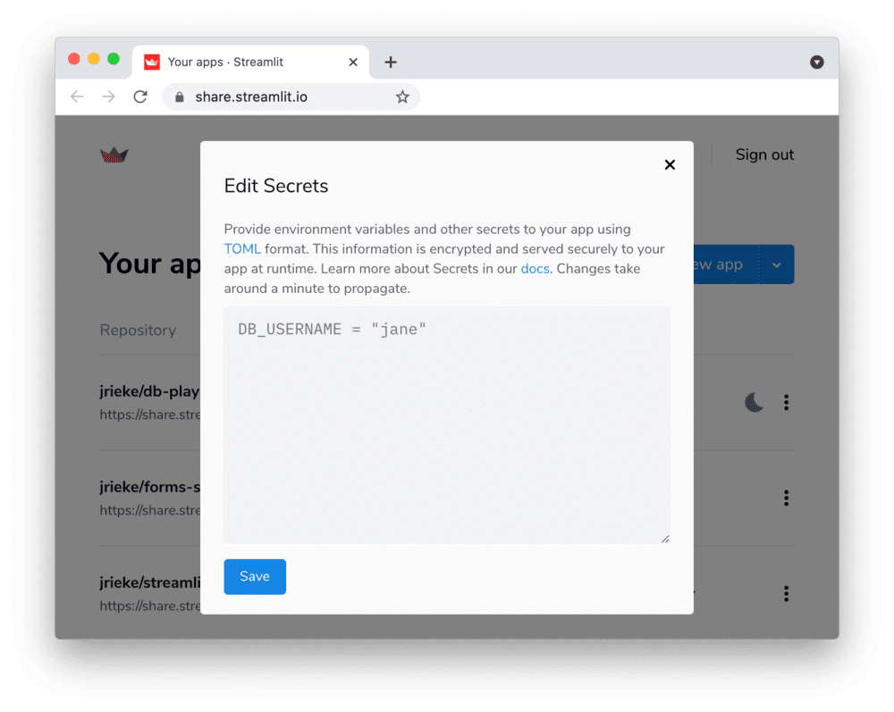

# Connect Streamlit to Tableau

## Introduction

This guide explains how to securely access data on Tableau from Streamlit sharing or Streamlit for Teams. It uses the [tableauserverclient](https://tableau.github.io/server-client-python/#) library and Streamlit's [secrets management](../deploy_streamlit_app.html#secrets-management).

## Create a Tableau site

```eval_rst
.. note:: If you already have a Tableau site that you want to use, feel free to `skip to the next step <tableau.html#create-personal-access-tokens>`__.
```

For simplicity, we are using the cloud version of Tableau here but this guide works equally well for self-hosted deployments. First, sign up for [Tableau Online](https://www.tableau.com/products/cloud-bi) or log in. Create a workbook or simply run one of the example workbooks under "Dashboard Starters".



## Create personal access tokens

While the Tableau API allows authentication via username and password, you should use [personal access tokens](https://help.tableau.com/current/server/en-us/security_personal_access_tokens.htm) for a production app.

Go to your [Tableau Online homepage](https://online.tableau.com/), create an access token and note down the token name and secret.

```eval_rst
.. thumbnail:: ../media/databases/tableau-2.png
   :width: 49%

.. thumbnail:: ../media/databases/tableau-3.png
   :width: 49%

.. note:: Personal access tokens will expire if not used after 15 consecutive days.
```

## Add token to your local app secrets

Your local Streamlit app will read secrets from a file `.streamlit/secrets.toml` in your app's root directory. Create this file if it doesn't exist yet and add your token, the site name you created during setup, and the URL of your Tableau server like below:

```
# .streamlit/secrets.toml

[tableau]
token_name = "xxx"
token_secret = "xxx"
server_url = "https://abc01.online.tableau.com/"
site_id = "streamlitexample"  # in your site's URL behind the server_url
```

```eval_rst
.. important:: Add this file to ``.gitignore`` and don't commit it to your Github repo!
```

## Copy your app secrets to the cloud

As the `secrets.toml` file above is not committed to Github, you need to pass its content to your deployed app (on Streamlit sharing or Streamlit for Teams) separately. Go to the [app dashboard](https://share.streamlit.io/) and in the app's dropdown menu, click on **Edit Secrets**. Copy the content of `secrets.toml` into the text area. More information in [Secrets Management](../deploy_streamlit_app.html#secrets-management).



## Add tableauserverclient to your requirements file

Add the [tableauserverclient](https://tableau.github.io/server-client-python/#) package to your `requirements.txt` file, preferably pinning its version (just replace `x.x.x` with the version you want installed):

```
# requirements.txt
tableauserverclient==x.x.x
```

## Write your Streamlit app

Copy the code below to your Streamlit app and run it. Note that this code just shows a few options of data you can get – explore the [tableauserverclient](https://tableau.github.io/server-client-python/#) library to find more!

```python
# streamlit_app.py

import streamlit as st
import tableauserverclient as TSC


# Set up connection. 
tableau_auth = TSC.PersonalAccessTokenAuth(
    st.secrets["tableau"]["token_name"],
    st.secrets["tableau"]["personal_access_token"],
    st.secrets["tableau"]["site_id"],
)
server = TSC.Server(st.secrets["tableau"]["server_url"], use_server_version=True)


# Get various data. 
# Explore the tableauserverclient library for more options.
# Uses st.cache to only rerun when the query changes or after 10 min.
@st.cache(ttl=600)
def run_query():
    with server.auth.sign_in(tableau_auth):

        # Get all workbooks.
        workbooks, pagination_item = server.workbooks.get()
        workbooks_names = [w.name for w in workbooks]

        # Get views for first workbook.
        server.workbooks.populate_views(workbooks[0])
        views_names = [v.name for v in workbooks[0].views]

        # Get image & CSV for first view of first workbook.
        view_item = workbooks[0].views[0]
        server.views.populate_image(view_item)
        server.views.populate_csv(view_item)
        view_name = view_item.name
        view_image = view_item.image
        # `view_item.csv` is a list of binary objects, convert to str.
        view_csv = b"".join(view_item.csv).decode("utf-8")

        return workbooks_names, views_names, view_name, view_image, view_csv

workbooks_names, views_names, view_name, view_image, view_csv = run_query()


# Print results.
st.subheader("📓 Workbooks")
st.write("Found the following workbooks:", ", ".join(workbooks_names))

st.subheader("👁️ Views")
st.write(
    f"Workbook *{workbooks_names[0]}* has the following views:",
    ", ".join(views_names),
)

st.subheader("🖼️ Image")
st.write(f"Here's what view *{view_name}* looks like:")
st.image(view_image, width=300)

st.subheader("📊 Data")
st.write(f"And here's the data for view *{view_name}*:")
st.write(pd.read_csv(StringIO(view_csv)))
```

See `st.cache` above? Without it, Streamlit would run the query every time the app reruns (e.g. on a widget interaction). With `st.cache`, it only runs when the query changes or after 10 minutes (that's what `ttl` is for). Watch out: If your database updates more frequently, you should adapt `ttl` or remove caching so viewers always see the latest data. Read more about caching [here](../caching.md).

If everything worked out, your app should look like this (can differ based on your workbooks):

