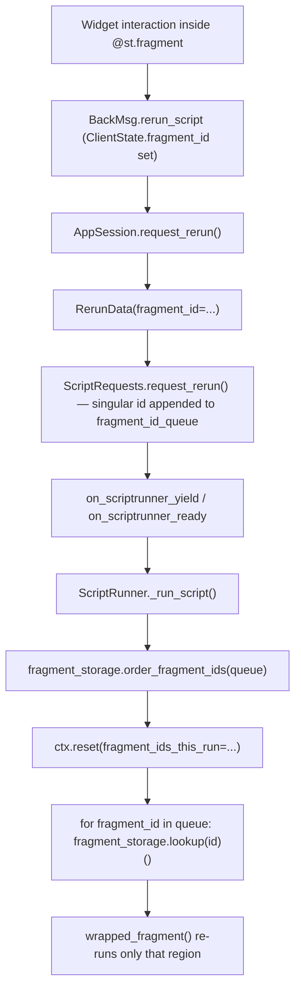

# Event-scoped fragment reruns — prototype implementation plan

## Overview

We extend the existing fragment-rerun machinery so a fragment can be re-run **by name**
from anywhere — a callback, the main script body, or another fragment — via
`st.rerun(target=...)`. The runtime already executes an ordered `fragment_id_queue`
without re-running the script body, and the request layer already coalesces fragment
reruns into a single ordered pass. The only genuinely new pieces are (1) an **addressing
layer** that maps a user-facing name to one or more internal `fragment_id`s, and (2)
loosening `st.rerun` so it can build a fragment queue from that name regardless of the
current execution context. Naming is exposed as a new `key` argument on `@st.fragment`;
internally the key is stamped onto the fragment's auto-created container (the "keyed
container", Option A in the spec) and recorded in a `key -> [fragment_id]` map held by
the per-session `FragmentStorage`. No proto change and no frontend change are required:
targeted reruns are resolved and dispatched entirely on the backend, reusing the same
`NewSession.fragment_ids_this_run` path the frontend already understands.

This is a prototype: it implements the happy path (name a fragment, target it from a
callback / main script / another fragment, target a list, coalesce multiple calls) and
explicitly defers cycle detection, metrics, docs, and exhaustive tests.

## Stack trace — the current fragment-rerun path

The diagram below traces today's path for a widget that lives **inside** a fragment
(the only way to trigger a scoped rerun today), then notes where targeted reruns will
hook in.



Key facts established by reading the code:

- **Frontend → backend signal.** A widget inside a fragment causes the browser to send
  a `rerun_script` `BackMsg` whose `ClientState.fragment_id` (`proto/streamlit/proto/ClientState.proto`,
  field 5) is the fragment's id. A widget **outside** a fragment sends no `fragment_id`,
  i.e. a full-app rerun.
- **Backend dispatch.** `AppSession.request_rerun()`
  (`lib/streamlit/runtime/app_session.py`, ~L406) reads `client_state.fragment_id`,
  early-returns if that id is no longer in `FragmentStorage`, and builds a
  `RerunData(fragment_id=fragment_id or None, ...)`.
- **Request layer / queue + coalescing.** `ScriptRequests.request_rerun()`
  (`lib/streamlit/runtime/scriptrunner_utils/script_requests.py`, ~L176) converts a
  singular `fragment_id` into a one-element `fragment_id_queue`, and when a rerun is
  already pending it **appends** the new id (dedup) — this is the existing coalescing.
  A request carrying a `fragment_id_queue` (plural) currently **replaces** the pending
  queue. `is_fragment_scoped_rerun` controls whether a pending fragment rerun is allowed
  to **preempt** an in-progress full run (`_fragment_run_should_not_preempt_script`,
  ~L86): scoped reruns preempt, auto/widget fragment reruns wait.
- **Script runner execution.** `ScriptRunner._run_script()`
  (`lib/streamlit/runtime/scriptrunner/script_runner.py`, ~L613–L800): if
  `rerun_data.fragment_id_queue` is set, it orders the ids
  (`fragment_storage.order_fragment_ids`, keeps ancestors before descendants), calls
  `ctx.reset(fragment_ids_this_run=...)`, and then **loops the queue**, `lookup`-ing each
  `wrapped_fragment` and calling it — the script body (`exec(code, ...)`) is skipped
  entirely. Missing ids are skipped with a warning.
- **Fragment identity & registry.** `@st.fragment`'s wrapper
  (`lib/streamlit/runtime/fragment.py`, `_fragment.wrap`, ~L358) computes
  `fragment_id = calc_hash(module.qualname + delta_path_str + additional_hash_info)` — a
  **positional hash** tied to the call-site's delta path — then calls
  `ctx.fragment_storage.register(fragment_id, wrapped_fragment, parent_fragment_id=...)`.
  The registry is `MemoryFragmentStorage` (per session, lives on `ScriptRunContext`),
  a dict `fragment_id -> closure` plus parent/registration-sequence bookkeeping. It
  persists across runs; full app runs call `clear(new_fragment_ids=...)` at the end.
- **Where `st.rerun(scope="fragment")` is built today.**
  `execution_control.rerun()` (`lib/streamlit/commands/execution_control.py`, ~L139)
  builds the queue via `_new_fragment_id_queue(ctx, scope)` (~L70), which **raises**
  unless we are already inside a fragment rerun (`ctx.fragment_ids_this_run` non-empty)
  and uses `ThreadState.get().fragment_id` to slice the queue from the current fragment
  onward. This is exactly the restriction targeted reruns must loosen.

The crucial observation for the prototype: **`on_change`/`on_click` callbacks run on the
backend** inside `code_to_exec` → `self._session_state.on_script_will_rerun(widget_states)`
(`script_runner.py`, ~L708), *before* the script body executes. So a callback calling
`st.rerun(target="charts")` runs server-side, can resolve the name against the
**previous** run's `FragmentStorage` registrations (still present; not cleared until the
full run finishes), issue a fragment-scoped `request_rerun`, and — because
`is_fragment_scoped_rerun=True` preempts — abort the in-progress full run in favor of a
scoped rerun of just `charts`. **No new frontend message is needed.**

## Addressing layer — data structures and resolution

### Where the key lives in the element tree (Option A: keyed container)

`@st.fragment`'s wrapper already wraps the user function body in an auto-created
`st.container()` (`fragment.py`, ~L420). We pass the decorator `key` into that container
so the name is stamped into the element tree on the fragment's own block
(`BlockProto.id`, exactly the mechanism `st.container(key=...)` uses today —
`lib/streamlit/elements/layouts.py`, ~L383). This makes the keyed container the
addressable anchor for the fragment and gives the frontend a stable, CSS-addressable
(`st-key-<key>`) handle for free. `st.container` already supports `key`, so **no change
to `layouts.py` is required**.

The fragment's `fragment_id` (the positional hash) is computed at the call site *before*
the internal container is entered, so adding a key to that container does **not** change
fragment identity — existing apps keep identical ids (backwards compatible).

### Runtime map: key -> fragment ids

`FragmentStorage` gains a `key -> [fragment_id, ...]` index, populated at `register()`
time. A name can map to **several** ids when the same `@st.fragment(key=...)` function is
called from multiple sites; per the spec, targeting reruns **all** of them in one ordered
pass. The map is kept in sync with the closure dict on `register`, `_remove`, and `clear`.

Resolution (`resolve_target` below) is called from `st.rerun(target=...)`:

- **Zero matches** → raise `StreamlitAPIException` ("No fragment found for target
  '<key>'. Pass the same `key=` you set on `@st.fragment`, and make sure that fragment
  has rendered at least once."). This is the "fail fast, fail helpfully" case from spec
  step 3.
- **One or more matches** → return the ordered list of ids; all are queued. (The
  multi-call-site case is valid and intentional. If a future, stricter "exactly one
  target" model is wanted, this is the single place to turn ">1" into an error — flagged
  as a decision point, not implemented in the prototype.)

## `st.rerun(target=...)` — API and dispatch

### Signature

```python
def rerun(
    *,
    scope: Literal["app", "fragment"] = "app",
    target: str | Sequence[str] | None = None,
) -> NoReturn: ...
```

`target` is keyword-only and additive; `scope` keeps its app/fragment meaning. Passing
`target` implies a fragment-scoped rerun of the named fragment(s); it is independent of
the caller's own fragment context, which is what lets a callback or the main script use
it. (`scope="fragment"` without `target` keeps its current "rerun the *current*
fragment" behavior.)

### Resolution + dispatch

`target` resolves through `ctx.fragment_storage.resolve_target(target)` into a list of
ids, which becomes the `fragment_id_queue`, with `is_fragment_scoped_rerun=True` so the
request preempts any in-progress full run. Everything downstream (ordering, the queue
loop, `NewSession.fragment_ids_this_run`) is unchanged.

### Coalescing multiple calls

Two callers want coalescing: (a) one `st.rerun(target=[...])` with a list, and (b)
several `st.rerun(target=...)` calls in the same callback. Case (a) works as-is (one
request with a multi-id queue). Case (b) currently **replaces** the pending queue
(`script_requests.py` ~L224: `fragment_id_queue = new_data.fragment_id_queue`). We change
that branch to **union/extend** the existing queue (dedup, order-preserving) so multiple
targeted calls accumulate into one ordered pass — matching the spec ("issue several
`st.rerun` calls, which the request layer coalesces").

## File-by-file changes (low layer → high layer)

### 1. `proto/streamlit/proto/*` — no change

Targeting is resolved and dispatched on the backend and reuses
`NewSession.fragment_ids_this_run`, which the frontend already consumes. `ClientState`,
`BackMsg`, and `Delta` are untouched. No `make protobuf` needed.

### 2. `lib/streamlit/runtime/fragment.py`

**Change A — `FragmentStorage` protocol: track keys and resolve them.** Add a `key`
parameter to `register` and two new abstract methods.

Before (protocol `register`):

```python
@abstractmethod
def register(
    self,
    key: str,
    fragment: Fragment,
    *,
    parent_fragment_id: str | None = None,
) -> None:
    ...
```

After (note: the existing positional `key` is the *fragment id*; the new name is
`target_key` to avoid confusion):

```python
@abstractmethod
def register(
    self,
    key: str,
    fragment: Fragment,
    *,
    parent_fragment_id: str | None = None,
    target_key: str | None = None,
) -> None:
    """Store a fragment definition.

    target_key
        The user-facing name from ``@st.fragment(key=...)``. When set, the
        fragment id is indexed under this name so ``st.rerun(target=...)`` can
        resolve it. A name may map to several ids if the fragment function is
        called from multiple sites.
    """
    ...

@abstractmethod
def resolve_target(self, target: str | Sequence[str]) -> list[str]:
    """Resolve one or more ``@st.fragment(key=...)`` names to fragment ids.

    Returns the ids in a stable order, with each name expanding to every
    registered call site of that fragment. Raises ``StreamlitAPIException`` if
    any name has no registered fragment.
    """
    ...
```

**Change B — `MemoryFragmentStorage`: maintain the index.**

Before (`__init__` and `register`/`_remove`):

```python
def __init__(self) -> None:
    self._lock = threading.Lock()
    self._fragments: dict[str, Fragment] = {}
    self._parent_by_id: dict[str, str | None] = {}
    self._registration_sequence_by_id: dict[str, int] = {}
    self._registration_sequence = 0

def _remove(self, fragment_id: str) -> None:
    del self._fragments[fragment_id]
    self._parent_by_id.pop(fragment_id, None)
    self._registration_sequence_by_id.pop(fragment_id, None)

def register(self, key, fragment, *, parent_fragment_id=None) -> None:
    with self._lock:
        self._registration_sequence += 1
        self._fragments[key] = fragment
        self._parent_by_id[key] = parent_fragment_id
        self._registration_sequence_by_id[key] = self._registration_sequence
```

After:

```python
def __init__(self) -> None:
    self._lock = threading.Lock()
    self._fragments: dict[str, Fragment] = {}
    self._parent_by_id: dict[str, str | None] = {}
    self._registration_sequence_by_id: dict[str, int] = {}
    self._registration_sequence = 0
    # User-facing fragment name -> registered fragment ids (one per call site).
    self._ids_by_target_key: dict[str, list[str]] = {}
    self._target_key_by_id: dict[str, str] = {}

def _remove(self, fragment_id: str) -> None:
    del self._fragments[fragment_id]
    self._parent_by_id.pop(fragment_id, None)
    self._registration_sequence_by_id.pop(fragment_id, None)
    target_key = self._target_key_by_id.pop(fragment_id, None)
    if target_key is not None:
        ids = self._ids_by_target_key.get(target_key)
        if ids and fragment_id in ids:
            ids.remove(fragment_id)
            if not ids:
                del self._ids_by_target_key[target_key]

def register(
    self, key, fragment, *, parent_fragment_id=None, target_key=None
) -> None:
    with self._lock:
        self._registration_sequence += 1
        self._fragments[key] = fragment
        self._parent_by_id[key] = parent_fragment_id
        self._registration_sequence_by_id[key] = self._registration_sequence
        if target_key is not None:
            self._target_key_by_id[key] = target_key
            ids = self._ids_by_target_key.setdefault(target_key, [])
            if key not in ids:
                ids.append(key)

def resolve_target(self, target: str | Sequence[str]) -> list[str]:
    names = [target] if isinstance(target, str) else list(target)
    with self._lock:
        resolved: list[str] = []
        for name in names:
            ids = self._ids_by_target_key.get(name)
            if not ids:
                raise StreamlitAPIException(
                    f"No fragment found for target '{name}'. Pass the same "
                    f"`key` you set on `@st.fragment(key=...)`, and make sure "
                    f"that fragment has rendered at least once."
                )
            for fragment_id in ids:
                if fragment_id not in resolved:
                    resolved.append(fragment_id)
        return resolved
```

`clear()` already drops ids via `_remove`, so the index is pruned in tandem with no
further change.

**Change C — the decorator/wrapper: accept and propagate `key`.** Thread `key` through
`_fragment`, the public `fragment`, its overloads, the inner `wrapper`, and `wrap`; pass
it to the internal container and to `register`.

Before (`wrap` container + register):

```python
fragment_id = calc_hash(...)
...
with ThreadState.scoped(fragment_id=fragment_id):
    ...
    container_ctx = (
        contextlib.nullcontext() if skip_container else st.container()
    )
...
ctx.fragment_storage.register(
    fragment_id,
    wrapped_fragment,
    parent_fragment_id=parent_fragment_id_at_def,
)
```

After (`key` is the decorator name captured by the closure):

```python
fragment_id = calc_hash(...)
...
with ThreadState.scoped(fragment_id=fragment_id):
    ...
    container_ctx = (
        contextlib.nullcontext()
        if skip_container
        else st.container(key=key)
    )
...
ctx.fragment_storage.register(
    fragment_id,
    wrapped_fragment,
    parent_fragment_id=parent_fragment_id_at_def,
    target_key=key,
)
```

And the signatures:

```python
def _fragment(
    func: F | None = None,
    *,
    run_every: int | float | timedelta | str | None = None,
    parallel: bool = False,
    key: str | None = None,
    additional_hash_info: str = "",
) -> Callable[[F], F] | F: ...

@gather_metrics("fragment")
def fragment(
    func: F | None = None,
    *,
    run_every: int | float | timedelta | str | None = None,
    parallel: bool = False,
    key: str | None = None,
) -> Callable[[F], F] | F:
    """...

    key : str or None
        An optional name for the fragment. When set, ``st.rerun(target=key)``
        re-runs this fragment from anywhere — a callback, the main script, or
        another fragment. If the fragment function is called from multiple
        sites, every call site re-runs together. If this is ``None`` (default),
        the fragment can only be re-run from within itself via
        ``st.rerun(scope="fragment")``.
    """
    return _fragment(func, run_every=run_every, parallel=parallel, key=key)
```

(The two `@overload`s and the inner `wrapper` that re-invokes `fragment(...)` get the
same `key` parameter threaded through.)

> Element-tree caveat (prototype): `st.container(key=...)` registers the key for
> duplicate-key detection. Multiple call sites of one `@st.fragment(key=...)` would
> therefore collide. For the prototype, resolution lives in the backend
> `_ids_by_target_key` map (which is the source of truth for dispatch); if duplicate-key
> enforcement on the container blocks multi-call-site usage, stamp the key onto the
> fragment's `BlockProto` without routing through `compute_and_register_element_id`'s
> uniqueness check (or only stamp when a single call site exists). This is the one spot
> where the "keyed container" and "rerun all call sites" goals interact.

### 3. `lib/streamlit/runtime/scriptrunner_utils/script_requests.py`

**Change — coalesce plural fragment queues by union instead of replace**, so several
`st.rerun(target=...)` calls in one callback accumulate.

Before (`request_rerun`, RERUN-already-pending branch):

```python
if new_data.fragment_id:
    fragment_id_queue = [*self._rerun_data.fragment_id_queue]
    if new_data.fragment_id not in fragment_id_queue:
        fragment_id_queue.append(new_data.fragment_id)
elif new_data.fragment_id_queue:
    # new_data contains a new fragment_id_queue, so we just use it.
    fragment_id_queue = new_data.fragment_id_queue
else:
    fragment_id_queue = []
```

After:

```python
if new_data.fragment_id:
    fragment_id_queue = [*self._rerun_data.fragment_id_queue]
    if new_data.fragment_id not in fragment_id_queue:
        fragment_id_queue.append(new_data.fragment_id)
elif new_data.fragment_id_queue:
    # Merge into the pending queue so multiple targeted reruns issued during a
    # single interaction run in one ordered pass.
    fragment_id_queue = [*self._rerun_data.fragment_id_queue]
    for fragment_id in new_data.fragment_id_queue:
        if fragment_id not in fragment_id_queue:
            fragment_id_queue.append(fragment_id)
else:
    fragment_id_queue = []
```

(Final ordering is still applied later by `order_fragment_ids` in the runner.)

### 4. `lib/streamlit/commands/execution_control.py`

**Change A — relax/extend queue construction** so `target` builds a queue from the
addressing layer regardless of the current fragment context.

Before (`_new_fragment_id_queue`):

```python
def _new_fragment_id_queue(
    ctx: ScriptRunContext,
    scope: Literal["app", "fragment"],
) -> list[str]:
    if scope == "app":
        return []
    curr_queue = ctx.fragment_ids_this_run
    if not curr_queue:
        raise StreamlitAPIException(
            'scope="fragment" can only be specified from `@st.fragment`-decorated '
            "functions during fragment reruns."
        )
    new_queue = list(dropwhile(lambda x: x != ThreadState.get().fragment_id, curr_queue))
    if not new_queue:
        raise RuntimeError("Could not find current_fragment_id in fragment_id_queue. ...")
    return new_queue
```

After (add a `target`-aware branch; the existing `scope` behavior is unchanged):

```python
def _new_fragment_id_queue(
    ctx: ScriptRunContext,
    scope: Literal["app", "fragment"],
    target: str | Sequence[str] | None = None,
) -> list[str]:
    if target is not None:
        # Targeted reruns address fragments by name and may be issued from
        # anywhere (a callback, the main script, or another fragment), so they
        # do not depend on the current fragment context.
        return ctx.fragment_storage.resolve_target(target)

    if scope == "app":
        return []

    curr_queue = ctx.fragment_ids_this_run
    if not curr_queue:
        raise StreamlitAPIException(
            'scope="fragment" can only be specified from `@st.fragment`-decorated '
            "functions during fragment reruns."
        )
    new_queue = list(dropwhile(lambda x: x != ThreadState.get().fragment_id, curr_queue))
    if not new_queue:  # pragma: no cover - defensive
        raise RuntimeError("Could not find current_fragment_id in fragment_id_queue. ...")
    return new_queue
```

**Change B — `rerun` signature and dispatch.**

Before:

```python
@gather_metrics("rerun")
def rerun(
    *,
    scope: Literal["app", "fragment"] = "app",
) -> NoReturn:
    if scope not in {"app", "fragment"}:
        raise StreamlitAPIException(...)
    ctx = get_script_run_ctx()
    if ctx and ctx.script_requests:
        ctx.script_requests.request_rerun(
            RerunData(
                query_string=ctx.query_string,
                page_script_hash=ctx.page_script_hash,
                fragment_id_queue=_new_fragment_id_queue(ctx, scope),
                is_fragment_scoped_rerun=scope == "fragment",
                cached_message_hashes=ctx.cached_message_hashes,
                context_info=ctx.context_info,
            )
        )
        st.empty()
```

After:

```python
@gather_metrics("rerun")
def rerun(
    *,
    scope: Literal["app", "fragment"] = "app",
    target: str | Sequence[str] | None = None,
) -> NoReturn:
    """...

    target : str, list of str, or None
        The ``key`` of a fragment (or a list of keys) to rerun. Set the key with
        ``@st.fragment(key=...)``. When ``target`` is set, Streamlit reruns only
        the named fragment(s) — in one ordered pass — instead of the full app,
        and the call may be made from anywhere (a callback, the main script, or
        another fragment). If this is ``None`` (default), ``scope`` determines
        what reruns.
    """
    if scope not in {"app", "fragment"}:
        raise StreamlitAPIException(
            f"'{scope}'is not a valid rerun scope. Valid scopes are 'app' and 'fragment'."
        )

    ctx = get_script_run_ctx()
    if ctx and ctx.script_requests:
        fragment_id_queue = _new_fragment_id_queue(ctx, scope, target)
        ctx.script_requests.request_rerun(
            RerunData(
                query_string=ctx.query_string,
                page_script_hash=ctx.page_script_hash,
                fragment_id_queue=fragment_id_queue,
                is_fragment_scoped_rerun=scope == "fragment" or target is not None,
                cached_message_hashes=ctx.cached_message_hashes,
                context_info=ctx.context_info,
            )
        )
        st.empty()
```

`Sequence` is added to the existing `from collections.abc import ...` import.

### 5. `lib/streamlit/elements/layouts.py` — no change

`st.container` already accepts `key` and stamps it into `BlockProto.id`. The fragment
wrapper simply calls `st.container(key=key)`.

### 6. `lib/streamlit/__init__.py` — no change

`st.fragment` and `st.rerun` are already exported (`fragment` ← `runtime.fragment.fragment`
at L131/L297; `rerun` ← `commands.execution_control` at L163). Adding keyword args does
not change the exports.

## Validation summary

- `target` with an unknown name → `StreamlitAPIException` (helpful message, names the
  missing key) raised synchronously from `st.rerun`.
- `target` + `scope="fragment"` together: harmless — `target` wins for queue
  construction; both set `is_fragment_scoped_rerun=True`. (Could be rejected explicitly
  for clarity; not required for the prototype.)
- Empty `target` list → resolves to an empty queue → behaves like a no-op fragment
  rerun. Acceptable for the prototype; can be tightened later.

## Prototype cut list (deferred)

- **Cycle detection.** The spec marks `A → B → A` infinite-rerun protection as post-MVP.
  Not implemented; cycle avoidance is the developer's responsibility, identical to
  `st.rerun()` today.
- **Element-tree uniqueness for multi-call-site keys.** The clean interaction between the
  keyed container's duplicate-key check and "rerun all call sites" is called out above
  but only minimally handled (backend map is the source of truth). Productionizing this
  is deferred.
- **Metrics.** The spec wants metrics for `st.rerun(target=...)`. `@gather_metrics("rerun")`
  already counts the call; adding a `target`-specific dimension is deferred.
- **Docs.** `st.rerun` reference, fragment concept docs, and an "event-driven / partial
  updates" guide are deferred (docstrings added inline are enough for the prototype).
- **Tests — non-regression list (update so existing suites don't break; full coverage
  deferred):**
  - `lib/tests/streamlit/commands/execution_control_test.py` — `rerun` signature gained a
    keyword; add minimal cases for `target` resolution / unknown-name error.
  - `lib/tests/streamlit/runtime/scriptrunner_utils/script_requests_test.py` — assert the
    new union-coalescing of `fragment_id_queue` instead of replace.
  - `lib/tests/streamlit/runtime/fragment_test.py` — `register()` gained `target_key`;
    add `resolve_target` happy-path + zero-match tests; verify `clear`/`_remove` prune
    the index.
  - `lib/tests/streamlit/runtime/scriptrunner/script_runner_test.py` — existing
    fragment-queue execution tests should still pass unchanged.
  - A new E2E (`e2e_playwright/`) proving "callback targets a fragment → only that region
    updates" is the right end-to-end proof, but is deferred for the prototype.
```
