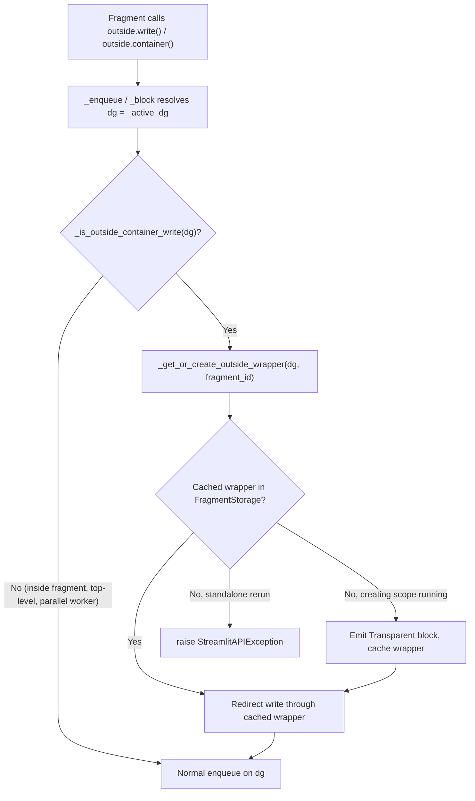

# Outside Container Writes — Implementation Plan

This plan breaks the approved tech spec
(`specs/2026-06-03-outside-container-writes/tech-spec.md`) into ordered,
independently mergeable PRs. Each PR lists its goal, files touched, key
before/after snippets, test expectations, and dependencies. Design rationale
lives in the spec — sections are referenced rather than restated.

## Design summary (for orientation only)

A fragment writing to a container declared outside its scope gets an implicit
per-`(fragment_id, container)` wrapper block (a new `Transparent` block type).
The wrapper occupies one stable slot in the outside container; only the
wrapper's internal cursor resets on fragment rerun. See spec sections
"Implicit wrapper containers", "Detection of outside container writes",
"Wrapper registry", "Cursor reset on fragment rerun".

### End-to-end data flow



On fragment rerun, `wrapped_fragment()` re-emits each wrapper's `add_block`
(refreshing `scriptRunId`) and resets the wrapper's `RunningCursor` to 0 before
the body runs.

---

## PR 1 — Proto: `Transparent` block type + frontend rendering

**Complexity: small**

### Goal and scope
Add a general-purpose, layout-transparent block type to the protocol and make
the frontend render it as an unstyled grouping div. No backend behavior change
yet; this is the foundational primitive the wrapper relies on. See spec
"Proto: new `Transparent` block type".

### Files modified
- `proto/streamlit/proto/Block.proto`
- Generated proto outputs (via `make protobuf`): `lib/streamlit/proto/Block_pb2.py*`, `frontend/protobuf/src/proto.d.ts`, `frontend/protobuf/src/proto.js`
- `frontend/lib/src/components/core/Block/Block.tsx`
- `frontend/lib/src/components/core/Block/utils.ts`
- Tests: `frontend/lib/src/components/core/Block/Block.test.tsx`

### Key changes

`Block.proto` — add the oneof entry (next free ID is 17) and the message:

```protobuf
message Block {
  oneof type {
    Vertical vertical = 1;
    Horizontal horizontal = 2;
    Column column = 3;
    Expandable expandable = 4;
    Form form = 5;
    TabContainer tab_container = 6;
    Tab tab = 7;
    ChatMessage chat_message = 9;
    Popover popover = 10;
    Dialog dialog = 11;
    FlexContainer flex_container = 13;
    Transparent transparent = 17;
  }

  // ... existing fields ...

  // A layout-transparent wrapper block with no visual treatment (no padding,
  // border, or gap). Renders as a plain unstyled div. Used to group elements
  // into a single tree node without affecting the user-visible layout.
  message Transparent {}

  // Next ID: 18
}
```

Run `make protobuf` to regenerate Python and TS bindings.

Frontend `utils.ts` — treat `transparent` like the other plain vertical
containers so it renders its children through the flex container path:

```typescript
export function checkFlexContainerBackwardsCompatibile(
  blockProto: BlockProto
): boolean {
  return Boolean(
    blockProto.flexContainer ||
      blockProto.vertical ||
      blockProto.horizontal ||
      blockProto.transparent
  )
}
```

Frontend `Block.tsx` — `getDirectionOfBlock` / `FlexBoxContainer` already
default to a borderless vertical layout when no flex config is present, so a
`Transparent` block renders as an unstyled vertical wrapper with no extra
visual treatment. No dedicated React component is required; the existing
fall-through to `ContainerContentsWrapper` covers it.

### Implementation choice (not settled by spec)
The spec says the frontend renders `Transparent` "identical to how it renders
an untyped block today, but with an explicit type to match on." In the current
tree, an untyped block falls through to the unstyled `ContainerContentsWrapper`.
The minimal, lowest-risk approach is to route `transparent` through the same
`checkFlexContainerBackwardsCompatibile` path (above) rather than introduce a
new styled component. This PR adopts that approach.

### Unit test expectations (frontend)
- `Block.test.tsx`: a `BlockNode` with `deltaBlock.transparent` set renders its
  children, produces no border/padding wrapper, and (when empty with
  `allowEmpty`) renders nothing visible. Assert children are present and assert
  no `stExpander`/`stColumn`/border testids appear (anti-regression).

### E2E test expectations
None (no user-facing API yet).

### Dependencies
None. First PR.

---

## PR 2 — Wrapper registry on `FragmentStorage`

**Complexity: small–medium**

### Goal and scope
Add the per-fragment wrapper registry and its lifecycle to `FragmentStorage`
(protocol + `MemoryFragmentStorage`), with no callers yet. The registry
persists across fragment reruns and is cleared on full app reruns. See spec
"Wrapper registry".

### Files modified
- `lib/streamlit/runtime/fragment.py`
- Tests: `lib/tests/streamlit/runtime/fragment_test.py`

### Key changes

Introduce a small record so wrapper metadata is not smeared across
`DeltaGenerator` (see "Implementation choice" below), defined near the storage:

```python
@dataclass
class _OutsideWrapper:
    """A cached implicit wrapper interposed between an outside container and a
    fragment's writes. ``creation_delta_path`` and ``block_proto`` are retained
    so the wrapper's ``add_block`` delta can be re-emitted on each fragment
    rerun.
    """

    delta_generator: DeltaGenerator
    creation_delta_path: list[int]
    block_proto: Block_pb2.Block
```

`FragmentStorage` protocol — add registry accessors:

```python
@abstractmethod
def register_outside_wrapper(
    self, fragment_id: str, container_id: str, wrapper: _OutsideWrapper
) -> None:
    """Store the implicit wrapper for a (fragment, outside container) pair."""
    raise NotImplementedError

@abstractmethod
def get_outside_wrapper(
    self, fragment_id: str, container_id: str
) -> _OutsideWrapper | None:
    """Return the cached wrapper for a (fragment, outside container) pair."""
    raise NotImplementedError

@abstractmethod
def outside_wrappers_for(
    self, fragment_id: str
) -> list[tuple[tuple[str, str], _OutsideWrapper]]:
    """Return all cached wrappers belonging to the given fragment."""
    raise NotImplementedError

@abstractmethod
def outside_wrapper_keys_for(self, fragment_id: str) -> list[tuple[str, str]]:
    """Return all wrapper registry keys belonging to the given fragment."""
    raise NotImplementedError
```

`MemoryFragmentStorage.__init__` — add the dict (guarded by the existing
`self._lock`):

```python
self._outside_wrappers: dict[tuple[str, str], _OutsideWrapper] = {}
```

`MemoryFragmentStorage.clear` — drop all wrappers unconditionally. On a full app
rerun the main script recreates outside containers as new DG objects, so old
entries are stale (see spec "Full app rerun"):

```python
def clear(self, new_fragment_ids: frozenset[str] | None = None) -> None:
    with self._lock:
        if new_fragment_ids is None:
            new_fragment_ids = frozenset()

        for fragment_id in list(self._fragments):
            if fragment_id not in new_fragment_ids:
                self._remove(fragment_id)

        self._outside_wrappers.clear()
```

Implement the four accessors with `self._lock`, keyed by `(fragment_id, container_id)`.

### Implementation choice (not settled by spec)
The spec sketches `wrapper._creation_delta_path`, `wrapper._block_proto`, and
`wrapper._cursor` as attributes on the wrapper `DeltaGenerator`. This plan
instead stores them on a dedicated `_OutsideWrapper` record (the DG itself is
`record.delta_generator`, its cursor is `record.delta_generator._cursor`). This
keeps `DeltaGenerator` free of wrapper-only attributes and aligns with the repo
guidance to prefer composition. Behavior is identical.

### Decision: clear semantics
`clear()` always empties `_outside_wrappers`, even when `new_fragment_ids`
preserves some fragment closures. The spec is explicit that wrappers are keyed
by container identity (`dg._id`) and that surviving fragments simply recreate
their wrappers when their container's creating scope next runs.

### Unit test expectations
In `fragment_test.py`, extend the `MemoryFragmentStorage` tests:
- `register_outside_wrapper` then `get_outside_wrapper` returns the same record;
  a missing key returns `None`.
- `outside_wrappers_for` / `outside_wrapper_keys_for` return only the matching
  fragment's entries (register two fragments, assert isolation).
- `clear()` empties `_outside_wrappers` even when the fragment id is retained via
  `new_fragment_ids` (anti-regression: assert the fragment closure survives but
  the wrapper does not).

### Dependencies
None functionally, but logically precedes PR 3 (which consumes the registry).

---

## PR 3 — Detection hook, wrapper creation, and write redirection

**Complexity: large**

### Goal and scope
Wire detection and wrapper creation into `DeltaGenerator._enqueue` and
`DeltaGenerator._block`. This is the PR that makes outside writes actually work
for the common case. Includes the standalone-rerun restriction error and the
`st.empty()` locked-cursor handling. See spec "Detection of outside container
writes", "Wrapper creation and retrieval", and the "Dynamic container selection"
behavior decision.

### Files modified
- `lib/streamlit/delta_generator.py`
- Tests: `lib/tests/streamlit/delta_generator_test.py`, `lib/tests/streamlit/runtime/fragment_test.py`

### Key changes

Add a low-level add-block helper that bypasses detection (used by both creation
and rerun re-emission, avoiding infinite recursion through `_block`):

```python
def _enqueue_add_block(delta_path: list[int], block_proto: Block_pb2.Block) -> None:
    """Enqueue an add_block delta at a fixed delta path without running the
    outside-write detection path.
    """
    msg = ForwardMsg()
    msg.metadata.delta_path[:] = delta_path
    msg.delta.add_block.CopyFrom(block_proto)
    _enqueue_message(msg)
```

Detection helper (parameters passed explicitly rather than read from globals as
sketched in the spec):

```python
def _is_outside_container_write(
    dg: DeltaGenerator,
    ts: FragmentThreadState,
    fragment_storage: FragmentStorage,
) -> bool:
    if not ts.fragment_id or not ts.delta_path:
        return False

    # Parallel workers keep the existing hard block on outside writes; never
    # interpose a wrapper during concurrent execution (see spec
    # "Interaction with parallel=True").
    if ts.is_parallel_worker:
        return False

    # Root-container DGs (st.sidebar, st._main) are managed by ctx.cursors,
    # which wrapped_fragment() already snapshots and restores. Wrapping them
    # would conflict with that mechanism.
    if dg._is_top_level:
        return False

    cursor_path = tuple(dg._cursor.delta_path) if dg._cursor else ()
    if _is_inside_fragment_path(cursor_path, ts.delta_path):
        return False

    # The DG may already live inside a wrapper belonging to THIS fragment (e.g.
    # a nested container created via outer.container()). Scope the ancestor walk
    # to the current fragment's wrappers so nested fragments still get their own.
    wrapper_ids = {
        container_id
        for (_fid, container_id) in fragment_storage.outside_wrapper_keys_for(
            ts.fragment_id
        )
    }
    return all(ancestor._id not in wrapper_ids for ancestor in dg._ancestors)
```

Creation/retrieval — returns the cached wrapper DG, or creates one, or raises:

```python
def _get_or_create_outside_wrapper(
    dg: DeltaGenerator,
    ts: FragmentThreadState,
    ctx: ScriptRunContext,
) -> DeltaGenerator:
    fragment_storage = ctx.fragment_storage
    fragment_id = cast("str", ts.fragment_id)
    container_id = dg._id

    cached = fragment_storage.get_outside_wrapper(fragment_id, container_id)
    if cached is not None:
        return cached.delta_generator

    # No wrapper yet. During a standalone fragment rerun the outside container's
    # creating scope is not executing, so we cannot safely allocate a new slot
    # (see spec "Dynamic container selection").
    if ctx.fragment_ids_this_run:
        raise StreamlitAPIException(
            "A fragment tried to write to a container created outside the "
            "fragment, but that container was not written to during the "
            "initial run, so Streamlit could not reserve a stable position "
            "for it.\n\nWrite to the container at least once during the full "
            "app run (e.g. claim the slot with `outside.empty()`), then fill "
            "it during fragment reruns."
        )

    parent_cursor = cast("Cursor", dg._cursor)
    block_proto = Block_pb2.Block()
    block_proto.transparent.SetInParent()
    block_proto.allow_empty = True

    creation_delta_path = list(parent_cursor.delta_path)

    # Inherit the cursor type from the outside container. st.empty() uses a
    # LockedCursor; the wrapper must also lock so writes replace in place and
    # honor the single-element contract (see spec "st.empty() as outside
    # container").
    parent_path = (*parent_cursor.parent_path, parent_cursor.index)
    if parent_cursor.is_locked:
        wrapper_cursor: Cursor = cursor.LockedCursor(
            root_container=dg._root_container, parent_path=parent_path, index=0
        )
    else:
        wrapper_cursor = cursor.RunningCursor(
            root_container=dg._root_container, parent_path=parent_path
        )

    wrapper_dg = DeltaGenerator(
        root_container=dg._root_container,
        cursor=wrapper_cursor,
        parent=dg,
        block_type="transparent",
    )

    _enqueue_add_block(creation_delta_path, block_proto)
    # Advance the outside container's cursor exactly once, at creation time.
    parent_cursor.get_locked_cursor()

    fragment_storage.register_outside_wrapper(
        fragment_id,
        container_id,
        _OutsideWrapper(wrapper_dg, creation_delta_path, block_proto),
    )
    return wrapper_dg
```

Call sites — in `_enqueue`, after the existing sidebar and parallel-worker
guards and before building the element message:

```python
# Operate on the active DeltaGenerator, in case we're in a `with` block.
dg = self._active_dg

ctx = get_script_run_ctx()
if ctx and ThreadState.get().fragment_id and _writes_directly_to_sidebar(dg):
    raise StreamlitAPIException(...)  # unchanged

if ctx:
    ts = ThreadState.get()
    if ts.is_parallel_worker:
        ...  # existing parallel block, unchanged

    if _is_outside_container_write(dg, ts, ctx.fragment_storage):
        dg = _get_or_create_outside_wrapper(dg, ts, ctx)
```

The same `_is_outside_container_write` / `_get_or_create_outside_wrapper`
redirect is added in `_block` right after `dg = self._active_dg`, so
`outer.container()` (and other nested containers) are created inside the
wrapper. Subsequent writes to the returned nested DG are recognized as already
inside the fragment's wrapper by the ancestor walk and pass through unwrapped
(see spec "Nested containers").

### Why redirection is correct on standalone reruns
On a standalone rerun the cached wrapper is returned directly; the outside
container's `RunningCursor` is never advanced again. This is what avoids
reintroducing the stale-cursor crash the wrapper exists to prevent (spec
"Wrapper creation and retrieval").

### Implementation choices (not settled by spec)
- **Helper signatures**: the spec sketches helpers reading module globals
  (`ThreadState.get()`, a bare `fragment_storage`). This plan passes `ts` and
  `fragment_storage`/`ctx` explicitly for testability and to avoid hidden
  coupling.
- **Recursion avoidance**: creation enqueues via `_enqueue_add_block` and
  registers the wrapper before returning, so neither the creation add_block nor
  the cursor advance re-enters detection. (Alternative considered: a reentrancy
  flag on `ThreadState`; rejected as heavier.)
- **Error wording** for the restriction is a placeholder; finalize during review.

### Unit test expectations
`delta_generator_test.py` / `fragment_test.py` (using `DeltaGeneratorTestCase`
or the AppTest harness):
- Outside write from inside a fragment emits a `Transparent` add_block on the
  outside container, then the element inside it; assert the element's delta path
  is nested one level below the outside container's slot.
- `_is_outside_container_write` returns `False` for: top-level DGs
  (`st.sidebar`, `st._main`), DGs inside the fragment path, parallel workers,
  and DGs already inside this fragment's wrapper (ancestor-walk case).
- Nested `outer.container()` produces exactly one wrapper; a second write to the
  nested DG creates no additional wrapper (assert registry size == 1).
- Two fragments writing to the same container get two distinct wrappers at
  distinct slots.
- Standalone rerun with no cached wrapper raises `StreamlitAPIException`
  (simulate by setting `ctx.fragment_ids_this_run` and an empty registry).
- `st.empty()` as the outside container yields a wrapper whose cursor
  `is_locked` is `True`.

### E2E test expectations
Deferred to PR 5 (needs the rerun reset from PR 4 to be meaningful end-to-end).

### Dependencies
PR 1 (proto) and PR 2 (registry).

---

## PR 4 — Cursor reset and wrapper re-emission on fragment rerun

**Complexity: medium**

### Goal and scope
Make wrappers stable across reruns: re-emit each wrapper's `add_block` (so the
frontend refreshes `scriptRunId` and `ClearStaleNodeVisitor` does not GC it) and
reset its `RunningCursor` to 0 before the fragment body executes. Without this,
elements accumulate (the wrapper never clears) or the wrapper disappears. See
spec "Cursor reset on fragment rerun".

### Files modified
- `lib/streamlit/runtime/fragment.py`
- `lib/streamlit/cursor.py` (optional `reset()` method — see implementation choice)
- Tests: `lib/tests/streamlit/runtime/fragment_test.py`

### Key changes

Reset function in `fragment.py`:

```python
def _reset_outside_wrappers(
    fragment_storage: FragmentStorage, fragment_id: str
) -> None:
    """Re-emit and reset every wrapper belonging to a fragment before it reruns.

    Re-emitting refreshes the wrapper block's scriptRunId so the frontend's
    ClearStaleNodeVisitor keeps it; resetting the cursor makes the fragment's
    children redraw from index 0 instead of accumulating.
    """
    from streamlit.delta_generator import _enqueue_add_block

    for _key, wrapper in fragment_storage.outside_wrappers_for(fragment_id):
        _enqueue_add_block(wrapper.creation_delta_path, wrapper.block_proto)

        wrapper_cursor = wrapper.delta_generator._cursor
        if wrapper_cursor is None or wrapper_cursor.is_locked:
            # LockedCursor (st.empty wrappers) always points at index 0.
            continue
        wrapper_cursor.reset()
```

Call it inside `wrapped_fragment()` after the snapshot restore and before the
body runs (inside the `ctx.fragment_ids_this_run` branch, since reset only
applies to fragment reruns):

```python
if ctx.fragment_ids_this_run:
    # This script run is a run of one or more fragments. We restore the
    # state of ctx.cursors and dg_stack to the snapshots we took when this
    # fragment was declared.
    ctx.cursors = deepcopy(cursors_snapshot)
    context_dg_stack.set(deepcopy(dg_stack_snapshot))
    _reset_outside_wrappers(ctx.fragment_storage, fragment_id)
```

### Implementation choice (not settled by spec)
The spec inlines the cursor reset by poking private fields
(`_index`, `_transient_index`, `_transient_elements`). This plan recommends a
`RunningCursor.reset()` method that mirrors `__init__` so the field list lives
in one place:

```python
def reset(self) -> None:
    """Reset this cursor to its initial position (index 0, no transients)."""
    self._index = 0
    self._transient_index = None
    self._transient_elements = SparseList[Element]()
```

`_root_container` and `_parent_path` are immutable after construction and are
intentionally not reset. If the reviewer prefers to avoid touching `cursor.py`,
the inline-field version from the spec is the fallback.

### Why re-emit before resetting
Re-emitting first guarantees the frontend sees the wrapper `add_block` ahead of
its child elements in the same forward-message batch, so children always have a
parent node to attach to (spec "Cursor reset on fragment rerun").

### Unit test expectations
`fragment_test.py`:
- After a simulated fragment rerun, `_reset_outside_wrappers` re-emits an
  add_block at each wrapper's `creation_delta_path` and the wrapper's cursor
  index is back to 0 (assert via a fake enqueue capturing messages).
- A `LockedCursor` wrapper is still re-emitted but its cursor is untouched
  (anti-regression: assert no `reset` side effect and index stays 0).
- Repeated reruns keep the element count inside the wrapper stable (write N
  elements, rerun, write N again, assert delta paths match — i.e. no
  accumulation, the original "Bad delta path index" symptom is gone).

### Dependencies
PR 2 (registry) and PR 3 (wrappers are created there).

---

## PR 5 — E2E coverage and public docs

**Complexity: medium**

### Goal and scope
Lock in the end-to-end behavior with Playwright tests and update the
`@st.fragment` docstring, which currently states fragments "can't render
widgets to externally created containers." See spec "Behavior Decisions".

### Files modified
- `e2e_playwright/st_fragment_outside_writes.py` (new app)
- `e2e_playwright/st_fragment_outside_writes_test.py` (new test)
- `lib/streamlit/runtime/fragment.py` (docstring update only)
- Possibly `lib/streamlit/elements/lib/policies.py` or wherever any remaining
  warning text lives (audit during this PR)

### Docstring change
`fragment()` currently warns:

```
.. warning::

    - Fragments can only contain widgets in their main body. Fragments
      can't render widgets to externally created containers.
```

Update to describe the new supported behavior and its constraints (a container
must be written to during the initial/full run before it can be populated on a
standalone rerun; widget interactions in outside containers trigger the
fragment's rerun, not a full rerun — spec "Widget interactions trigger the
writing fragment's rerun"). Keep the `st.sidebar`-direct restriction note.

### E2E app (`st_fragment_outside_writes.py`) should exercise
- Main-script header + fragment writes + footer into one outside `st.container()`
  (interleaving: assert header/footer stay put across fragment reruns).
- Two fragments writing into the same outside container (distinct wrappers).
- A fragment writing into `st.sidebar` via `with st.sidebar:` wrapping the call.
- `outside.empty()` placeholder pattern from the spec's "Dynamic container
  selection".
- A nested `outer.container()` created inside the fragment.

### E2E test expectations (`..._test.py`)
- Clicking a widget inside the outside container reruns only the fragment:
  outside header/footer text does not change, fragment content does.
- Element count inside the wrapper stays constant across repeated fragment
  reruns (regression guard for the stale-cursor crash).
- The app does not surface the "Bad delta path index" error.
- Snapshot of the outside container shows no visible border/padding from the
  transparent wrapper.
- Run with `make run-e2e-test st_fragment_outside_writes_test.py`.

### External-test risk note
Outside writes change delta-path construction and fragment rerun routing, which
touches embedding/session behavior. Consider whether
`@pytest.mark.external_test` coverage is warranted (see the
`assessing-external-test-risk` skill) during review.

### Dependencies
PR 3 and PR 4 (full behavior must be in place).

---

## Cross-cutting notes

### Parallel fragments guard
Outside writes must remain blocked during parallel execution. The existing
`is_parallel_worker` block in `_enqueue` stays; additionally
`_is_outside_container_write` short-circuits to `False` for parallel workers
(PR 3) so the wrapper path never runs concurrently and the registry needs no
lock. If parallel outside writes are ever enabled, the registry would need
synchronization (spec "Interaction with parallel=True").

### Spec ambiguities / open decisions surfaced
1. **Wrapper metadata storage** — record (`_OutsideWrapper`) vs. attributes on
   `DeltaGenerator`. Plan recommends the record (PR 2).
2. **Cursor reset mechanism** — `RunningCursor.reset()` vs. inline private-field
   pokes. Plan recommends the method (PR 4).
3. **Frontend rendering** — reuse the existing borderless vertical container
   path vs. a dedicated component. Plan reuses the existing path (PR 1).
4. **Restriction error wording** — placeholder text; finalize in review (PR 3).
5. **`enqueue_add_block` helper** — does not exist today; introduced as
   `_enqueue_add_block` in `delta_generator.py` (PR 3) and imported by
   `fragment.py` (PR 4).

### Suggested merge order
PR 1 → PR 2 → PR 3 → PR 4 → PR 5. PRs 1 and 2 are independent and could land in
either order; PR 3 depends on both; PR 4 depends on PR 3; PR 5 depends on PR 4.

### Validation per PR
Run `make check` (format, lint, types, unit tests on changed files) before each
PR. PR 1 additionally requires `make protobuf` and frontend checks
(`make frontend-tests`, `make frontend-types`). PR 5 runs the new e2e via
`make run-e2e-test`.
