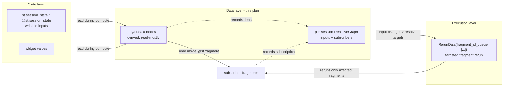
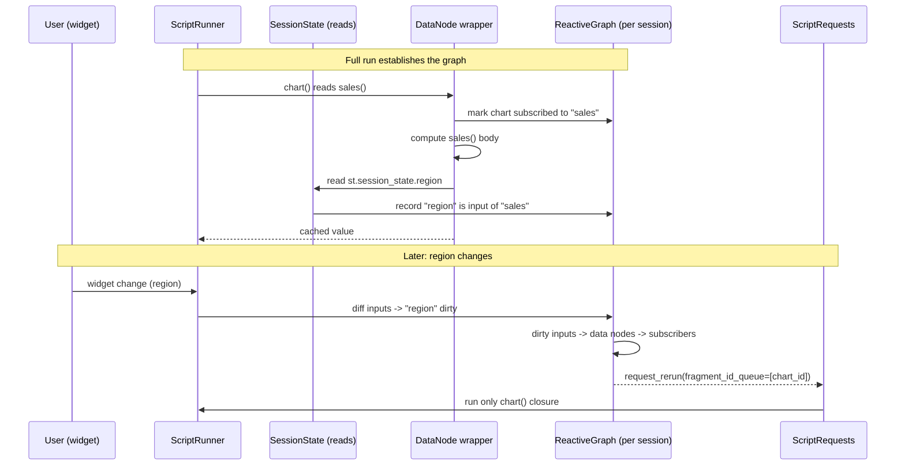

# Reactive data layer (`@st.data`) — implementation plan

Staged implementation plan for a **declarative reactive data layer** in the
open-source Streamlit library. `@st.data` (working name) declares derived/queried
data that records its inputs, subscribes the fragments that read it, and compiles
input changes down to **targeted fragment reruns**.

> Scope: **OSS Streamlit only.** Snowflake semantic views, Cortex Analyst, and
> SiS-specific backends are out of scope for the implementation stages and are
> confined to the [Snowflake integration sketch](#snowflake-integration-sketch-future).

---

## Overview

### Problem

Streamlit reruns the whole script (or a whole fragment) on every interaction. When
a dashboard reads an expensive derived dataset, users have three bad options today:

- `@st.cache_data` — memoizes by function arguments only, but does **not** know
  *which UI depends on the data*, so a change still reruns everything that reads it.
- Manual `@st.fragment` + `st.rerun(scope="fragment")` — works, but the developer
  must hand-wire which fragment reruns when which input changes.
- Session-state bookkeeping + `if` guards — verbose and error-prone.

There is real demand for "recompute/redraw only what changed" behavior:
[#10603](https://github.com/streamlit/streamlit/issues/10603),
[#12799](https://github.com/streamlit/streamlit/issues/12799),
[#10045](https://github.com/streamlit/streamlit/issues/10045),
[#12395](https://github.com/streamlit/streamlit/issues/12395),
[#12980](https://github.com/streamlit/streamlit/issues/12980),
[#9052](https://github.com/streamlit/streamlit/issues/9052) (partial / event-driven
updates).

### The idea

```python
@st.data                                   # declares a named, introspectable node
def sales():
    return query(st.session_state.region)  # framework records: sales depends on `region`

@st.fragment
def chart():
    st.line_chart(sales())                 # reading sales() subscribes this fragment
```

When `st.session_state.region` changes, the framework:

1. sees `region` is an input of the `sales` data node,
2. sees `chart` is subscribed to `sales`,
3. reruns **only** `chart` (targeted fragment rerun) instead of the whole app.

The developer writes plain Python; the reactivity is automatic.

### Three-layer model

| Layer | Concern | Primitive |
|---|---|---|
| **Execution** | Rerun exactly these fragments, not the whole app | addressable `@st.fragment` + targeted fragment rerun |
| **State** | Declare typed, persistent per-session inputs | `@st.session_state` class (sibling, draft) |
| **Data** | Declare derived/queried data the UI reads | `@st.data` (this plan) |

`@st.data` is the **automatic** layer that computes which fragments to rerun. It
depends on the execution layer and composes with (but does not live inside) the
state layer.

### Grounding note on referenced specs

The two specs named in the task brief
(`specs/2026-06-23-event-scoped-fragment-reruns`,
`specs/2026-02-25-session-state-class`) are **not present in this repository
clone** — they are external design docs. This plan therefore grounds every
mechanism in code that exists today. Crucially, the execution primitive this layer
compiles to **already exists internally**: `RerunData.fragment_id_queue` plus
`ScriptRequests.request_rerun(...)` can enqueue a targeted rerun of an arbitrary
fragment id (see [Relationship to the execution layer](#relationship-to-the-execution-layer)).
The closest present design doc for the progressive-backend pattern is
[`specs/2025-11-18-session-scoped-connections-and-rcr/product-spec.md`](specs/2025-11-18-session-scoped-connections-and-rcr/product-spec.md).

---

## Relationship to execution / state layers



### Relationship to the execution layer

The runtime already supports addressable, targeted fragment reruns; the data layer
only needs to *drive* it. Key facts:

- `RerunData` carries `fragment_id` / `fragment_id_queue`
  ([`lib/streamlit/runtime/scriptrunner_utils/script_requests.py`](lib/streamlit/runtime/scriptrunner_utils/script_requests.py)).
  A non-empty queue makes `_run_script` execute only those fragments'
  stored closures; an empty queue is a full app rerun
  ([`lib/streamlit/runtime/scriptrunner/script_runner.py`](lib/streamlit/runtime/scriptrunner/script_runner.py)).
- `ScriptRequests.request_rerun(RerunData(fragment_id_queue=[...]))` is the
  internal entry point; `order_fragment_ids()` orders ancestors before descendants
  and `clear_stale_descendants()` prunes children that were not re-registered.
- Fragment ids are content-addressed from `module.qualname` + the DG delta path and
  stored per-session in `MemoryFragmentStorage`
  ([`lib/streamlit/runtime/fragment.py`](lib/streamlit/runtime/fragment.py)),
  reachable via `ctx.fragment_storage`.

Consequently, the data layer does **not** extend `st.rerun(scope=...)`.
`st.rerun(scope="fragment")` reruns the *current* fragment chain, not an arbitrary
id ([`lib/streamlit/commands/execution_control.py`](lib/streamlit/commands/execution_control.py)),
which is the wrong shape for "rerun these N subscribers." Instead the layer calls
`request_rerun(RerunData(fragment_id_queue=ordered_ids))` directly through a thin
internal helper (Stage 0).

### Relationship to the state layer

`@st.data` **reads** state; it never owns it. Inputs are recorded by instrumenting
the existing read paths in
[`lib/streamlit/runtime/state/safe_session_state.py`](lib/streamlit/runtime/state/safe_session_state.py)
(`__getitem__`, `register_widget`). This works today with plain
`st.session_state`. When the declarative `@st.session_state` class lands, it routes
through the same `SessionState` store, so `@st.data` gets its dependency tracking
for free — no coupling to the state-class implementation. The prototype does not
require the state class to exist.

---

## End-to-end reactive flow

The plain-Python happy path, step by step.



### 1. Registration — a named, introspectable node

`@st.data` wraps the user function in a `DataNode` descriptor. On first call within a
session the node is registered in the per-session `ReactiveGraph` under a stable
**node key** (default: `module.qualname`, overridable via `key=`). The node records:
its callable, declared `depends_on` (if any), current input set, current value +
version, and the set of subscribed fragment ids. The registry is what powers
[introspection](#introspection--agent-facing-metadata).

### 2. Recording upstream dependencies on read

While a `DataNode` body executes, `ScriptRunContext.active_data_node` points at it.
Any read that flows through the instrumented paths appends to that node's input set:

- `st.session_state[key]` / `st.session_state.attr` → `SafeSessionState.__getitem__`
  records input `("state", user_key)`.
- Widget value resolution → `SafeSessionState.register_widget` records input
  `("widget", widget_id)`.
- Reading another `@st.data` node inside the body records a **data→data** edge
  `("data", other_node_key)` (this is how derived-on-derived chains form).

Reads are captured into a per-run buffer and committed to the node's edge set when
its compute finishes, so a node's inputs always reflect its most recent evaluation.
Manual `depends_on=[...]` is unioned in (escape hatch / Stage 1 bootstrap).

### 3. Subscribing a fragment on read

When a `DataNode` is **called** (not computed — every read, hit or miss), the layer
looks at `ThreadState.get().fragment_id`. If a fragment is active, it records a
subscription `fragment_id → node_key` in the graph. Reading the same node outside any
fragment records no subscription (a top-level read simply participates in the full
run). Subscriptions are rebuilt every run: they are cleared for a fragment id when
that fragment re-executes, then re-added as the fragment reads nodes, so stale
subscriptions self-heal.

### 4. Resolving change → fragment targets → dispatch

At the start of a run, before user code, the layer determines the **dirty input
set**:

- widget changes come from the incoming `WidgetStates` diff
  (`on_script_will_rerun` already computes changed widgets);
- `st.session_state` writes are captured in `SafeSessionState.__setitem__`.

It then walks the graph: dirty inputs → directly dependent data nodes → transitively
dependent data nodes (data→data edges) → union of subscribed fragment ids. Dirty
nodes are marked stale (their cached value is invalidated). If the run was a full app
run, nothing special happens (the whole script reruns and rebuilds everything). If
the change is isolated (e.g. a widget owned by a fragment, or a targeted write), the
layer enqueues `request_rerun(RerunData(fragment_id_queue=order_fragment_ids(targets)))`.
Each targeted fragment reruns, re-reads its data nodes (which recompute because they
are stale), and redraws — nothing else moves.

### 5. Per-session structures, cost, lifecycle, cleanup

- The `ReactiveGraph` lives on `SessionState` (persists across reruns and survives
  `fastReruns` ScriptRunner swaps, since both share `AppSession._session_state`).
- The per-run **dependency-capture buffer** and `active_data_node` pointer live on
  `ScriptRunContext` / `SharedRunState`, which are reset every run.
- **Cost:** O(nodes + edges + subscriptions) memory per session; edges/subscriptions
  are small string-keyed sets. Node *values* are held by the reused caching layer
  (with TTL/`max_entries`), not the graph itself, so the graph stays lightweight.
- **Cleanup:** subscriptions for a fragment are cleared when it reruns; nodes not
  re-registered during a full run are dropped (mirroring
  `fragment_storage.clear(new_fragment_ids=...)`); the whole graph is cleared in
  `SessionState.clear()` (used by "Clear cache" and session reset).

---

## API design

### `@st.data` vs. extending `@st.cache_data`

Caching and reactivity overlap (both wrap a function and memoize a result) but are
**different use cases**. Below are the options with tradeoffs, weighed against the
[Streamlit API principles](specs/AGENTS.md).

**Option A — New `@st.data` decorator (recommended).** ✅

```python
@st.data
def sales():
    return query(st.session_state.region)
```

- Pros: One clear use case per command (principle #20). Reactivity + introspection
  are first-class, not bolted onto a memoization API. Room for reactive-specific
  params (`depends_on`, future `on_change`) without polluting `cache_data`.
  Semantically honest: the value model here is a versioned dependency node, not a
  `(function_key, arg_hash)` entry. Reuses caching *internals* under the hood
  (principle #18 satisfied where it matters — implementation, not surface).
- Cons: A new top-level command to teach and maintain.

**Option B — Extend `@st.cache_data` with `reactive=True`.**

- Pros: No new command; extension over invention (#18, literally).
- Cons: Overloads a memoization primitive with a reactivity/graph concept
  (violates #20, #35 "clever but too clever"). `cache_data`'s public contract is
  "keyed by arguments"; reactive nodes are keyed by *identity + recorded inputs* —
  a subtle, confusing dual meaning. Introspection metadata has no natural home on a
  cache. Widget-in-cache is currently a *warning*; here reads of state are the whole
  point, so the mental models diverge.

**Option C — A `st.cache_data(...)`-style function factory `st.data(func, ...)`.**

- Same tradeoffs as A but as a callable rather than bare decorator; A already
  supports both `@st.data` and `@st.data(key=...)` via the standard decorator-factory
  pattern, so C adds nothing.

**Decision: Option A.** Build a new `@st.data` decorator that internally reuses the
caching machinery (`make_cached_func_wrapper` / `CachedFunc`, message replay, the
`in_cached_function`-style guard, session scoping, TTL/LRU) but adds dependency
recording, subscription, and introspection on top. This keeps `@st.cache_data`
focused and lets `@st.data` evolve reactive-specific behavior.

### Decorator shape

Function-first, matching `@st.cache_data` / `@st.fragment` conventions (principles
#5, #11, #27):

```python
@overload
def data(func: F) -> F: ...
@overload
def data(
    *,
    key: str | None = None,
    ttl: float | timedelta | str | None = None,
    max_entries: int | None = None,
    show_spinner: bool | str = True,
    depends_on: Sequence[str] | None = None,
) -> Callable[[F], F]: ...
```

- `func` — the derived-data function (positional, essential).
- `key` — stable node id; defaults to `module.qualname`. Needed when the same
  function is defined in a factory/closure, or to keep the id stable across renames
  (principle #7: `key`, not `id`).
- `ttl` / `max_entries` / `show_spinner` — identical semantics and defaults to
  `@st.cache_data` (principle #10, same name same behavior).
- `depends_on` — explicit list of input identifiers (state keys or other node keys),
  unioned with automatically recorded inputs. The escape hatch for inputs the tracker
  cannot see (e.g. reads inside a `@st.cache_data` sub-call, external clocks). This is
  the piece the reruns spec deferred and this layer owns.

Calling a data node returns its (typed) value, exactly like calling the function
(principle #14, type preservation). It is **read-mostly**: the value is derived, not
assigned, which is the boundary vs. writable `@st.session_state`.

### Composition with `@st.session_state`

No special integration is required. `@st.data` records `st.session_state` reads
through the same `SessionState` store the declarative state class uses. Example of the
intended end state:

```python
@st.session_state
class Filters:
    region: str = "EMEA"

@st.data
def sales():
    return query(Filters.region)     # records dependency on the `region` state key

@st.fragment
def chart():
    st.line_chart(sales())           # subscribes this fragment to `sales`
```

### Introspection / agent-facing metadata

The `ReactiveGraph` exposes a read-only view for tooling and agents:

```python
st.data.registry()  # -> list[DataNodeInfo]

@dataclass(frozen=True)
class DataNodeInfo:
    key: str
    doc: str | None
    inputs: tuple[str, ...]         # recorded + declared upstream identifiers
    subscribers: tuple[str, ...]    # fragment ids currently reading this node
    version: int                    # bumped on recompute; lets agents detect change
    backend: str                    # "python" now; e.g. "snowflake-semantic" later
```

This lets an agent (or a debug panel) answer "what does this dashboard read, and what
recomputes when I change X?" without executing anything — the demand behind the agent
use case in the exploration. The `backend` field is where a future semantic model
surfaces governed metrics/dimensions.

### Error cases

- **Cycles** (`a` reads `b` reads `a`): detected when committing edges. Full cycle
  detection is deferred (see [cut list](#open-questions--prototype-cut-list)); the
  prototype uses a per-run recursion guard (a node already on the active-node stack →
  `StreamlitAPIException` with the offending chain), which is cheap and catches the
  common case (principle #23, fail fast + helpfully).
- **Stale subscriptions** (fragment removed or restructured): self-healing — a
  fragment id absent from `new_fragment_ids` after a full run has its subscriptions
  dropped alongside its storage entry.
- **Fragment key churn** (fragment id changes when layout/position changes): the old
  id's subscriptions are pruned; the new id re-subscribes on next read. No stale
  reruns because dispatch only targets ids present in `fragment_storage`.
- **Read outside a session** (bare script, tests): degrade to plain function call
  with no tracking (principle #15, default null over error), mirroring
  `get_session_state()`'s mock fallback.

---

## Per-session data graph

Structures (new module `lib/streamlit/runtime/reactive/`):

```python
InputId = tuple[str, str]   # ("state", user_key) | ("widget", widget_id) | ("data", node_key)

@dataclass
class DataNode:
    key: str
    func: Callable[..., Any]
    declared_deps: frozenset[str]
    inputs: set[InputId] = field(default_factory=set)
    subscribers: set[str] = field(default_factory=set)   # fragment ids
    version: int = 0
    backend: str = "python"

class ReactiveGraph:
    _nodes: dict[str, DataNode]
    _input_index: dict[InputId, set[str]]     # input -> node keys (reverse index)

    def register(self, node: DataNode) -> None: ...
    def record_input(self, node_key: str, input_id: InputId) -> None: ...
    def record_subscription(self, fragment_id: str, node_key: str) -> None: ...
    def clear_subscriptions_for(self, fragment_id: str) -> None: ...
    def resolve_targets(self, dirty: set[InputId]) -> list[str]: ...   # -> fragment ids
    def prune(self, live_node_keys: frozenset[str]) -> None: ...
```

Placement and lifecycle:

| Concern | Location | Reset when |
|---|---|---|
| `ReactiveGraph` (nodes, edges, subscriptions) | field on `SessionState` | `SessionState.clear()`; `prune()` after full runs |
| `active_data_node` pointer + capture buffer | `ScriptRunContext` / `SharedRunState` | every `ctx.reset()` / `SharedRunState.reset()` |
| Node **values** (versioned) | reused caching layer (`DataCaches`, session-scoped) | TTL / `max_entries` / `clear()` |

`resolve_targets` is a BFS over `_input_index` (dirty inputs → nodes → data-node
inputs of downstream nodes → …), collecting `subscribers`, then `order_fragment_ids`
for correct ancestor/descendant ordering. `fastReruns` safety comes from anchoring the
graph on the session, not the run context.

---

## Staged implementation plan (OSS Streamlit only)

Each stage is an independently testable increment. No Snowflake/SiS code in any stage.

### Stage 0 — Execution prerequisite: addressable targeted rerun helper

- **Goal:** a stable internal API to enqueue a rerun of an explicit set of fragment
  ids, independent of the reactive layer.
- **Scope:** thin wrapper over `ScriptRequests.request_rerun(RerunData(fragment_id_queue=...))`
  that validates ids against `fragment_storage`, orders them via `order_fragment_ids`,
  and no-ops on unknown ids. No public API.
- **Key files:** [`lib/streamlit/runtime/fragment.py`](lib/streamlit/runtime/fragment.py)
  (helper), [`lib/streamlit/runtime/scriptrunner_utils/script_requests.py`](lib/streamlit/runtime/scriptrunner_utils/script_requests.py)
  (already sufficient; reference only).
- **Acceptance:** unit test enqueues two fragment ids and asserts `_run_script`
  executes only those closures in ancestor-first order.
- **Deferred:** any dependency logic; this is pure execution plumbing.

### Stage 1 — `@st.data` registration + manual `depends_on`

- **Goal:** `@st.data` exists, registers a node, memoizes its value, and can be
  invalidated by explicitly declared inputs.
- **Scope:** new `reactive/` module with `DataNode`, `ReactiveGraph`; `@st.data`
  decorator reusing `make_cached_func_wrapper` for value caching; `ReactiveGraph`
  field on `SessionState` with `clear()` wiring; dispatch driven only by
  `depends_on` (no auto-recording yet). Public `st.data` export.
- **Key files:** `lib/streamlit/runtime/reactive/{__init__,data_api,graph}.py` (new),
  [`lib/streamlit/runtime/state/session_state.py`](lib/streamlit/runtime/state/session_state.py),
  [`lib/streamlit/__init__.py`](lib/streamlit/__init__.py).
- **Acceptance:** app defines `@st.data(depends_on=["region"])`; changing `region`
  marks the node stale and reruns only subscribed fragments; unchanged widgets do
  not recompute the node.
- **Deferred:** automatic dependency recording; data→data edges beyond declared.

### Stage 2 — Automatic dependency recording on read

- **Goal:** inputs are recorded automatically; `depends_on` becomes optional.
- **Scope:** `active_data_node` pointer + capture buffer on `ScriptRunContext`;
  instrument `SafeSessionState.__getitem__` / `register_widget` / `__setitem__`;
  commit edges when a node's compute finishes; data→data edges via nested node calls;
  per-run recursion guard for cycles.
- **Key files:** [`lib/streamlit/runtime/scriptrunner_utils/script_run_context.py`](lib/streamlit/runtime/scriptrunner_utils/script_run_context.py),
  [`lib/streamlit/runtime/scriptrunner_utils/shared_run_state.py`](lib/streamlit/runtime/scriptrunner_utils/shared_run_state.py),
  [`lib/streamlit/runtime/state/safe_session_state.py`](lib/streamlit/runtime/state/safe_session_state.py),
  `lib/streamlit/runtime/reactive/graph.py`.
- **Acceptance:** the intro example works with **no** `depends_on`; reading
  `st.session_state.region` inside `sales()` records the edge; a nested `@st.data`
  read records a data→data edge; a self-referential cycle raises a clear exception.
- **Deferred:** subscription-driven targeted reruns (Stage 3 turns them on); global
  cycle detection.

### Stage 3 — Fragment subscription + automatic targeted reruns

- **Goal:** reading a node inside a `@st.fragment` subscribes it; input changes rerun
  exactly the subscribed fragments via the Stage 0 helper.
- **Scope:** record `fragment_id → node_key` subscriptions on node call; clear a
  fragment's subscriptions when it reruns; at run start compute the dirty input set
  and, when isolated, dispatch `resolve_targets(...)` through the Stage 0 helper.
- **Key files:** `lib/streamlit/runtime/reactive/graph.py`,
  [`lib/streamlit/runtime/scriptrunner/script_runner.py`](lib/streamlit/runtime/scriptrunner/script_runner.py)
  (dirty-set computation at run start / `on_script_will_rerun` hook),
  [`lib/streamlit/runtime/fragment.py`](lib/streamlit/runtime/fragment.py) (subscription clear on fragment rerun).
- **Acceptance:** e2e — two fragments read two different nodes; changing an input of
  one node reruns only that node's subscriber; snapshot shows the other fragment's DOM
  untouched.
- **Deferred:** parallel-fragment interactions; cross-page nodes.

### Stage 4 — Introspection / agent-facing metadata

- **Goal:** `st.data.registry()` returns `DataNodeInfo` for tooling and agents.
- **Scope:** read-only projection of `ReactiveGraph`; `version` bump on recompute;
  `backend` field.
- **Key files:** `lib/streamlit/runtime/reactive/data_api.py`,
  [`lib/streamlit/__init__.py`](lib/streamlit/__init__.py).
- **Acceptance:** unit test asserts inputs/subscribers/version reflect the graph after
  a run without re-executing user code.
- **Deferred:** a rendered debug panel; frontend visualization.

### Later stages (listed, not fully planned)

- Full cycle detection with actionable multi-node error paths.
- Invalidation/TTL polish, `max_entries` tuning, spinner UX for recompute.
- Parallel fragments and multipage nodes.
- `on_change`/reactive-callback ergonomics if demand appears.
- Comprehensive unit + e2e + typing tests; user docs and API reference.
- `BaseDataSource` backend plugin interface (bridges to the Snowflake sketch).

---

## File-by-file changes (Stages 1–2)

Ordered from runtime internals up to the public API. Snippets show representative
signatures/bodies; code comments describe behavior only.

### Stage 1

#### 1. `lib/streamlit/runtime/reactive/graph.py` (new)

One-line: per-session dependency graph — nodes, reverse input index, subscriptions,
and target resolution.

```python
from __future__ import annotations

from dataclasses import dataclass, field
from typing import Any, Callable

InputId = tuple[str, str]


@dataclass
class DataNode:
    """A single reactive data cell registered by ``@st.data``."""

    key: str
    func: Callable[..., Any]
    declared_deps: frozenset[str] = frozenset()
    inputs: set[InputId] = field(default_factory=set)
    subscribers: set[str] = field(default_factory=set)
    version: int = 0
    backend: str = "python"


class ReactiveGraph:
    """Holds the reactive data graph for one session.

    Lives on ``SessionState`` so it persists across reruns and shares its lifetime
    with the session's widget and user state.
    """

    def __init__(self) -> None:
        self._nodes: dict[str, DataNode] = {}
        self._input_index: dict[InputId, set[str]] = {}

    def register(self, node: DataNode) -> None:
        existing = self._nodes.get(node.key)
        if existing is not None:
            node.subscribers = existing.subscribers
            node.version = existing.version
        self._nodes[node.key] = node
        for dep in node.declared_deps:
            self._index(("state", dep), node.key)

    def resolve_targets(self, dirty: set[InputId]) -> list[str]:
        """Return the fragment ids that must rerun for a set of dirty inputs."""
        seen_nodes: set[str] = set()
        frontier = list(dirty)
        while frontier:
            current = frontier.pop()
            for node_key in self._input_index.get(current, ()):
                if node_key in seen_nodes:
                    continue
                seen_nodes.add(node_key)
                self._nodes[node_key].version += 1
                frontier.append(("data", node_key))
        targets: set[str] = set()
        for node_key in seen_nodes:
            targets.update(self._nodes[node_key].subscribers)
        return sorted(targets)

    def _index(self, input_id: InputId, node_key: str) -> None:
        self._input_index.setdefault(input_id, set()).add(node_key)
```

#### 2. `lib/streamlit/runtime/reactive/data_api.py` (new)

One-line: the `@st.data` decorator; wraps the user function, registers a node, and
memoizes the value via the existing caching machinery.

```python
@overload
def data(func: F) -> F: ...
@overload
def data(
    *,
    key: str | None = None,
    ttl: float | timedelta | str | None = None,
    max_entries: int | None = None,
    show_spinner: bool | str = True,
    depends_on: Sequence[str] | None = None,
) -> Callable[[F], F]: ...


@gather_metrics("data")
def data(func=None, *, key=None, ttl=None, max_entries=None,
         show_spinner=True, depends_on=None):
    """Declare a reactive, derived data source.

    The decorated function's result is cached per session and recomputed only when one
    of its inputs changes. Fragments that read the value are rerun automatically when
    the value changes.
    """

    def decorator(f: F) -> F:
        node_key = key or f"{f.__module__}.{f.__qualname__}"
        cached = make_cached_func_wrapper(
            CachedDataFuncInfo(func=f, scope="session", ttl=ttl,
                               max_entries=max_entries, show_spinner=show_spinner,
                               persist=None, hash_funcs=None)
        )

        @functools.wraps(f)
        def wrapper(*args: Any, **kwargs: Any) -> Any:
            ctx = get_script_run_ctx()
            if ctx is None:
                return f(*args, **kwargs)
            graph = ctx.session_state.reactive_graph
            graph.register(DataNode(node_key, f, frozenset(depends_on or ())))
            fragment_id = ThreadState.get().fragment_id
            if fragment_id is not None:
                graph.record_subscription(fragment_id, node_key)
            return cached(*args, **kwargs)

        return cast("F", wrapper)

    return decorator if func is None else decorator(func)
```

> Note: `record_subscription` and `clear_subscriptions_for` are added in Stage 1 as
> no-op-safe methods; targeted dispatch that consumes them is enabled in Stage 3.

#### 3. `lib/streamlit/runtime/state/session_state.py`

One-line: host the per-session `ReactiveGraph` and clear it with the rest of session
state.

Before:

```python
    def clear(self) -> None:
        self._old_state.clear()
        self._new_session_state.clear()
        self._new_widget_state.clear()
        self._key_id_mapper.clear()
```

After:

```python
    reactive_graph: ReactiveGraph = field(default_factory=ReactiveGraph)

    def clear(self) -> None:
        self._old_state.clear()
        self._new_session_state.clear()
        self._new_widget_state.clear()
        self._key_id_mapper.clear()
        self.reactive_graph = ReactiveGraph()
```

#### 4. `lib/streamlit/__init__.py`

One-line: export `st.data`.

Before:

```python
from streamlit.runtime.caching import (
    cache_resource as _cache_resource,
    cache_data as _cache_data,
    cache as _cache,
)
```

After:

```python
from streamlit.runtime.caching import (
    cache_resource as _cache_resource,
    cache_data as _cache_data,
    cache as _cache,
)
from streamlit.runtime.reactive import data as _data
```

...and in the `st.*` assignment block:

```python
data = _data
```

### Stage 2

#### 5. `lib/streamlit/runtime/scriptrunner_utils/script_run_context.py`

One-line: track the currently computing data node so reads can be attributed to it.

Before:

```python
    fragment_ids_this_run: list[str] | None = None
    has_dialog_opened: bool = False
```

After:

```python
    fragment_ids_this_run: list[str] | None = None
    has_dialog_opened: bool = False
    active_data_node: str | None = None
```

The capture buffer (`dict[str, set[InputId]]`) is added to `SharedRunState` and
cleared in its `reset()`, so recorded inputs never leak across runs.

#### 6. `lib/streamlit/runtime/state/safe_session_state.py`

One-line: attribute state and widget reads to the active data node, and record writes
as dirty inputs.

Before:

```python
    def __getitem__(self, key: str) -> Any:
        self._yield_callback()
        with self._lock:
            return self._state[key]

    def __setitem__(self, key: str, value: Any) -> None:
        self._yield_callback()
        with self._lock:
            self._state[key] = value
```

After:

```python
    def __getitem__(self, key: str) -> Any:
        self._yield_callback()
        with self._lock:
            value = self._state[key]
        record_reactive_read(("state", key))
        return value

    def __setitem__(self, key: str, value: Any) -> None:
        self._yield_callback()
        with self._lock:
            self._state[key] = value
        record_reactive_write(("state", key))
```

`record_reactive_read` reads `ctx.active_data_node` and, when set, appends the input
to that node's capture-buffer entry; `record_reactive_write` marks the input dirty for
next-run resolution. Both no-op without a session context, keeping bare-script and
test behavior unchanged. `register_widget` gets the same read attribution for
`("widget", metadata.id)`.

#### 7. `lib/streamlit/runtime/reactive/data_api.py` (extend)

One-line: set/clear the active-node pointer around compute and commit captured edges.

```python
        @functools.wraps(f)
        def wrapper(*args: Any, **kwargs: Any) -> Any:
            ctx = get_script_run_ctx()
            if ctx is None:
                return f(*args, **kwargs)
            graph = ctx.session_state.reactive_graph
            graph.register(DataNode(node_key, f, frozenset(depends_on or ())))
            fragment_id = ThreadState.get().fragment_id
            if fragment_id is not None:
                graph.record_subscription(fragment_id, node_key)
            if ctx.active_data_node is not None:
                graph.record_input(ctx.active_data_node, ("data", node_key))
            previous = ctx.active_data_node
            ctx.active_data_node = node_key
            try:
                return cached(*args, **kwargs)
            finally:
                graph.commit_inputs(node_key, ctx.shared.reactive_reads.pop(node_key, set()))
                ctx.active_data_node = previous
```

The `previous`/`finally` handling gives correct nesting for data→data chains and,
combined with a per-run recursion guard in `commit_inputs`, raises a clear exception
on cycles.

---

## Snowflake integration sketch (future)

This section is architectural only — no file-by-file plan, and nothing here lands in
the OSS stages above. It shows how the *same* `@st.data` API upgrades when backed by
Snowflake, following the `st.connection` progressive-backend precedent.

### The upgrade shape

The OSS `DataNode.backend` is `"python"`. A capable backend swaps the compute path
without changing user code:

```python
# Plain Python (OSS, first-class):
@st.data
def sales():
    return df.query("region == @region")

# Backed by a governed semantic model (future):
@st.data(source="snowflake-semantic", model="SALES_SEMANTIC_VIEW")
def sales():
    return metric("total_sales", by="region")   # compiles to governed SQL, not local pandas
```

Mirrors `st.connection`: one API, richer behavior when a backend is present, plain
Python always available (principle #26, minimize migration distance).

### Consuming an existing semantic view first (preferred)

The first Snowflake step is **consuming** an existing semantic view, not generating
one from Python. The backend reads the view's governed metrics and dimensions and
exposes them as the node's inputs/outputs. This respects the customer's existing
governance and is far lower-risk than authoring views. Generating views from Python
is a later, optional capability.

### Query pushdown, governed metrics/dimensions, RBAC

- **Pushdown:** filters/aggregations recorded as node inputs (e.g. `region`) compile
  to SQL executed in the warehouse; only results return. The reactive graph's input
  set is exactly the set of pushdown parameters, so targeted reruns re-issue only the
  affected queries.
- **Governed metrics/dimensions:** surfaced through `DataNodeInfo` (the `backend` and
  a metrics/dimensions extension), so tooling and agents see governed semantics rather
  than opaque SQL.
- **RBAC:** the backend runs under the app's Snowflake identity (caller's-rights model
  from `SnowflakeCallersRightsConnection`), so row/column access is enforced by
  Snowflake, not by Streamlit.

### Cortex Analyst / agent reasoning as a consumer

`st.data.registry()` already exposes nodes, inputs, subscribers, and (with a semantic
backend) governed metrics/dimensions. Cortex Analyst or an app agent consumes this to
reason over the same semantic model the UI uses — "which metric drives this chart, and
what happens if I filter by X" — without a separate schema description. The semantic
model is a **backend of the data layer**, never session state.

### Interfaces the OSS library must expose

A small backend-plugin seam, analogous to `BaseConnection` + `_FIRST_PARTY_CONNECTIONS`:

```python
class BaseDataSource(ABC):
    @classmethod
    def scope(cls) -> Literal["global", "session"]: ...
    def resolve(self, node: DataNode, params: Mapping[str, Any]) -> Any: ...
    def describe(self, node: DataNode) -> Mapping[str, Any]: ...   # governed metadata
```

- `@st.data(source=...)` resolves a string/class to a `BaseDataSource` exactly as
  `connection_factory` resolves connection types (first-party dict, dotted path, or
  class), with lazy imports and friendly "install X" errors.
- OSS ships the interface and the `"python"` default source only.

### Where the code lives

- **streamlit (OSS):** the `@st.data` API, `ReactiveGraph`, `BaseDataSource`
  interface, the `"python"` source, and introspection.
- **SiS / Snowflake package:** the concrete `SnowflakeSemanticDataSource`
  (semantic-view consumption, pushdown, RBAC, Cortex Analyst bridge), registered via
  the plugin seam — no changes to OSS internals required.

---

## Open questions & prototype cut list

### Open questions

- **Cache extension vs. new decorator** — resolved to a new `@st.data` (Option A) that
  reuses caching internals. Flagged for team confirmation given principle #18.
- **Per-session memory** — the graph is lightweight (string-keyed sets); node values
  reuse the capped caching layer. Open: whether to also cap graph size per session or
  rely on `prune()` after full runs. Prototype relies on `prune()` + `clear()`.
- **Agent use cases** — `st.data.registry()` addresses introspection now; the deeper
  "agent reasons over governed semantics" use case is gated on the Snowflake backend
  and is intentionally out of the OSS stages.
- **Widget-diff source of truth** — reuse `on_script_will_rerun`'s changed-widget
  computation for the dirty set vs. a dedicated diff. Prototype reuses the existing
  computation.
- **Interaction with parallel fragments** — deferred; the prototype assumes serial
  fragment execution.

### Prototype cut list (defer for a first cut)

- Full graph-wide cycle detection (keep the cheap per-run recursion guard).
- Exhaustive unit/e2e/typing coverage (cover the happy path + one invalidation + one
  cycle error).
- User-facing docs and API reference.
- All Snowflake/SiS backends and the `BaseDataSource` seam (interface can wait until
  after Stage 4).
- Hard dependency on the declarative `@st.session_state` class — track plain
  `st.session_state` reads; the state class composes for free when it lands.
- Rendered debug/introspection panel and any frontend visualization.
