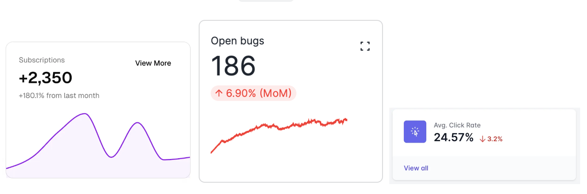

# Clickable action for `st.metric`

## Summary

Add `on_click` and `action` parameters to `st.metric` to enable click interactions. When
`on_click="rerun"` or a callback is provided, click events are activated and `st.metric`
returns `True` when clicked. The optional `action` parameter displays a customizable icon
button; when `action=None`, the entire metric card becomes clickable.



## Problem

`st.metric` is widely used for displaying KPIs and summary statistics in dashboards. Users
often want to make metrics interactive—clicking a metric to see more details, open a dialog
with historical data, or navigate to a related page. Currently, there's no way to add
interactivity to `st.metric` without combining it with other widgets inside a container.

**User requests:**

- [#12322](https://github.com/streamlit/streamlit/issues/12322) - Add clickable actions to
  `st.metric` (9+ upvotes)
- [#9370](https://github.com/streamlit/streamlit/issues/9370) - Callback on `st.metric` click
  event (13+ upvotes)

**Use cases:**

- Dashboard metrics that open detailed views or dialogs when clicked
- KPI cards with "View More" or "Expand" functionality
- Metrics that link to related data pages or external resources
- Interactive metric grids where users can drill down into specific metrics

## Proposal

### API

```python
st.metric(
    ...,
    on_click: Literal["ignore", "rerun"] | Callable = "ignore",  # NEW
    action: str | None = None,  # NEW
) -> DeltaGenerator | bool
```

#### Parameters

| Parameter | Type | Default | Description |
|-----------|------|---------|-------------|
| `on_click` | `"ignore"`, `"rerun"`, or `callable` | `"ignore"` | How the metric should respond to click events. `"ignore"` (default): No click handling. `"rerun"`: Clicking triggers a rerun and returns `True`. `callable`: Clicking triggers a rerun and executes the callback. |
| `action` | `str \| None` | `None` | Label for a clickable button (in the top-right corner?). Only relevant when `on_click` is set. Supports short text, emojis, Material Symbols (e.g. `:material/icon_name:`), and basic Markdown (Bold, Italics, Images). If `None`, the entire metric card is clickable. |

> Alternative parameter names for `action`: `action_label`, `button`, `button_label`

#### Return Value

| Condition | Return Value |
|-----------|--------------|
| `on_click="ignore"` | `DeltaGenerator` (current behavior, for chaining) |
| `on_click="rerun"` or callable | `bool` - `True` if clicked on the current run, `False` otherwise |

#### Behavior

**Without click handling (`on_click="ignore"`, default):**

- `st.metric` displays as it does today
- Returns a `DeltaGenerator` for method chaining
- The `action` parameter is ignored

**With click handling (`on_click="rerun"` or callable):**

- Click events are activated on the metric
- Returns `bool` - `True` if clicked, `False` otherwise
- If a callable is provided, it executes as a callback before the app reruns

**Click target based on `action`:**

- **`action=None` (default)**: The entire metric card is clickable
  - Cursor changes to pointer on hover to indicate interactivity
  - Subtle hover effect on the entire card
- **`action` is set**: A tertiary/ghost-style icon button appears (in the top-right corner?)
  - Only the button is clickable, not the entire card
  - The button has no background with a subtle hover effect
  - Button visibility: always visible when `border=True`, appears on hover when `border=False`

**Action rendering (when `action` is set):**

- **Icon-only** (e.g., `:material/expand_content:`): Renders as a compact icon button
- **Text-only** (e.g., `"View More"`): Renders as a text link/button
- **Icon + text** (e.g., `:material/open_in_full: Expand`): Renders with icon followed by text

**Additional notes:**

- If `help` is also set, the help tooltip appears next to the label, while the action
  button remains in the top-right corner

#### Examples

**Clickable metric card (entire card clickable):**

```python
import streamlit as st

@st.dialog("Subscription Details")
def show_details():
    st.write("Detailed subscription data...")
    st.dataframe(subscription_data)

if st.metric(
    "Subscriptions",
    "+2,350",
    "+180.1% from last month",
    on_click="rerun",
    border=True,
):
    show_details()
```

**Metric with action button:**

```python
import streamlit as st

@st.dialog("Subscription Details")
def show_details():
    st.write("Detailed subscription data...")
    st.dataframe(subscription_data)

if st.metric(
    "Subscriptions",
    "+2,350",
    "+180.1% from last month",
    on_click="rerun",
    action=":material/open_in_full:",
    border=True,
):
    show_details()
```

**Using a callback:**

```python
import streamlit as st

def handle_click():
    st.session_state.selected_metric = "bugs"

clicked = st.metric(
    "Open bugs",
    "186",
    "↑ 6.90% (MoM)",
    delta_color="inverse",
    on_click=handle_click,
    action=":material/open_in_new:",
    border=True,
)

if clicked:
    st.switch_page("pages/bug_tracker.py")
```

**Text-only action button:**

```python
import streamlit as st

if st.metric(
    "Subscriptions",
    "+2,350",
    "+180.1%",
    on_click="rerun",
    action="View More",
    border=True,
):
    show_details()
```

### Alternatives Considered

#### Alternative 1: Only `action` parameter (no `on_click`)

```python
st.metric("Revenue", "$45K", action=":material/expand:")  # Returns bool when action is set
```

**Pros:**

- Simpler API with single parameter
- Action button provides visual indicator

**Cons:**

- No way to make entire metric clickable without showing a button
- Less consistent with other Streamlit widgets that use `on_click`/`on_select` pattern

#### Alternative 2: `on_click` with fixed action icon

```python
st.metric("Revenue", "$45K", on_click="rerun")  # Always shows ⋯ or ⛶ icon
```

**Pros:**

- Simpler API (just one parameter)
- Consistent icon across all metrics

**Cons:**

- No customization of the action icon
- The icon meaning isn't clear without context
- No option for full-card clickability without icon

#### Alternative 3: Multiple actions returning clicked label

```python
clicked_action = st.metric(..., actions=["View More", "Download", "Share"])
if clicked_action == "View More":
    show_dialog()
```

### Design

> TBD - mockups on where and how to place the action button are WIP

### Edge Cases

- **`action` without `on_click`**: The `action` parameter is ignored when `on_click="ignore"`.
  No button is shown and no click handling occurs.
- **`action` with `help`**: Both can be used together. Help tooltip appears next to the
  label, action button in top-right corner.
- **Accessibility**: Action button is keyboard-focusable and has appropriate ARIA labels.
- **`border=False` with `action`**: Icon appears on hover to avoid cluttering borderless
  metrics.
- **`border=False` with full-card click (`action=None`)**: Subtle hover effect indicates
  interactivity.

## Checklist

- [x] Will this work on all deployment platforms (e.g. [Streamlit Community Cloud](https://streamlit.io/cloud), [Streamlit in Snowflake](https://www.snowflake.com/en/product/features/streamlit-in-snowflake/), [Hugging Face Spaces](https://huggingface.co/spaces))?
- [x] No breaking API changes?
- [x] No new dependencies?
- [x] Metrics collected?
- [x] Any security or legal implications?
- [x] Anything to keep in mind for docs?
- [x] Any other risks?
