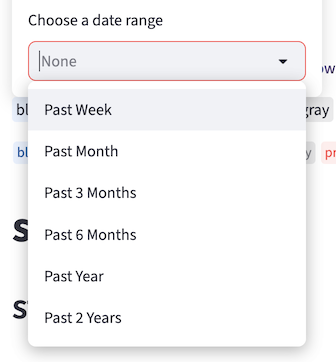

# Custom quick select for `st.date_input`

## Summary

Let devs customize or hide the quick-select dropdown in `st.date_input`.

## Problem

If a range is passed to `st.date_input`, we show a quick-select dropdown at the bottom
of the date picker:



This has the default options from BaseWeb. Sometimes it can be useful to customize
what's shown here.

Requests:

- (4 👍) [#12331](https://github.com/streamlit/streamlit/issues/12331).

## Proposal

### API

```python

st.date_input(
    ...,
    quick_select_options: Mapping[str, Sequence[date, date]] | bool | None = None,
)
```

Allowed values for `quick_select_options`:

- `None` to show the default options, just like today. Note that the quick select should
  still only show up if `value` is a range. If `value` is a single date, the value of
  `quick_select_options` can be ignored.
- `False` to hide the quick select entirely (note that `False` = hidden and
  `None` = default is the same pattern we use in other places, e.g. for `anchor` on
  `st.title` or `border` on `st.container`).
- A dict mapping a string label (to be shown in the dropdown) to a sequence containing
  exactly one start and ond end date (e.g.
  `{"Last 30 days": [date.today() - timedelta(days=30), date.today()], ...}`).

### Examples

```python
# Hide quick select completely
st.date_input(
    "Future release window",
    value=(date.today(), date.today() + timedelta(days=30)),
    quick_select_options="off"
)

# Provide custom forward-looking options
st.date_input(
    "Forecast horizon",
    value=(date.today(), date.today() + timedelta(days=30)),
    quick_select_options={
        "Next week": (date.today(), date.today() + timedelta(days=7)),
        "Next quarter": (
            date.today(),
            date.today() + timedelta(days=90),
        ),
    },
)
```

## Checklist

- [x] Will this work on all deployment platforms (e.g. [Streamlit Community Cloud](https://streamlit.io/cloud), [Streamlit in Snowflake](https://www.snowflake.com/en/product/features/streamlit-in-snowflake/), [Hugging Face Spaces](https://huggingface.co/spaces))?
- [x] No breaking API changes?
- [x] No new dependencies?
- [x] Metrics collected?
- [x] Any security or legal implications?
- [x] Anything to keep in mind for docs?
- [x] Any other risks?
