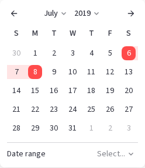

# Quick-select presets for `st.date_input`

## Summary

Add a keyword-only `quick_select_options` parameter to `st.date_input` so app
developers can hide the quick-select control or replace its built-in date-range presets
with app-specific single dates or date ranges. `None` preserves today's behavior, so the
API is additive and existing apps do not change.

The date picker now uses Streamlit-owned React Aria components instead of BaseWeb. The
current range picker already implements its quick-select control as a composed React Aria
listbox, which makes both customization and an equivalent single-date control feasible
without another frontend dependency.

## Problem

Range-mode `st.date_input` can show a quick-select control below the calendar:



The built-in presets all end on or near today (for example, "Past Week" and "Past
Month"). They are useful for analytics dashboards, but app developers cannot hide or
replace them when their domain uses different periods:

- Future-looking apps need choices such as "Next week" or "Next quarter."
- Reporting apps commonly use a maximum of yesterday, a previous business day, or the
  latest complete data partition rather than today.
- Fiscal periods, release windows, billing cycles, and experiment windows do not map to
  the built-in durations.
- Single-date inputs can benefit from shortcuts such as "Yesterday," "Next Monday," or
  a domain-specific milestone, but currently have no quick-select control.

Setting `min_value` can make the built-in range control disappear in some cases, but it
does not express the intended presets and cannot help when the valid date window is broad.
Building separate buttons requires developers to duplicate widget state, callbacks, form
behavior, and layout outside the calendar.

### User requests

- [#12331](https://github.com/streamlit/streamlit/issues/12331) requests control over
  quick-select visibility and custom ranges. Follow-up comments specifically request a
  previous-day endpoint and custom relative reporting periods.
- Single-date inputs have no quick-select control at all, even though the React Aria
  rewrite removed the range-only limitation that BaseWeb imposed.

## Proposal

### API

Add `quick_select_options` after the existing keyword-only parameters in every
`st.date_input` overload. The simplified type is:

```python
from collections.abc import Mapping
from datetime import date, datetime
from typing import Literal, TypeAlias

DatePresetValue: TypeAlias = date | datetime | str | Literal["today"]
DateRangePresetValue: TypeAlias = (
    tuple[DatePresetValue, DatePresetValue] | list[DatePresetValue]
)
QuickSelectPresetValue: TypeAlias = DatePresetValue | DateRangePresetValue


def date_input(
    # Existing parameters...
    *,
    quick_select_options: (
        Mapping[str, QuickSelectPresetValue] | Literal[False] | None
    ) = None,
) -> date | tuple[date, ...] | None: ...
```

The existing overloads narrow the mapping value according to the widget mode:

- A single-date input accepts `Mapping[str, DatePresetValue]`.
- A range input accepts `Mapping[str, DateRangePresetValue]`, with exactly two values
  required for every entry. `str` is a scalar here, not a sequence, matching the
  existing `date_input` range overload.

`DatePresetValue` has the same scalar conversion semantics as `value`: a
`datetime.date`, a `datetime.datetime` (time ignored), an ISO date/datetime string, or
`"today"`. `None` is not a valid preset value.

### Configuration modes

| `quick_select_options` | Single-date input | Date-range input |
|---|---|---|
| `None` (default) | Keep today's behavior: do not show quick select. | Keep today's automatic visibility and built-in presets exactly. |
| `False` | Hide quick select. | Hide quick select, regardless of the automatic visibility rule. |
| Non-empty mapping | Show the supplied labels and scalar dates. | Show the supplied labels and two-date ranges. |

A custom mapping replaces the built-in presets and always shows the control, regardless
of the automatic visibility rule. Mapping insertion order determines display order.
`True` is intentionally invalid: `False` is a one-way opt-out sentinel, not a generic
show/hide boolean.

The `None` path remains owned by the frontend and preserves the current list ("Past
Week," "Past Month," "Past 3 Months," "Past 6 Months," "Past Year," and "Past 2
Years"), its min/max handling, and its range-only visibility gate. This proposal does not
turn those defaults into a public compatibility contract; Streamlit may improve them
independently.

### Examples

#### Hide quick select

```python
from datetime import date, timedelta

import streamlit as st

today = date.today()

release_window = st.date_input(
    "Future release window",
    value=(today, today + timedelta(days=30)),
    min_value=today,
    quick_select_options=False,
)
```

#### Custom reporting ranges ending yesterday

```python
from datetime import date, timedelta

import streamlit as st

today = date.today()
yesterday = today - timedelta(days=1)

reporting_period = st.date_input(
    "Reporting period",
    value=(yesterday - timedelta(days=29), yesterday),
    max_value=yesterday,
    key="reporting_period",
    quick_select_options={
        "Previous day": (yesterday, yesterday),
        "Last 7 complete days": (yesterday - timedelta(days=6), yesterday),
        "Last 30 complete days": (yesterday - timedelta(days=29), yesterday),
    },
)
```

The app script computes these dates whenever it reruns, so the presets advance naturally
without adding a separate relative-date string language.

#### Custom single-date presets

```python
from datetime import date, timedelta

import streamlit as st

today = date.today()
days_until_next_monday = (7 - today.weekday()) % 7 or 7

as_of_date = st.date_input(
    "As-of date",
    value=today,
    key="as_of_date",
    quick_select_options={
        "Yesterday": today - timedelta(days=1),
        "Today": today,
        "Next Monday": today + timedelta(days=days_until_next_monday),
    },
)
```

### Validation and errors

Validate custom options in Python before registering the widget. Invalid input raises a
shared `streamlit.errors` subclass naming the parameter and offending label; presets are
never silently dropped, reordered, or clamped. Prefer
`StreamlitInvalidParameterTypeError` for unsupported types and unparseable dates,
`StreamlitValueBelowMinError` / `StreamlitValueAboveMaxError` for bounds, and a
`StreamlitAPIException` subclass only when no shared type fits. Do not reuse
`_convert_datelike_to_date` unchanged: it hardcodes `"value"` as the parameter name, so
preset parsing needs its own error path for `quick_select_options`. Classify a value as
a sequence only when `isinstance(v, Sequence) and not isinstance(v, str)`, matching
`_parse_date_value`.

| Invalid input | Behavior |
|---|---|
| `True` or another unsupported top-level value | Raise and list `None`, `False`, or a mapping as the valid forms. |
| Empty mapping | Raise. `False` is the explicit hide sentinel; `{}` is treated as a likely authoring mistake rather than silently hiding the control. |
| Non-string or empty/whitespace-only label | Raise. Labels are rendered as plain text in the initial release. |
| Single-date mode with a sequence value | Raise; each preset must resolve to one scalar date. A `str` such as `"today"` is a scalar, not a sequence of characters. |
| Range mode with a scalar or a sequence whose length is not two | Raise; each preset must contain exactly one start and one end date. A `str` is a scalar here too. |
| Unsupported or unparseable date value, including `None` | Raise using the same date-conversion guidance as `value`. |
| Start date after end date | Raise; do not normalize an author-provided preset. This is stricter than `value`, which currently accepts an inverted range. |
| Date outside `min_value` / `max_value` | Raise; identify the preset and violated bound. Built-in `None` presets may still be filtered or clamped by the frontend because Streamlit owns that list; custom presets raise because the app author owns them. |
| Two labels that normalize to the same date or range | Raise because the trigger shows a single selected label. Overlap that only happens on some calendar days (for example "Yesterday" vs "Last business day" on Monday) is still an error; authors should keep preset values distinct. |

Validation uses the resolved `min_value` and `max_value`, including Streamlit's computed
defaults when either argument is omitted. If those bounds change on a later rerun, the
custom options are validated again.

### Selection behavior

- Selecting a preset updates `st.date_input` through the same existing change handler as
  a calendar selection. It therefore preserves serialization, `on_change`, Session State,
  query-parameter binding, fragment behavior, and the one-rerun-per-interaction contract.
- Inside a form, selection is buffered and submitted with the form just like a calendar
  selection; it does not cause an early rerun.
- Single-date preset selection closes the calendar like selecting a day. Range preset
  selection retains the current range quick-select behavior, including keeping the
  calendar open.
- If the current value exactly matches a preset, the trigger shows its label. Otherwise,
  it shows the existing placeholder.
- On a clearable input, selecting the active preset again clears the value, matching the
  current range control. A non-clearable input keeps the preset selected.
- The current value does not have to match a preset. On a keyed widget, replacing or
  removing options on a later rerun does not change the widget value. Without a key,
  changing options changes widget identity and resets the value, matching how
  `options` behaves for `st.selectbox`.

Custom mappings can update dynamically. Apps whose preset dates move with the calendar
(for example `date.today()` ranges) should pass an explicit `key`, or a midnight rerun
remounts the widget and drops the selection.

### Design and accessibility

Use the current quick-select row, trigger, and scrollable React Aria listbox for both
single and range calendars. Custom labels replace only the listbox data; focus handling,
keyboard selection, Escape behavior, selected-state announcement, sidebar positioning,
and theming remain unchanged. Single-date mode adds the same row below its calendar only
when a custom mapping is supplied. The range control keeps the visible label
`Date range` and the accessible name `Quick select a date range`. The single-date control
uses `Date` and `Quick select a date` so the chrome is not range-worded.

Long option lists scroll within the existing dropdown height. The feature does not add a
second calendar, native `<select>`, or app-authored HTML.

## Technical feasibility

The feature is feasible with the current architecture and has no identified platform or
state-management blocker:

- [`RangeDateInput.tsx`](../../frontend/lib/src/components/widgets/DateInput/RangeDateInput.tsx)
  already composes a controlled, single-selection React Aria listbox below the range
  calendar and sends selected `CalendarDate` values through `onChange`.
- [`dateInputUtils.ts`](../../frontend/lib/src/components/widgets/DateInput/dateInputUtils.ts)
  already parses ISO values, compares dates, creates the default presets with
  `@internationalized/date`, and applies the current automatic visibility rule.
- [`SingleDateInput.tsx`](../../frontend/lib/src/components/widgets/DateInput/SingleDateInput.tsx)
  exposes the equivalent scalar `onChange(CalendarDate)` path. Extracting the existing
  preset row/listbox into a shared component is sufficient to support single-date
  mappings; no React Aria limitation requires range-only behavior.
- React Aria's [DatePicker](https://react-aria.adobe.com/DatePicker) and
  [DateRangePicker](https://react-aria.adobe.com/DateRangePicker) are controlled by date
  values and change handlers, while its [ListBox](https://react-aria.adobe.com/ListBox)
  supports controlled single selection and dynamic collections. These are the primitives
  already used by Streamlit's implementation.

The implementation is a bounded backend/protobuf/frontend change:

1. Parse and validate the mapping in `time_widgets.py`, normalize its values to ordered
   ISO strings, and include the normalized config in keyless widget identity.
2. Add an explicit `DEFAULT` / `HIDDEN` / `CUSTOM` mode and repeated
   `(label, values)` entries to `DateInput.proto`. An explicit mode avoids relying on
   protobuf repeated-field emptiness to distinguish `None`, `False`, and an invalid empty
   mapping.
3. Keep generating built-in presets in the frontend for `DEFAULT`; deserialize custom
   ISO values to `CalendarDate` for `CUSTOM`; render no row for `HIDDEN`.
4. Extract the existing quick-select UI into a shared component used by range mode and,
   for custom mappings, single-date mode. Both parents continue to own commit/close
   behavior through their existing handlers.

Coverage should include backend parsing/proto/identity tests, overload type tests,
frontend tests for each mode plus bounds and keyboard behavior, and E2E tests for one
custom range, one custom single date, hiding the default control, callbacks, and forms.
The existing range quick-select unit and E2E tests provide the baseline.

## Alternatives considered

### Option 1: Custom presets in single and range modes ✅ Preferred

- Pros: Uses the same parameter and UI for one concept; addresses both reviewed use
  cases; takes advantage of the now-Streamlit-owned React Aria implementation; avoids a
  future API expansion for single dates.
- Cons: Requires extracting a shared frontend control and adding single-date tests.

### Option 2: Keep customization range-only

- Pros: Smallest implementation delta because the current quick-select UI is in
  `RangeDateInput`.
- Cons: Preserves a BaseWeb-era product limitation after the technical limitation is
  gone; silently ignoring the parameter in single mode is error-prone; adding single
  dates later would revisit the same API and UI.

### Option 3: Add only a `show_quick_select: bool` toggle

- Pros: Solves the narrow visibility request with a simple type.
- Cons: Does not solve fiscal, future, or previous-day ranges; developers still need
  external buttons and state coordination; a second options parameter would likely be
  needed later.

`quick_select_options` with `None` / `False` / mapping is preferred because it extends the
existing control in one additive parameter and makes the common modes explicit.

## Out of scope (future work)

- Relative-date strings such as `"-1d"`, `"3mo"`, or `"ytd"`, and accepting
  `timedelta` directly as a preset value. Python date arithmetic already covers these
  cases without defining new parsing, month-end, timezone, or anchoring semantics.
- Callable presets evaluated in the browser or on selection. Callables cannot cross the
  protobuf boundary and would introduce server round trips before a value is known.
- Grouped options, descriptions, icons, Markdown labels, or per-option disabling.
- App customization of the labels or arithmetic of Streamlit's built-in `None` presets;
  pass a mapping to replace the list instead.
- Integration with future `enabled_dates` / `disabled_dates` APIs. If date disabling
  ships separately, preset validation must reuse the same selectable-date rules so a
  shortcut cannot bypass them.
- Quick-select presets for `st.datetime_input` or other date/time widgets.

## Checklist

| Item | ✅ or comment |
|---|---|
| Works on SiS, Cloud, etc? | ✅ Uses the existing bundled frontend and widget protocol on every platform. |
| No breaking API changes | ✅ `None` preserves current rendering and interaction behavior. |
| No new dependencies | ✅ Reuses React Aria, `@internationalized/date`, and the existing dropdown components. |
| Metrics collected | Track `quick_select_options` as default/hidden/custom and single/range through existing `st.date_input` metrics. Do not record labels or dates. |
| Any security/legal impact? | No new impact. Labels are rendered as text and dates use existing validation/serialization. |
| Any docs changes needed? | Document the parameter modes, validation, single/range examples, and the current automatic behavior of `None`. |
| Any other risks? | Main risks are overlay/focus regressions and mode-specific validation; cover both with existing React unit and Playwright patterns. |
