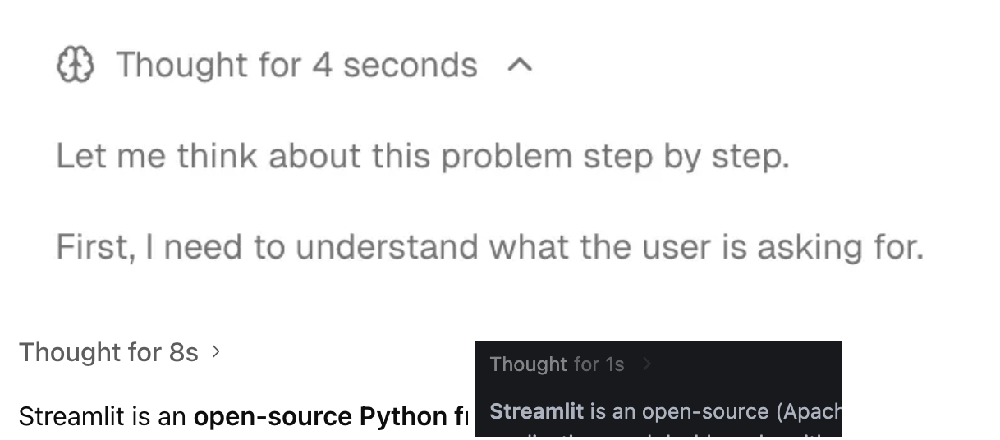

# Compact style for `st.expander` and `st.status`

## Summary

Add support for a compact, borderless style to `st.expander` and `st.status` via a new
`border: bool = True` parameter. The compact style removes the border and background,
rendering the toggle as minimal inline text—ideal for displaying AI reasoning, thoughts,
or collapsible metadata without visual clutter.



## Problem

Users building AI-powered applications need a way to display collapsible "thinking" or
reasoning content in a compact, unobtrusive style. The current `st.expander` and `st.status`
components render with a prominent border and background that works well for section grouping
but feels too heavy for inline reasoning disclosure.

**User request:**

- [#13246](https://github.com/streamlit/streamlit/issues/13246) — Provide a compact style for
  `st.expander` and `st.status` (5+ upvotes)

**Use cases:**

- **AI reasoning disclosure**: Show model "thinking" steps that can be expanded on demand
  (like ChatGPT, Claude, and Gemini's reasoning UI)
- **Streaming thought indicators**: Display "Thought for X seconds" toggles during agent runs
- **Lightweight metadata toggles**: Show optional details without breaking content flow
- **Debug information**: Collapsible technical details that don't need visual prominence

**Current behavior:**

Both `st.expander` and `st.status` render with a full border and background:

```python
with st.expander("Thought for 4 seconds"):
    st.write("Let me think about this problem step by step...")
```

This creates a boxed container that dominates the visual hierarchy. Users want an alternative
that blends into the content flow—just a small toggle with text.

**Industry pattern:**

This compact toggle pattern is common across major AI interfaces:

| Platform        | Implementation                                       |
| --------------- | ---------------------------------------------------- |
| ChatGPT         | "Thought for X seconds" collapsible reasoning        |
| Claude          | Expandable thinking blocks in extended thinking mode |
| Gemini          | Collapsible reasoning steps                          |
| Vercel AI SDK   | `<Reasoning>` component with minimal chrome          |

## Proposal

### API

Add a `border` parameter to both `st.expander` and `st.status`:

```python
st.expander(
    label: str,
    expanded: bool = False,
    *,
    key: Key | None = None,
    icon: str | None = None,
    width: WidthWithoutContent = "stretch",
    on_change: Literal["ignore", "rerun"] = "ignore",
    border: bool = True,  # NEW
)

st.status(
    label: str,
    *,
    expanded: bool = False,
    state: Literal["running", "complete", "error"] = "running",
    width: WidthWithoutContent = "stretch",
    border: bool = True,  # NEW
)
```

### Parameter

| Parameter | Type   | Default | Description                                                                                                                                    |
| --------- | ------ | ------- | ---------------------------------------------------------------------------------------------------------------------------------------------- |
| `border`  | `bool` | `True`  | Whether to display the border and background. When `False`, renders as a compact inline toggle without visual container styling. |

### Behavior

**`border=True` (default):**

- Current behavior: Full border, background color on hover, rounded corners
- The expander/status appears as a distinct visual container
- Best for: Section grouping, prominent collapsible content, form sections

**`border=False`:**

- Compact toggle: Only the label and chevron/icon are visible
- No border, no background (except subtle hover highlight on the toggle itself)
- Toggle text uses secondary color to indicate interactivity
- Best for: Inline reasoning disclosure, lightweight metadata, debug info

### Design

**Default style (`border=True`):**

```
┌─────────────────────────────────────────┐
│ ▸ Thought for 4 seconds                 │
└─────────────────────────────────────────┘
```

**Compact style (`border=False`):**

```
Thought for 4 seconds ›
```

When expanded with `border=False`:

```
Thought for 4 seconds ˅

Let me think about this problem step by step.

First, I need to understand what the user is asking for...
```

**Visual details for compact style:**

- **Trailing chevron**: Chevron appears after the label (not before), similar to navigation
  menu group headers. Points right (`›`) when collapsed, down (`˅`) when expanded.
- **No content indentation**: Expanded content is left-aligned with the page margin,
  not indented under the toggle.
- **No container box**: No border, no background color
- **Caption styling**: Toggle uses caption text styling (`isCaption` in `StreamlitMarkdown`)
  for consistent muted appearance
- **Subtle hover state**: Light background highlight on the toggle row only

### Examples

**AI reasoning disclosure:**

```python
import streamlit as st

# Compact thinking indicator
with st.expander("Thought for 4 seconds", border=False, icon=":material/psychology:"):
    st.write("Let me think about this problem step by step.")
    st.write("First, I need to understand what the user is asking for...")

st.write("Here's my answer: The solution is 42.")
```

**Streaming status with compact style:**

```python
import streamlit as st
import time

with st.status("Analyzing data...", border=False) as status:
    st.write("Loading dataset...")
    time.sleep(1)
    st.write("Running analysis...")
    time.sleep(1)
    status.update(label="Analysis complete", state="complete")

st.write("Results: 95% accuracy")
```

**Debug information toggle:**

```python
import streamlit as st

st.metric("API Latency", "45ms")

with st.expander("Debug details", border=False):
    st.json({"endpoint": "/api/data", "cache_hit": True, "query_time": "12ms"})
```

**Comparison: bordered vs compact:**

```python
import streamlit as st

st.subheader("Bordered (default)")
with st.expander("Click to expand"):
    st.write("This has a full border and background.")

st.subheader("Compact")
with st.expander("Click to expand", border=False):
    st.write("This blends into the content flow.")
```

### Implementation Notes

**Protobuf changes:**

Add `border` field to `Block.Expandable`:

```protobuf
message Expandable {
  string label = 1;
  optional bool expanded = 2;
  string icon = 3;
  optional string id = 4;
  bool border = 5;  // NEW: default true
}
```

**Frontend changes:**

- Add conditional CSS classes based on `border` prop
- When `border=False`:
  - Remove `border`, `border-radius`, `background-color` from container
  - Move chevron to trailing position (after label text)
  - Change chevron direction: right (`›`) collapsed, down (`˅`) expanded
  - Remove content panel indentation (left-align with page)
  - Add subtle hover state to summary row only
  - Apply caption text styling (`isCaption` prop in `StreamlitMarkdown`)

**Backend changes:**

- Add `border` parameter to `expander()` and `status()` in `layouts.py`
- Pass through to protobuf message
- Default to `True` for backward compatibility

### Edge Cases

- **`border=False` with `width=int`**: Compact style still respects fixed pixel width
- **Nested expanders**: Each expander independently respects its own `border` setting
- **Fragments**: `border` setting preserved across fragment reruns
- **Theming**: Compact style uses caption text styling, adapts to light/dark theme automatically
- **Icon placement**: When `icon` is set, icon appears before the label; chevron remains
  trailing (e.g., `🧠 Thought for 4 seconds ›`)

## Alternatives Considered

**Option A: `type="compact"` parameter** (from original issue)

```python
st.expander("Label", type="compact")
```

- Pros: Explicit naming, allows future style variants
- Cons: Introduces new parameter name; inconsistent with `st.container(border=...)`

**Option B: `border=False` parameter** ✅ PREFERRED

```python
st.expander("Label", border=False)
```

- Pros: Consistent with `st.container(border=True)` pattern; simple boolean toggle
- Cons: "border" somewhat underspecifies the visual change (also removes background)

**Option C: `style="compact"` parameter**

```python
st.expander("Label", style="compact")
```

- Pros: Allows multiple style variants
- Cons: New parameter name; "style" is vague; over-engineering for current need

**Decision rationale:**

`border=False` wins because:
1. **API consistency**: `st.container` already uses `border` parameter with same semantics
2. **API principle #11**: Patterns are sacred—reuse existing parameter names
3. **API principle #4**: Start minimal—boolean is sufficient; can extend later if needed
4. **User mental model**: "I want the expander without the box" → `border=False` is intuitive

## Out of Scope (Future Work)

- **Custom border color/style**: Use theming system instead
- **Animation style options**: Current animation works for both styles
- **`border` parameter for other containers**: Could extend to `st.form`, `st.chat_message`
  if there's demand
- **Per-section styling in multipage apps**: Different concern, separate proposal

## Checklist

| Item                       | ✅ or comment                                   |
| -------------------------- | ----------------------------------------------- |
| Works on SiS, Cloud, etc?  | ✅                                              |
| No breaking API changes    | ✅ New parameter with backward-compatible default |
| No new dependencies        | ✅                                              |
| Metrics collected          | ✅ Track `border` parameter usage               |
| Any security/legal impact? | ✅ None                                         |
| Any docs changes needed?   | ✅ Document `border` parameter with examples    |
