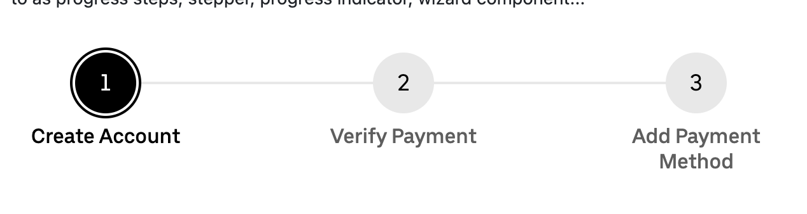

# Stepper widget for multi-step workflows

## Summary

Add a new `st.stepper` widget that displays a sequence of steps with visual progress indication, allowing users to guide others through discrete workflow stages. The stepper shows which step is active, which steps are completed, and which are pending—providing clear visual feedback for multi-step processes like forms, wizards, onboarding flows, and data pipelines.



## Problem

Streamlit lacks a native component for guiding users through multi-step workflows. Users building wizard-style interfaces, multi-page forms, or pipeline progress indicators must resort to workarounds like `st.radio`, `st.selectbox`, or `st.segmented_control`—none of which communicate the sequential, progressive nature of steps.

**Requests:**

- [#10748](https://github.com/streamlit/streamlit/issues/10748) — Stepper element for progress steps (33+ upvotes)

**Use cases:**

- **Multi-step forms**: Registration wizards, checkout flows, survey questionnaires
- **Onboarding flows**: Guiding new users through setup steps
- **Data pipelines**: Showing progress through ETL stages (extract → transform → load)
- **Approval workflows**: Tracking document/request status through stages
- **Tutorial progress**: Interactive tutorials with clear progression

**Current workarounds and limitations:**

| Component              | Limitation for step-based workflows                  |
| ---------------------- | ---------------------------------------------------- |
| `st.radio`             | No visual indication of progress/completion          |
| `st.selectbox`         | No multi-step visualization                          |
| `st.segmented_control` | Designed for mode selection, not sequential progress |
| `st.tabs`              | All content executes; no completion state            |
| `st.progress`          | Shows percentage, not discrete steps                 |

**Reference implementations:**

- [Chakra UI Steps](https://chakra-ui.com/docs/components/steps) — Composition-based API
- [Atlassian Progress Tracker](https://atlassian.design/components/progress-tracker/examples) — Step states (visited, current, disabled)
- [BaseWeb ProgressSteps](https://baseweb.design/components/progress-steps/) — Vertical orientation
- [Tailwind UI Progress Bars](https://tailwindcss.com/plus/ui-blocks/application-ui/navigation/progress-bars) — Visual variants
- [MUI Stepper](https://mui.com/material-ui/react-stepper/) — Navigation modes (linear vs non-linear)

---

## Proposal

### API

```python
st.stepper(
    steps: Sequence[str],
    *,
    default: str | None = None,
    navigation_mode: Literal["free", "linear"] | None = "free",
    orientation: Literal["horizontal", "vertical"] = "horizontal",
    key: Key | None = None,
    on_change: WidgetCallback | None = None,
    args: WidgetArgs | None = None,
    kwargs: WidgetKwargs | None = None,
    format_func: Callable[[str], str] | None = None,
    disabled: bool = False,
) -> str
```

### Parameters

| Parameter         | Type                                      | Default        | Description                                                                                                              |
| ----------------- | ----------------------------------------- | -------------- | ------------------------------------------------------------------------------------------------------------------------ |
| `steps`           | `Sequence[str]`                           | required       | List of step labels. Supports markdown and Material icons (`:material/icon_name:`). **Labels must be unique.**           |
| `default`         | `str \| None`                             | `None`         | Initially active step (by label). If `None`, the first step is active.                                                   |
| `navigation_mode` | `Literal["free", "linear"] \| None`       | `"free"`       | Controls which steps users can click (see Navigation Modes below).                                                       |
| `orientation`     | `Literal["horizontal", "vertical"]`       | `"horizontal"` | Layout direction of the stepper.                                                                                         |
| `key`             | `str \| int \| None`                      | `None`         | Unique key for the widget. Required for session state access.                                                            |
| `on_change`       | `Callable \| None`                        | `None`         | Callback function executed when the active step changes.                                                                 |
| `args`            | `tuple \| list \| None`                   | `None`         | Arguments to pass to the callback.                                                                                       |
| `kwargs`          | `dict \| None`                            | `None`         | Keyword arguments to pass to the callback.                                                                               |
| `format_func`     | `Callable[[str], str] \| None`            | `None`         | Function to format step labels for display. Supports markdown and Material icons. Original values preserved for returns. |
| `disabled`        | `bool`                                    | `False`        | Disables the stepper (no interaction, dimmed appearance).                                                                |

### Return Value

| Condition        | Return Value                               |
| ---------------- | ------------------------------------------ |
| User clicks step | `str` — Label of the clicked step          |
| No interaction   | `str` — Label of the currently active step |

The return value is the step label string, consistent with `st.selectbox` and `st.radio`.

### Navigation Modes

The `navigation_mode` parameter controls which steps users can click:

| Mode       | Clickable Steps                                                              | Use Case                                              |
| ---------- | ---------------------------------------------------------------------------- | ----------------------------------------------------- |
| `"free"`   | **All steps** (completed, active, and pending)                               | Non-linear workflows, review/edit previous steps      |
| `"linear"` | **Completed steps only** (users can go back but not skip ahead)              | Sequential forms requiring validation before progress |
| `None`     | **No steps clickable** (display-only, navigation via session state/buttons)  | Pipeline status displays, read-only progress tracking |

**Visual distinction:** In `"linear"` mode, pending steps appear visually muted/disabled with `cursor: not-allowed` to indicate they cannot be clicked. In `"free"` mode, all steps have a clickable hover state.

### Step Visual States

Each step displays one of four visual states:

| State         | Visual Indicator                            | When Applied                                                                 |
| ------------- | ------------------------------------------- | ---------------------------------------------------------------------------- |
| **Completed** | Checkmark icon, muted styling               | Steps before the active step                                                 |
| **Active**    | Primary color highlight, step number/icon   | Current active step                                                          |
| **Pending**   | Outline/muted styling, step number          | Steps after the active step                                                  |
| **Disabled**  | Dimmed, `cursor: not-allowed`               | Pending steps in `"linear"` mode, or all steps when `disabled=True`/`navigation_mode=None` |

### Icon and Markdown Support

Step labels support the same markdown rendering as other Streamlit labels:

- **Markdown**: Bold (`**text**`), italics (`*text*`), strikethrough, inline code, links
- **Emoji**: Single-character emoji (e.g., `"1️⃣ First"`)
- **Material icons**: Format `:material/icon_name:` at the start of the label

**Icon detection logic:**

1. If the label starts with `:material/icon_name:`, extract and display as step icon
2. If the label starts with an emoji, display as step icon
3. Otherwise, display the step number (1, 2, 3...)

```python
# These all work:
st.stepper(["Ready", "Set", "Go"])  # Shows: 1, 2, 3
st.stepper([":material/edit: Draft", ":material/send: Submit", ":material/check: Done"])  # Shows icons
st.stepper(["1️⃣ First", "2️⃣ Second", "3️⃣ Third"])  # Shows emoji
```

---

## Behavior

### Linear Navigation (Wizard Pattern)

Use `navigation_mode="linear"` for sequential workflows where users must complete steps in order:

```python
steps = ["Account", "Profile", "Payment", "Confirm"]
step = st.stepper(steps, key="wizard", navigation_mode="linear")

if step == "Account":
    email = st.text_input("Email")
    password = st.text_input("Password", type="password")
    if st.button("Continue") and email and password:
        st.session_state.wizard = "Profile"  # Advance programmatically
        st.rerun()

elif step == "Profile":
    # User can click back to "Account" (completed)
    # User cannot click ahead to "Payment" (not yet completed)
    name = st.text_input("Name")
    if st.button("Continue") and name:
        st.session_state.wizard = "Payment"
        st.rerun()
```

### Read-Only Mode (Pipeline Status)

Use `navigation_mode=None` for display-only steppers controlled programmatically:

```python
# Pipeline status display - user cannot click to change
stages = ["Extract", "Transform", "Load", "Complete"]
current_stage = stages[get_pipeline_stage()]  # Returns stage label
st.stepper(
    stages,
    default=current_stage,
    navigation_mode=None,
)
```

### Session State Integration

The stepper integrates with session state like other widgets:

```python
steps = ["Info", "Details", "Review", "Submit"]

def next_step():
    current_idx = steps.index(st.session_state.wizard_step)
    if current_idx < len(steps) - 1:
        st.session_state.wizard_step = steps[current_idx + 1]

def prev_step():
    current_idx = steps.index(st.session_state.wizard_step)
    if current_idx > 0:
        st.session_state.wizard_step = steps[current_idx - 1]

step = st.stepper(steps, key="wizard_step")

col1, col2 = st.columns(2)
with col1:
    st.button("Back", on_click=prev_step, disabled=step == "Info")
with col2:
    st.button("Next", on_click=next_step, disabled=step == "Submit")
```

---

## Examples

### Basic wizard flow

```python
import streamlit as st

steps = ["Account", "Profile", "Preferences", "Complete"]
current_step = st.stepper(steps, key="signup_step")

if current_step == "Account":
    st.text_input("Email")
    st.text_input("Password", type="password")
elif current_step == "Profile":
    st.text_input("Display Name")
    st.text_area("Bio")
elif current_step == "Preferences":
    st.checkbox("Email notifications")
    st.selectbox("Theme", ["Light", "Dark", "Auto"])
else:  # "Complete"
    st.success("Setup complete!")
```

### With icons

```python
import streamlit as st

step = st.stepper([
    ":material/upload: Upload",
    ":material/psychology: Analyze",
    ":material/insights: Results",
])

if step == ":material/upload: Upload":
    st.file_uploader("Choose a file")
elif step == ":material/psychology: Analyze":
    st.write("Analyzing...")
else:
    st.write("Analysis complete!")
```

### Vertical orientation in sidebar

```python
import streamlit as st

with st.sidebar:
    step = st.stepper(
        ["Data", "Model", "Train", "Evaluate"],
        orientation="vertical",
        key="ml_step",
    )
```

---

## Edge Cases

| Scenario                 | Behavior                                                                          |
| ------------------------ | --------------------------------------------------------------------------------- |
| Empty steps list         | Raises `StreamlitAPIException`                                                    |
| Single step              | Valid; displays one step (always active)                                          |
| `default` not in steps   | Raises `StreamlitAPIException`                                                    |
| Duplicate step labels    | Raises `StreamlitAPIException` (labels must be unique for unambiguous returns)    |
| Long step labels         | Truncated with ellipsis; full text on hover                                       |
| Many steps (>10)         | Horizontal: scrollable container. Vertical: scrollable container                  |

---

## Alternatives Considered

### Alternative A: Container-based API (like `st.tabs`)

```python
step1, step2, step3 = st.stepper(["Ready", "Set", "Go"])

with step1:
    st.write("Step 1 content")

with step2:
    st.write("Step 2 content")
```

**Pros:**

- Familiar pattern from `st.tabs`
- Automatic content scoping per step

**Cons:**

- All step content executes on every rerun (performance concern for expensive operations)
- Doesn't support the common "wizard" pattern where only active step content renders
- More complex to implement completion state per step

**Why not selected:** The selection-based API is simpler, more flexible, and avoids the "all content executes" problem. Users who want tab-like behavior can use `st.tabs` instead.

### Alternative B: Index-based return value

```python
step_index = st.stepper(["Ready", "Set", "Go"])  # Returns 0, 1, or 2
if step_index == 0:
    ...
```

**Pros:**

- Allows duplicate labels
- Natural for `if step >= 2:` progress checks

**Cons:**

- Less readable conditionals (`if step == 0:` vs `if step == "Account":`)
- Inconsistent with `st.selectbox` and `st.radio` patterns
- Reordering steps breaks conditionals

**Why not selected:** Label-based returns are more readable and consistent with other Streamlit selection widgets.

---

## Out of Scope (Future Work)

- **Custom completion tracking**: A `completed` parameter to manually specify which steps appear as completed (e.g., `completed=[0, 2]` for non-linear workflows where steps are completed out of order). For v1, all steps before the active step are automatically shown as completed.
- **Step descriptions/subtitles**: Rich metadata per step (`{"label": "Account", "description": "Create your account"}`)—can add via `descriptions` parameter if user demand warrants
- **Error states**: Marking steps as having validation errors (`errors=[1]`)—can add `errors` parameter later
- **Animated transitions**: Smooth CSS transitions when steps change
- **Optional steps**: Marking certain steps as skippable

---

## Implementation Notes

### Build from Scratch (No BaseWeb ProgressSteps)

The stepper should be implemented as a **custom React component** rather than using BaseWeb's `ProgressSteps` component:

1. **Design consistency**: Custom implementation integrates with Streamlit's design system and theme variables
2. **Full control**: Control over visual states, transitions, and responsive behavior
3. **Both orientations**: Horizontal and vertical layouts work seamlessly
4. **Theming**: Proper support for light/dark themes and custom theme variables
5. **Bundle size**: No additional BaseWeb dependencies

The implementation should follow patterns from `st.segmented_control` and `st.radio`.

### Horizontal and Vertical Layouts

| Orientation    | Best For                                | Layout Behavior                                  |
| -------------- | --------------------------------------- | ------------------------------------------------ |
| `"horizontal"` | Main content area, wide containers      | Steps flow left-to-right with connecting lines   |
| `"vertical"`   | Sidebars, narrow containers, many steps | Steps stack top-to-bottom with connecting lines  |

---

## Checklist

| Item                       | ✅ or comment                                           |
| -------------------------- | ------------------------------------------------------- |
| Works on SiS, Cloud, etc?  | ✅ Yes                                                  |
| No breaking API changes    | ✅ New widget                                           |
| No new dependencies        | ✅ Custom component using existing React/Emotion stack  |
| Metrics collected          | ✅ Yes                                                  |
| Any security/legal impact? | ✅ None                                                 |
| Any docs changes needed?   | ✅ Document new widget with examples                    |

---

## References

- **GitHub Issue:** [#10748](https://github.com/streamlit/streamlit/issues/10748)
- **Chakra UI Steps:** [Documentation](https://chakra-ui.com/docs/components/steps)
- **Atlassian Progress Tracker:** [Documentation](https://atlassian.design/components/progress-tracker/examples)
- **BaseWeb ProgressSteps:** [Documentation](https://baseweb.design/components/progress-steps/)
- **MUI Stepper:** [Documentation](https://mui.com/material-ui/react-stepper/)
