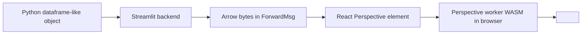
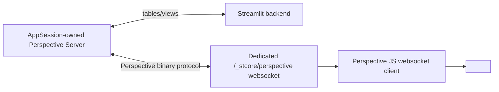

# `st.perspective` technical design

## Summary

This spec proposes a phased integration for Perspective in Streamlit. Phase 1 adds
`st.perspective` as a first-class element powered by Streamlit's existing
protobuf + Arrow transport and Perspective's browser-side WebAssembly runtime.
Phase 2, if needed, adds a dedicated Perspective WebSocket route for replicated
and server-only binding modes.

The key technical conclusion from the investigation is that **Perspective does not
require a second server channel for the initial product**. The extra WebSocket
handler is only necessary if Streamlit wants to support Perspective's server-backed
architectures, distributed editing, or virtual servers. For v1, Streamlit can
avoid `perspective-python` entirely.

This matches how Perspective itself separates transport concerns. Its Jupyter
widget exposes an explicit `binding_mode` (`"server"` or `"client-server"`),
rather than treating all deployments as the same architecture. Streamlit should
make the same distinction and not pay for a server transport before it needs one.

## Problem

Perspective spans both UI and transport:

- Its viewer is a browser custom element with JS, CSS, plugin bundles, and WASM.
- Its richer deployment modes use a separate binary protocol over WebSocket.
- Its saved viewer state is browser-native and event-driven, while Streamlit is
  rerun-driven.

Streamlit has three constraints that matter here:

1. **The main Streamlit WebSocket is protobuf-only**

   `/_stcore/stream` currently accepts only Streamlit `BackMsg` / `ForwardMsg`
   frames. It is not a general-purpose multiplexed binary channel.

2. **Frontend state usually resets on remount unless explicitly preserved**

   Perspective's main value comes from preserving filters, pivots, plugin choice,
   and column layout while the app reruns.

3. **Asset packaging matters**

   Perspective's recommended bundled integration requires JS modules plus explicit
   bootstrapping of WASM assets. The frontend build must handle that cleanly.

## Proposal

### Recommendation

Ship `st.perspective` in two phases:

1. **Phase 1: Client-only Perspective** ✅ PREFERRED
2. **Phase 2: Dedicated server-backed Perspective transport** follow-up only if
   customer demand justifies the complexity

This keeps the first release aligned with Streamlit's normal element model and
avoids committing to a second long-lived protocol before the product proves value.

### Phase 1 Architecture



This architecture preserves Perspective's interactive UI model, but not all of its
server-assisted scaling characteristics. Because Streamlit still ships full
snapshots to the browser in Phase 1, this design should not promise true push
streaming, remote-query semantics, or datasets that exceed practical browser memory.

#### Backend

Add a new proto-backed element:

- `proto/streamlit/proto/Perspective.proto`
- register it in `proto/streamlit/proto/Element.proto`
- backend command in `lib/streamlit/elements/perspective.py`
- export from `lib/streamlit/__init__.py`

Suggested proto fields:

```proto
message Perspective {
  streamlit.ArrowData data = 1;
  optional string default_config_json = 2;
  optional string theme = 3;
  optional string id = 4;
  optional string schema_digest = 5;
}
```

Backend serialization path:

- Accept anything supported by `st.dataframe`.
- Use existing Streamlit helpers such as `convert_anything_to_arrow_bytes`.
- Do **not** depend on `perspective-python` for v1.

This is an important simplification: Perspective's JS engine already accepts Arrow,
and Streamlit already knows how to produce Arrow. The Python Perspective runtime is
only required for server-backed Perspective modes.

This is also where Streamlit intentionally diverges from Perspective's Jupyter
widget, whose default `binding_mode="server"` is optimized for notebook kernel
transport rather than rerun-driven apps.

The Python API docs do reveal a reasonable future interop path, but not one worth
pulling into v1. `perspective.Table` and `perspective.AsyncTable` are first-class
Python objects with server/session semantics, explicit cleanup requirements, and
incremental update methods. Streamlit should not take on that lifecycle merely to
support an extra input type in the initial snapshot-based element.

#### Element identity

Identity must preserve user state across row updates while still resetting on schema
changes when necessary.

Recommended ID policy:

- If `key` is provided:
  - compute a `schema_digest` from the Arrow schema only
  - use `compute_and_register_element_id(..., key_as_main_identity={"schema_digest", "theme"})`
  - this preserves user state across data changes that keep the same schema
- If `key` is omitted:
  - include data/config digests in identity so two identical-looking, unkeyed
    Perspective elements in the same script do not collide

Rationale:

- Users who care about persistent interactive state can supply `key`, which is
  already idiomatic in Streamlit.
- Schema changes should reset the viewer rather than attempting to reapply an
  invalid Perspective config token.

#### Frontend

Add a dedicated React wrapper, for example:

- `frontend/lib/src/components/elements/Perspective/Perspective.tsx`
- register in `frontend/lib/src/components/core/Block/ElementNodeRenderer.tsx`

The component should:

1. Initialize Perspective assets once per page load.
2. Create a browser-local Perspective worker via `perspective.worker()`.
3. Create or replace a browser-local Perspective table from Arrow bytes.
4. Mount a `<perspective-viewer>` element and load that table.
5. Restore persisted viewer state if one exists; otherwise apply `default_config`.

#### Frontend dependencies

Bundle Perspective frontend assets directly into the Streamlit app:

- Perspective client package
- Perspective viewer package
- Datagrid plugin
- D3FC chart plugins
- Perspective CSS themes support
- required WASM assets

The official Perspective docs call out two important packaging details:

- the browser build needs the WASM files in addition to JS
- Vite integration uses `?url` imports and bootstrapping via `init_server()` /
  `init_client()`

Example shape from the Perspective docs:

```ts
import SERVER_WASM from "...perspective-server.wasm?url"
import CLIENT_WASM from "...perspective-viewer.wasm?url"

await Promise.all([
  perspective.init_server(fetch(SERVER_WASM)),
  perspectiveViewer.init_client(fetch(CLIENT_WASM)),
])
```

Two concrete implementation risks must be called out:

1. Streamlit's current Vite config does not explicitly set `build.target = "esnext"`,
   while Perspective's docs recommend that for Vite builds.
2. Streamlit must verify whether the recommended Perspective ESM build works as-is
   with the repo's browser support target, or whether a small isolated build path is
   needed for this element.

This needs validation in implementation spike work before merging.

#### Viewer state persistence

Perspective's viewer state should be treated like Plotly figure state or passive
container state: frontend-owned unless and until Streamlit adds explicit Python
callbacks.

Use `WidgetStateManager.elementStates` for v1:

- key: `element.id`
- value: saved Perspective token from `viewer.save()`

Frontend behavior:

1. Listen for `perspective-config-update`.
2. Debounce and call `await viewer.save()`.
3. Store the token in `widgetMgr.setElementState(element.id, "viewerState", token)`.
4. On remount with the same `element.id`, restore the stored token instead of only
   using `default_config`.

This matches existing Streamlit patterns:

- `PlotlyChart` uses frontend element state for remount recovery.
- layout-container persistence work uses `WidgetStateManager.elementStates` for
  non-widget state.

#### Theme integration

Perspective expects CSS theme definitions, not Streamlit theme objects directly.
For `theme="streamlit"`:

- import Perspective's base `themes.css` so icons and required variables exist
- layer a small Streamlit-specific Perspective theme override on top
- inject the override once
- call `viewer.resetThemes(["Streamlit"])`
- restore `{ theme: "Streamlit" }`

This should update when the Streamlit app theme changes.

Bundle only a small supported theme surface for v1:

- one Streamlit-generated theme
- optional pass-through to bundled Perspective themes if explicitly requested

#### Data update strategy

Use full snapshot replacement in v1:

- same schema: replace current table contents from new Arrow payload
- different schema: destroy and recreate table + viewer instance, then apply
  `default_config`

This is intentionally simpler than Perspective's replicated update stream.
It keeps the backend stateless and consistent with Streamlit's rerun model.

One important implication: Phase 1 does not gain server-side virtual scrolling just
by using Perspective. Once the full Arrow payload is in the browser, the user gets
excellent local interactivity, but not server-mediated access to arbitrarily large
or continuously updating tables.

### Future `perspective-python` Interop

The official Python API suggests two plausible interop directions for later phases:

1. **Server-backed mode accepts hosted Perspective tables directly**

   In a future server-backed phase, it is reasonable for `st.perspective` to accept
   `perspective.Table` or `perspective.AsyncTable` inputs, or to register a named
   hosted table behind the scenes. Perspective's Python server model is built around
   named tables that JavaScript clients can open over a websocket, and `.update()`
   / `.replace()` map naturally onto a streaming follow-up API.

2. **Client-only mode snapshots a Perspective table to Arrow**

   A `perspective.Table` can also be snapshotted for client-only rendering by
   creating a `View` and calling `to_arrow()`. This is technically feasible, but it
   should still be deferred. It adds an optional dependency, temporary `View`
   lifecycle management, and niche API complexity for comparatively little v1 value.

Recommended spec stance:

- keep `perspective-python` out of the initial dependency graph
- keep `data=` scoped to standard Streamlit dataframe-like inputs in v1
- reserve `perspective.Table` / `perspective.AsyncTable` support for a later phase
  where Streamlit deliberately adopts the Python server model

### Future Selection / Callback API

The alternative spec's `on_select` direction is useful, but it is not the right v1
scope. If Streamlit later surfaces Perspective interactions back to Python, it
should follow existing chart-widget conventions rather than inventing a
Perspective-specific event model.

Recommended direction for a future phase:

- use `on_select="ignore" | "rerun" | callback` semantics consistent with
  `st.plotly_chart` and `st.pydeck_chart`
- register widget state only when selections are activated
- define a narrow, Streamlit-owned selection payload rather than exposing raw
  Perspective DOM event detail objects directly

Click events and config-change callbacks can be evaluated separately later.

### Phase 2: Dedicated Perspective WebSocket

Only add this if Streamlit decides to support one or more of:

- server-only Perspective
- client/server replicated Perspective
- distributed editing
- Perspective virtual servers

#### Why a dedicated route is preferred

Do **not** tunnel raw Perspective frames over `/_stcore/stream`.

Reasons:

- Streamlit's main WebSocket is explicitly protobuf-based.
- The frontend `WebsocketConnection` and backend Starlette handler both assume that
  contract.
- Perspective's JS `websocket()` client expects a plain Perspective server session,
  not Streamlit-wrapped frames.
- Multiplexing would require writing custom adapters on both sides and would tightly
  couple Streamlit's session protocol to Perspective's wire protocol.

If Streamlit supports server-backed Perspective, a second route is cleaner:



#### Route shape

Suggested reserved path:

- `/_stcore/perspective`

Possible ownership model:

- one Perspective `Server` per Streamlit `AppSession`
- each `st.perspective` element registers a hosted table name scoped by `element.id`
- frontend opens tables by name over a shared Perspective websocket client
- prefer not to encode `session_id` or `table_id` into the URL path; the session is
  already established by the Streamlit websocket handshake, and table names can be
  opened after connection without exposing more session internals in the route shape

The Python API docs also suggest one more design constraint here: hosted table names
matter. If Streamlit adopts the server-backed model, it should lean into Perspective's
existing "open named table over websocket" pattern instead of inventing a parallel
resource lookup protocol.

#### Security and lifecycle requirements

A dedicated route must match Streamlit's existing protections:

- origin validation
- XSRF validation
- cookie parsing / trusted headers
- session-scoped lifecycle cleanup

The Perspective example handlers accept websockets immediately and do not implement
those checks themselves, so Streamlit cannot mount them naively. Streamlit needs a
wrapper that performs its normal handshake validation first and then hands bytes to a
Perspective session.

If Phase 2 is built, the Perspective server/manager should be owned and cleaned up
with `AppSession` lifetime, not left as a loosely managed runtime-global cache.

Streamlit should also verify whether its server-backed implementation should use
Perspective's async Python client/server surfaces for Starlette integration, rather
than assuming the simplest synchronous local-client pattern will scale cleanly to
multiple websocket connections.

#### Repo touchpoints for a new route

If Phase 2 is implemented, the route must be kept in sync across:

- `lib/streamlit/web/server/starlette/starlette_routes.py`
- `lib/streamlit/web/server/starlette/starlette_app.py`
- possibly a new `starlette_perspective_websocket.py`
- `frontend/app/vite.config.ts` dev proxy
- any frontend endpoint helpers that construct backend URLs

This is already a known maintenance pattern in the repo for `_stcore`, component,
and bidi-component routes.

### Testing Plan

#### Python tests

- backend command accepts dataframe-like inputs and serializes Arrow
- element ID behavior with and without `key`
- schema-digest reset behavior

#### Frontend unit tests

- bootstraps Perspective assets exactly once
- restores persisted viewer state across remount
- applies `default_config` only on initial load / reset
- recreates viewer on schema change
- updates theme correctly

WASM bootstrapping should be mocked in Vitest; the test focus is lifecycle and state,
not Perspective internals.

#### E2E

- basic datagrid render
- plugin switch and filter survive unrelated rerun when `key` is set
- same-schema data refresh preserves user config
- schema change resets to default config

## Alternatives Considered

### Alternative 1: Build the feature directly on top of internal bidirectional components

Expose `st.perspective` publicly, but implement it internally as a bundled
`BidiComponent`.

**Pros**

- Reuses existing frontend state + callback plumbing.
- Natural fit for a web-component-based library.
- `BidiComponent` already uses `key_as_main_identity=True` semantics.

**Cons**

- Adds another layer of indirection for a built-in feature.
- Less obviously native than a dedicated element proto.
- Harder to extend with element-specific behaviors such as fullscreen or future
  richer layout integration.

**Decision**

Rejected for the preferred path. It is a viable fallback spike if the dedicated
element proves unexpectedly expensive.

### Alternative 2: Add server-backed Perspective from day one

Implement a Starlette websocket route, session manager integration, and a Python
dependency on `perspective-python` immediately.

**Pros**

- Unlocks the full Perspective architecture on day one.
- Better path for extremely large datasets and distributed editing.

**Cons**

- Much larger review surface: new long-lived server sessions, new dependency, new
  binary protocol, new security surface.
- Harder to validate in Cloud/SiS environments.
- Not required for the majority of first-use cases.

**Decision**

Rejected for v1. Keep as explicit follow-up work.

### Alternative 3: Ship only a documented custom component

Publish an example or separate package instead of a built-in Streamlit command.

**Pros**

- Lowest implementation cost.

**Cons**

- Loses discoverability and first-class support.
- Pushes packaging, theming, and transport complexity onto users.
- Misses the point of integrating Perspective into the core product.

**Decision**

Rejected.
