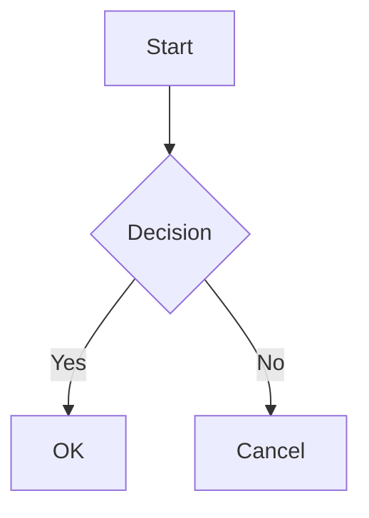
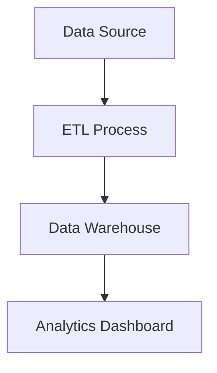

# Mermaid Chart Support

## Summary

Add native support for rendering [Mermaid](https://mermaid.js.org/) diagrams in Streamlit apps
through markdown code blocks and a dedicated `st.mermaid_chart` command. This enables users to
create flowcharts, sequence diagrams, class diagrams, and other visualizations using Mermaid's
text-based syntax.

## Problem

### User Requests

- [GitHub Issue #10721](https://github.com/streamlit/streamlit/issues/10721) — Mermaid diagram
  support

### Pain Points

Some Streamlit users need to visualize:

- System architectures and data flows
- Process workflows and decision trees
- Entity relationships
- Project timelines and Gantt charts
- State machines and sequence diagrams

Currently, users must either:

1. Use external tools (Lucidchart, Draw.io) to generate images and embed them with `st.image`
2. Use `st.graphviz_chart`, which has a steeper learning curve and limited diagram types
3. Use custom components or iframes to embed Mermaid

Mermaid has become the de-facto standard for text-based diagramming in documentation
(GitHub, GitLab, Notion, Obsidian) and AI chat applications (ChatGPT, Claude, Gemini),
making it a natural fit for Streamlit's user base.

### Use Cases

1. **Data Pipeline Documentation** — Visualizing ETL workflows and data transformations
2. **API Documentation** — Sequence diagrams showing request/response flows
3. **Decision Trees** — Visualizing ML model decisions or business logic
4. **Project Planning** — Gantt charts for sprint planning or project timelines
5. **Architecture Diagrams** — System component relationships and dependencies
6. **State Machines** — Visualizing app states and transitions

## Proposal

### API

#### Markdown Code Blocks (Primary Interface)

Users can embed Mermaid diagrams directly in markdown using fenced code blocks:

````python
import streamlit as st

st.markdown("""

""")
````

This follows the same pattern used by GitHub, GitLab, and other platforms, making it familiar
and portable.

#### Dedicated Command (Discovery Helper)

For discoverability and explicit usage, provide `st.mermaid_chart`:

```python
st.mermaid_chart(
    body: str,    # Mermaid diagram definition
) -> DeltaGenerator
```

**Parameters:**

| Parameter | Type | Description |
|-----------|------|-------------|
| `body` | `str` | The Mermaid diagram definition using Mermaid syntax |

**Implementation Note:** `st.mermaid_chart` is a thin wrapper that generates a markdown code
fence and delegates to `st.markdown`. This ensures consistent behavior between both approaches.

````python
# These are equivalent:
st.mermaid_chart("graph TD; A-->B")

st.markdown("""

""")
````

### Behavior

#### Supported Diagram Types

All Mermaid diagram types are supported:

| Type | Example Syntax |
|------|----------------|
| Flowchart | `graph TD; A-->B` |
| Sequence Diagram | `sequenceDiagram; Alice->>Bob: Hello` |
| Class Diagram | `classDiagram; Animal <\|-- Duck` |
| State Diagram | `stateDiagram-v2; [*] --> State1` |
| Entity Relationship | `erDiagram; CUSTOMER \|\|--o{ ORDER : places` |
| Gantt Chart | `gantt; Task: done, 2024-01-01, 7d` |
| Pie Chart | `pie; "Dogs": 386; "Cats": 325` |
| User Journey | `journey; section Go to work; Make tea: 5: Me` |
| Git Graph | `gitGraph; commit; branch develop; commit` |
| Mindmap | `mindmap; root((mindmap)); Origins` |
| Timeline | `timeline; 2020: Event 1; 2021: Event 2` |
| Quadrant Chart | `quadrantChart; Campaign A: [0.3, 0.6]` |
| Sankey Diagram | `sankey-beta; Source,Target,Value` |

#### Theming

Diagrams automatically match the Streamlit theme:

- **Colors**: Uses Streamlit's color palette (blue, green, orange, red, violet, yellow, gray)
- **Typography**: Matches Streamlit's font family and sizes
- **Dark/Light Mode**: Automatically adapts when users toggle themes

The theming uses Mermaid's "base" theme with Streamlit-specific color overrides:

- Primary elements use Streamlit blue
- Secondary elements use Streamlit green
- Tertiary elements use Streamlit orange
- Error states use Streamlit red
- Notes use Streamlit yellow
- Gantt chart completion uses Streamlit green
- Git graph branches use the full Streamlit color palette

#### Loading State

While the diagram is rendering:

- Shows a skeleton loader matching the element skeleton style
- Diagram area reserves space to prevent layout shift
- ARIA labels indicate loading state for screen readers

#### Error Handling

Invalid Mermaid syntax displays:

- A styled error message with the Mermaid parser error
- Error styled with Streamlit's error colors (red background)
- The original source is not exposed in the error

### Toolbar Actions

The rendered diagram includes a hover toolbar (consistent with other Streamlit charts):

| Action | Icon | Description |
|--------|------|-------------|
| Fullscreen | Expand icon | Opens diagram in fullscreen mode for complex diagrams |
| Download PNG | Download icon | Exports the diagram as a 2x-scaled PNG image |
| Copy Source | Copy icon | Copies the Mermaid source code to clipboard |

The toolbar appears on hover over the diagram container and follows Streamlit's toolbar styling.

### Examples

#### Basic Flowchart

```python
import streamlit as st

st.mermaid_chart('''
graph LR
    A[Start] --> B{Decision}
    B -->|Yes| C[OK]
    B -->|No| D[Cancel]
''')
```

#### Sequence Diagram

```python
import streamlit as st

st.mermaid_chart('''
sequenceDiagram
    participant User
    participant App
    participant Server
    User->>App: Click button
    App->>Server: API request
    Server-->>App: Response
    App-->>User: Update UI
''')
```

#### Gantt Chart

```python
import streamlit as st

st.mermaid_chart('''
gantt
    title Project Schedule
    dateFormat YYYY-MM-DD
    section Planning
    Research       :a1, 2024-01-01, 7d
    Design         :a2, after a1, 5d
    section Development
    Implementation :b1, after a2, 14d
    Testing        :b2, after b1, 7d
''')
```

#### Within Markdown Context

````python
import streamlit as st

st.markdown("""
## System Architecture

The following diagram shows our data pipeline:



The pipeline runs daily at midnight.
""")
````

### Security

Diagrams are rendered with security in mind:

- **Mermaid Security Level**: Uses `securityLevel: "strict"` to prevent XSS
- **SVG Sandboxing**: Rendered SVGs are loaded via blob URLs in `` tags, providing
  browser-enforced sandboxing (no script execution possible)
- **No HTML Labels**: Uses `htmlLabels: false` to generate native SVG text elements,
  avoiding foreignObject which could contain HTML

### Accessibility

- Diagrams include semantic alt text based on diagram type (e.g., "Mermaid flowchart")
- Loading state uses `aria-busy="true"` and descriptive `aria-label`
- Error messages use `role="alert"` for screen reader announcements
- Fullscreen button has proper labeling

## Tradeoffs

- **Wheel size increase**: Adding mermaid.js increases the overall Streamlit wheel size by ~7%
  due to bundled frontend assets. This is a one-time cost that affects all users, regardless of
  whether they use Mermaid diagrams.

## Out of Scope (Future Work)

The following are explicitly not included in this initial release:

- **`key` parameter** — Not needed for display-only elements without state
- **`width`/`height` parameters** — Diagrams auto-size; users can wrap in `st.container`
- **Click interactions** — Mermaid supports click callbacks, but this requires additional
  API design for callback handling
- **Custom themes** — Users cannot override the automatic Streamlit theming
- **Server-side rendering** — Diagrams are rendered client-side only

## Checklist

| Item                         | ✅ or comment |
|------------------------------|---------------|
| Works on SiS, Cloud, etc?    | ✅ Client-side rendering, no server dependencies |
| No breaking API changes      | ✅ New additive feature only |
| No new dependencies          | ✅ Backend; mermaid.js added to frontend (lazy-loaded) |
| Metrics collected            | ✅ `mermaid_chart` command tracked via `gather_metrics` |
| Any security/legal impact?   | ✅ No — mermaid.js is MIT licensed; strict security mode used |
| Any docs changes needed?     | ✅ API reference docs and tutorial page |
