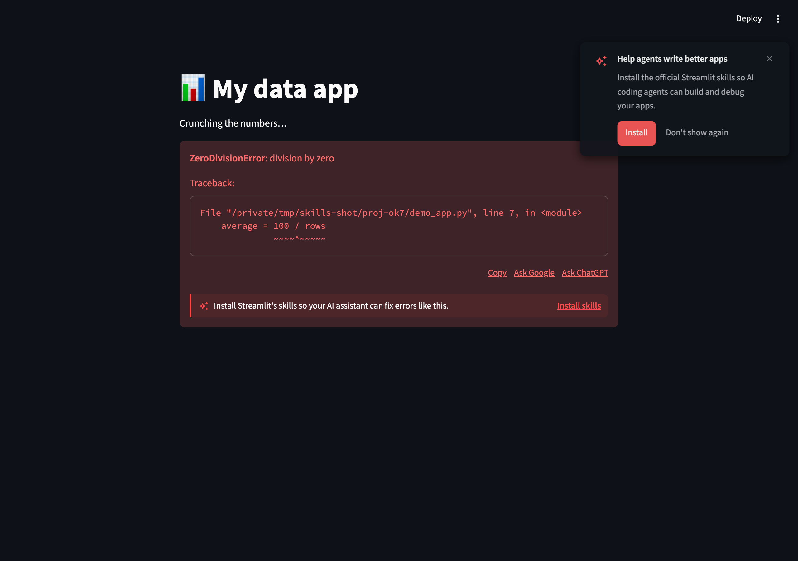
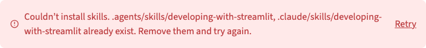

# In-error "Install skills" nudge

## Summary

Adds a one-click **"Install skills"** call-to-action **inside the error box**
(`ExceptionElement`) during local development. When a developer hits an uncaught
error, has an AI coding agent, but hasn't installed Streamlit's agent skills, a
small "tip" band at the foot of the error offers a one-click install right at the
moment of pain.

This is the second of two adoption surfaces for Streamlit's agent skills. The first
is the proactive startup **toast** ([PR 15473](https://github.com/streamlit/streamlit/pull/15473)),
already approved. Both reuse the same install backend and the
[`streamlit skills` CLI](../2026-05-11-streamlit-skills-cli/product-spec.md) under
the hood. This spec covers only the in-error callout — a "somewhat significant
user-facing change" that Lukas and Johannes asked to write up so it has a discussion
space outside the code review ([PR 15693](https://github.com/streamlit/streamlit/pull/15693)).

## Problem

Streamlit bundles agent skills that make AI coding assistants dramatically better at
building and debugging Streamlit apps, but most developers never install them — they
don't know the skills exist, and there's no prompt at a moment when they'd care.

The startup toast (#15473) is **proactive**: it appears on app load, before the
developer has hit any friction. That's a low-intent moment — easy to dismiss and
forget.

An **uncaught traceback is the highest-intent moment** a developer experiences: it's
exactly when they most wish their coding agent were smarter about Streamlit. The error
box already nudges users toward external help ("Ask Google", "Ask ChatGPT"). Offering
"Install skills" in the same place — *"so your AI assistant can fix errors like this"* —
converts that frustration into a one-click setup step, without adding a separate
component to maintain.

## Proposal

### Design

A tasteful "tip" band at the foot of the error box: a brand-accent left stripe + faint
accent wash, a sparkle icon, one line of copy, and a lightweight text-style action. It
reads as a peer of the error's existing **Copy / Ask Google / Ask ChatGPT** links — not
a panel that overwhelms them.

**Idle** — shown at the foot of the error box. (The toast in the top-right is the
separate startup nudge from #15473, included here to show how the two surfaces relate;
in practice they are mutually exclusive — see *Behavior*.)

**Error** — install failed; shows the server's reason and a **Retry** action.

**Success** — brief confirmation, then the callout removes itself.

Copy:

| State   | Copy                                                                      | Action          |
|---------|---------------------------------------------------------------------------|-----------------|
| Idle    | Install Streamlit's skills so your AI assistant can fix errors like this. | **Install skills** |
| Success | ✓ Skills installed — your AI assistant is ready to help.                  | _(auto-dismiss)_ |
| Error   | Couldn't install skills. _\<server reason\>_ (e.g. "… already exist. Remove them and try again.") | **Retry** |

> A short design pass on the surfaces (toast + callout) with Jessi is a planned
> follow-up — copy, spacing, and icon treatment may change.

### Behavior

**When it shows** — all of the following must hold:

- **Local development only.** Reuses the exact predicate that already gates the
  "Ask ChatGPT" links (`shouldShowLinks`): a direct-loopback (localhost) connection,
  not embedded, not on Community Cloud / SiS.
- It's an **error, not a warning** (`!element.isWarning`).
- An **AI coding agent is detected** and skills are **not already installed** this
  session.
- The **startup toast is not currently showing** (mutual exclusion).
- The user has **not permanently dismissed** the nudge ("Don't show again" on the
  toast).

**Mutual exclusion with the toast.** The callout never appears alongside the toast.
It *does* still appear if the toast was snoozed (the 24h snooze is intentionally **not**
checked) — an error is a higher-intent moment than a proactively-snoozed startup nudge.
A permanent "Don't show again" is honored immediately for both surfaces.

**One callout at a time.** When several errors are on screen, a single sticky claim
slot dedupes to exactly one callout. The claim isn't yanked mid-confirmation by the
post-install state change, so the success/error message stays attached to the callout
the user clicked.

**Install flow.** Clicking **Install skills** runs the same install action as the
toast (`InstallSkillsHandler` / `requestInstallSkills`). On success, the callout shows
"✓ Skills installed" briefly, then removes itself. On failure, it shows the server's
reason plus a **Retry**.

There is **no per-callout dismiss control** — the callout is already gated tightly and
removes itself on success; the permanent opt-out lives on the toast.

### Implementation notes (for context)

- **No proto change.** No `Exception.proto` change is required.
- **Reuses the toast's install backend verbatim.** The only new wiring is a
  `SkillsInstallContext` (lib core) that feeds an app-level install callback down to the
  lib-level `ExceptionElement` — mirroring how `LibConfigContext` feeds `showErrorLinks`.
  No new lib→app dependency is introduced.
- **Telemetry.** Adds a `surface` dimension to the existing install `MetricsEvent`
  (`toast` vs `errorCallout`) so the shown → installed funnel is attributable per
  surface.

## Out of scope / Follow-ups

- **`SCRIPT_COMPILE_ERROR` modal (syntax errors).** The full-screen compile-error modal
  is a separate surface; adding the callout there is a documented follow-up.
- **Design pass with Jessi** on copy, spacing, and icon treatment across both surfaces.
- Non-localhost / hosted environments — intentionally excluded; the skills target a
  local coding agent.

## Checklist

| Item                       | ✅ or comment                                                                                                   |
|----------------------------|-----------------------------------------------------------------------------------------------------------------|
| Works on SiS, Cloud, etc?  | Intentionally **localhost-dev only** — suppressed on Cloud / SiS / embed (same gate as the "Ask ChatGPT" links). |
| No breaking API changes    | Yes — no proto change, no public Python API; purely additive frontend surface reusing the existing install handler. |
| No new dependencies        | Yes.                                                                                                            |
| Metrics collected          | Yes — new `surface` dimension on the install `MetricsEvent` (`toast` vs `errorCallout`).                         |
| Any security/legal impact? | Low — install is a local-filesystem action, gated on a direct-loopback connection, reusing the toast PR's `InstallSkillsHandler`. |
| Any docs changes needed?   | Minimal — behavior is self-explanatory; the `streamlit skills` CLI ([separate spec](../2026-05-11-streamlit-skills-cli/product-spec.md)) is the documented entry point. |
