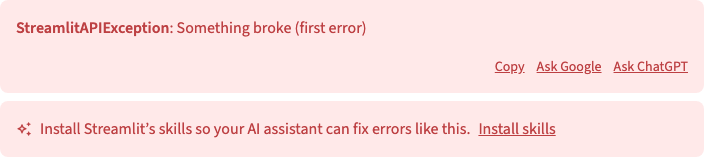

# In-error "Install skills" nudge

## Summary

Adds a one-click **"Install skills"** call-to-action **attached to the error box**
(`ExceptionElement`) during local development. When a developer hits an error that
**Streamlit itself raised** (e.g. a `StreamlitAPIException`), has an AI coding agent,
but hasn't installed Streamlit's agent skills, a small callout directly below the
error offers a one-click install right at the moment of pain. The callout is
deliberately **not** shown for arbitrary user/runtime errors (a `ZeroDivisionError`
in the developer's own logic won't be fixed by installing Streamlit skills) — see
*Problem → Which errors?*.

This is the second of two adoption surfaces for Streamlit's agent skills. The first
is the proactive startup **toast** ([PR 15473](https://github.com/streamlit/streamlit/pull/15473)),
already approved. Both reuse the same install backend and the
[`streamlit skills` CLI](../2026-05-11-streamlit-skills-cli/product-spec.md) under
the hood. This spec covers only the in-error callout — a "somewhat significant
user-facing change" that Lukas and Johannes asked to write up so it has a discussion
space outside the code review ([PR 15693](https://github.com/streamlit/streamlit/pull/15693)).

## Problem

Streamlit bundles agent skills that make AI coding assistants dramatically better at
building and debugging Streamlit apps, but most developers never install them — they
don't know the skills exist, and there's no prompt at a moment when they'd care.

The startup toast (#15473) is **proactive**: it appears on app load, before the
developer has hit any friction. That's a low-intent moment — easy to dismiss and
forget.

An **uncaught traceback is the highest-intent moment** a developer experiences: it's
exactly when they most wish their coding agent were smarter about Streamlit. The error
box already nudges users toward external help ("Ask Google", "Ask ChatGPT"). Offering
"Install skills" in the same place — *"so your AI assistant can fix errors like this"* —
converts that frustration into a one-click setup step, without adding a separate
component to maintain.

### Which errors?

Not every traceback is one our skills can help with. A `ZeroDivisionError` or a
`KeyError` in the developer's own logic won't be fixed by teaching their agent about
Streamlit — nudging "install skills" there is noise. So the callout is scoped to
**errors Streamlit itself raises**: `StreamlitAPIException` and the other exception
types Streamlit defines (all subclasses of the base `streamlit.errors.Error`). These
signal misuse of the Streamlit API — precisely the class of mistake the skills exist to
prevent, so *"fix errors like this"* is an honest promise here.

We lose no reach by narrowing this surface: the proactive startup **toast** (#15473)
still carries the broad "install skills" prompt for everyone, so a developer who hits a
generic Python error has already been offered the skills once. The in-error callout is
the *high-intent* reinforcement, and it only fires when the skills would actually move
the needle.

> **Decision (2026-06-29, per Johannes Rieke, PM):** show the in-error callout **only
> for Streamlit-raised exceptions**, not on every error. This resolves the open
> question of scope from the original draft (which showed it on every uncaught error).

## Proposal

### Design

Its **own box directly below the error box**, sharing that box's tint, corner radius,
and padding: a sparkle icon, one line of copy, and a lightweight underlined text action.
The two boxes are separated by one gap step tighter than Streamlit's normal spacing
between elements, so they read as an attached pair — the callout belongs to *this* error.
The action is a text link, matching the error's own **Copy / Ask Google / Ask ChatGPT**
links, so the CTA reads as a peer rather than a panel that overwhelms them.

**Idle** — the error and its callout. (The startup toast from #15473 is a separate
surface and is mutually exclusive with this one — see *Behavior*.)

**Success** — the box takes the success tint for a brief confirmation, then removes
itself. Switching the whole box (rather than just the text) keeps a confirmation from
reading as green text sitting inside a red error box.

**Error** — install failed; the box keeps the error tint and shows the server's reason
plus a **Retry** action (copy below).

Copy:

| State   | Copy                                                                      | Action          |
|---------|---------------------------------------------------------------------------|-----------------|
| Idle    | Install Streamlit's skills so your AI assistant can fix errors like this. | **Install skills** |
| Success | ✓ Skills installed — your AI assistant is ready to help.                  | _(auto-dismiss)_ |
| Error   | Couldn't install skills. _\<server reason\>_ (e.g. "… already exist. Remove them and try again.") | **Retry** |

> **Design pass with Jessi — done.** Raised by Johannes in review (2026-06-29) as a
> pre-ship gate on the original mock (brand-accent left stripe, faint accent wash,
> off design-system red tones, uncertain alignment). Resolved with design: the accent
> stripe and wash are gone, all colour comes from the shared alert tokens the error box
> already uses, and the callout became its own box below the error rather than a band
> inside it. The images above are renders of the implementation, not mocks.

### Behavior

**When it shows** — all of the following must hold:

- **Local development only.** Reuses the exact predicate that already gates the
  "Ask ChatGPT" links (`shouldShowLinks`): a direct-loopback (localhost) connection,
  not embedded, not on Community Cloud / SiS.
- It's an **error, not a warning** (`!element.isWarning`).
- The error is a **Streamlit-raised exception.** Only exceptions Streamlit itself
  defines qualify (`StreamlitAPIException` and the other subclasses of
  `streamlit.errors.Error`); arbitrary user/runtime errors like `ZeroDivisionError` or
  `KeyError` do **not** trigger the callout. The backend flags this on the exception
  proto (see *Implementation notes*); rationale in *Problem → Which errors?*.
- An **AI coding agent is detected** and skills are **not already installed** this
  session.
- The **startup toast is not currently showing** (mutual exclusion).
- The user has **not permanently dismissed** the nudge ("Don't show again" on the
  toast).

**Mutual exclusion with the toast.** The callout never appears alongside the toast.
It *does* still appear if the toast was snoozed (the 24h snooze is intentionally **not**
checked) — an error is a higher-intent moment than a proactively-snoozed startup nudge.
A permanent "Don't show again" is honored immediately for both surfaces.

**One callout at a time.** When several errors are on screen, a single sticky claim
slot dedupes to exactly one callout. The claim isn't yanked mid-confirmation by the
post-install state change, so the success/error message stays attached to the callout
the user clicked.

**Install flow.** Clicking **Install skills** runs the same install action as the
toast (`InstallSkillsHandler` / `requestInstallSkills`). On success, the callout shows
"✓ Skills installed" briefly, then removes itself. On failure, it shows the server's
reason plus a **Retry**.

There is **no per-callout dismiss control** — the callout is already gated tightly and
removes itself on success; the permanent opt-out lives on the toast.

### Implementation notes (for context)

- **One small, additive `Exception.proto` field.** To scope the callout to
  Streamlit-raised errors, the frontend must know whether an exception is
  Streamlit-defined. The backend already knows (`isinstance(exc, streamlit.errors.Error)`
  during `marshall`), so we surface it as a single new boolean on `Exception.proto`
  (e.g. `is_streamlit_exception`). This is backwards-compatible: proto3 defaults it to
  `false`, and existing external consumers of the (deliberately stable) `Exception`
  proto are unaffected. A frontend allowlist of exception **type-name strings** was
  considered and rejected — it's fragile (it would miss non-`Streamlit`-prefixed types
  like `DuplicateWidgetID`, and the `alternate_name` override can replace `type`
  entirely).
- **Reuses the toast's install backend verbatim.** The only new wiring is a
  `SkillsInstallContext` (lib core) that feeds an app-level install callback down to the
  lib-level `ExceptionElement` — mirroring how `LibConfigContext` feeds `showErrorLinks`.
  No new lib→app dependency is introduced.
- **Telemetry.** Adds a `surface` dimension to the existing install `MetricsEvent`
  (`toast` vs `errorCallout`) so the shown → installed funnel is attributable per
  surface.

## Out of scope / Follow-ups

- **`SCRIPT_COMPILE_ERROR` modal (syntax errors).** The full-screen compile-error modal
  is a separate surface; adding the callout there is a documented follow-up.
- Non-localhost / hosted environments — intentionally excluded; the skills target a
  local coding agent.

## Checklist

| Item                       | ✅ or comment                                                                                                   |
|----------------------------|-----------------------------------------------------------------------------------------------------------------|
| Works on SiS, Cloud, etc?  | Intentionally **localhost-dev only** — suppressed on Cloud / SiS / embed (same gate as the "Ask ChatGPT" links). |
| No breaking API changes    | Yes — one **additive, backwards-compatible** `Exception.proto` field (`is_streamlit_exception`, defaults `false`); no public Python API change. Reuses the existing install handler. |
| No new dependencies        | Yes.                                                                                                            |
| Metrics collected          | Yes — new `surface` dimension on the install `MetricsEvent` (`toast` vs `errorCallout`).                         |
| Any security/legal impact? | Low — install is a local-filesystem action, gated on a direct-loopback connection, reusing the toast PR's `InstallSkillsHandler`. |
| Any docs changes needed?   | Minimal — behavior is self-explanatory; the `streamlit skills` CLI ([separate spec](../2026-05-11-streamlit-skills-cli/product-spec.md)) is the documented entry point. |
