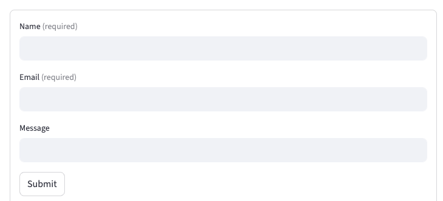
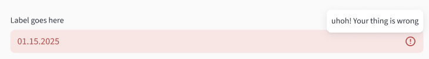

# `required` parameter for input widgets

## Summary

Add a `required: bool = False` parameter to input widgets that can be empty, so a field must
have a value before it is committed or a form is submitted. Empty commits are blocked in the
browser (no rerun), the widget shows the existing validation error state, and form submit is
gated the same way `st.text_input(..., validate=...)` already gates invalid values. This works
inside **and** outside `st.form`.

`required` is emptiness. `validate` is content. They compose: empty values fail `required` and
skip `validate`; non-empty values skip `required` and run `validate`.

## Problem

Streamlit has no built-in way to say "this input must be filled." Developers re-implement
that check after a rerun, which is slow, easy to get wrong, and fights `st.form(clear_on_submit=True)`.

### User requests

- [#7165](https://github.com/streamlit/streamlit/issues/7165) — Form fields required (144 👍).
  Top-tier request. Form submit currently succeeds with empty widgets; `clear_on_submit=True`
  then wipes valid fields even when the developer later rejects the submit.
- [#13497](https://github.com/streamlit/streamlit/issues/13497) — `required` on `st.text_input`.
  Asks for a required marker, no extra rerun, and `aria-required` for screen readers.
- [#9870](https://github.com/streamlit/streamlit/issues/9870) — `required` on `st.pills` /
  `st.segmented_control` (shipped in 1.56 for single-select). Users treat these as tab/radio
  replacements and need "one option always selected."
- [#14900](https://github.com/streamlit/streamlit/issues/14900) — Same `required` for
  multi-select pills ("at least one"). Not shipped; a follow-up PR
  ([#15483](https://github.com/streamlit/streamlit/pull/15483)) was closed.

`st.column_config` already has `required` on editable columns: an edit cannot be committed
while a required cell is empty. Input widgets should match that vocabulary.

### Why workarounds fail

```python
with st.form("signup"):
    name = st.text_input("Name")
    email = st.text_input("Email")
    submitted = st.form_submit_button("Submit")

if submitted:
    if not name.strip() or not email.strip():
        st.error("Name and email are required.")
    else:
        save(name, email)
```

- Validation only runs after a full (or fragment) rerun.
- `clear_on_submit=True` clears the form even when the developer then rejects the submit.
- Error copy lives in a separate `st.error`, not on the field that is wrong.
- The same pattern is worse *outside* a form: every keystroke/blur that empties a field
  reruns the app and tears down downstream UI.

### Use cases

1. **Signup / contact forms** — Name and email must be filled before submit; optional
   message can stay empty.
2. **Filters and tools outside forms** — A search box, SQL editor, or "run model" field
   should not rerun the app when the user clears it and tabs away.
3. **Pills / segmented control as tabs** — Always keep one option selected
   (`required=True, default="Overview"`). Already shipped; this spec extends the same
   parameter to the rest of the input API.
4. **Optional-empty widgets made mandatory** — `st.selectbox(..., index=None)`,
   `st.number_input(..., value=None)`, `st.file_uploader(...)` start empty. `required=True`
   is how developers opt those empty states into "must be provided."

### Relationship to `validate`

[`specs/2025-12-03-text-input-validation`](../2025-12-03-text-input-validation/product-spec.md)
shipped client-side regex `validate` on `st.text_input` (server-side callables are still a
follow-up). That spec **explicitly skipped empty values** and deferred requiredness:

> If the input is the empty string, validation is skipped. Requiredness is handled
> separately by a future `required` parameter.

Current behavior (already implemented):

- Empty `""` / `None` **bypasses** `validate` and is committed.
- Non-empty values that fail the regex are **not** committed: error state, no rerun.
- Inside a form, `widgetMgr.addFormSubmitValidator` runs on submit (no short-circuit, so
  every invalid field can show an error). Failed validation blocks submit and
  `clear_on_submit`.
- Specialized types (`type="email"` / `"url"`) install a default `validate` rule, which
  also skips empty — so `st.text_input("Email", type="email")` still accepts a blank field.

`required` is that missing emptiness check, using the same commit/form-submit pipeline.

## Proposal

### API

```python
st.text_input(..., *, required: bool = False)
```

Keyword-only `required: bool = False` on every input widget that can be empty (see
[Affected widgets](#affected-widgets)). Same name and meaning as
`st.pills(..., required=True)` and `st.column_config.*.required`.

**Option 1: Boolean `required`** ✅ PREFERRED

- Pros: Matches HTML, column config, and shipped pills/segmented_control. No third state.
- Cons: Custom error copy needs a later parameter (see [Out of scope](#out-of-scope-future-work)).

**Option 2: `required: bool | str = False`** (custom message as a string)

- Pros: `required="Enter your work email."` is a nice progressive disclosure.
- Cons: Overloads a boolean with a message; pills already ship `bool`. Defer until we
  know custom copy is needed — `validate=(regex, message)` already covers content copy.

**Option 3: `clearable` instead of `required`**

- Pros: Describes the X-button on selectbox/number_input.
- Cons: Does not describe form gating or text inputs (users can always delete text).
  Rejected; `required` is the user-facing concept, clear affordances follow from it.

### Affected widgets

Add `required` everywhere an input can be empty. Widgets that always have a value are
omitted — a no-op `required` is worse than leaving the parameter off.

| Widget | Empty means | `required` already? |
| --- | --- | --- |
| `st.text_input`, `st.text_area` | `None` or whitespace-only (`str.strip() == ""`) for **required**. `validate` skip remains `""` / `None` only (see [`required` and `validate`](#required-and-validate)). | No |
| `st.number_input`, `st.date_input`, `st.time_input`, `st.datetime_input` | `None` | No |
| `st.selectbox`, `st.radio` | `None` (`index=None`) | No |
| `st.multiselect` | `[]` | No |
| `st.pills`, `st.segmented_control` | `None` / `[]` | Yes (single-select only) |
| `st.file_uploader`, `st.camera_input`, `st.audio_input` | `None` or `[]` | No |

In range-mode `st.date_input`, `required` treats a complete `(start, end)` as non-empty. `()`, a missing bound, and a one-element `tuple[date]` are empty. When `required=False`, today's partial-range commit is unchanged.

**Not in scope:** `st.checkbox` / `st.toggle` (boolean, not emptiness), sliders and
`st.color_picker` (always a value), buttons, `st.chat_input` (trigger widget),
`st.feedback` (sentiment/rating control; empty means "no opinion yet," which is a
valid response — requiring a rating is a "must rate" question like checkbox
"must be checked," not a missing form value), `st.data_editor` (column `required`
already exists).

### Core behavior

`required=True` means: **the widget's committed value must be non-empty.**

This is **not** "the script waits until the field is filled." Commands stay non-blocking
(API principle 32). The first run still returns the empty default; developers still write
`if name:` when downstream code cannot handle empty. What `required` prevents is a
*later* empty commit and an empty form submit.

| Moment | Empty + `required=True` | Result |
| --- | --- | --- |
| Initial render | Yes (default empty) | No error, no blocked script. Return value is the empty default. |
| User tries to commit empty **outside** a form (blur / Enter / change) | Yes | Error state. **No rerun.** Backend keeps the last committed value. |
| User blurs an empty field **inside** a form | Yes | No error yet — the value stages into form pending state without running the required check (same as `validate`). Gating happens at submit. |
| Form submit with any required field empty | Yes | Submit aborted (no rerun, no `clear_on_submit`). Every failing field shows its error. |
| User commits a non-empty value | No | Normal commit / submit. Then `validate` runs if configured. |

Do **not** disable `st.form_submit_button`. Let the user click, then show field errors.
Disabled submit is confusing (why can't I click?).

Do **not** raise if `required=True` is used outside a form. The same parameter must work
in forms, fragments, dialogs, and standalone widgets.

### `required` and `validate`

One pipeline, two checks, required first:

| Current value | `required` | `validate` | Commit / form submit |
| --- | --- | --- | --- |
| `""` / `None` | `False` (default) | any | Allowed; `validate` is skipped (today's behavior) |
| Whitespace-only (`"   "`) | `False` (default) | any | `required` passes; `validate` runs on the raw string and decides (today's behavior) |
| `""` / `None` / whitespace-only | `True` | any | **Blocked.** Message: `This field is required`. `validate` does not run |
| Non-empty after strip, invalid | any | regex / tuple | **Blocked.** `validate` message (today's behavior) |
| Non-empty after strip, valid | any | regex / tuple / none | Allowed |

```python
# Optional email: empty is OK, "foo" is not
st.text_input("Email", type="email")

# Required email: empty is not OK, "foo" is not OK, "a@b.co" is
st.text_input("Email", type="email", required=True)

# Required and custom format
st.text_input(
    "Username",
    required=True,
    validate=(
        r"^[a-z][a-z0-9_]{2,}$",
        "Use lowercase letters, digits, and underscores.",
    ),
)
```

Whitespace-only strings on `st.text_input` / `st.text_area` count as empty **for
`required`** (`"   "` + `required=True` → required error, not a `validate` error). They
do **not** count as empty for the `validate` skip: when `required=False`, `"   "` still
runs the regex (today only `""` / `None` skip). `validate` still sees the raw value when
the field is non-empty after strip.

Like `validate`, this is **client-side**. It can be bypassed. It is not a security
boundary; app code that cares must still check the Python value after submit.

### Two enforcement styles

Widgets differ in whether an empty UI is a reasonable in-progress state.

**Typed widgets** (`text_input`, `text_area`, `number_input`, `date_input`, `time_input`,
`datetime_input`): the user must be able to clear the field while editing. Empty UI is
allowed. Empty *commit* is not. Matches `validate`.

- Clear / search-X / backspace-to-empty updates the local field only.
- Outside a form, on blur / Enter / change: if empty, show the error and do not send a
  value. Inside a form, blur/Enter stages into form pending state without running the
  required check (same as `validate`); the error is shown at submit.
- Incomplete range `st.date_input` while the picker is still open is in-progress
  editing, not a failed commit. Keep the incomplete range in local UI and do not
  commit. No required error when the user picks the first bound. Outside a form,
  blur or calendar close of an incomplete range shows the required error.
  Inside a form, that error waits until submit (same as other typed empty
  fields). Re-editing a complete range down to one bound must not submit the
  previous `(start, end)`.
- `type="search"` **keeps** the clear X when `required=True`. Search is a typed widget:
  emptying the field is how the user starts a new query. The X must **not** immediately
  commit `""` (today it does, because empty bypasses `validate`). Outside a form, X
  is an empty-commit gesture: local UI + required error, no `""` write. Inside a
  form, X matches backspace: stage into form pending, no error until submit.
  Hiding the X would mix this up with selection widgets, where clear means "no
  choice."

**Selection widgets** (`selectbox`, `radio`, `multiselect`, `pills`, `segmented_control`):
empty is "no choice," not an in-progress edit. Once a value is selected,
`required=True` prevents returning to empty (hide/disable the clear control;
ignore click-to-deselect; do not remove the last multiselect/pills chip).

If the widget still starts empty (`index=None` / `default=None`):
- Inside a form, submit is gated until the user picks something.
- Outside a form there is no empty-commit gesture until the user selects
  and then tries to clear, so `required` is a label plus "cannot clear
  after the first choice." Downstream code still uses `if country:`.

This is the shipped pills/segmented single-select behavior (`disallowEmptySelection`),
extended to:

- form-submit gating when the widget is *still* empty
- the error state + `(required)` label when empty is possible
- **multi-select** pills/segmented_control and `st.multiselect`: at least one item
  ([#14900](https://github.com/streamlit/streamlit/issues/14900)). Drop the current
  `required=True` + `selection_mode="multi"` exception.

**File-like widgets** (`file_uploader`, `camera_input`, `audio_input`): these **do**
commit empty today (file delete, Clear photo, clear recording). `required=True` must
block a later empty commit, same as typed/selection widgets — not only add a label and
form gate.

- **Camera / audio:** treat Clear as a typed-widget empty edit. Clear updates local UI,
  shows the required error, and does **not** commit `None`. A new capture commits.
  Users must be able to recapture. Inside a form: Clear then submit fails required
  (does not send the previous capture); recapture then submit sends the new capture.
  While a recapture is still uploading, submit stays blocked and the required error
  is not shown. A failed or cancelled recapture stays uncommittable (do not restore
  or submit the prior capture). Implementation details (staged local state vs widget
  manager, when the upload window starts, and gating every submit path) live in the
  [tech spec](./tech-spec.md).
- **File uploader:** once at least one file is committed, `required=True` **locks
  deleting the last file** (hide/disable that delete control), like selection widgets.
  Replacing via a new drop still works. Form submit is gated while the widget is still
  empty (`None` / `[]`).
- **In-progress upload:** an upload in flight is not empty. That includes a first
  file on an empty required uploader: in-flight local files are not
  required-empty. Gate **every** form submit path for that window (submit button,
  its shortcut, and Enter / `submitForm`) — `formsWithUploads` today only
  disables `FormSubmitButton`. This is not a `This field is required` click path.
  After a **successful** upload, required is evaluated on the committed files.

`required=True` does **not** change defaults. `st.selectbox(options)` still starts on
the first option; `st.number_input()` still starts at `min`. To get an empty required
selectbox:

```python
st.selectbox("Country", countries, index=None, required=True)
```

### Design

Reuse the validation error treatment already used by `st.text_input` / `st.number_input`
(red field, error icon, tooltip) — not a new visual language.

**Required marker** — append `(required)` to the visible label in caption-sized,
muted text. Prefer this over a bare `*` (too implicit). Show it whenever
`required=True` and the label is visible (`label_visibility="visible"`).
Hidden/collapsed labels rely on `aria-required` (or the accessible-name fallback
below) only.



**Error state** — after a failed commit or failed form submit, the widget uses the
existing invalid-input treatment. Tooltip / `aria-describedby` text:
`This field is required`.



Typed widgets already have this chrome. Selection and file-like widgets should get the
same error icon + tooltip (on the label or control) and a red outline; exact placement
can be finalized in Figma against the [design-system invalid field](https://www.figma.com/design/svukmRMf0N9yQzdv8f7sgO/Streamlit-Open-Source-design-system?node-id=3135-130392).

**Accessibility**

- `aria-required="true"` whenever `required=True` (already done for pills). On
  widgets whose root role does not honor `aria-required` (file-uploader dropzone,
  camera, audio — and pills needed an imperative workaround), also include
  `(required)` in the accessible name via `aria-label` / `aria-labelledby`.
- `aria-invalid="true"` and `aria-describedby` pointing at the error text while the
  error is shown (already done for `validate`).
- Selection and file-like widgets must use the same visually hidden `role="alert"`
  linked by `aria-describedby` that `st.text_input` already uses. Tooltip-only error
  text is not announced on a failed form submit (no rerun, no focus change).

### Pills and segmented_control (existing `required`)

Keep the 1.56 behavior, then close the gaps so `required` means the same thing
everywhere:

| Today (single-select) | This spec |
| --- | --- |
| Cannot deselect once a value is selected | Unchanged |
| May start empty if `default` is unset | Unchanged — do not auto-select the first option |
| No `(required)` label | Add the marker |
| Empty required widget can still submit a form | Gate form submit; show error |
| `required=True` + `selection_mode="multi"` raises | Allow it: at least one selection |

Auto-selecting the first option when `required=True` and `default` is unset was
considered for tabs and rejected: it makes "required but empty until the user picks"
impossible, which forms need.

### Examples

**Required fields in a form**

```python
import streamlit as st

with st.form("contact"):
    name = st.text_input("Name", required=True)
    email = st.text_input("Email", type="email", required=True)
    message = st.text_area("Message")
    submitted = st.form_submit_button("Send")

if submitted:
    send_email(name, email, message)
    st.success("Sent")
```

Empty name/email: submit does nothing, both fields show `This field is required`,
`clear_on_submit` does not run. Invalid email format: name can be valid while email
shows the `type="email"` validate message.

**Outside a form**

```python
import streamlit as st

query = st.text_input("SQL", required=True)
if query:
    st.dataframe(run_query(query))
```

Clearing the box and tabbing away does not rerun with `query == ""` (the table stays).
The field shows the required error until the user enters text again. First page load
still has `query == ""` and shows no table — `if query:` remains necessary.

**Pills as tabs (already possible)**

```python
page = st.segmented_control(
    "Page",
    ["Overview", "Details", "Logs"],
    default="Overview",
    required=True,
)
```

**Empty-start select, required to proceed**

```python
country = st.selectbox("Country", countries, index=None, required=True)
if country:
    st.write(f"Selected {country}")
```

**File upload in a form**

```python
with st.form("upload"):
    f = st.file_uploader("CSV", type="csv", required=True)
    if st.form_submit_button("Ingest"):
        ingest(f)
```

### Edge cases

- **First run / empty default.** No error until the user attempts a commit or form
  submit. Return types do **not** narrow (e.g. `st.selectbox(index=None, required=True)`
  stays `V | None`) because the first run can still be empty. Existing pills overloads
  that narrow when `required=True` and `default` is set stay as they are. Once
  `required=True` is legal with `selection_mode="multi"`, the multi overload still
  returns `list[V]` with no non-empty guarantee.
- **Pre-filled required field.** `st.text_input("Name", value="Ada", required=True)`
  starts valid. Clearing it and committing is blocked.
- **`disabled=True`.** A disabled empty required field can trap a form. Do not raise
  (disabled is often toggled dynamically); document the footgun.
- **`label_visibility`.** `(required)` is omitted when the label is hidden or
  collapsed; `aria-required` remains.
- **`bind="query-params"`.** Same caveat as `validate`: inside a form, keystrokes may
  still stage into widget/URL state before submit-time gating. Failed submit does not
  apply values on the server. Outside a form, a blocked empty commit must not write
  the empty value into the URL.
- **Fragments and dialogs.** Same commit/submit gating as the page; a fragment rerun
  is the rerun that gets blocked.
- **Programmatic `st.session_state[key] = ""`.** Allowed (like bypassing client
  `validate`). The error appears on the next user commit/submit, not on the
  programmatic write.
- **AppTest / tampered client.** Client-side only; tests can still set empty values.
- **`on_change`.** Does not fire on a blocked empty commit (no widget value change
  reaches the server).
- **Widget identity.** Changing `required` must not reset the widget (same as
  `disabled`). Do not hash `required` into the element ID.
- **`st.form(clear_on_submit=True)`.** Clear only runs after a successful submit.
- **Range `st.date_input`.** An incomplete range counts as empty. With
  `required=True`, the intermediate single-date commit (which reruns the app today)
  is suppressed until both bounds are selected. Error timing matches typed widgets
  (picker-open first bound is in-progress; outside-form blur/close vs in-form
  submit). Form submit uses the local/staged bounds: an incomplete re-edit of a
  previously complete range fails required and does not send the old pair.
- **`type="email"` / `"url"` without `required`.** Unchanged: empty still allowed.

## Out of Scope (Future Work)

- **Custom required message** (`required="Enter your name"`) — wait for demand; default
  copy is enough for v1.
- **Server-side enforcement** of requiredness / callable `validate` (the unshipped half
  of the text-input validation spec). When callables ship, `required` still runs
  client-side first so empty values never hit the callable.
- **`required` on checkbox/toggle** ("must be checked") — different meaning than
  emptiness.
- **`st.chat_input`** — trigger widget; empty submit is a separate interaction model.
- **`st.feedback`** — empty means no opinion yet, not a missing data field.
  Requiring a rating is a distinct "must rate" product (like checkbox must-be-checked)
  and can be added later if demand appears.
- **Widget-level `required` on `st.data_editor`** — columns already have it.
- **Native HTML `required` / browser bubble** — Streamlit forms are not native `<form>`
  submits; `validate` already rejected React Aria/native constraint validation for this
  reason. Use Streamlit's error chrome + `aria-required`.
- **Auto-selecting a default** when `required=True` and no `default`/`index` is set.
- **`min_selections` / "at least N"** — `required=True` on multi-select is deliberately
  the `min_selections=1` special case. A numeric minimum can be added later without
  conflict (`st.multiselect` already has `max_selections`).

## Alternatives considered

**Restrict `required=True` to forms; raise outside.** The previous draft preferred this
as a safe default. Rejected: it makes the parameter illegal in the cases where pills
already use it, and it blocks the outside-form "don't rerun on clear" use case.
`validate` already shipped the outside-form commit-gate; `required` should too.

**Disable the submit button while required fields are empty.** Rejected: users don't
learn *why* they can't submit. Click-then-error is the standard pattern.

**Asterisk instead of `(required)`.** Common on the web, but easy to miss and not
self-explanatory. `(required)` is explicit.

**`required="auto"` mixing clear-button policy with requiredness.** Rejected: keep
`required` a boolean. Clearable remains "has an empty default" as today, with
selection widgets additionally locking the last value when `required=True`.

**Only ship on `st.text_input`.** Too narrow given #7165 (forms) and the pills
precedent. Specify the full input-widget API; implementation can still land in waves
(see the [tech spec](./tech-spec.md)).

**Skip `required` when `disabled=True` (HTML constraint-validation precedent).**
Rejected for v1: `validate` does not skip disabled widgets either, and skipping
here would make `required` and `validate` diverge without a product call. A
disabled empty required field can trap a form; document that footgun rather than
special-casing.

## Checklist

| Item                      | ✅ or comment                                                                 |
| ------------------------- | ----------------------------------------------------------------------------- |
| Works on SiS, Cloud, etc? | ✅ Frontend commit/submit gating; no new backend runtime dependency            |
| No breaking API changes   | ✅ New optional param (`False`). Pills: allowing `required` in multi-select is additive (today it raises). **Intentional behavior fix:** empty shipped `required` pills/segmented widgets will start failing form submit (today those forms still submit). Not a deprecation; changelog should call out closing the 1.56 form-gating gap. |
| No new dependencies       | ✅ Reuses `validate` error UI and `addFormSubmitValidator`                     |
| Metrics collected         | ✅ Track `required=True` usage per widget                                      |
| Any security/legal impact? | Client-side only; document that app code must still check values if it matters |
| Any docs changes needed?  | Yes — `required` on each affected widget; how it composes with `validate`; first-run empty still returned |
