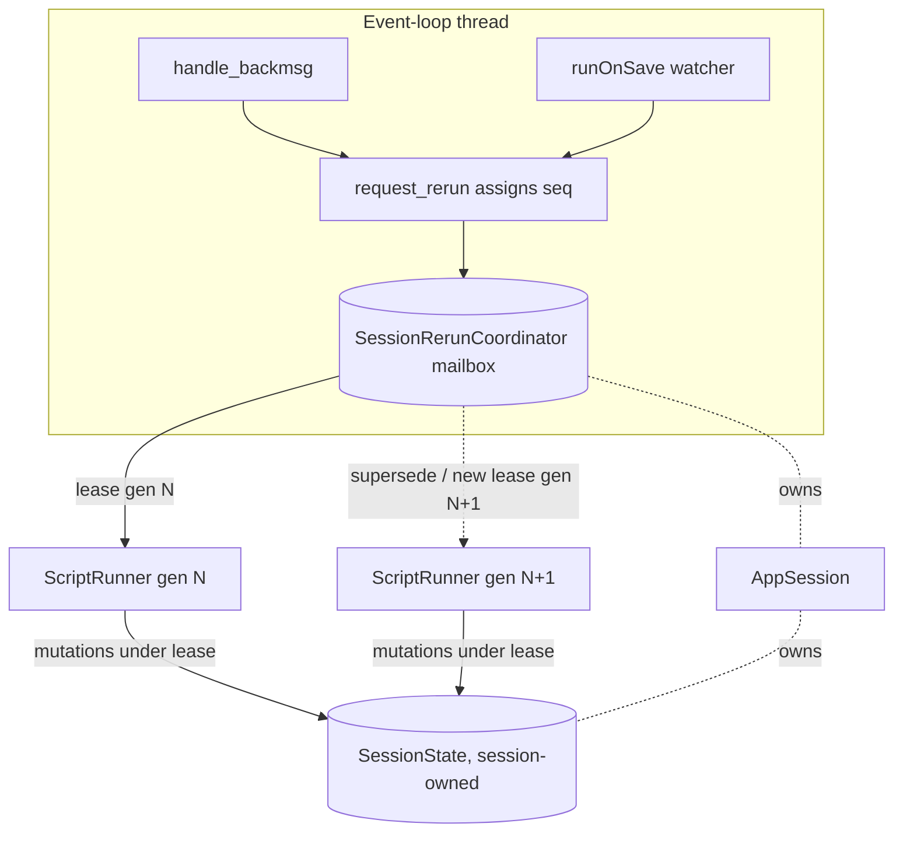
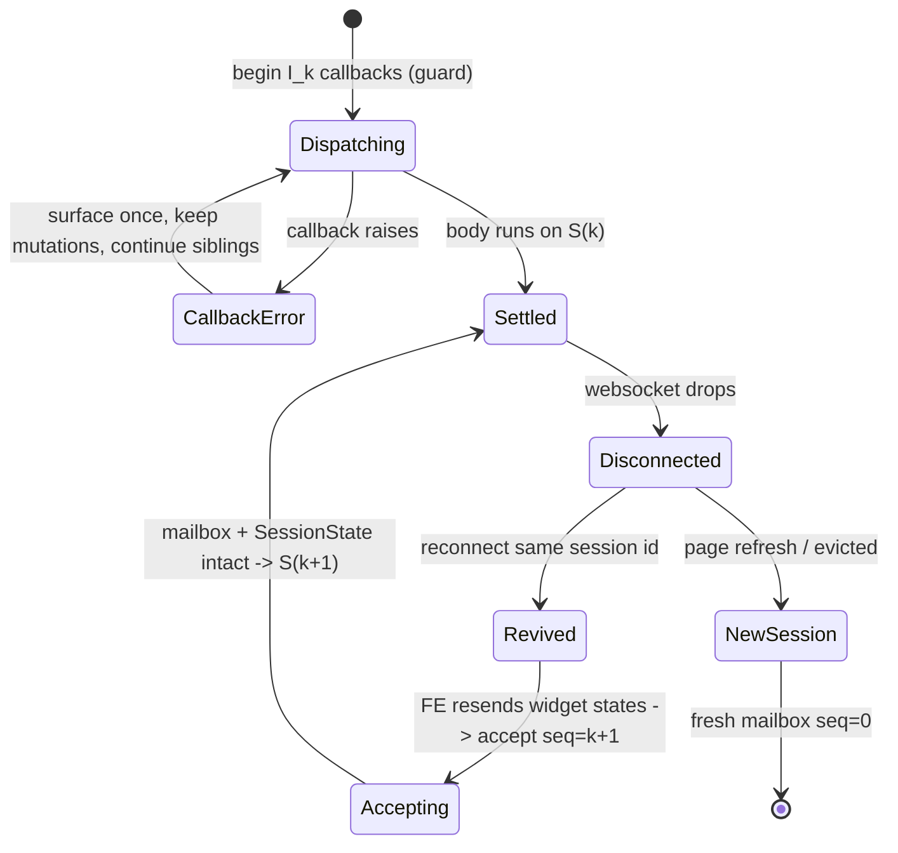

# Session-owned rerun mailbox

## Summary

Rerun coordination currently lives on the `ScriptRunner`, not on the `AppSession`. Under
`runner.fastReruns=true` a full-app interaction stops the running `ScriptRunner` and starts a
fresh one, discarding whatever pending or in-flight interaction state the old runner held, and
the two runners can briefly overlap while sharing one `SessionState`. Callback ordering,
exactly-once callback dispatch, and the final `SessionState` therefore depend on thread timing.

This spec proposes an `AppSession`-owned **rerun mailbox** (a `SessionRerunCoordinator`) that
outlives any single `ScriptRunner`, assigns every accepted browser interaction a session-scoped
sequence position, and hands ordered, coalesced work to successive runners under a generation
lease. The goal is a single testable invariant — **session-scoped serial equivalence** — while
keeping fast reruns responsive everywhere except a small protected callback/state boundary.

This is a design-only document. No production behavior is changed by merging it.

## Problem

### Where rerun state lives today

Ownership is split across two layers with different lifetimes:

| Object | Owner | Lifetime |
| --- | --- | --- |
| `SessionState` | `AppSession._session_state` | Whole session; survives runner replacement |
| `ScriptRequests` + pending `RerunData` | `ScriptRunner._requests` | Per runner; **not** transferred on replacement |
| `SafeSessionState` (RLock wrapper) | Per `ScriptRunner`, wrapping the shared `SessionState` | Per runner |
| `_scriptrunner` (the "current" runner) | `AppSession` | At most one; set to `None` during fast-rerun handoff |

`AppSession` owns the durable state (`SessionState`, `_client_state`, `_fragment_storage`), but
the *queue of accepted-but-not-yet-applied interactions* is owned by the ephemeral runner:

```246:248:lib/streamlit/runtime/scriptrunner/script_runner.py
        self._requests = ScriptRequests()
        self._requests.request_rerun(initial_rerun_data)
```

`ScriptRequests` is a thread-safe latch (one pending, coalesced `RerunData`), not a durable
per-session queue:

```179:189:lib/streamlit/runtime/scriptrunner_utils/script_requests.py
class ScriptRequests:
    """An interface for communicating with a ScriptRunner. Thread-safe.

    AppSession makes requests of a ScriptRunner through this class, and
    ScriptRunner handles those requests.
    """
```

### The `fastReruns` interleaving gap

`AppSession.request_rerun` runs on the event-loop thread. For a full-app interaction under
`fastReruns`, it stops the current runner and immediately creates a new one:

```494:516:lib/streamlit/runtime/app_session.py
        if self._scriptrunner is not None:
            if (
                bool(config.get_option("runner.fastReruns"))
                and not rerun_data.fragment_id
            ):
                # If fastReruns is enabled and this is *not* a rerun of a fragment,
                # we don't send rerun requests to our existing ScriptRunner. Instead, we
                # tell it to shut down. We'll then spin up a new ScriptRunner, below, to
                # handle the rerun immediately.
                self._scriptrunner.request_stop()
                self._scriptrunner = None
            else:
                # Either fastReruns is not enabled or this RERUN request is a request to
                # run a fragment. We send our current ScriptRunner a rerun request, and
                # if it's accepted, we're done.
                success = self._scriptrunner.request_rerun(rerun_data)
                if success:
                    return

        # If we are here, then either we have no ScriptRunner, or our
        # current ScriptRunner is shutting down and cannot handle a rerun
        # request - so we'll create and start a new ScriptRunner.
        self._create_scriptrunner(rerun_data)
```

This creates three timing-dependent hazards:

1. **Abandoned interaction state.** Anything the old runner had accepted but not yet applied —
   a pending coalesced `RerunData`, trigger values still queued from a rapid earlier click,
   `st.rerun()` votes gathered mid-callback — lives on the old runner's `ScriptRequests` and is
   dropped. The new runner is seeded only with the newest `RerunData`.
2. **Overlapping runners share one `SessionState`.** The old script thread keeps running until
   its next yield point and can still mutate `SessionState` through `SafeSessionState`, whose
   `RLock` is released between operations, so the old and new runs can interleave writes. The
   wrapper's own docstring calls out that this window exists:

```32:39:lib/streamlit/runtime/state/safe_session_state.py
    """Thread-safe wrapper around SessionState.

    When AppSession gets a re-run request, it can interrupt its existing
    ScriptRunner and spin up a new ScriptRunner to handle the request.
    When this happens, the existing ScriptRunner will continue executing
    its script until it reaches a yield point - but during this time, it
    must not mutate its SessionState.
    """
```

3. **Callback dispatch is not protected across replacement.** If a full-app interaction lands
   while the previous interaction's `on_change`/`on_click` callbacks are mid-flight, the old
   runner is asked to stop while it is still inside `on_script_will_rerun` → `_call_callbacks`
   under the `RLock`. The new runner is created immediately and can begin applying the newer
   interaction's widget states before the earlier callback batch has finished mutating state.

### Prior art

- [#16158](https://github.com/streamlit/streamlit/pull/16158) — *Make `st.rerun()` work in
  widget callbacks*. Landed the **same-run** fixes: defer rerun requests until after the last
  callback returns (so one callback's rerun no longer aborts its siblings), skip stale-widget
  cleanup for a body that never ran (so widget values survive a preempting rerun), reset triggers
  so a click fires its callback exactly once, and make `ScriptRequests.request_rerun` coalescing
  order-independent (full-app wins whenever it appears; otherwise fragment targets union with
  dedup).
- [#16161](https://github.com/streamlit/streamlit/pull/16161) — *Event-scoped fragment reruns*.
  Built `st.rerun(scope=<key>)` on top of #16158 and explicitly listed the remaining gap as a
  follow-up:

  > **`suppress_callbacks` coalescing race**: there is a narrow window where concurrent
  > interactions could interleave coalescing. Planned to be addressed by a batching fix.

  That "batching fix" is the design in this spec.
- Issue [#10501](https://github.com/streamlit/streamlit/issues/10501) — original report that
  `st.rerun()` in a callback was silently a no-op.

Everything #16158 fixed is scoped to a *single* runner's replay loop. The moment `fastReruns`
replaces the runner, that same-run reasoning no longer holds, because the coalescing latch and
the deferred-rerun votes were runner-owned and are thrown away. This spec moves the coordination
point up to the session so the guarantees hold *across* runner replacement.

## Goals

- Define and enforce **session-scoped serial equivalence** (below) as a single, testable
  invariant that holds across `ScriptRunner` replacement.
- Preserve fast-rerun responsiveness everywhere except the minimum callback/state boundary that
  correctness requires.
- Give the coordination a durable, session-scoped home so pending interaction state is never
  silently abandoned while the `AppSession` lives.
- Be safe under free-threaded CPython (PEP 703), where the GIL no longer serializes compound
  read-modify-write on shared containers.

## Non-goals

- No change to the public `st.*` API or to the wire protocol.
- No promise of exactly-once *external* side effects (network calls, DB writes) across a process
  crash or `AppSession` destruction. The guarantee is about observable `SessionState`.
- No frontend batching redesign. The existing macrotask coalescing in `WidgetStateManager` and
  the single ordered WebSocket stream are taken as given.
- User callbacks continue to run on script threads. Nothing in this design executes user code on
  the `AppSession` event-loop thread.

## Behavioral contract

The contract is defined before any data structure so that the mailbox can be validated against
it, and so alternatives can be compared against the same yardstick.

### What "accepted" means and where the sequence position is assigned

A browser interaction is a `rerun_script` `BackMsg` carrying a `ClientState` (widget states,
query string, page hash, optional `fragment_id`, cached-message hashes). It becomes **accepted**
at exactly one point: when `AppSession.request_rerun`, running on the event-loop thread, passes
the fragment-existence guard and constructs its `RerunData`.

```469:490:lib/streamlit/runtime/app_session.py
            if fragment_id and not self._fragment_storage.contains(fragment_id):
                _LOGGER.info(
                    "The fragment with id %s does not exist anymore - "
                    "it might have been removed during a preceding full-app rerun.",
                    fragment_id,
                )
                return
            ...
            rerun_data = RerunData(
                query_string=query_string,
                widget_states=client_state.widget_states,
                page_script_hash=client_state.page_script_hash,
                page_name=client_state.page_name,
                fragment_id=fragment_id or None,
                is_auto_rerun=client_state.is_auto_rerun,
                cached_message_hashes=frozenset(client_state.cached_message_hashes),
                context_info=client_state.context_info,
            )
```

At that point the interaction is assigned a monotonically increasing, session-scoped integer
**sequence number** `seq`. A dropped interaction (fragment no longer exists, session shutting
down) is *not* accepted and consumes no `seq`. Assigning `seq` on the event-loop thread is what
makes the order well-defined: that thread is single-threaded and is the one place every browser
interaction funnels through.

### Canonical order

The canonical order is **`AppSession` acceptance order**: the order in which
`request_rerun` assigns `seq` on the event-loop thread.

- It is *not* the frontend's raw emission order and *not* wall-clock WebSocket delivery order,
  because the frontend coalesces same-macrotask widget changes into one `rerun_script`
  (latest-wins, triggers preserved) before anything reaches the socket. That coalescing happens
  before acceptance and is deliberately outside the guarantee: the browser decides what counts as
  one interaction; the session orders whatever interactions it accepts.
- **The existing ordered WebSocket stream is sufficient** as the transport. There is one socket
  per tab; inbound frames are dispatched in receive order, and `AppSession.handle_backmsg` is
  invoked from the event loop one message at a time. So delivery order == acceptance order for
  messages on a single connection, and no sequence numbers need to travel on the wire. The
  session assigns `seq` locally; the frontend never sees it.
- Frontend-side batching only affects *what* is delivered, never *reordering*: a later macrotask
  can supersede an earlier interaction's widget value before send, but it cannot make interaction
  B arrive before interaction A once both are distinct messages.

### The serial-equivalence invariant

Let the accepted interactions be `I₁, I₂, …` in canonical order. Define the **reference
model** `S(n)` as the `SessionState` produced by applying `I₁ … Iₙ` strictly sequentially:
for each interaction, reset triggers, install its widget states, run its callbacks to
completion (observing all mutations of prior interactions), then run the resulting script/fragment
body.

The invariant, at every point where user code can observe `SessionState`:

> **Prefix property.** Any state observed at a user-code boundary equals `S(k)` for some
> `k` that is a prefix of the accepted sequence — never a mix of interactions, never a value
> from an interaction `Iⱼ` with `j > k`.
>
> **Settled property.** Once the mailbox is drained (no accepted interaction is unapplied and no
> runner is executing), the observable state equals `S(N)` for the complete accepted sequence
> `I₁ … I_N`.

The three observation boundaries this must hold at:

1. **Callback entry** — when `Iₖ`'s `on_change`/`on_click` callback begins, `SessionState`
   reflects `S(k-1)` plus `Iₖ`'s freshly installed widget values. It must not reflect any part of
   `I_{k+1}`.
2. **Callback completion** — `Iₖ`'s callback mutations are fully applied and visible before any
   later interaction's callback runs or any later widget states are installed.
3. **Script-body execution** — the body for the run that services `Iₖ` observes `S(k)`
   (its own installed widgets plus all completed callback mutations up to and including `Iₖ`).

The implementation **need not** apply every low-level mutation one-by-one. It may batch or
coalesce interactions, provided the *callback observations* and the *settled state* are identical
to sequential application. Concretely: a callback for `A` must never observe `B`'s state; `A`'s
callback mutations must be part of the state `B` is applied to; and no callback is skipped or
run twice.

### Coalescing semantics

Coalescing is an optimization over the reference model and is only legal when it does not change
callback observations or the settled state.

- **Fresh widget values (no callback).** A widget change with `on_change="ignore"` or no callback
  contributes only a value. Consecutive such changes to the same widget may collapse to the newest
  value: no callback observes the intermediate, and the settled value is the newest either way.
  This matches today's latest-wins merge in `_coalesce_widget_states`.
- **Trigger values** (`trigger_value`, `string_trigger_value`, `chat_input_value`,
  `json_trigger_value`). A trigger represents a discrete event (a click). Triggers may **not** be
  dropped by coalescing while their callback has not yet run — an active trigger from an older
  interaction is carried forward so a rapid second click is not lost. This is exactly the
  carry-forward already implemented:

```117:141:lib/streamlit/runtime/scriptrunner_utils/script_requests.py
def _coalesce_widget_states(
    old_states: WidgetStates | None,
    new_states: WidgetStates | None,
    *,
    old_suppress_callbacks: bool = False,
) -> WidgetStates | None:
    """Merge an older WidgetStates into a newer one, returning the result.

    For most widgets the newer value wins.  Button and chat-input triggers are
    special: an active trigger in ``old_states`` carries forward so rapid clicks
    aren't lost — unless ``old_suppress_callbacks`` is True, in which case the
    older trigger belonged to a callback batch that already ran and must not be
    replayed.
    """
```

  Once a trigger's callback has run, that trigger is spent and must reset (never replay). The
  mailbox tracks "callbacks already dispatched for this batch" so a coalesced follow-on cannot
  re-fire a spent trigger — this is the durable version of `suppress_callbacks`.
- **Callback execution.** Callbacks are dispatched in interaction order. Two interactions may be
  merged into one *run* only if neither has an unspent callback, or if all their callbacks are
  dispatched in order within the same protected batch with the earlier batch's mutations visible
  to the later. Merging must never reorder callbacks relative to canonical order.
- **Callback mutations.** Coalescing optimizes *when the body runs*, not *whether mutations
  apply*. Every callback's writes are part of the state handed to the next interaction.

### Guarantee classes

| Guarantee | Class | Notes |
| --- | --- | --- |
| Each accepted interaction's callback runs | **exactly once** | Per accepted interaction, across runner replacement, unless the `AppSession` is destroyed first. |
| A trigger (click) fires its callback | **exactly once** | Reset after dispatch; carried forward only until dispatched. |
| Body run for an interaction | **at-most-once, coalesced** | Bodies may coalesce; the settled body observes `S(N)`. Compatible with "one rerun per interaction". |
| Callback that raises | **at-most-once** | The exception is surfaced once (existing `handle_uncaught_app_exception`); state mutations already made by that callback before it raised are kept; siblings still run; the interaction still advances `seq`. Not retried. |
| Ordering of accepted interactions | **total, canonical** | Prefix + settled properties above. |
| External side effects in callbacks | **best-effort** | No cross-crash/destruction guarantee (non-goal). |
| Interactions accepted after `AppSession` teardown | **dropped** | Permitted: pending work may be discarded when the session ends. |

### Relationship to non-browser rerun requests

Not every rerun originates from the browser, and the mailbox must place each source correctly
relative to the interaction sequence.

| Source | Origin thread | Ordering treatment |
| --- | --- | --- |
| Browser interaction (`rerun_script`) | Event loop | Assigned `seq`; the ordered sequence this spec governs. |
| Timer / `run_every` auto-rerun | Event loop (`is_auto_rerun=True`) | Accepted like a browser interaction but flagged; may be dropped/coalesced under backpressure without violating equivalence (it carries no unspent trigger). |
| Fragment rerun (widget in a fragment) | Event loop | Accepted with a `fragment_id`; ordered in the same sequence. Non-preempting fragment reruns still coalesce and run at the next ready point (existing `_fragment_run_should_not_preempt_script`). |
| Keyed / `st.rerun(scope=<key>)` | Script thread (callback) | A *derived* request produced while servicing an interaction; folded into the current interaction's batch, not assigned a new browser `seq`. |
| Explicit `st.rerun()` in body | Script thread | Derived continuation of the current interaction; loops within the run (existing `RerunException` path), not a new accepted interaction. |
| `st.switch_page` / navigation | Script thread | Derived; changes the page hash of the current run, then reruns. Ordered within the current interaction. |
| Source-file change (`runOnSave`) | Watcher thread | Accepted as a full-app request with no widget states; ordered in the sequence. Purely additive; coalesces with a pending full-app run. |

The mailbox distinguishes **accepted interactions** (assigned `seq`, from the event loop or
watcher) from **derived requests** (raised on a script thread while servicing an interaction).
Derived requests never jump the queue: they extend or continue the interaction currently being
serviced.

### Lifecycle boundaries

- **Transient WebSocket reconnect (same session id).** `WebsocketSessionManager.connect_session`
  revives the same `AppSession` (and therefore the same mailbox and `SessionState`):

```190:207:lib/streamlit/runtime/websocket_session_manager.py
        if isinstance(session_info, SessionInfo):
            existing_session = session_info.session
            existing_session.register_file_watchers()

            self._active_session_info_by_id[existing_session.id] = ActiveSessionInfo(
                client,
                existing_session,
                session_info.script_run_count,
            )
            self._session_storage.delete(existing_session.id)
            ...
            return existing_session.id
```

  The mailbox and its `seq` counter persist. On reconnect the frontend resends current widget
  states as a fresh interaction (via `sendUpdateWidgetsMessage`), which is accepted with the next
  `seq`. In-flight state is preserved; the resend is simply the next prefix element.
- **Full page refresh.** The frontend has no `last.sessionId`, so no session id is offered on the
  handshake; a brand-new `AppSession` (and mailbox, starting at `seq=0`) is created. No transfer.
- **`AppSession` teardown / `close_session`.** Pending mailbox work is discarded (allowed by the
  contract). The mailbox is drained-and-closed; no callbacks run after teardown begins.
- **Reconnect to a session that has been evicted from storage.** Treated as a new session (new
  mailbox); the resent widget states become interaction 1.

## Proposal

### Overview

Introduce a `SessionRerunCoordinator` (the "mailbox") owned by `AppSession`. It is the single
authority for (a) assigning `seq`, (b) holding the ordered, coalesced set of accepted-but-unapplied
interactions, and (c) leasing work to a `ScriptRunner` under a generation token. `ScriptRunner`
stops owning a durable request queue; it borrows the next batch from the mailbox and reports
results back. `SessionState` remains session-owned and is only ever mutated by the runner that
currently holds the active lease.



### Ownership matrix (proposed)

| Concern | Owner | Rationale |
| --- | --- | --- |
| Accepted-interaction sequence + `seq` counter | `SessionRerunCoordinator` (session) | Survives runner replacement; single writer (event loop). |
| Coalescing of pending interactions | `SessionRerunCoordinator` | Coalescing must span runners, not reset on replacement. |
| Current runner + its generation/lease | `AppSession` via the coordinator | One authoritative "current" generation. |
| `SessionState` | `AppSession` | Unchanged; durable. |
| Applying widget states / dispatching callbacks | The lease-holding `ScriptRunner` (script thread) | Keeps user code on script threads. |
| Right to mutate `SessionState` | Whichever runner holds the active lease | Prevents overlapping-runner interleaving. |

### Data structures

```python
class RunnerLease:
    """A single-use grant that lets one ScriptRunner apply one interaction batch.

    A lease is bound to a monotonically increasing generation. Only the runner
    holding the current generation may install widget states, dispatch callbacks,
    or mutate SessionState. When the coordinator supersedes a lease, the
    generation advances and the old lease becomes ``expired``; an expired lease's
    holder must not touch SessionState.
    """

    generation: int
    batch: InteractionBatch
    _expired: threading.Event


class InteractionBatch:
    """An ordered, coalesced set of accepted interactions ready to be serviced.

    ``callbacks_dispatched`` records which triggers in this batch have already
    fired their callbacks, so a superseding coalesce cannot replay a spent
    trigger (the durable form of ``suppress_callbacks``).
    """

    lowest_seq: int
    highest_seq: int
    rerun_data: RerunData  # coalesced, as produced by _coalesce_widget_states
    callbacks_dispatched: bool


class SessionRerunCoordinator:
    """Session-owned mailbox. All mutation of the pending batch happens on the
    event-loop thread; the script thread only reads its lease and reports back.
    """

    def __init__(self) -> None:
        self._lock = threading.Lock()
        self._next_seq = 0
        self._pending: InteractionBatch | None = None
        self._current_generation = 0
        self._active_lease: RunnerLease | None = None
```

`RerunData` gains one field so a serviced batch can be identified end-to-end:

```python
@dataclass(frozen=True)
class RerunData:
    """Data attached to RERUN requests. Immutable."""

    ...
    # Highest accepted interaction sequence number folded into this batch.
    # Used by the coordinator to acknowledge drainage and by observability.
    batch_seq: int = 0
```

### Accept path (event-loop thread)

`AppSession.request_rerun` no longer branches on `fastReruns` to decide between
`request_stop`/`_create_scriptrunner` and `request_rerun`. It always hands the interaction to the
coordinator, which assigns `seq`, coalesces into the pending batch, and decides whether the
current runner can absorb the update or a new generation is needed.

Before (today):

```python
        if self._scriptrunner is not None:
            if (
                bool(config.get_option("runner.fastReruns"))
                and not rerun_data.fragment_id
            ):
                self._scriptrunner.request_stop()
                self._scriptrunner = None
            else:
                success = self._scriptrunner.request_rerun(rerun_data)
                if success:
                    return
        self._create_scriptrunner(rerun_data)
```

After (proposed):

```python
        # Assign this interaction its session-scoped sequence position and fold it
        # into the pending batch. The coordinator decides, under fastReruns, whether
        # the current runner can keep going or must be superseded by a new generation.
        decision = self._coordinator.accept(rerun_data)
        if decision.kind == AcceptDecision.ABSORBED:
            # The current runner has been handed the updated batch and stays alive.
            return
        if decision.kind == AcceptDecision.SUPERSEDE:
            # fastReruns full-app path: retire the current runner's lease and start a
            # fresh runner on the new generation. The old runner may keep executing
            # until its next yield point but can no longer mutate SessionState.
            self._retire_current_runner()
        self._create_scriptrunner_from_coordinator()
```

The `fastReruns` config still selects between `ABSORBED` (send to the live runner) and
`SUPERSEDE` (replace the runner) — but the pending batch and `seq` sequence are preserved by the
coordinator in both cases, so no accepted interaction is dropped.

### Runner generations and leases

Every `ScriptRunner` is created bound to the coordinator's current generation. The runner may
mutate `SessionState` only while its lease is unexpired. Three rules enforce single-writer
semantics:

1. **Fresh runner ⇒ new generation.** `accept(...) → SUPERSEDE` increments `_current_generation`
   and marks the previous lease expired *before* the new runner starts.
2. **Mutation is gated on the lease.** `SafeSessionState`'s mutating and callback-dispatching
   entry points check the lease before taking the state lock. An expired lease turns the mutation
   into a fast, side-effect-free stop (the old runner unwinds at its next yield). This closes the
   overlapping-writer window that the current `RLock` leaves open.

   Before (today):

```python
    def on_script_will_rerun(
        self,
        latest_widget_states: WidgetStatesProto,
        *,
        suppress_callbacks: bool = False,
    ) -> None:
        self._yield_callback()
        with self._lock:
            self._state.on_script_will_rerun(
                latest_widget_states, suppress_callbacks=suppress_callbacks
            )
```

   After (proposed):

```python
    def on_script_will_rerun(
        self,
        latest_widget_states: WidgetStatesProto,
        *,
        suppress_callbacks: bool = False,
    ) -> None:
        # Yield first so a superseded runner observes STOP before touching state.
        self._yield_callback()
        # Only the runner holding the live lease may install widget states and run
        # callbacks. A superseded runner returns without mutating shared state.
        with self._lease.acquire_or_stop():
            self._state.on_script_will_rerun(
                latest_widget_states, suppress_callbacks=suppress_callbacks
            )
```

3. **Events are still filtered by identity.** `AppSession` already ignores events from a
   non-current runner; generation makes this explicit and race-free: an event carries its
   generation and is dropped unless it matches `_current_generation`.

### Atomic callback-batch publication and replay transfer

The core correctness move: **callback dispatch for an interaction batch is an atomic unit with
respect to supersession.** When a runner begins dispatching a batch's callbacks it takes a
*dispatch guard* on the lease. While the guard is held:

- `accept(...)` may still assign `seq` and coalesce into `_pending` (the event loop never blocks),
  but it returns `ABSORBED_DEFERRED` — it will not `SUPERSEDE` until the guard is released.
- When the guard releases, the coordinator publishes the *next* batch. If a full-app interaction
  arrived during dispatch, the newly published batch carries `callbacks_dispatched=True` for the
  triggers already fired (so they are replayed as values, not re-fired) — exactly the
  `suppress_callbacks` + trigger-only-replay behavior from #16158, but now computed by the
  session and handed to whichever runner (old, continuing, or freshly superseding) picks it up.

This is what makes coalescing legal under the contract: the "batch of callbacks already ran"
fact is durable session state, not a flag on a runner that is about to be discarded. The narrow
`suppress_callbacks` coalescing race noted in #16161 disappears because the merge and the
"already dispatched" bookkeeping happen under one lock on one thread (the event loop), and the
publication to the next generation is atomic.

Publication hands the successor runner an `InteractionBatch` whose `rerun_data.widget_states`
already went through `_coalesce_widget_states` with the correct `old_suppress_callbacks`. No
replay state lives on the retired runner.

### Serializing mutations without waiting for an obsolete body

A superseded runner must not block the new run, but also must not mutate state. The design
separates *stopping* from *draining*:

- The new generation's runner starts immediately (responsiveness preserved).
- The old runner is asked to stop; its next yield point (`_maybe_handle_execution_control_request`
  via `_yield_callback`, or the lease check above) turns any further `SessionState` access into a
  no-op unwind. It does **not** need to finish its body before the new runner proceeds.
- Because mutation is lease-gated, the new runner can install `S(k)` while the old runner is still
  unwinding: the old runner's writes are rejected, so there is no interleave. The only shared
  object both touch is `SessionState`, and only the lease-holder may write it.

The one place we *do* wait is the dispatch guard: a full-app supersession will not publish its new
batch until an in-flight callback batch finishes. That is the "minimum protected callback
boundary" — small (one interaction's callbacks), bounded, and required by boundary #2 of the
invariant.

### How `fastReruns` keeps responsiveness

`fastReruns` still means "don't make the user wait for the previous full-app body to finish."
That is preserved: supersession starts the new runner right away. The only added latency is when
a new full-app interaction arrives *while the previous interaction's callbacks are executing* —
then supersession waits for that callback batch (typically microseconds to a few milliseconds of
user code) rather than starting a run that would violate serial equivalence. Outside that window
behavior is identical to today's fast path.

### Backpressure, bounds, coalescing, locking, free-threaded safety

- **Bounds.** The mailbox holds at most one coalesced pending `InteractionBatch` plus at most one
  active lease — O(1) memory regardless of interaction rate, because coalescing merges on arrival.
  There is no unbounded queue to grow under a flood of clicks.
- **Backpressure.** Auto-rerun (`is_auto_rerun`) and callback-less value updates may be coalesced
  away freely. Interactions with unspent triggers are never dropped, only carried forward; a flood
  of distinct clicks collapses to "carry the triggers, fire each callback once, run the body
  once."
- **Locking.** One `threading.Lock` in the coordinator guards `_next_seq`, `_pending`,
  `_current_generation`, and `_active_lease`. It is held only for O(1) coalescing work, never
  across user code. `SafeSessionState` keeps its state lock but adds the lease gate; the long-held
  `RLock`-across-callbacks can then be shortened to a plain `Lock` per the existing TODO, because
  cross-runner exclusion now comes from the lease, not from holding the state lock for the whole
  callback batch.
- **Free-threaded (PEP 703).** All shared-container mutation (`_pending`, sequence counter,
  generation) is under the coordinator lock; the lease uses a `threading.Event` for expiry. No
  correctness relies on the GIL serializing compound operations, so the design holds when the GIL
  is absent. This mirrors the per-field locking approach the parallel-fragments work adopted for
  shared `ScriptRunContext` sets.

### Recovery and edge cases

| Situation | Behavior |
| --- | --- |
| Callback raises | Exception surfaced once via existing handler; siblings still dispatched in order; the interaction still advances `seq`; the batch's body runs on the resulting state. |
| `st.stop()` in body | Body ends; run stops; batch is acknowledged as serviced up to its `seq`; no new run unless a later interaction is pending. |
| `st.rerun()` in body | Derived continuation; loops within the current run (existing `RerunException`), acknowledged under the same interaction. |
| `st.rerun(scope=<key>)` / keyed | Folded into the current batch during callback dispatch; preempts the interaction default per #16161; no new `seq`. |
| Navigation (`st.switch_page`) | Derived; sets page hash and reruns within the current interaction. |
| Runner shutdown (idle) | Lease released; coordinator keeps the sequence and awaits the next accept, then creates a runner. |
| Interrupted run (superseded mid-body) | Old runner unwinds at next yield; its non-lease-holding writes are rejected; new generation owns state. |
| Session teardown | Mailbox drained-and-closed; pending work discarded; no post-teardown callbacks. |

### Compatibility with rerun modes

- **Full-app reruns.** The `SUPERSEDE` path; the primary case the mailbox fixes.
- **Fragment-scoped reruns.** Accepted with a `fragment_id`; non-preempting reruns coalesce and
  run at the next ready point exactly as today (`_fragment_run_should_not_preempt_script`
  unchanged). The lease still governs `SessionState` writes.
- **Keyed-fragment reruns** (`st.rerun(scope=<key>)`). Derived requests folded into the servicing
  interaction; the "already dispatched" bookkeeping is what #16161's follow-up needed.
- **Periodic / `run_every`.** Auto-rerun interactions accepted and coalescible; never carry
  unspent triggers, so dropping under coalescing is safe.
- **Parallel-fragment reruns.** Orthogonal: parallelism is *within* a run (worker threads under
  one lease). The lease-holding runner owns the coordinator interaction; workers mutate state
  through `SafeSessionState`, which already serializes per-operation and now also checks the
  single lease the run holds. No second lease is issued for workers.

## State-machine and sequence diagrams

### 1. Two rapid browser interactions while the first callback is running

```mermaid
sequenceDiagram
    participant FE as Frontend
    participant EL as Event loop (AppSession)
    participant MB as SessionRerunCoordinator
    participant R1 as ScriptRunner gen N
    participant SS as SessionState

    FE->>EL: rerun_script I1 (click A)
    EL->>MB: accept(I1) -> seq=1
    MB->>R1: lease gen N, batch{seq1}
    R1->>SS: install widgets S(0)+I1
    R1->>R1: dispatch A.callback (guard held)
    FE->>EL: rerun_script I2 (click B)
    EL->>MB: accept(I2) -> seq=2 (guard held -> ABSORBED_DEFERRED)
    Note over MB: I2 coalesced into pending;<br/>no supersede while callbacks run
    R1->>SS: A.callback mutations applied
    R1->>R1: release dispatch guard
    MB->>R1: publish batch{seq2}, B trigger unspent, A trigger spent
    R1->>SS: install widgets S(1)+I2, dispatch B.callback
    R1->>SS: settled = S(2)
```

### 2. Full-app fast rerun replacing a runner with pending replay triggers

```mermaid
sequenceDiagram
    participant EL as Event loop
    participant MB as SessionRerunCoordinator
    participant R1 as ScriptRunner gen N
    participant R2 as ScriptRunner gen N+1
    participant SS as SessionState

    Note over R1: running body for I1 (no callback in flight)
    EL->>MB: accept(I2 full-app) -> seq=2
    MB->>MB: coalesce; SUPERSEDE (no dispatch guard held)
    MB->>R1: expire lease gen N
    MB->>R2: create, lease gen N+1, batch{seq2, replay trigger-only if needed}
    R2->>SS: install S(1)+I2 (lease valid)
    R1--xSS: late write rejected (lease expired) -> unwind at yield
    R2->>SS: settled = S(2)
```

### 3. Fragment interaction arriving during a full-app callback

```mermaid
sequenceDiagram
    participant EL as Event loop
    participant MB as SessionRerunCoordinator
    participant R1 as ScriptRunner gen N (full-app run)
    participant SS as SessionState

    Note over R1: dispatching full-app interaction I1 callbacks (guard held)
    EL->>MB: accept(I2 fragment_id=f) -> seq=2 (ABSORBED_DEFERRED)
    Note over MB: fragment reruns do not preempt;<br/>coalesced into pending
    R1->>SS: I1 callbacks complete, guard released
    MB->>R1: publish batch: full-app body for I1, then fragment f for I2
    R1->>SS: run body S(1); then fragment f observes S(2)
    R1->>SS: settled = S(2)
```

### 4. Callback failure and disconnection/reconnection



## Alternatives Considered

### A. Durable per-`AppSession` mailbox used by successive runners — **preferred**

The proposal above.

- **Pros.** Coordination point matches the lifetime of the state it protects; the invariant holds
  by construction across replacement; coalescing/"already dispatched" bookkeeping is durable, which
  is precisely what #16161's follow-up needs; O(1) memory; free-threaded-safe; naturally
  supersedes the narrower fixes below.
- **Cons.** Largest change surface (new session-owned object, lease plumbing through
  `SafeSessionState` and `ScriptRunner`); introduces a generation concept that must be threaded
  through event filtering.

### B. Narrow atomic handoff of pending/current `RerunData` during fast replacement

Keep the runner-owned `ScriptRequests`, but when `SUPERSEDE` happens, atomically copy the old
runner's pending `RerunData` (and any deferred rerun votes) into the new runner's initial data.

- **Pros.** Much smaller; localized to `app_session.py` + `script_requests.py`; fixes the
  *abandoned interaction state* symptom directly.
- **Cons.** Does not fix overlapping writers (both runners can still mutate `SessionState`), so it
  does not deliver the callback-completion boundary; the handoff must snapshot mid-callback state,
  which is exactly the race #16161 flagged; ordering guarantee remains implicit and hard to test.
  A good *first* PR, not a complete solution (see PR split).

### C. Defer fast replacement while callback dispatch or replay handoff is active

Keep today's structure but, under `fastReruns`, do **not** stop-and-replace while the current
runner is inside callback dispatch or a replay handoff; queue the new interaction and let the
current runner finish that boundary first.

- **Pros.** Small; directly closes the callback-completion race without a lease/generation model;
  can reuse the existing `ScriptRequests` latch.
- **Cons.** Only protects the callback boundary, not the general overlapping-writer window (a
  supersession that happens *between* callback batches still starts a second writer);
  "queue the new interaction" needs a durable place to live, which pushes toward A anyway;
  responsiveness regresses if callback batches are long. Effectively a subset of A without the
  durable mailbox.

### D. Keep runner-owned queues and document latest-interaction-wins

Accept the current behavior; document that under `fastReruns`, a rapid full-app interaction can
supersede in-flight interaction state and that callback ordering is best-effort.

- **Pros.** Zero code; no risk.
- **Cons.** Does not meet the required invariant; leaves #10501-class surprises (lost clicks, lost
  `session_state` writes) under rapid interaction; contradicts the task's goal. Rejected, but
  documented as the status quo baseline the other options are measured against.

## Implementation sketch

### Module-by-module changes

- `lib/streamlit/runtime/app_session.py`
  - Construct `self._coordinator = SessionRerunCoordinator()` alongside `SessionState`.
  - Replace the `fastReruns` branch in `request_rerun` with `self._coordinator.accept(...)` and
    act on the returned decision (`ABSORBED` / `ABSORBED_DEFERRED` / `SUPERSEDE`).
  - Add `_retire_current_runner()` (expire lease, `request_stop`) and
    `_create_scriptrunner_from_coordinator()` (bind new generation, seed from the published batch).
  - Tag `on_event` handling with generation so stale-runner filtering is race-free.
- `lib/streamlit/runtime/scriptrunner_utils/script_requests.py`
  - `ScriptRequests` becomes a thin per-run adapter that reads the leased `InteractionBatch`
    instead of owning the durable pending state. `_coalesce_widget_states` and the coalescing
    rules move behind the coordinator (or are called by it), keeping the same trigger carry-forward
    semantics. Add `RerunData.batch_seq`.
- `lib/streamlit/runtime/scriptrunner/script_runner.py`
  - Accept a `RunnerLease` at construction; pass it to `SafeSessionState`.
  - The run loop pulls its next batch from the lease/coordinator rather than from a private
    `ScriptRequests`; on completion it acknowledges the serviced `batch_seq`.
- `lib/streamlit/runtime/state/safe_session_state.py`
  - Gate mutating/callback entry points on the lease (`acquire_or_stop()`); a superseded lease
    turns the operation into a clean unwind. Shorten the `RLock` to `Lock` once callbacks no longer
    need the lock held for their whole duration (cross-runner exclusion now comes from the lease).
- `lib/streamlit/runtime/state/session_state.py`
  - No semantic change to callback dispatch, but the "callbacks already dispatched / suppress
    replay" signal is sourced from the batch's `callbacks_dispatched` rather than recomputed
    per-runner.
- `lib/streamlit/runtime/websocket_session_manager.py`
  - No structural change; the reconnect path already revives the same `AppSession`, so the mailbox
    persists automatically. Add an assertion/test that the coordinator survives reconnect.
- New: `lib/streamlit/runtime/scriptrunner_utils/session_rerun_coordinator.py` (mailbox, lease,
  batch types) with mirrored tests.

### Invariants (assertable)

- I1: `seq` is strictly increasing and assigned only on the event-loop thread.
- I2: At most one unexpired lease exists at any time.
- I3: A write to `SessionState` occurs only from the holder of the current lease.
- I4: For every accepted interaction, its callback set is dispatched exactly once, in `seq`
  order, before any later interaction's callbacks or widget installs.
- I5: When `_pending is None` and no lease is active, observable state equals `S(N)`.

### Observability

- Structured debug logs on `accept` (seq, kind, coalesced-into), `SUPERSEDE` (old/new generation),
  lease expiry, and batch acknowledgment.
- Counters: interactions accepted, coalesced-away, supersessions, dispatch-guard waits and their
  durations (to watch the protected-boundary latency), late writes rejected by an expired lease.
- A debug BackMsg-triggered dump of `{next_seq, current_generation, pending batch summary}` for
  e2e assertions, behind the existing debug-message mechanism.

### Migration and compatibility

- No public API or proto change; `runner.fastReruns` keeps its meaning (choose `ABSORBED` vs
  `SUPERSEDE`). It could later be removed once the mailbox makes fast replacement always safe, but
  that is out of scope.
- AppTest (`local_script_runner.py`) drives runs synchronously; it constructs a coordinator with a
  single generation and services batches inline, so existing tests keep working. #16158 already
  migrated fragment tests to seed via `initial_rerun_data`; the equivalent seed becomes the initial
  leased batch.
- Behavior is unchanged for the common case (no rapid overlapping interactions); only the racy
  windows change outcome, moving them onto the reference model.

### Performance risks

- Hot path: `request_rerun` gains one O(1) coordinator-lock section per interaction — negligible
  next to protobuf handling already on that path.
- `SafeSessionState` gains a lease check per mutating call. It must be a single atomic read of a
  `threading.Event`/generation int, not a lock acquisition, to avoid adding contention to the
  documented state hot path.
- The dispatch guard adds latency only when a full-app interaction arrives during callback
  dispatch; bounded by one callback batch. Must be measured; if user callbacks are long this is a
  visible but correct delay (alternative C shares this cost).

### Test strategy

- **Unit — coordinator** (`session_rerun_coordinator_test.py`): seq assignment, coalescing rules
  (full-app wins, fragment union+dedup, trigger carry-forward, spent-trigger suppression),
  `ABSORBED` vs `ABSORBED_DEFERRED` vs `SUPERSEDE` decisions, generation/lease expiry, drainage
  acknowledgment.
- **Unit — SafeSessionState lease gating**: an expired lease rejects writes and unwinds; the
  current lease writes succeed; no interleave when two leases exist transiently.
- **AppTest** (`session_state_test.py`, `script_runner_test.py`): two rapid interactions where the
  first has a callback that mutates `session_state`; assert the second observes the mutation and
  each callback fires exactly once; assert widget values survive a superseding full-app rerun
  (extends #16158's coverage across runner replacement); fragment interaction during a full-app
  callback runs after callbacks complete.
- **E2E** (`e2e_playwright/`): rapid double-click and click-then-full-rerun scenarios asserting no
  lost callback and correct settled UI; reconnect-preserves-mailbox scenario (transient disconnect
  then resend). Exact run counts are asserted in AppTest where they cannot race.
- **Property/fuzz (optional)**: generate random interleavings of accepts and callback durations;
  assert the observed `SessionState` sequence matches the reference model `S(k)` prefixes.

### Suggested PR split

1. **Same-run replay/coalescing hardening (independent).** Lands the smaller fix on the existing
   runner-owned structure — Alternative B's atomic handoff of pending `RerunData` plus deferred
   rerun votes during `SUPERSEDE`, and folding #16161's `suppress_callbacks` coalescing so the
   documented narrow race is closed for the single-runner-to-successor handoff. No lease/generation
   model. This is shippable on its own, reduces lost-interaction symptoms immediately, and is
   test-covered by extending `script_requests_test.py` and `session_state_test.py`. It does **not**
   claim the full serial-equivalence invariant.
2. **Introduce `SessionRerunCoordinator` (no behavior change).** Add the mailbox, lease, and batch
   types; have `AppSession` assign `seq` and coalesce through it while still driving the current
   runner exactly as PR 1 does. Pure plumbing + unit tests; the coordinator is authoritative for
   ordering but supersession still uses the PR 1 handoff.
3. **Lease-gate `SessionState` and move supersession onto the coordinator.** Wire the lease through
   `SafeSessionState` and `ScriptRunner`, add the dispatch guard, and switch `request_rerun` to the
   `accept()` decisions. This is where the overlapping-writer window closes and the invariant
   becomes enforceable; shorten the `RLock` to `Lock`.
4. **Observability + free-threaded validation.** Counters/logs/debug dump, and PEP 703 test runs.

PR 1 lands and helps users independently; PRs 2–4 build on it and PR 3 **supersedes** PR 1's
narrow handoff (the coordinator becomes the single source of truth, and the ad-hoc handoff is
removed). If the larger design stalls, PR 1 still stands on its own.

## Out of scope (future work)

- Removing the `runner.fastReruns` option entirely once supersession is always safe.
- Exactly-once external side effects across crashes/teardown (explicit non-goal).
- Cross-fragment multi-operation atomicity in parallel fragments (covered by the parallel-fragments
  spec).
- Persisting the mailbox across full page refresh (deliberately a fresh session).
