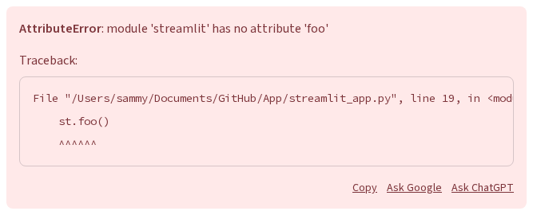
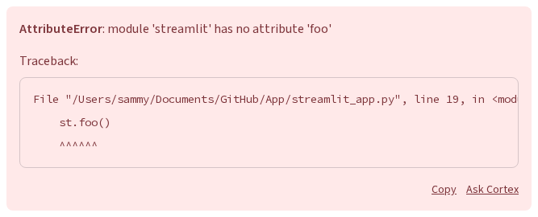

# Host-configurable exception help links

## Summary

Lets an embedding host hide either of the exception box's help actions
("Ask Google" / "Ask ChatGPT"), rename them, or route a click to the host via
`postMessage` instead of a third-party page. Host config only — no new
`st.exception` argument, and `client.showErrorLinks` still decides whether the
help row appears at all.

## Problem

Every exception ends with the same two hardcoded outbound links:



Both destinations are wrong for a platform that embeds Streamlit and has its
own assistant — internal developer portals, managed Streamlit hosting,
Snowflake's SiS/Cortex. Those hosts don't want to send users to a third party,
which is noise on a managed platform and a policy problem on some deployments.
They do want to keep an AI action, since an error is where an assistant is
most valuable, but it should be *their* assistant: named correctly and handed
the error in-product, not opening a new tab with the traceback in a query
string.

Today the only control is `client.showErrorLinks`, which is all-or-nothing:
keep both links or lose the whole row, including Copy.

## Proposal

Add an optional `errorLinks` field to host config (`/_stcore/host-config` and
`window.__streamlit.HOST_CONFIG`; window wins). Both actions take the same
options.



### API

```ts
errorLinks?: {
  /** The "Ask Google" action. */
  search?: ErrorLinkConfig
  /** The "Ask ChatGPT" action. */
  chat?: ErrorLinkConfig
}

type ErrorLinkConfig = {
  /** Show this action? Defaults to true. */
  enabled?: boolean

  /** Action text. Defaults to "Ask Google" / "Ask ChatGPT". */
  label?: string

  /**
   * Where a click goes. Defaults to "url".
   * - "url": open the built-in destination in a new tab (current behavior)
   * - "postMessage": send EXCEPTION_HELP_REQUEST to the host, no navigation
   */
  target?: "url" | "postMessage"
}
```

The screenshot above is this configuration — Google hidden, chat renamed and
routed to the host:

```json
{
  "errorLinks": {
    "search": { "enabled": false },
    "chat": { "label": "Ask Cortex", "target": "postMessage" }
  }
}
```

### Message shape

Both actions emit the same message, distinguished by `link`, so a host can
route a search click differently from an assistant click:

```ts
{
  type: "EXCEPTION_HELP_REQUEST"
  link: "search" | "chat"
  error: string       // `Type: message`
  stacktrace: string  // traceback text, or ""
}
```

It goes through the existing `HostCommunicationManager` guest→host channel and
carries `stCommVersion` like every other message; hosts must ignore types they
don't recognize. There is no host→guest reply in this iteration — the host
opens its own UI.

### Behavior

**Visibility.** `client.showErrorLinks` remains the outer gate deciding
whether the help row shows at all (localhost-only by default), and
`errorLinks` only refines what appears within a row that is already shown, so
a host can't use it to surface links where the app author turned them off.

| `client.showErrorLinks` | `search.enabled` / `chat.enabled` | Result |
| --- | --- | --- |
| `false`, or `auto` off localhost | anything | no help row at all |
| `true`, or `auto` on localhost | omitted / `true` | Copy plus that action |
| `true`, or `auto` on localhost | `false` | Copy, that action hidden |

Copy isn't configurable and always shows with the row, even when both actions
are disabled.

**A click is required.** A message is sent only on a real user click
(`isTrusted`, so page script can't synthesize one), and repeated clicks are
throttled. Streamlit never posts on render, on rerun, or any other implicit
trigger, so embedding an app never becomes a passive feed of tracebacks.

**Fallback when not embedded.** `target: "postMessage"` needs a host to
receive it. With no embedding host, or no confirmed origin (see *Security*),
the action opens its built-in URL instead, with the configured `label` still
applied. One host config then works for both embedded and standalone
deployments rather than leaving a dead control on screen.

**Unchanged.** Copy, the skills-install callout, and default rendering when
`errorLinks` is omitted.

## Security

**No host-supplied URLs.** The host configures labels and routing, never an
`href`, so there is no `javascript:`/`data:` injection surface and no way to
point users at an attacker-chosen page. Destinations are Streamlit's built-in
URLs or the host's own message handler.

**Payload.** `error` and `stacktrace` come from the already-rendered
`Exception` proto rather than being re-derived, so details suppressed by
`client.showErrorDetails` never appear here and the host receives exactly what
the user can already see and Copy. `stacktrace` is truncated at a fixed cap
with an explicit marker. The text is unredacted and can contain paths,
queries, or secrets that surfaced in an exception message, so hosts should
treat it as sensitive.

**Delivery is limited to a confirmed origin.** Streamlit's generic guest→host
send targets `"*"`, which would hand the traceback to whatever frame embeds
the app. `EXCEPTION_HELP_REQUEST` instead goes only to a *confirmed host
origin*: the concrete `event.origin` of a parent-frame message that already
passed `allowedOrigins` validation. `allowedOrigins` entries can't serve as a
`targetOrigin` themselves — they are `URLPattern` patterns that may contain
wildcards, while `postMessage` requires a concrete origin — hence confirming
from the inbound handshake. The host therefore opts in twice: once in config,
once by communicating from an allowed origin. Same-window self-posts (used by
in-iframe embed preambles) don't confirm, since their origin is the app's own
and targeting it would produce a message a third-party parent silently drops.
With no confirmed origin, the action takes the URL fallback and nothing is
sent.

**What hosts still have to get right.** A wildcard `allowedOrigins`
(`https://*.example.com`) widens who can become confirmed — a subdomain
takeover is enough — so hosts enabling `postMessage` should list concrete
origins, and Streamlit logs a development-mode warning when a wildcard is
configured alongside it. `window.__streamlit.HOST_CONFIG` outranks the server
endpoint, so a script-injectable host page can enable this channel; prefer
configuring `errorLinks` at `/_stcore/host-config`, where it is
server-controlled. Setting `Content-Security-Policy: frame-ancestors` refuses
unknown parents at the browser rather than relying on our validation alone.

**Labels** render as plain text, never through `StreamlitMarkdown`,
length-capped with control and bidi characters stripped, so a crafted label
can't break or reorder the row.

**Not a data-loss control.** Hiding an action doesn't stop anyone copying the
traceback elsewhere. `enabled: false` is a product choice, not a compliance
boundary.

### Security test coverage

- No message on render, on rerun, or from a synthetic (non-`isTrusted`) click
- No message when not embedded, or when no origin has been confirmed
  (including the self-post-only case) — the URL fallback is taken instead
- Message is never posted with a `"*"` target origin
- Label renders as text, length-capped, with control/bidi characters stripped
- `stacktrace` is truncated at the cap

## Alternative considered

A generic per-link `url` taking arbitrary host URLs with `{error}` /
`{stacktrace}` placeholders, mirroring `metricsUrl`. Rejected: it puts a
host-supplied string into an `href` that we would have to validate and
sanitize forever, and no requester wants these links retargeted to a third URL
— they want them gone or handled in-product. A `target` enum is also more
honest than a `url` field that accepts one magic non-URL string.

## Out of scope

- Arbitrary host URLs and `{error}` / `{stacktrace}` templating
- Host→guest reply rendering an answer inside the exception box
- Per-call arguments or callbacks on `st.exception`
- A `config.toml` equivalent for non-embedded deployments (see *Follow-up*)

## Follow-up

Self-hosted users have the same underlying need — stop shipping links to
Google and OpenAI, keep Copy — and host config doesn't serve them. Worth a
separate proposal giving `client.showErrorLinks` per-link control so the OSS
path isn't strictly worse than the embedded one.

## Checklist

| Item                       | ✅ or comment                                                     |
| -------------------------- | ----------------------------------------------------------------- |
| Works on SiS, Cloud, etc?  | Host-opt-in; standalone deployments fall back to URLs             |
| No breaking API changes    | Additive `LibConfig` field                                        |
| No new dependencies        |                                                                   |
| Metrics collected          | None yet — consider counting `postMessage` sends vs. fallbacks    |
| Any security/legal impact? | See *Security*: no host-supplied `href`, confirmed-origin delivery, user-initiated |
| Any docs changes needed?   | Host-config docs; decide whether that surface is publicly documented |
