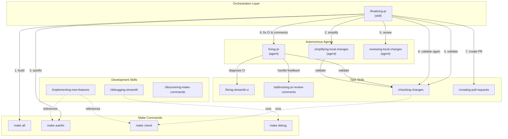
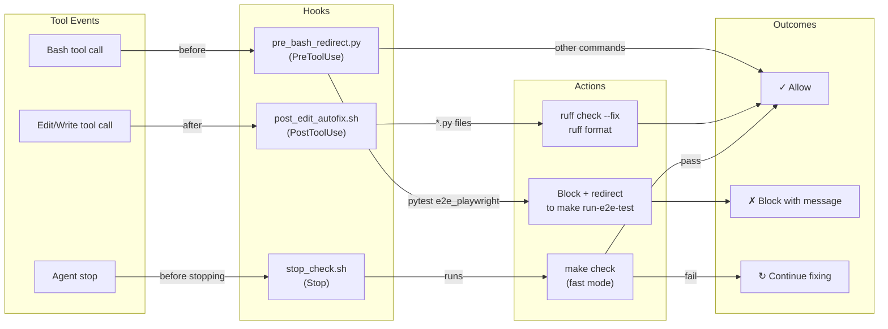
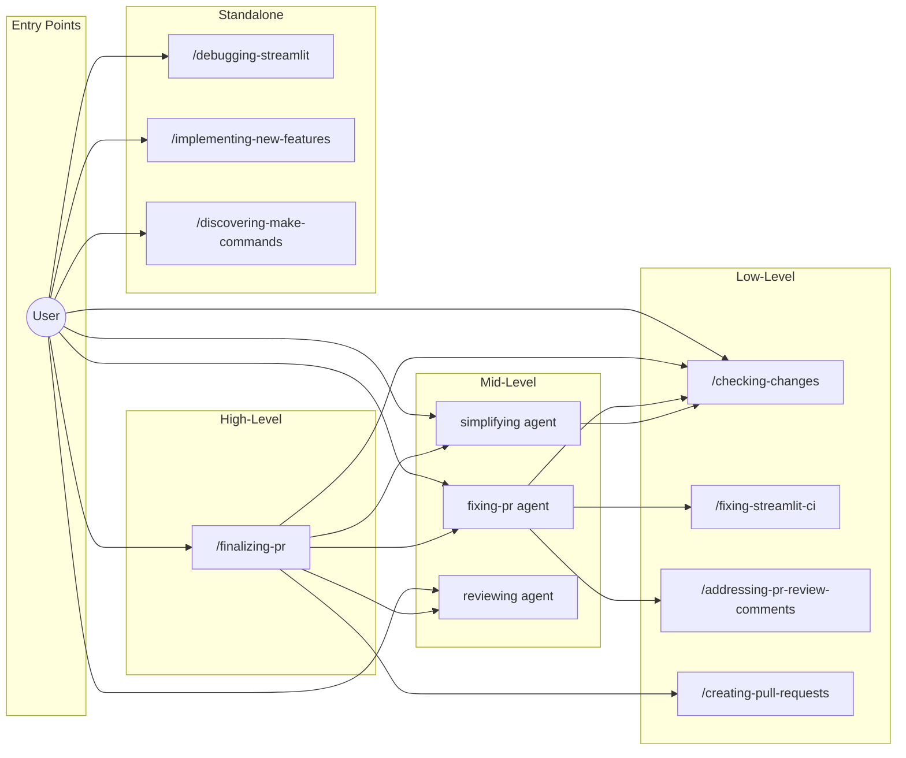

# Agent Architecture

This document describes the skill and subagent architecture in `.claude/` for Streamlit development.

## Overview

The architecture consists of three types of components:

| Type | Location | Purpose |
|------|----------|---------|
| **Skills** | `.claude/skills/` | Instruction sets for specific tasks (invoked via `/skill-name`) |
| **Agents** | `.claude/agents/` | Autonomous subagents that can use multiple skills |
| **Commands** | `.claude/commands/` | Simple triggers that invoke subagents |
| **Hooks** | `.claude/hooks/` | Automatic triggers on tool events (PreToolUse, PostToolUse, Stop) |

## Architecture Diagram



## Hooks System

Hooks are automatic triggers that run on specific tool events. They enforce policies and automate repetitive tasks without explicit invocation.



### Hook Details

| Hook | Event | Trigger | Action |
|------|-------|---------|--------|
| `pre_bash_redirect.py` | PreToolUse(Bash) | `pytest ... e2e_playwright` | Block and redirect to `make run-e2e-test` |
| `post_edit_autofix.sh` | PostToolUse(Edit\|Write) | Any `*.py` file | Auto-run `ruff check --fix` and `ruff format` |
| `stop_check.sh` | Stop | Agent finishing | Run `make check`; block if fails |

### Hook Behavior

**PreToolUse: `pre_bash_redirect.py`**
- Intercepts Bash commands before execution
- Blocks direct `pytest e2e_playwright/...` commands
- Provides feedback to use `make run-e2e-test <filename>` instead
- Enforces E2E test execution policy

**PostToolUse: `post_edit_autofix.sh`**
- Runs after Edit or Write operations complete
- Only processes Python files (`*.py`)
- Automatically formats with `ruff check --fix` then `ruff format`
- Reduces manual formatting steps

**Stop: `stop_check.sh`**
- Runs when agent is about to stop responding
- Executes `make check` in fast mode (skips slow type checks)
- If check fails: blocks stop, feeds errors back to agent to fix
- Prevents incomplete work from being considered "done"
- Has loop protection to prevent infinite fix cycles

## Component Details

### Orchestration Skill

#### `/finalizing-pr`
The main orchestration skill that prepares a branch for merge. It coordinates:
1. Build verification (`make all`)
2. Code simplification (`simplifying-local-changes` agent)
3. Auto-fixing (`make autofix`)
4. Validation (`/checking-changes`)
5. Code review (`reviewing-local-changes` agent)
6. PR creation/update (`/creating-pull-requests` patterns)
7. CI/PR maintenance (`fixing-pr` agent)

### Autonomous Agents

| Agent | Mode | Purpose | Skills Used |
|-------|------|---------|-------------|
| `fixing-pr` | Autonomous | CI fix loop: wait for CI, fix failures, address comments, push, repeat | `/fixing-streamlit-ci`, `/addressing-pr-review-comments`, `/checking-changes` |
| `simplifying-local-changes` | Autonomous | Refine code for clarity and maintainability | `/checking-changes` |
| `reviewing-local-changes` | Read-only | Code review (no edits) | None (read-only analysis) |

### Task Skills

| Skill | Purpose | Make Command |
|-------|---------|--------------|
| `/checking-changes` | Run format, lint, type, unit tests | `make check` |
| `/fixing-streamlit-ci` | Diagnose and fix CI failures | Various per failure type |
| `/addressing-pr-review-comments` | Handle PR review feedback | N/A (uses `gh` CLI) |
| `/creating-pull-requests` | Create draft PRs with proper format | `gh pr create` |

### Development Skills

| Skill | Purpose | Make Command |
|-------|---------|--------------|
| `/debugging-streamlit` | Debug with hot-reload | `make debug` |
| `/implementing-new-features` | Guide for new features | `make protobuf`, `make autofix`, `make check` |
| `/discovering-make-commands` | List available make targets | `make help` |

## Invocation Patterns

### Direct Skill Invocation
```
/checking-changes     → Runs make check
/debugging-streamlit  → Interactive debugging session
```

### Command → Agent
```
/reviewing-local-changes  → reviewing-local-changes agent
/simplifying-local-changes → simplifying-local-changes agent
/fixing-pr                 → fixing-pr agent
```

### Orchestrated Workflow
```
/finalizing-pr → runs multiple agents and skills in sequence
```

## Dependency Flow



## File Structure

```
.claude/
├── settings.json                        # Permissions and hook configuration
├── skills/
│   ├── AGENTS.md                        # Skills documentation
│   ├── addressing-pr-review-comments/
│   │   └── SKILL.md
│   ├── checking-changes/
│   │   └── SKILL.md
│   ├── creating-pull-requests/
│   │   └── SKILL.md
│   ├── debugging-streamlit/
│   │   └── SKILL.md
│   ├── discovering-make-commands/
│   │   └── SKILL.md
│   ├── finalizing-pr/
│   │   └── SKILL.md                     # Orchestration skill
│   ├── fixing-streamlit-ci/
│   │   └── SKILL.md
│   └── implementing-new-features/
│       └── SKILL.md
├── agents/
│   ├── fixing-pr.md                     # Autonomous CI/PR loop
│   ├── reviewing-local-changes.md       # Read-only review
│   └── simplifying-local-changes.md     # Code simplification
├── commands/
│   ├── fixing-pr.md                     # Trigger for fixing-pr agent
│   ├── reviewing-local-changes.md       # Trigger for reviewing agent
│   └── simplifying-local-changes.md     # Trigger for simplifying agent
└── hooks/
    ├── pre_bash_redirect.py             # Block pytest e2e, redirect to make
    ├── post_edit_autofix.sh             # Auto-format Python files
    └── stop_check.sh                    # Run make check before stopping
```

## Settings Configuration

The `settings.json` file configures permissions and hooks:

```json
{
  "permissions": {
    "allow": ["Bash(make *)", "Bash(uv run pytest *)", "Bash(git *)", ...],
    "ask": ["Bash(git push *)", "Bash(git reset --hard *)", ...]
  },
  "hooks": {
    "PreToolUse": [{ "matcher": "Bash", "hooks": [...] }],
    "PostToolUse": [{ "matcher": "Edit|Write", "hooks": [...] }],
    "Stop": [{ "hooks": [...] }]
  }
}
```

### Permission Categories

| Category | Commands | Behavior |
|----------|----------|----------|
| **Allow** | `make *`, `uv run *`, `yarn *`, `gh pr/issue/run *`, `git *` | Auto-approved |
| **Ask** | `git push`, `git reset --hard`, `git clean` | Requires user confirmation |
